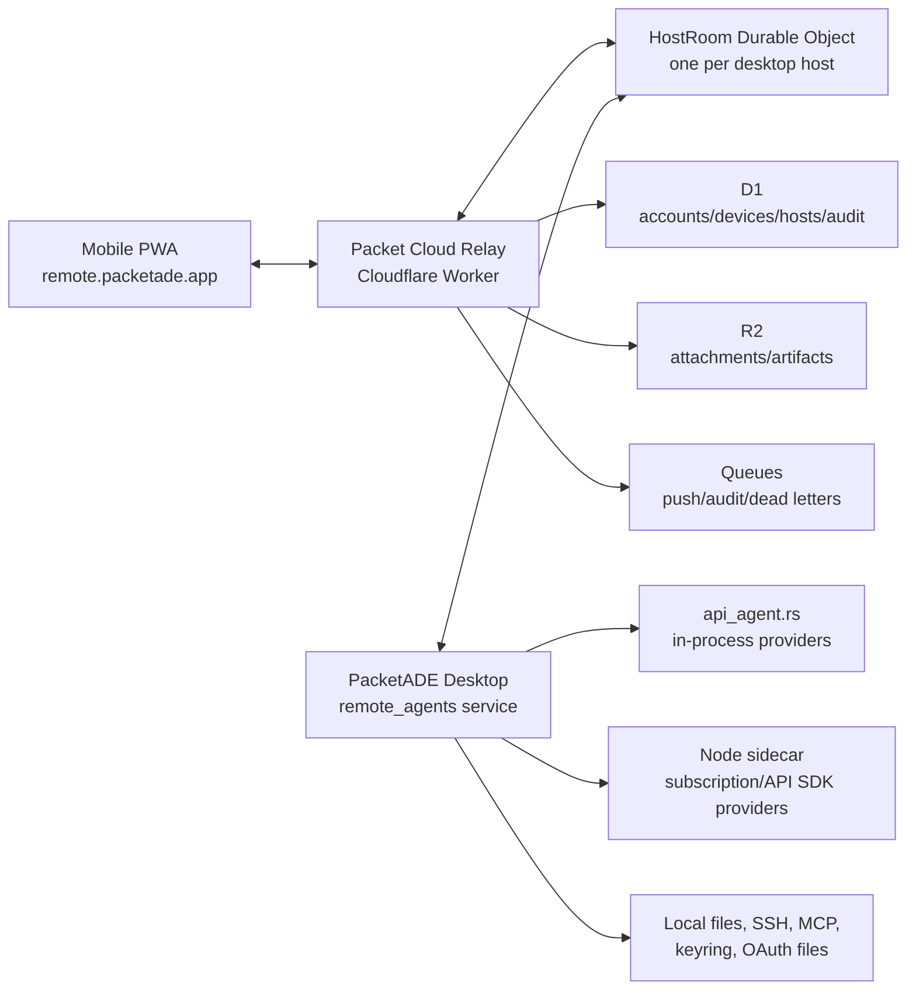

# 02 - Architecture

## High-Level Shape



## Execution Ownership

Desktop PacketADE is the agent host. It:

- creates conversations
- selects provider/model/profile
- reads provider auth status
- calls `start_api_agent_session`
- receives API-agent events
- executes tools locally or over configured SSH
- handles sidecar provider lifecycle
- persists conversations
- responds to approvals
- owns secrets

Cloud relay:

- authenticates accounts/devices/hosts
- routes envelopes
- buffers encrypted events for reconnect
- enforces host/device ACLs
- stores metadata and audit rows
- sends push notifications

PWA:

- presents mobile UX
- stores device key and session cursors
- sends remote commands
- renders streamed events
- receives push notifications
- does not have provider secrets

## Recommended Cloud Stack

### Cloudflare Workers

HTTP and WebSocket entrypoint:

- `/auth/*` for passkey/magic-link/OIDC flows if self-hosted
- `/api/*` for host/device metadata
- `/ws/host` for desktop outbound WebSocket
- `/ws/device` for PWA WebSocket
- `/push/*` for Web Push subscription management

### Durable Objects

Use one `HostRoomDO` per desktop host id.

Responsibilities:

- track one active desktop socket
- track zero or more device sockets
- assign per-session sequence numbers
- route commands to desktop
- route events to devices
- enforce host/device authorization
- keep bounded replay buffer
- coalesce stream chunks for slow clients
- handle resume after reconnect
- emit audit/notification jobs

Cloudflare Durable Objects are designed for unique stateful coordination, and their WebSocket hibernation support is a fit for many long-lived idle host connections.

### D1

Relational metadata:

- accounts
- identities
- hosts
- devices
- host_device_acl
- auth sessions
- revoked tokens
- provider/model snapshot metadata
- audit log
- push subscriptions

### R2

Large binary or semi-large payloads:

- image attachments
- file previews
- screenshots
- optional encrypted transcript exports
- future diff artifacts if they exceed envelope size caps

### Queues

Async work:

- push notifications
- audit-log fanout
- dead-lettered remote commands
- analytics/billing rollups
- offline command expiry cleanup

## Why WebSocket

Use WebSocket as the real-time channel because Remote Agents is bidirectional:

- phone sends prompts, approvals, cancels, retries
- desktop sends streaming chunks and tool events
- both sides need heartbeats, acks, and resume cursors

SSE is not enough as a primary channel because it is server-to-client only. WebRTC is not MVP because it still needs signaling, NAT traversal, auth, and fallback relay logic. Web Push is not a stream and should only wake the user.

## Desktop Integration

Add a narrow remote service:

```text
src-tauri/src/commands/remote_agents/
  mod.rs
  config.rs
  auth.rs
  relay_client.rs
  host_registry.rs
  protocol.rs
  service.rs
  conversation_service.rs
  event_fanout.rs
  approvals.rs
  audit.rs
```

Frontend support:

```text
src/stores/remoteAgentsStore.ts
src/components/views/tools/RemoteAgentsCard.tsx
src/lib/remote-agents.ts
src/types/remote-agents.ts
```

Future PWA:

```text
remoteagents/pwa/
remoteagents/relay-worker/
remoteagents/shared/
```

The exact app folder can move, but the cloud/PWA/shared protocol should stay outside `src-tauri` so it can build independently of Tauri.

## Current PacketADE Touchpoints

### Event Contract

Current API-agent event names live in `src/lib/events.ts`:

- `api-agent:chunk:{sessionId}`
- `api-agent:thinking:{sessionId}`
- `api-agent:thinking-stop:{sessionId}`
- `api-agent:tool-start:{sessionId}`
- `api-agent:tool-result:{sessionId}`
- `api-agent:permission-request:{sessionId}`
- `api-agent:pending-edit:{sessionId}`
- `api-agent:plan-block:{sessionId}`
- `api-agent:tool-output-extended:{sessionId}`
- `api-agent:turn-summary:{sessionId}`
- `api-agent:done:{sessionId}`
- `api-agent:error:{sessionId}`

Remote should not invent a second model event vocabulary. It should wrap these as `agent.event` payloads.

### API Agent Runtime

`src-tauri/src/commands/api_agent.rs` owns:

- `start_api_agent_session`
- `send_api_agent_message`
- permission/edit response handling
- cancel/close/retry/model/permission mode commands
- in-process provider loop
- sidecar forwarding branch

Remote should call a new backend conversation service, not expose these commands directly to the cloud.

### Sidecar Runtime

`agent-sidecar/src/protocol.ts` and `agent-sidecar/src/session-registry.ts` define the sidecar wire protocol. Remote Agents should not connect to the sidecar directly. Desktop Rust remains the supervisor.

### Frontend Conversation Ownership Problem

Today, `src/stores/agentTaskStore.ts` owns much of the lifecycle:

- creates `AgentConversation`
- appends initial user/assistant placeholder
- installs listeners
- starts backend session
- schedules persistence
- handles queued messages
- resumes hydrated conversations

For remote, this must become backend-owned enough that a phone-created conversation appears as a first-class desktop conversation.

Required refactor:

- Create Rust-side `RemoteConversationService`.
- Move or duplicate launch assembly into a reusable backend command.
- Add events to tell desktop React "conversation created/updated remotely."
- Keep React store as UI state, not the only source of creation truth.

## Backend Conversation Service

The service should expose internal methods:

```rust
create_remote_conversation(input) -> RemoteConversationSnapshot
send_remote_message(conversation_id, input) -> Ack
cancel_remote_conversation(conversation_id) -> Ack
retry_remote_conversation(conversation_id, model_override) -> Ack
set_remote_model(conversation_id, model) -> Ack
respond_remote_permission(conversation_id, tool_id, decision) -> Ack
respond_remote_edit(conversation_id, tool_id, decision, merged_content) -> Ack
snapshot_remote_conversations(filter) -> Vec<RemoteConversationSnapshot>
```

It should reuse existing API-agent commands internally where possible, but it must also:

- persist conversation records
- emit local desktop state events
- install or forward backend event subscriptions
- maintain remote cursor state
- validate account/device/host permissions

## PWA Architecture

The PWA should be a separate React/Vite app initially:

- avoids coupling mobile release to Tauri desktop bundle
- can deploy to `remote.packetade.app`
- can use Workbox/service worker
- can evolve toward native iOS later

Shared packages:

- protocol types
- event reducers
- auth client
- design tokens subset

## Data Storage Boundaries

### Desktop

Stores:

- provider secrets
- OAuth files
- keyring credentials
- local/SSH workspace paths
- MCP env/config
- full local conversation history
- host private key
- remote refresh token

### Cloud

Stores:

- account identity metadata
- host/device metadata
- ACLs and revocations
- audit rows
- push subscriptions
- encrypted event replay buffer
- encrypted attachments/artifacts

### PWA

Stores:

- device private key
- local auth session
- last seen cursors
- cached encrypted/decrypted conversation summaries as allowed
- local drafts/outbox

## Scaling Assumptions For V1

- One active desktop socket per host.
- Up to 5 mobile/browser clients per host.
- Up to 20 active conversations visible in PWA.
- Replay buffer per conversation: 1,000 events or 24 hours, whichever comes first.
- Max relay envelope payload: 256 KB inline.
- Larger payloads go to R2 by reference.
- Slow stream clients receive coalesced chunk batches.

## Failure Modes

### Desktop Disconnects

- Durable Object marks host offline.
- Devices receive `host.offline`.
- Push is not sent for normal disconnect unless sessions were active.
- Commands may be rejected or queued with TTL depending on command type.

### Mobile Disconnects

- Desktop continues running.
- Durable Object buffers encrypted events.
- PWA reconnects with `resume_after`.
- If replay is too old, PWA requests a fresh conversation snapshot from desktop.

### Relay Restart

- Durable Object hibernation/storage preserves enough state for reconnect.
- Both desktop and PWA reconnect with cursors.
- Commands are idempotent by command id.

### Cloud Outage

- Desktop PacketADE remains fully functional locally.
- PWA shows offline.
- No remote execution occurs.

