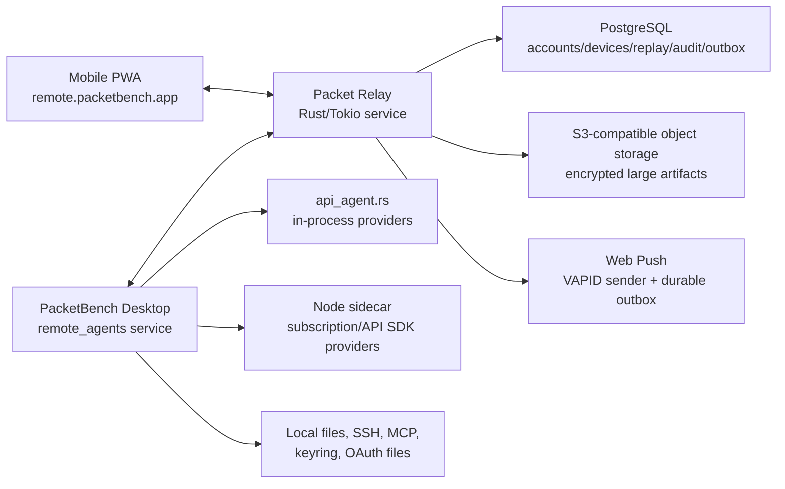

# 02 - Architecture

## High-Level Shape



## Execution Ownership

Desktop PacketBench is the agent host. It:

- creates conversations
- selects provider/model/profile
- reads provider auth status
- calls `start_api_agent_session`
- receives API-agent events
- executes tools locally or over configured SSH
- handles sidecar provider lifecycle
- persists conversations
- responds to approvals
- owns secrets

Rust relay:

- authenticates accounts/devices/hosts
- routes envelopes
- buffers encrypted events for reconnect
- enforces host/device ACLs
- stores metadata and audit rows
- sends push notifications

PWA:

- presents mobile UX
- stores device key and session cursors
- sends remote commands
- renders streamed events
- receives push notifications
- does not have provider secrets

## Recommended Relay Stack

### Standalone `packet-relay` service

The relay is the sibling repository at `D:\projects\packetrelay`. It is a
standalone Rust 1.83 application built on Tokio and Tungstenite, with bounded
connection/message limits and existing bridge, broadcast, and authenticated-room
protocols. PacketBench must add a separate, versioned host/device protocol without
breaking those compatibility modes.

The current binary is a transport baseline, not a finished PacketBench backend. At
this planning revision it has no account control plane, WebSocket tickets,
Origin policy, durable replay, multiple devices per host, Web Push, audit store,
or horizontally coordinated state. Those are implementation requirements below,
not assumptions.

Extend the Rust service with HTTP and WebSocket entrypoints:

- `/auth/*` for passkey/magic-link/OIDC flows if self-hosted
- `/api/*` for host/device metadata
- `/ws/host` for desktop outbound WebSocket
- `/ws/device` for PWA WebSocket
- `/push/*` for Web Push subscription management
- `/healthz`, `/readyz`, and `/metrics` for operations

TLS terminates at the hosting proxy, matching the relay's existing deployment
model. Public deployments expose only HTTPS/WSS.

### Deployment target: Railway

**Resolved 2026-08-27** (see `09-open-decisions.md` § Relay Deployment Target).
The relay deploys to Railway, replacing the Google Cloud Run deployment it ran
while it served Syndicate. `railway.json` in the relay repo already builds the
root `Dockerfile`; `cloudbuild.yaml` and `deploy.sh` are the retired Cloud Run
path. This does not reopen the 2026-08-02 decision to use the Rust relay and
reject Cloudflare — Railway answers only *where that relay runs*.

What carries over unchanged:

- TLS terminates at Railway's edge proxy and the container serves plain
  HTTP/WS on `$PORT`, which the relay already honours (`PORT` overrides the
  CLI port). Public exposure stays HTTPS/WSS only.
- Everything in this document about protocol, PostgreSQL as the system of
  record, the 64 KiB inline envelope ceiling, replay/cursors, and the
  wake-only Web Push channel is deployment-independent.
- `/healthz`, `/readyz`, and `/metrics` can be used directly. The relay's
  public `/health` and `/ready` aliases exist only because Cloud Run reserves
  some paths ending in `z`; keep them for compatibility with the existing
  smoke checks, but the workaround is no longer load-bearing.

What must be configured, not assumed:

- **No sleeping.** The relay service must not run with app-sleeping/serverless
  idling enabled. A sleeping relay drops the desktop host socket, which
  defeats presence and wake-on-push. Cloud Run's zero-warm-instance default
  and its cold-start cost trade-off (`MIN_INSTANCES=1`) do not carry over —
  the relay is an always-on process here.
- **Single instance.** Live routing is process-local (see below). Run one
  replica and do not enable horizontal scaling before a coordination layer
  exists.

Open verifications (Sprint 0 — record answers here and in
`09-open-decisions.md`; do not design against a guess):

1. **Edge WebSocket connection lifetime.** Cloud Run bounded every WebSocket
   by its request timeout (3,600 s max), so periodic forced reconnects were
   guaranteed and the relay's docs treat reconnect as normal even when
   healthy. Railway's maximum connection lifetime and idle-timeout behavior
   for WebSockets is **not established here** — verify before Sprint 1 sizes
   heartbeat and resume intervals. Resume/replay remains mandatory either way
   (mobile networks force reconnects regardless), so this changes tuning, not
   architecture.
2. **Deploy-time instance overlap.** Railway keeps a previous deployment
   serving until the replacement is healthy, so two relay processes can be
   live briefly across a deploy — the same best-effort singleton caveat that
   Cloud Run's max-instances=1 had. Confirm the exact overlap semantics and
   decide whether per-`{hostId, conversationId}` sequence assignment needs a
   database-backed guard rather than a process-local counter.
3. **Managed PostgreSQL durability.** Railway's managed PostgreSQL is the
   intended provisioning path (same project, private networking,
   `DATABASE_URL`). Whether its backup/point-in-time-recovery guarantees are
   sufficient for the audit log and replay store before an external private
   beta is unanswered — check before the Sprint 5 security baseline.
4. **Region selection.** The Cloud Run deployment ran in `us-central1`. The
   Railway region has not been chosen; pick it against expected client
   locations and co-locate the database with the relay.

### In-process host router

Use one Rust host-room actor/state entry per desktop host id. It owns live socket
coordination while durable state remains outside the process.

Responsibilities:

- track one active desktop socket
- track zero or more device sockets
- assign per-session sequence numbers
- route commands to desktop
- route events to devices
- enforce host/device authorization
- keep bounded replay buffer
- coalesce stream chunks for slow clients
- handle resume after reconnect
- write audit/notification outbox rows

The v1 deployment remains deliberately single-instance because live routing is
process-local. A later scaling milestone may add a broker/coordination layer, but
the protocol must not depend on one hosting provider. "Single instance" is
best-effort on any platform that overlaps deployments — see open verification 2
under Deployment target.

### PostgreSQL

Relational metadata:

- accounts
- identities
- hosts
- devices
- host_device_acl
- auth sessions
- revoked tokens
- provider/model snapshot metadata
- audit log
- push subscriptions
- encrypted replay events and acknowledged cursors
- single-use WebSocket tickets
- durable notification/dead-letter outbox

PostgreSQL is the deployed system of record. Local development may use an
isolated disposable database, but production behavior must be tested against
PostgreSQL rather than a different persistence model. The deployed instance is
Railway's managed PostgreSQL, co-located with the relay service; its durability
guarantees are an open pre-beta verification (see Deployment target).

### S3-compatible object storage

Large binary or semi-large payloads:

- image attachments
- file previews
- screenshots
- optional encrypted transcript exports
- future diff artifacts if they exceed envelope size caps

Attachments remain deferred for the first relay/host-presence checkpoint. The
protocol uses opaque `artifactId` references so the backend is not tied to an
object-storage vendor.

### Rust background workers and durable outbox

Async work:

- push notifications
- audit-log fanout
- dead-lettered remote commands
- analytics/billing rollups
- offline command expiry cleanup

The relay process claims outbox rows with bounded retries and idempotency keys.
No separate queue product is required for v1; a future queue can consume the
same outbox contract if load justifies it.

## Why WebSocket

Use WebSocket as the real-time channel because Remote Agents is bidirectional:

- phone sends prompts, approvals, cancels, retries
- desktop sends streaming chunks and tool events
- both sides need heartbeats, acks, and resume cursors

SSE is not enough as a primary channel because it is server-to-client only. WebRTC is not MVP because it still needs signaling, NAT traversal, auth, and fallback relay logic. Web Push is not a stream and should only wake the user.

## Desktop Integration

Add a narrow remote service:

```text
src-tauri/src/commands/remote_agents/
  mod.rs
  config.rs
  auth.rs
  relay_client.rs
  host_registry.rs
  protocol.rs
  service.rs
  conversation_service.rs
  event_fanout.rs
  approvals.rs
  audit.rs
```

Frontend support:

```text
src/stores/remoteAgentsStore.ts
src/components/views/tools/RemoteAgentsCard.tsx
src/lib/remote-agents.ts
src/types/remote-agents.ts
```

Future PWA:

```text
remoteagents/pwa/
remoteagents/shared/
D:\projects\packetrelay/   # independently built/deployed Rust service
```

The exact PWA/shared folder can move, but the PWA/shared protocol should stay
outside `src-tauri` so it can build independently of Tauri. Relay changes land
in the standalone repository and are contract-tested against the shared schemas.

## Current PacketBench Touchpoints

### Event Contract

Current API-agent event names live in `src/lib/events.ts`:

- `api-agent:chunk:{sessionId}`
- `api-agent:thinking:{sessionId}`
- `api-agent:thinking-stop:{sessionId}`
- `api-agent:tool-start:{sessionId}`
- `api-agent:tool-result:{sessionId}`
- `api-agent:permission-request:{sessionId}`
- `api-agent:pending-edit:{sessionId}`
- `api-agent:plan-block:{sessionId}`
- `api-agent:tool-output-extended:{sessionId}`
- `api-agent:turn-summary:{sessionId}`
- `api-agent:done:{sessionId}`
- `api-agent:error:{sessionId}`

Remote should not invent a second model event vocabulary. It should wrap these as `agent.event` payloads.

### API Agent Runtime

`src-tauri/src/commands/api_agent.rs` owns:

- `start_api_agent_session`
- `send_api_agent_message`
- permission/edit response handling
- cancel/close/retry/model/permission mode commands
- in-process provider loop
- sidecar forwarding branch

Remote should call a new backend conversation service, not expose these commands directly to the cloud.

### Sidecar Runtime

`agent-sidecar/src/protocol.ts` and `agent-sidecar/src/session-registry.ts` define the sidecar wire protocol. Remote Agents should not connect to the sidecar directly. Desktop Rust remains the supervisor.

### Frontend Conversation Ownership Problem

Today, `src/stores/agentTaskStore.ts` owns much of the lifecycle:

- creates `AgentConversation`
- appends initial user/assistant placeholder
- installs listeners
- starts backend session
- schedules persistence
- handles queued messages
- resumes hydrated conversations

For remote, this must become backend-owned enough that a phone-created conversation appears as a first-class desktop conversation.

Required refactor:

- Create Rust-side `RemoteConversationService`.
- Move or duplicate launch assembly into a reusable backend command.
- Add events to tell desktop React "conversation created/updated remotely."
- Keep React store as UI state, not the only source of creation truth.

## Backend Conversation Service

The service should expose internal methods:

```rust
create_remote_conversation(input) -> RemoteConversationSnapshot
send_remote_message(conversation_id, input) -> Ack
cancel_remote_conversation(conversation_id) -> Ack
retry_remote_conversation(conversation_id, model_override) -> Ack
set_remote_model(conversation_id, model) -> Ack
respond_remote_permission(conversation_id, tool_id, decision) -> Ack
respond_remote_edit(conversation_id, tool_id, decision, merged_content) -> Ack
snapshot_remote_conversations(filter) -> Vec<RemoteConversationSnapshot>
```

It should reuse existing API-agent commands internally where possible, but it must also:

- persist conversation records
- emit local desktop state events
- install or forward backend event subscriptions
- maintain remote cursor state
- validate account/device/host permissions

## PWA Architecture

The PWA should be a separate React/Vite app initially:

- avoids coupling mobile release to Tauri desktop bundle
- can deploy to `remote.packetbench.app`
- can use Workbox/service worker
- can evolve toward native iOS later

Shared packages:

- protocol types
- event reducers
- auth client
- design tokens subset

## Data Storage Boundaries

### Desktop

Stores:

- provider secrets
- OAuth files
- keyring credentials
- local/SSH workspace paths
- MCP env/config
- full local conversation history
- host private key
- remote refresh token

### Relay service

Stores:

- account identity metadata
- host/device metadata
- ACLs and revocations
- audit rows
- push subscriptions
- encrypted event replay buffer
- encrypted attachments/artifacts

### PWA

Stores:

- device private key
- local auth session
- last seen cursors
- cached encrypted/decrypted conversation summaries as allowed
- local drafts/outbox

## Scaling Assumptions For V1

- One active desktop socket per host.
- Up to 5 mobile/browser clients per host.
- Up to 20 active conversations visible in PWA.
- Replay buffer per conversation: 1,000 events or 24 hours, whichever comes first.
- Max relay envelope payload: 64 KiB inline, matching `packet-relay`'s security ceiling.
- Larger payloads use encrypted object-storage references.
- Slow stream clients receive coalesced chunk batches.

## Failure Modes

### Desktop Disconnects

- The Rust host router marks the host offline and persists last-seen state.
- Devices receive `host.offline`.
- Push is not sent for normal disconnect unless sessions were active.
- Commands may be rejected or queued with TTL depending on command type.

### Mobile Disconnects

- Desktop continues running.
- The relay persists encrypted replay events in PostgreSQL.
- PWA reconnects with `resume_after`.
- If replay is too old, PWA requests a fresh conversation snapshot from desktop.

### Relay Restart

- PostgreSQL preserves replay cursors/events; live sockets reconnect to the restarted Rust process.
- Both desktop and PWA reconnect with cursors.
- Commands are idempotent by command id.

### Cloud Outage

- Desktop PacketBench remains fully functional locally.
- PWA shows offline.
- No remote execution occurs.
