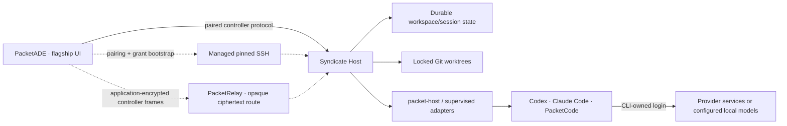

# Syndicate execution target

Status: **source implemented and independently reviewed**; public relay,
installer publication, and packaged real-host proof remain release gates.

Last reconciled: 2026-08-12.

Product owner: PacketADE. Host contract owner: Syndicate.

Syndicate positioning:

> Turn your Linux server into a private coding-agent powerhouse. Run your
> existing agents there and control them from any browser.

The companion host-side contract is
[`docs/PACKETADE_EXECUTION_TARGET.md`](https://github.com/packetloss404/syndicate/blob/main/docs/PACKETADE_EXECUTION_TARGET.md)
in the Syndicate repository.

## Implementation status

The first PacketADE flagship target boundary is implemented across PacketADE,
Syndicate, `packet-host`, and PacketRelay:

- [x] Tagged, persisted `kind: "syndicate"` execution target, with centralized
      target predicates that prevent Host paths from reaching local/SSH file, Git,
      MCP, Flight, editor, or handoff operations.
- [x] Short-lived invitation claim, device Ed25519/X25519 keys, OS-keychain
      private-key storage, local Host approval, narrowed scopes, capability/health
      refresh, revocation, and explicit offline forget.
- [x] Host-owned repository catalog and Workspace list/create. PacketADE sends
      an opaque `repositoryId`, never a client-selected absolute path.
- [x] Typed `pane.create`, `session.start/attach/input/resize/stop`, and
      `events.read` controller v1 operations with durable request IDs, bounded
      input, response correlation, scope gates, and no generic RPC exposed to the
      frontend.
- [x] Durable pane/session identities and replay cursor persistence. PacketADE
      resumes output without duplicating input, surfaces replay gaps, and preserves
      recoverable remote ownership when stop fails.
- [x] Managed loopback SSH bootstrap through the canonical verified
      `ServerConfig`: strict pinned host key, no agent forwarding, no connection
      sharing, supervised reconnect, and deterministic teardown.
- [x] Application-encrypted PacketRelay controller transport: Host-signed
      grants, device proof of possession, X25519/HKDF-SHA256, AES-256-GCM,
      Ed25519-signed frames, durable monotonic counters, replay rejection, and
      request correlation. The relay sees only route metadata and ciphertext.
- [x] Safe transport transition: the first post-approval snapshot uses pinned
      SSH while the relay grant is provably absent; after grant capture, a
      configured relay is authoritative and a failed request is never resent over
      SSH.
- [x] Installed `packet-host` service owns PTYs independently from the Node
      Host, so a Node Host-only restart can reconcile and reattach exact durable
      sessions. `packet-host` restart and server reboot remain separate limits.
- [x] Automated source gates: PacketADE's 2,000 frontend tests and 647 Rust
      tests pass; focused direct/relay/tunnel/fixture/bootstrap coverage passes and
      independent review found no remaining P0/P1 issue.

The following are not yet shipped promises:

- [ ] Deploy and end-to-end verify the public PacketRelay product route. The
      intended endpoint is
      `wss://packet-relay-1038865114903.us-central1.run.app/v1/product-route`, but
      it must not be described as live until deployment and smoke verification
      succeed.
- [ ] Publish immutable Syndicate x64/arm64 release archives and checksums, then
      publish and clean-install the real public `curl` installer URL.
- [ ] Run the packaged Ubuntu/controller/network/revocation/restart/upgrade/
      rollback acceptance matrix.
- [ ] Prove recovery across `packet-host` service restart or server reboot
      before promising either; Node Host-only restart is the implemented boundary.
- [ ] Add multiple PacketADE device credentials per machine, view-only import
      of arbitrary existing Host panes, and WebSocket event subscription if user
      demand justifies them. V1 uses one PacketADE credential per machine and HTTP
      `session.attach` replay as the canonical recovery path.

## Decision

PacketADE remains the flagship and the user's primary workspace. Syndicate is a
first-class execution target: a user can install Syndicate and the official
agent CLIs on an owned Linux server, pair that machine with PacketADE, and start
or reattach coding-agent sessions on the server from PacketADE.

This is deliberately not:

- another generic SSH integration;
- a second PacketADE workspace implementation;
- PacketADE Remote Agents, whose v1 controller is a phone/PWA and whose
  execution owner remains PacketADE Desktop;
- a route for moving provider credentials through PacketADE or a relay.

SSH is useful for installation and for a private alpha tunnel. Once connected,
PacketADE must use Syndicate's typed, authorized workspace/session API.
Syndicate remains the authority for paths, worktrees, processes, input, replay,
and cleanup.

## Market signal and differentiation

Anthropic's current Claude Code Desktop already supports selecting an owned
Linux or macOS machine over SSH and using the desktop application as the
interface. That validates the basic “powerful remote machine, local UI” demand,
but it also means raw SSH launch is not the product advantage.

Syndicate differentiates the PacketADE experience by making the remote machine
a durable, multi-agent execution authority: Codex, Claude Code, and PacketCode;
browser access; host-owned Workspaces; isolated writer worktrees; typed policy;
reconnect/replay; resource governance; and one target contract that can later
serve API agents and Flights after their separate authority rules are proven.

## Why it is a separate target kind

PacketADE currently models API-agent execution as `Local` or `Ssh`, and its
saved `ServerConfig` is specifically an SSH connection. A Workspace stores
`serverId` and `remoteProjectPath` for that model. Syndicate has materially
different semantics:

- it issues durable machine, workspace, pane, session, and worktree identities;
- it owns the remote path and process lifecycle;
- it authorizes typed operations instead of accepting arbitrary remote
  commands;
- it supports reconnect/replay and concurrent isolated worktrees;
- it reports CLI capability and authentication state without returning
  credentials.

The implementation does not overload `serverId` or `remoteProjectPath` with
those semantics. It persists a tagged target; `serverConfigId` refers only to
the verified SSH bootstrap/fallback configuration and never makes Syndicate an
SSH target:

```ts
type ExecutionTargetRef =
  | { kind: "local" }
  | { kind: "ssh"; serverId: string }
  | {
      kind: "syndicate";
      machineId: string;
      workspaceId: string;
      serverConfigId: string;
    };
```

Existing fields remain readable during migration, and execution-sensitive
surfaces branch through centralized `kind` predicates.

## User experience

### Pair a machine

Settings has a **Syndicate machines** surface separate from **SSH servers**.
The flow is:

1. Install Syndicate on the Linux host and run its doctor.
2. Sign into Codex, Claude Code, and/or PacketCode on that host using each
   CLI's own supported login.
3. Ask Syndicate to create a short-lived pairing package.
4. In PacketADE, select the already verified SSH `ServerConfig`, paste the
   package, and claim it. PacketADE validates the Host signing and key-agreement
   SPKIs and fingerprints before consuming the invite.
5. Approve the pending device and its requested scopes in Syndicate's local
   browser UI, then refresh the machine in PacketADE.
6. PacketADE keeps the Ed25519/X25519 private material in the operating-system
   keychain. Syndicate stores the revocable public device grant and later
   returns the Host-signed relay certificate.

The release pairing package has this additive envelope shape:

```json
{
  "protocolVersion": 1,
  "relayEndpoint": "wss://packet-relay-1038865114903.us-central1.run.app/v1/product-route",
  "invitation": { "...": "existing controller invitation fields" }
}
```

`relayEndpoint` is optional. An explicitly entered PacketADE endpoint wins;
both forms are validated as exact versioned WSS product-route URLs before the
one-time claim is consumed. The production URL above is the intended release
value, not a live-service claim until deployment verification closes.

The managed pinned SSH local forward is the implemented pairing and grant-
bootstrap path. Pairing and application authorization are still required; the
SSH login is not the Syndicate identity.

### Select it as an execution target

The Workspace creation flow has an **Execution target** selector:

- **This computer**
- existing SSH servers
- paired Syndicate machines

Choosing a Syndicate machine loads host-owned repositories and Workspaces.
PacketADE shows the machine name, connection state, coarse capacity, Syndicate
version, installed agents, agent versions, and redacted auth readiness. It must
not browse arbitrary absolute paths supplied by the client.

A Workspace is bound to its target while it has live sessions. Moving work
between targets is a later explicit clone/import operation, not a dropdown
mutation.

### Work in PacketADE

The normal Workspace surface remains primary:

- every remote pane is visibly labeled `Syndicate · <machine>`;
- the displayed remote path is host-reported and read-only;
- **New pane** selects an available CLI profile and access posture;
- disconnecting PacketADE leaves the agent running on Syndicate;
- reconnecting attaches at a durable output cursor without duplicating input;
- stop, resize, approval, and attention states map to explicit host operations;
- stale, revoked, upgrading, capacity-limited, and auth-required states have
  distinct messages and recovery actions.

The first release is Workspace CLI panes. API-agent conversations, Flights,
arbitrary shells, file synchronization, and target-to-target handoff are not
silently included.

## Feature boundary

| Included in first usable release                                                                     | Explicitly later or excluded                                |
| ---------------------------------------------------------------------------------------------------- | ----------------------------------------------------------- |
| Pair, name, revoke, and reconnect one owned Syndicate machine                                        | Multi-tenant team hosting                                   |
| Capability and redacted CLI readiness snapshot                                                       | Copying OAuth tokens, API keys, or CLI credential files     |
| Select or create a host-owned Workspace                                                              | Arbitrary client-supplied host paths                        |
| Start Codex, Claude Code, or PacketCode panes from host profiles                                     | Generic remote-command or environment-variable API          |
| Host-owned isolated Git worktree per writable pane/task                                              | Automatic merge, deletion, or destructive cleanup           |
| Stream output; send bounded terminal input and resize/stop                                           | Transparent local filesystem mounts or background file sync |
| Reattach after client/network loss with cursor replay; preserve PTYs across a Node Host-only restart | Surviving `packet-host` service restart or server reboot    |
| Capacity, version, update, and attention states                                                      | Local-model performance claims without a suitable GPU       |

## Architecture



Only the solid application-protocol edge grants execution authority. The
transport can change without changing Workspace or session semantics.

## Transport implementation

### Implemented bootstrap: managed SSH local forwarding

The bootstrap keeps the Syndicate controller bound to loopback:

```text
ssh -N \
  -L 127.0.0.1:<local-ephemeral>:127.0.0.1:<syndicate-controller-port> \
  -o ExitOnForwardFailure=yes \
  <user>@<host>
```

PacketADE reuses its pinned host-key machinery, never enables SSH agent
forwarding, keeps the forwarded listener on loopback, disables OpenSSH
connection sharing, supervises the dedicated tunnel process, and tears it down
with the machine/app lifecycle.

The existing Syndicate single-use browser bootstrap/cookie is not a native
controller credential. The bootstrap still requires the controller protocol
and a paired device grant.

### Implemented client, pending public deployment: PacketRelay

Syndicate keeps the Host outbound-only and PacketRelay treats routed payloads
as opaque ciphertext. PacketADE and the Host implement Host-signed grants,
device proof of possession, X25519/HKDF-SHA256 key derivation, AES-256-GCM,
Ed25519 frame signatures, durable counters, replay rejection, expiry/scope
validation, reconnect, and response correlation. The remaining transport gate
is operational: deploy and verify the public WSS product route. A private
LAN/VPN direct route may later use the same application protocol and device
identity.

PacketADE uses pinned SSH only while no verified relay grant exists. Once the
grant is captured, a configured relay request is never retried over SSH after a
transport error because its mutation/input outcome may be uncertain.

Transport authentication is not operation authorization. A relay route token,
VPN membership, SSH login, TLS connection, or WebSocket `Origin` value is never
enough to start or control a session.

## Controller protocol v1

The PacketADE-to-Syndicate contract is distinct from both the browser API and
the Node-to-`packet-host` local protocol. Version 1 is frozen and implemented
with:

### Negotiation and state

- protocol version range and feature capabilities;
- stable machine ID, display name, Syndicate build, OS/architecture, and
  compatibility status;
- bounded capacity snapshot: session limit, active count, pressure state, and
  disk warning;
- installed CLI profiles with executable/version and redacted
  `ready`, `auth-required`, `unavailable`, or `unsupported` state;
- host-owned repositories, Workspaces, panes, and active session summaries.

### Typed commands

- `workspace.list`, `workspace.get`, and `workspace.create`;
- `pane.create` for the Host-authorized worktree and terminal record;
- `session.start`, `session.attach`, `session.resize`, `session.input`, and
  `session.stop`;
- `events.read` from a durable sequence cursor;
- machine grant inspection and local revocation.

Every mutating request needs a request ID, idempotency rule, caller device ID,
scope check, target identity, expiry, and audit event. The Host resolves
canonical paths and executable profiles. Version 1 accepts no raw executable,
`argv`, environment map, shell command, or absolute path from PacketADE.

### Event behavior

- output and state events carry a monotonically increasing per-session or
  per-stream sequence;
- attach accepts the last applied cursor and returns a bounded replay or an
  explicit resync snapshot;
- retries cannot apply input or create a session twice;
- slow consumers receive backpressure or a typed gap/resync response;
- terminal bytes remain bounded and are never interpreted as JSON strings;
- logs and diagnostics redact prompts, terminal contents, repository contents,
  environment values, and provider metadata by default.

WebSocket `Origin` validation remains required for browser clients, but native
PacketADE authentication must use its device key. A native client can choose
any `Origin` string, so `Origin` is not an identity proof.

## Security and credential boundary

Syndicate authorizes each operation against a current, revocable grant. The v1
scopes are narrow and separable:

- `machine.read`
- `workspace.read`
- `workspace.create`
- `session.start`
- `terminal.view`
- `terminal.input`
- `terminal.resize`
- `terminal.stop`

Terminal input is full code-execution authority as the Syndicate operating
system user: the controlled coding CLI can invoke shells and tools. It is
disabled unless the grant and selected access posture allow it, bounded per
frame, audited, and rate-limited. The typed controller protocol reduces network
attack surface but does not sandbox the agent. Git worktrees isolate checkouts
and writer leases, not processes, credentials, the rest of the user's home, or
network access.

Provider authentication remains on the server:

- Codex is installed and signed in on the Syndicate machine; it runs against
  repositories and tools on that machine.
- Claude Code owns its login and credential storage on that machine.
- PacketCode reads its configured provider credentials on that machine and can
  report readiness through `packetcode doctor --json`.
- PacketADE and the relay receive only redacted status. They never read,
  upload, copy, refresh, or back up credential files.
- SSH agent forwarding is never a prerequisite.

Run Syndicate and the CLIs as a dedicated unprivileged Linux user, not root.
Repository permissions and CLI credentials belong to that account.

## Lifecycle and ownership

Syndicate is the source of truth for:

- Workspace and repository identities;
- pane/session IDs and process state;
- worktree allocation, writer leases, and quarantine;
- output cursors and replay;
- approvals and audit events;
- capacity and local policy.

PacketADE persists only the target reference, display/cache data, its controller
key, and last applied cursors. Cached host state must be replaceable by an
authoritative snapshot.

The reconnect promise applies to PacketADE or network loss. In an installed
Linux deployment, the separately supervised `packet-host` service owns PTYs
independently from the Node Host. A Node Host-only crash/restart preserves the
native session; startup reconciliation reclaims only an exact durable
pane/profile/worktree binding, and PacketADE resumes from its cursor. Stopping
or restarting `packet-host`, or rebooting the server, still terminates PTYs and
must not be advertised as survivable until a later runtime proves it.

## Linux host profile

The supported first host should be a current Ubuntu LTS server with:

- a dedicated non-root service account and private home;
- a user-level systemd service with lingering enabled so it starts at boot and
  remains after logout;
- restart-on-failure for the Host, bounded restart rate, and explicit
  startup/readiness probes;
- cgroup v2 controls such as `CPUWeight`, `MemoryHigh`/`MemoryMax`, and
  `TasksMax`;
- local SSD/NVMe repositories and worktrees;
- bounded logs, free-space thresholds, and no secret-bearing diagnostics;
- `syndicate doctor --json` for the Host, Git, runtime, CLI, permission,
  transport, and resource checks.

A 32-core, 256-GB server is an excellent concurrency machine for repository
indexing, builds, tests, language servers, and many simultaneous agents.
Codex/Claude model inference still follows the installed CLI/provider contract;
that CPU/RAM does not turn cloud inference into local inference. Local models
need an explicitly supported runtime and usually an appropriate GPU.

## Failure behavior

| Condition                                  | PacketADE behavior                                                                                                      |
| ------------------------------------------ | ----------------------------------------------------------------------------------------------------------------------- |
| Host offline                               | Keep cached identity, disable launch/input, offer reconnect                                                             |
| Tunnel or relay interrupted                | Mark reconnecting; never replay unsafely; resume from cursor                                                            |
| Device revoked                             | Drop cached session authority and require a new pairing                                                                 |
| Version mismatch                           | Read-only status if compatible; otherwise block with required versions                                                  |
| CLI missing or signed out                  | Disable that profile and show a host-local recovery command                                                             |
| Session capacity reached                   | Keep existing sessions attached; block new start with pressure detail                                                   |
| Workspace lease conflict                   | Show the owning pane/task; never force or reuse the worktree                                                            |
| Output replay gap                          | Request authoritative snapshot and visibly mark omitted history                                                         |
| Node Host process restarted                | Reconcile the exact live `packet-host` session and resume from the durable cursor; fail closed on any identity mismatch |
| `packet-host` restarted or server rebooted | Mark the prior PTY interrupted; retain durable Workspace/session history without claiming the process survived          |
| Low disk or quarantine                     | Block new writable sessions; preserve evidence and require host action                                                  |

## Delivery slices

These are implementation and release-proof boundaries, not parallel backlogs:

1. **ST0 — Source complete.** Version the target schema, controller messages,
   scopes, error taxonomy, cursor semantics, and compatibility rules in both
   repositories.
2. **ST1 — Source complete; public proof open.** Package the unprivileged systemd user
   service, installer/update path, doctor, resource policy, and uninstall
   behavior on a clean Ubuntu host.
3. **ST2 — Source complete.** Add device keys/grants,
   revocation, capability snapshots, CLI readiness, and an SSH-tunneled direct
   proof.
4. **ST3 — Source complete.** Add the tagged target, migration, keychain
   storage, machine list, and health/version states.
5. **ST4 — Source complete.** Browse/create repositories and Workspaces,
   persist their IDs, and prove path/lease authorization.
6. **ST5 — Source complete.** Start/attach/input/resize/stop, replay,
   backpressure, attention states, and reconnect after client/network loss.
7. **ST6 — Source complete; packaged proof open.** Prove multiple isolated agents, cgroup
   limits, disk pressure, descendant shutdown, quarantine, upgrades, and
   diagnostics.
8. **ST7 — Client/Host/relay source complete; deployment open.** Put the same
   controller protocol over the reviewed application-encrypted outbound relay;
   deploy and verify its public WSS route.
9. **ST8 — Open release matrix.** Run packaged PacketADE against clean Ubuntu x64
   and arm64 hosts, each supported CLI, Windows/macOS/Linux controllers,
   network faults, revocation, upgrades, and rollback.

### Current cross-product foundation

The PacketADE and Syndicate working trees now contain the usable source
boundary:

- authenticated machine/capability schema v1 with redacted CLI readiness;
- local browser approval plus PacketADE pairing, narrowed device scopes,
  capability health, and revocation;
- a tested rootless Linux release installer with verified, atomic version
  switching and a loopback `systemd --user` service contract;
- a portable production runtime containing Node, native SQLite, `packet-host`,
  migrations, and dashboard assets, with an arbitrary-working-directory smoke
  test;
- a pinned x64/arm64 tag-release workflow for archives, checksums, and GitHub
  provenance attestations;
- the tagged PacketADE execution target, Host-owned Workspace/pane/session
  operations, cursor replay, and strict isolation from local path consumers;
- controller v1 over managed pinned SSH and application-encrypted PacketRelay;
- Node Host-only restart reconciliation through the independently supervised
  `packet-host` service.

ST1/ST7/ST8 remain release gates rather than missing core implementation. A
public `curl` command remains blocked on immutable public x64/arm64 assets,
checksums, installer publication, and clean-machine proof. “Control from
anywhere” remains blocked on deployment and end-to-end verification of the
public PacketRelay product route.

## Acceptance matrix

The feature is not shippable until all of these are demonstrated:

1. A clean Ubuntu machine installs Syndicate without running the service or
   agents as root.
2. PacketADE pairs and later revokes a controller without exposing a reusable
   secret in logs or UI state.
3. Capability discovery reports installed CLI versions and redacted readiness,
   never token or credential-file contents.
4. PacketADE selects or creates a host-owned Workspace without accepting a
   client-selected absolute path.
5. Three writable panes on one repository receive distinct locked worktrees and
   branches; none can acquire another pane's writer lease.
6. PacketADE disconnects, the agents keep running, and reconnect resumes once
   from the last durable cursor without duplicate input.
7. Stop terminates and reaps the complete descendant process tree or places the
   session/worktree into durable quarantine.
8. Revoked, expired, replayed, out-of-scope, cross-workspace, and malformed
   commands fail closed and produce bounded audit events.
9. Raw executable, `argv`, environment, shell-command, and arbitrary-path
   attempts are rejected by the protocol and Host.
10. Slow-client and noisy-output tests prove bounds, ordering, gap behavior,
    memory pressure, and recovery.
11. Node Host-only restart preserves and exactly reconciles live
    `packet-host` sessions; `packet-host` restart/reboot is represented as an
    interruption rather than inferred from stale PacketADE cache.
12. The managed SSH tunnel and application-encrypted PacketRelay transport
    pass the same controller contract tests, and the deployed public route
    passes an end-to-end smoke.

## Frozen implementation decisions and remaining P2 choices

Frozen by this contract:

- PacketADE is the flagship control surface.
- Syndicate is a distinct execution target, not an SSH-server subtype.
- Syndicate owns remote execution and durable workspace/session identity.
- CLI credentials stay on the Syndicate machine.
- Version 1 is typed and deny-by-default; it has no arbitrary remote command.
- Network/client reconnect, Node Host-only restart, `packet-host` restart, and
  server reboot are separate product promises.
- Ed25519 signs pairing/RPC/frame authority; X25519 plus HKDF-SHA256 derives
  AES-256-GCM relay keys; private device material stays in the OS keychain.
- Managed pinned SSH bootstraps pairing/grant capture. PacketRelay is the
  outbound Internet transport once a verified grant exists.
- `session.input` ships only with `terminal.input`; view-only devices cannot
  launch PacketADE execution panes.
- Repository registration is Host-local configuration. PacketADE receives
  opaque catalog IDs and can create a Workspace from a registered repository.

Remaining bounded choices:

- whether/when to support multiple PacketADE devices per machine instead of
  the v1 revoke-or-forget-before-re-pair rule;
- whether view-only grants need an import/attach flow for existing Host panes;
- whether WebSocket subscriptions materially improve on canonical bounded HTTP
  replay;
- the support and retention policy beyond the frozen protocol v1 compatibility
  floor;
- whether process survival across `packet-host` restart/server reboot is worth
  a new runtime ownership model.

## Research basis

This contract was reconciled against the current PacketADE target/SSH model,
Syndicate's loopback Host, remote-deployment boundary, `packet-host` protocol,
durable Workspace schema, interactive worktree design, and PacketCode's
`doctor --json` contract.

Primary external references:

- [OpenSSH client manual](https://man.openbsd.org/ssh) — loopback local
  forwarding, forwarding-only mode, host verification, and the warning against
  agent forwarding.
- [OpenSSH client configuration](https://man.openbsd.org/ssh_config) —
  `ExitOnForwardFailure` behavior.
- [RFC 6455 WebSocket security model](https://www.rfc-editor.org/info/rfc6455/)
  — browser Origin checks and why a native client needs real authentication.
- [Git worktree](https://git-scm.com/docs/git-worktree.html) — locked creation
  and stable porcelain discovery.
- [systemd `loginctl`](https://www.freedesktop.org/software/systemd/man/latest/loginctl.html)
  and [resource control](https://www.freedesktop.org/software/systemd/man/latest/systemd.resource-control.html)
  — lingering user services and cgroup limits.
- [Official Codex CLI guide](https://learn.chatgpt.com/docs/codex/cli) — Linux
  installation, host-local sign-in, local-repository operation, and installed
  tool execution.
- [Claude Code authentication](https://code.claude.com/docs/en/authentication)
  — host-local login and SSH/headless authentication behavior.
- [Claude Code Desktop](https://code.claude.com/docs/en/desktop) — current
  owned-machine SSH sessions and the local-interface/remote-execution product
  pattern.
