# PacketADE — State of the ADE — 2026-07

<!--
AUDIENCE: coding agents. This file is the machine-readable edition. Section 0
is the current source of truth; Sections 1-12 preserve the detailed 2026-07-30
audit as dated evidence and their original status tokens are not a live task
register. The human edition is state-of-the-ade-2026-07-30.pdf and carries
identical content. The former HTML edition was retired 2026-07-30.
-->

**Document type:** living record · **Report date:** 2026-07-30 · **Last status pass:** 2026-08-02 against the working tree based on `b8c2d21`; last packaged source remains `fd8c226`
**Human edition:** [`state-of-the-ade-2026-07-30.pdf`](./state-of-the-ade-2026-07-30.pdf) — same content, paginated, 5 embedded screenshots.
**Screenshots:** referenced by relative path under [`visual-audit-2026-07-30/`](./visual-audit-2026-07-30/); regenerate with `e2e/visual-audit.spec.ts`.

## 0. Machine Summary

Read this section first. Everything below it is evidence.

### 0.0 Current authority — 2026-08-02

This section supersedes stale status language in the dated deep-dive below.
Use [`../../backlog.md`](../../backlog.md) for the item-level task register,
[`../../HANDOFF.md`](../../HANDOFF.md) for session restart, and
[`../../dev/proof-audit-2026-08-01.md`](../../dev/proof-audit-2026-08-01.md)
for exact proof and external-gate disposition.

The current product state is:

- Workspace/Agents restructuring and the six-group Settings information
  architecture are complete. Workspaces are CLI/PacketCode-first; GUI agents
  own a first-class same-window surface; new Workspace conversation attachment
  is retired while saved-pane compatibility remains.
- The 2026-08-01 high-priority source loop is complete and independently
  reviewed: destructive terminal-pane close now confirms the live-PTY effect;
  Anthropic edit approvals carry exact `toolUseId` correlation; Agent Stop and
  Side Chat wait for request-owned cancellation acknowledgement; Monitor-open
  failures are visible; and cancel-pending chrome has one owner.
- Local/SSH Workspace, repository, and Git-host authority are now explicit.
  Host/repository switches invalidate stale reads, detail, caches, and
  mutations; activation is serialized/latest-wins; and GitHub-only actions are
  capability-gated for Gitea/Forgejo.
- The Settings P1 authority/security pass is source-complete: autonomy writes
  are awaited and revision-fenced, unenforced controls are hidden, and SSH
  passwords remain OS-keyring-only with compensating rollback and truthful
  test/error state.
- Selectable shells for raw local Terminal panes are source-complete in the
  current working tree. Pane, Workspace, and app choices precede Auto; Auto
  preserves the historical `powershell`-on-Windows/`bash`-on-POSIX launch.
  Detection, WSL distributions, install guidance, custom-shell allowlisting,
  and a bounded probe are wired. Dedicated CLI panes are unchanged and SSH
  Terminals use the remote login shell. Commit/package and manual shell-matrix
  proof remain open.
- Flight Deck Option B, PacketAgent W9 consumer source, PacketCode integration,
  Project Memory, local-first MCP Hub, Dictation hardening, trust/provenance,
  Issue-to-Flight mirroring, and read-only Monitor are implemented at the
  source level. Their remaining gates are real/package/environment proof, not
  permission to claim a release.
- Remote Agents is preserved but paused. Do not begin implementation until the
  owner resolves authentication provider and E2EE timing. Relay architecture
  and code location are already locked to the standalone Rust service at
  `D:\projects\packet-relay`, with shared schemas and the PWA beginning under
  PacketADE's `remoteagents/` workspace.
- The last packaged operational-honesty source is committed and pushed at
  `fd8c226`. A fresh unsigned
  v0.10.2 Windows application, MSI, and NSIS setup EXE were built from that
  exact revision; hashes and paths are recorded in `HANDOFF.md`. The current
  shell-profile working tree is based on local `main` `b8c2d21`, is not yet
  committed or packaged, and does not supersede that package evidence. No new
  tag or public release was created.

### 0.1 State vector

| Key | Value |
|---|---|
| `report_date` | 2026-07-30 |
| `repo` | `D:\projects\PacketADE` |
| `current_source_head` | local `main` `b8c2d21` plus uncommitted shell-profile work; branch was already one commit ahead of `origin/main` |
| `last_windows_package_source` | `fd8c226` |
| `app_version` | 0.10.2 · sidecar protocol v11 |
| `chat_providers` | **7** (`api-openai-codex` dropped in `422ab94`; was 8) |
| `loc_reviewed` | ~177k (frontend + Rust + sidecar) |
| `gate_pnpm_build` | green |
| `gate_lint` | 0 errors |
| `gate_vitest` | 1873 / 1873 across 228 files |
| `gate_high_priority_focus` | 108 / 108 across 15 files |
| `gate_sidecar_check` | green; live Anthropic round trip remains opt-in/external |
| `gate_cargo_test` | 603 passed / 0 failed / 2 ignored; schema-export test intentionally manual/ignored |
| `gate_ci` | **none — there is no CI** |
| `historical_findings` (§2-§5) | 2026-07-30 baseline; original status tokens retained as evidence, not the live backlog |
| `historical_audit_ledger` (§11) | 218 items swept across 64 docs; use §0.3 and `backlog.md` for current disposition |
| `owner_decisions` | D1-D5 and Workspace/Agents Option B decided and implemented; Undo remains a separate owner decision |
| `windows_package` | fresh unsigned app/MSI/NSIS built from `fd8c226`; hashes in `HANDOFF.md` |
| `release_readiness` | 0 failures / 6 warnings; signing, notarization, updater signing/config, and `latest.json` remain absent |

### 0.2 ID scheme and grep recipes

| ID form | Meaning | Where |
|---|---|---|
| `F-<section>-<nn>` | domain deep-dive finding, e.g. `F-2.5-03` | §2.1 – §2.7 |
| `UX-<nn>` | reconciled cross-audit UX finding | §3.2 |
| `D<n>` | owner decision (D1–D5) | §3.1 |
| `W-`, `P-`, `A-`, `D-`, `B-` `<nn>` | creation / panes / agents / deletion / buttons flow finding | §5.3 |

- Every historical finding block or row carries the status token it had during
  the 2026-07-30/31 audit. Those tokens are evidence, not the live backlog.
- `grep -n "STATUS: OPEN" state-of-the-ade-2026-07-30.md` finds historically
  open §2 findings that must be reconciled through §0.3 and `backlog.md` before
  acting.
- `grep -n "\[Resolved\]" state-of-the-ade-2026-07-30.md` finds flow findings
  already closed during the original audit pass.
- `grep -n "NEW 2026-07-30" state-of-the-ade-2026-07-30.md` → findings discovered after first publication.
- `grep -n "NEW 2026-07-31" state-of-the-ade-2026-07-30.md` → findings opened by the 2026-07-31 loops.
- Resolving commits referenced by this document, in order: `d5cfe8b`, `a8abf54`, `531fbec`, `2898946`, `86cfac3`, `c3906c7`, `8cc2217`, `7cad08b`, `073cbf8`, `35dcb54`, `d8fb78e`, `422ab94`.

> **SHA REMAP, 2026-07-31.** The first eight shas above were rewritten by a
> history rewrite between publication and the 07-31 pass; the originals
> (`72b2734`, `e7e7c27`, `33708c0`, `dffbe61`, `93d41af`, `f405ea1`, `d94cca4`,
> `6847e5c`) are no longer reachable with `git cat-file`. Every reference in
> this document was remapped 1:1 by commit message. If you find a sha here that
> `git show` cannot resolve, it predates this remap — report it rather than
> guessing.

### 0.3 Open items — the actionable list

Ordered by decision dependency and release impact. Source-complete items that
still need real/package proof remain here so they cannot be mistaken for fully
closed releases.

| # | Current item | Why it is still open | Authority |
|---|---|---|---|
| 1 | **Remote Agents Sprint 0 is paused.** | The Rust `packet-relay` service and repository split are selected; owner must still choose authentication provider and E2EE timing before implementation. | `dev/remoteagents/09-open-decisions.md` |
| 2 | **Distribution trust: CI, signing, notarization, updater.** | Release readiness is 0 failures / 6 warnings, but installers remain unsigned, updater configuration/signing and `latest.json` are absent, and no hosted CI gate exists. | `ROADMAP.md` R2 · release runbooks |
| 3 | **Packaged acceptance matrix.** | Fresh unsigned Windows app/MSI/NSIS artifacts now exist for `fd8c226`; manual launch, lifecycle, accessibility, denial, credential, and real-host matrices remain. | `dev/proof-audit-2026-08-01.md` |
| 4 | **Local Terminal shell packaged matrix.** | Source and full local gates pass; commit/package and manually verify Auto, each installed Windows profile, unavailable-shell recovery, persistence/hydration, and CLI/SSH non-regression. | `backlog.md` · `HANDOFF.md` |
| 5 | **Global Undo needs an owner design decision.** | Choose durable soft-delete/restore or a time-boxed undo toast; confirmations remain the current safety net. | UX-25 · D-12 · `backlog.md` |
| 6 | **Flight supervision release-like proof.** | RG8/CG9/CI9/AP9 still require packaged local and disposable pinned-SSH matrices. | `dev/bridgemind/*-loop.md` |
| 7 | **PacketAgent real W9 interoperability.** | Consumer source/fixtures pass; closure needs a separately running URL/token/workspace, close/relaunch durability, and remaining PacketAgent product slices. | `dev/bridgemind/packetagent-handoff-loop.md` |
| 8 | **PacketCode published-release proof.** | Sibling source and doctor pass; signed multi-platform artifacts, clean-machine install/upgrade/rollback, packaged PacketADE launch, and PacketAgent compatibility remain. | `dev/bridgemind/packetcode-bridgecode-loop.md` |
| 9 | **Settings and SSH external proof.** | P1 source is complete; run packaged OS-keyring behavior and live pinned-host password authentication. Stable scoped MCP IDs, active-project identity, profile validation, and consolidated diagnostics remain bounded P2 work. | `dev/workspace-agent-settings-decision-2026-07-29.md` |
| 10 | **GitHub/Gitea packaged authority proof.** | Source guards and focused tests pass. Run real repository/PR transitions plus a slow-write/host-switch overlap because Rust selects the process-global host at command start. | `backlog.md` Git-host section |
| 11 | **Issue-to-Flight mirroring proof.** | Source planner/store integration passes; packaged create/adopt/update/pull/conflict/restart/revoked-auth matrices need disposable GitHub and Gitea repositories. | `dev/issue-flight-mirror-design.md` |
| 12 | **Memory, MCP, and provenance environment proof.** | Source implementations pass; real editor watch storms, configured local/pinned-SSH MCP servers, provider parity, crash/reload/version-skew, YOLO, and packaged visual checks remain. | BridgeMind loop ledgers |
| 13 | **Dictation hardware/platform proof.** | Source hardening is complete, but this host has zero active capture endpoints; Windows device-loss/default/USB/Bluetooth and packaged macOS/Linux matrices remain. | `dev/bridgemind/dictation-repair-hardening-loop.md` |
| 14 | **Monitor packaged/multi-display proof.** | Source route/capability tests pass and launch errors are visible; packaged lifecycle, stale-state, accessibility, and WebView-to-Rust denial proof remain. | `dev/send-to-monitor-plan.md` |
| 15 | **Main-shell MS4 and bounded cleanup.** | Responsive/accessibility and 800px-to-ultrawide packaged review remain, plus naming polish, Ctrl+N versus `/new` semantics, and explicit keep/delete decisions for dead or unreferenced code. | `dev/main-shell-navigation-and-right-panel-audit-2026-07-29.md` |
| 16 | **Local-model and retired-provider follow-up.** | Gate Ollama picker rows by tool capability and decide whether to add WI-5 provider migration for conversations on the retired Codex chat-provider id. | `dev/local-model-routing.md` · `dev/oauth-removal-plan.md` |

Closed by the 2026-08-01 source loop and no longer open: unconfirmed terminal-
pane kill, duplicate cancel-pending controls, Anthropic edit correlation, Agent
Stop acknowledgement, Side Chat cancellation, Monitor failure visibility,
repo/host-context invalidation, unenforced Settings controls, authoritative
autonomy persistence, and writable SSH-password lifecycle. Exact proof is in
`dev/proof-audit-2026-08-01.md`.

### 0.4 Resolution timeline

| Commit | Date | What it closed |
|---|---|---|
| `d5cfe8b` | 2026-07-30 | 16 confirmed bugs (2 critical), Gemini CLI removal, docs overhaul |
| `a8abf54` | 2026-07-30 | D1 — Workspace-level Agent inspector removed (UX-01) |
| `531fbec` | 2026-07-30 | D3 — SSH gating of local-only actions (UX-04) |
| `2898946` | 2026-07-30 | D4 — single route registry (UX-14, P1-9) |
| `86cfac3` | 2026-07-30 | D2 + D5 — one `RightDock`, Editor reconnected (UX-02, UX-03, UX-10) |
| `c3906c7` | 2026-07-30 | Deletion safety (§5 Critical), keyboard/exit safety, modals + board, creation flows |
| `8cc2217` | 2026-07-30 | Delete cleanup: flight attempts, conversation worktrees, SSH keyring |
| `7cad08b` | 2026-07-30 | Worktree-cleanup honesty, integration-worktree cleanup, startup view restore, issue + comment deletion, chrome de-duplication, confirm-fence CRLF fix |
| `ab25041` | 2026-07-31 | Multi-account CLI support for Workspaces (Claude Code + Codex) — PTY-side, no API-provider change |
| `073cbf8` | 2026-07-31 | CE2 — one shared rate table, corrected Anthropic/MiniMax rows, cache-aware and date-scheduled pricing |
| `35dcb54` | 2026-07-31 | **Owner decision:** the cost *reporting* surface removed (`CostDashboardView`, `LiveSpendChip`, Settings Usage Analytics card, per-conversation dollars, `/usage`). Guardrails kept as a safety control — caps rehomed to `BudgetGuardrailsCard`, the poll to `startCostGuardrailMonitor()` |
| `d8fb78e` | 2026-07-31 | CE6 prompt caching + its proof instruments · CE9 OpenAI-compat `cached_tokens` / `prompt_cache_key` · **WI-1** auxiliary routing off subscription OAuth (`core/aux_llm.rs`, `forward_start` deleted) — closes F-2.1-05 · historical repricing (`core/reprice.rs`, $158.88 → $52.96) · MiniMax host + `reasoning_details` round-trip |
| `422ab94` | 2026-07-31 | Sidecar re-authenticated on API keys (`api-claude-oauth` kept, relabelled; `api-openai-codex` dropped) — closes F-2.5-01 · CE14 targeted `edit_file` · LM1 Ollama native `/api/chat` with `num_ctx` + `keep_alive` · Flight-launch P1 provider-id mapping |
| `fd8c226` | 2026-08-01 | Terminal-pane confirmation; exact Anthropic edit correlation; acknowledgement-bound Agent Stop and Side Chat; Monitor error visibility; cancel-pending de-duplication; local/SSH/repository/Git-host authority guards; truthful Settings saves; hidden unenforced controls; OS-keyring SSH password lifecycle; proof and documentation reconciliation. Pushed to `main` and compiled into fresh unsigned Windows app/MSI/NSIS artifacts. |
| working tree on `b8c2d21` | 2026-08-02 | Selectable raw-local-Terminal shells with app/Workspace/pane precedence, exact Auto compatibility, detection/install/probe UX, WSL distribution support, persisted schema, and remote-login-shell separation. Source-gated; not yet committed or packaged. |

---

## 1. Executive Summary

> **2026-08-02 status note.** The assessment below explains the original audit
> and is retained as evidence. Its forward-looking claims are superseded by
> §0.0-§0.4. In particular, the terminal-pane confirmation, Anthropic edit-
> approval correlation, acknowledgement-bound Agent Stop/Side Chat behavior,
> Git/repository authority corrections, Settings P1 authority/security work,
> and their source tests are now complete. The present bottleneck is no longer
> those source defects; it is commit/package-bound and real-environment proof,
> distribution trust, the Undo decision, bounded MS4/P2 cleanup, and the three
> Remote Agents Sprint-0 decisions.

At its six-month midpoint, PacketADE is a real product, not a prototype. The engineering quality in its hardest subsystems — atomic state persistence with corruption recovery, a concurrency-correct agent turn lifecycle, battle-hardened xterm/PTY handling, a versioned sidecar protocol with restart supervision, and above-average SSH security — is well beyond what solo desktop projects usually achieve. Its breadth is its moat: a seven-provider chat matrix (eight until `422ab94`) mixing hosted API keys with local models, SSH-remote execution for both terminals and agent tools, worktree-isolated parallel Flights with cost rollup, a memory layer, an MCP hub, and Windows-native support. No competitor bundles all of this.

The review found the weaknesses cluster in three bands, none of them structural rot:

- **Lifecycle and recovery seams.** Both critical bugs and most of the high-severity ones lived where sessions cancel, error, crash, or restart: the Anthropic `cancel()` killing the whole conversation, sidecar errors bricking live sessions, crash-recovery instructions that could never work, Flights with no startup recovery, merges that report success without merging. These are exactly the seams the test suites never exercised against real providers.
- **Process infrastructure.** Zero CI, no coverage measurement, unsigned installers, no auto-updater, no crash telemetry, and macOS/Linux targets that have never been compiled. The quality ladder is genuinely good — and entirely voluntary.
- **Daily-driver polish.** Ctrl+K stealing keystrokes from terminals, the app forgetting your view on every launch, one-click session-destroying window close, silent failures (~96 console-only error sites vs. one toast consumer), and a flagship launch modal that forgets your targets every time. *(As of `7cad08b` the first three are closed — `c3906c7` for the shortcut guard and close-confirmation, `7cad08b` for the startup view restore.)*

| Metric | Meaning |
|---|---|
| **~177k** | Lines of code under review (frontend + Rust + sidecar) |
| **16** | Bugs confirmed by the adversarial verify stage (0 refuted) |
| **2 / 9 / 5** | Critical / high / medium severity split |
| **16 / 16** | Bugs fixed this session (15 distinct defects; two findings reconciled as one) |
| **7** | Chat providers across two transports, one event contract (8 until `422ab94` dropped `api-openai-codex`) |
| **0** | CI workflows, signed installers, or telemetry channels |
| **43 / 5** | Reconciled UX findings / owner decisions — all 5 decided **and implemented** 2026-07-30 |
| **182 / 15** | Still-valid items across 64 audited docs / critical among them |
| **65** | Creation / opening / deletion flow findings (5 reviewers) |
| **1260 → 1873** | Vitest tests before the five implementations → current shell-profile working tree; `cargo test` 440 → 603 |

> **KEY**
> **Headline strengths**
>
> - Transport-agnostic `api-agent:*` event contract spanning the in-process Rust runtime and the Node sidecar — the architectural decision everything else composes on.
> - Durable-by-design persistence: tmp + fsync + rename + backup, quarantine-first corruption recovery, backend-owned merge semantics that stop stale UI snapshots from rewinding attempt state.
> - SSH posture: host-key pinning, `sh_quote` everywhere, keyring passwords via askpass (never argv/env), fail-closed remote path containment.
> - Test depth where risk is highest: 165 Vitest files, 417 Rust unit tests, 14 deterministic sidecar smoke gates — plus a Rust→TS schema drift gate.
> - Flights: the one-prompt-N-agents orchestrator with path-claim collision gating, reviewer gates enforced in Rust, and per-flight cost rollup — a feature set competitors don't have in one place.
>

> **CRITICAL**
> **Headline risks (post-fix)**
>
> - ~~**Permission-mode semantics are dangerous and inconsistent:** the default "auto" mode maps to `--dangerously-bypass-approvals-and-sandbox` for Codex sessions.~~ **Closed `422ab94`** by deleting the Codex API provider outright. The permission-vocabulary inconsistency it exemplified is still real (§8.2), and the flag survives as an opt-in PTY workspace toggle (F-2.5-12).
> - **No Flight recovery across restarts:** a crash mid-flight leaves zombie attempts spinning forever, and failed attempts destroy their uncommitted work. Rated critical by the flights review; still open.
> - **The quality ladder is discipline-only:** at 177k LOC with no CI, one skipped `pnpm check` ships regressions silently. The bug fleet's findings — clustered in untested lifecycle seams — are direct evidence.
> - **Distribution is stuck:** unsigned, updater-less releases mean every update is a manual 78 MB SmartScreen-flagged install. This caps any user base at approximately one.
> - ~~**Approving a gated write on the flagship Claude Agent SDK provider hangs the turn forever** because the Anthropic `pending_edit` event omitted the required `toolUseId`.~~ **Source-closed 2026-08-01:** the protocol requires the ID, the provider forwards the exact SDK value and fails closed when absent, and a dedicated smoke covers the correlation. Live approval remains external proof.
>

#### What was fixed this session

All 16 confirmed bugs were repaired by four fixer agents with disjoint file territories, with regression tests added across the board. Highlights: the Anthropic cancel-kills-conversation critical, the Codex flight-cost over-counting critical, worktree merge failures masquerading as success, the zombie-sidecar oversized-line hang, session-bricking on advisory errors, and the packetcode→packetade migration ordering defect. Separately: Gemini CLI support was removed entirely (45 files), the public docs were rewritten for honesty, the statusline work shipped in a sibling repo, and a marketing identity ("Phosphor Deck") was produced. Details in §10; verification gate status in §10.3.

> **KEY**
> **Same-day expansion — the consolidated six-month ledger**
>
> This report was expanded the same day with three reconciliation inputs that turn it into the single consolidated ledger of everything known to be open:
>
> - **The UX Ledger (§3):** the 07-29 main-shell audit, this review's code critique, and a rendered visual audit reconciled into **43 deduped findings** (9 critical, 19 high, 13 medium, 2 low) — **none** resolved by this session's 16 bug fixes, which were all store/backend defects. At the front of the queue sat **five owner decisions** — **all decided by the owner on 2026-07-30 and implemented the same day** in the planned D1→D3→D4→D2+D5 order (commits `a8abf54`, `531fbec`, `2898946`, `86cfac3`; see §10.5).
> - **Visual audit (§4):** the first rendered-pixel pass over the app — 14 curated screenshots with per-screen findings, plus an honest statement of what web-mode mocks could not audit.
> - **Outstanding audits ledger (§11):** a validity sweep of all **64** past audits/reviews/scans/plans: **218 open items**, **182 still valid** against the code as of today, **15 critical** — every one tabled with evidence.
>
> **Second same-day expansion.** Two further inputs landed after the first: a **5-reviewer creation/opening/deletion flow review** commissioned directly by the owner (§5 — 65 findings on workspace creation, in-workspace panes, agent conversations, deletion everywhere, and global button redundancy, with a full top-strip/bottom-strip button inventory); and the **implementation record** (§10.5) showing all five owner decisions were not only decided but **implemented, gated, committed and pushed the same day** across four commits. **Three follow-up loops then landed against §5 itself** — `c3906c7` (confirmation everywhere, keyboard/exit safety, creation flows), `8cc2217` (delete cleanup: flight attempts, conversation worktrees, SSH keyring), and `7cad08b` (worktree-cleanup honesty, cooperative integration worktrees, startup view restore, issue and comment deletion, chrome de-duplication) — so the chapter carries per-finding resolution stamps and a resolution note at its head.
>

**Verdict:** the project has earned a "ship it to more humans" posture — but only after the trust seams close. The recommended order (§12): the five owner decisions are **decided and implemented (2026-07-30)** — four commits, gates green, the suite growing 1,260 → 1,363 tests across 166 → 179 files (§3.1, §10.5); the standalone quick wins (Ctrl+K terminal guard, close-confirmation, Escape-close opt-ins, Issues-board grid) and the creation-flow fixes then shipped in `c3906c7`, the three deferred delete-cleanup decisions in `8cc2217`, and the remaining cleanup holes in `7cad08b` (typed worktree-cleanup outcomes, cooperative integration worktrees, startup view restore, issue and comment deletion, chrome de-duplication), taking the suite to **1,581 tests across 200 files** with `cargo test` at **452** (§5, §10.5); **the one thing four loops have not touched is undo**, which is blocked on an owner design decision — soft-delete plus restore, or a time-boxed undo toast (§0.3 item 1) — alongside the un-confirmed PTY kill in `WorkspacePane`'s "Close pane"; lock in this session's fixes with CI, close the four open trust items (Codex auto-bypass, edit-approval hang, flight recovery, evidence-destroying cleanup) together with the UX P0 quartet, then ship the updater + signing, and only then spend on the frontier bets — starting with the data-capture layers (trust ledger, flight recorder journal) whose value compounds with every week they run.

## 2. State of the Codebase

Seven domain deep dives. Each chapter carries the reviewer's summary, selected strengths, the full ranked problem list (severity-badged), and consolidated recommendations. Problems fixed during this session's bug loop are marked; everything else is open.

### 2.1 Frontend — React 19 / TypeScript / Zustand

A mature, unusually well-documented codebase (~119k LOC in `src/`) with genuinely sophisticated engineering in its hardest areas: the rAF-coalesced streaming pipeline with flush-before-done ordering; xterm/PTY handling that works around an xterm 6.0 parser crash, WebGL-on-hidden-container blanking, and StrictMode double-spawns; and disciplined hydration ordering with `sessionGlue` as the single eslint-enforced bridge between the conversation and placement engines. Store test coverage is strong (50+ test files) and inline comments carry design rationale, making a 55-store architecture legible.

The weaknesses: (1) state-management scale effects — a single `conversations` array holds every transcript and always-mounted chrome subscribes to all of it, recomputing O(all-messages) cost aggregation per streaming frame, while unmemoized message rows re-parse markdown per frame; (2) persistence fragmented across five coexisting mechanisms with hand-rolled duplication; (3) dead code from rapid churn that now actively misleads — a vestigial pane registry silently breaking Prompt Library, a routing settings card wired to nothing, a persisted view that is saved but never restored. None of it is structurally rotten; it is the residue of fast, well-tested iteration. *(As of 2026-07-31 two of those three are closed: the view restore in `7cad08b`, the routing card in `d8fb78e` — it now drives auxiliary-task provider selection. The dead pane registry is still open.)*

#### Strengths

- Stream coalescer batches token events to one store write per animation frame with explicit `flushNow()` ordering — tail chunks never drop or reorder.
- Battle-hardened xterm layer: DECRQM crash workaround, deferred WebGL, 0×0 resize guards, sequence-aware transcript replay.
- Enforced decoupling: conversation and placement engines never import each other; all wiring lives in `sessionGlue.ts`.
- 50+ store/hook/view test suites including 931-line listener tests and dual-run parity tests.
- Code-splitting done right: lazy views, xterm out of the entry chunk, retained-mount workspaces so live PTYs survive navigation.

#### Problems (ranked)

**[F-2.1-01] High — Prompt Library "Send to terminal" silently broken via dead layoutStore pane registry**

- FILE: `src/stores/layoutStore.ts`
- STATUS: OPEN
- DETAIL: `layoutStore.addPane` is never called, so the pane registry is permanently empty; `promptStore.sendToTerminal` always gets `undefined` and the action is a silent no-op. CLAUDE.md still documents the dead path.

**[F-2.1-02] High — Always-mounted chrome subscribes to the full conversations array per streaming frame**

- FILE: `src/components/layout/LiveSpendChip.tsx`
- STATUS: OPEN
- DETAIL: LiveSpendChip, RunningAgentsChip, and PinnedApprovalBanner re-render at up to ~60 fps during streaming; the spend chip re-runs cost aggregation over every message of every conversation each frame.

**[F-2.1-03] Medium — Unmemoized message rows and MarkdownRenderer — full markdown re-parse of mounted history during streaming**

- FILE: `src/components/agents/chat/MessageList.tsx`
- STATUS: OPEN
- DETAIL: Rows mount once and never unmount; after scrolling a long transcript, the entire conversation's markdown re-parses per frame. Tool cards are memoized — the same treatment is missing one level up.

**[F-2.1-04] Medium — Persistence fragmented across five mechanisms with hand-rolled duplication**

- FILE: `src/stores/layoutStore.ts`
- STATUS: OPEN
- DETAIL: Zustand persist, manual localStorage helpers, backend state slices, per-conversation files, and localStorage caches coexist; `layoutStore.setProjectPath` re-implements workspaceStore's persistence inline — a documented drift hazard.

**[F-2.1-05] Medium — routingStore task-type routing UI is a dead end — resolveForTask has zero callers**

- FILE: `src/stores/routingStore.ts`
- STATUS: RESOLVED `d8fb78e`
- DETAIL: Users could configure routing that had no effect anywhere. The only references to `resolveForTask` were two Vitest mocks. Matched the pending local-model-routing plan (LM1–LM7): wire it into launch paths or hide the card until the plan lands.
- RESOLUTION: WI-1 of `dev/oauth-removal-plan.md` gave it production callers. `src/lib/attemptRouting.ts:136` resolves the Draft-patch path through `routingStore.resolveForTask(...)`, and `ProviderRoutingCard` gained an "Auxiliary AI tasks" section backed by a Rust `AuxRoutingState` that `core/aux_llm.rs` reads. The card now decides which provider serves spec import, Code Quality explain/summarize, PR description, and PR review; with nothing configured it falls back to the cheapest provider holding a keyring `api-key-*` credential (Ollama excluded from automatic selection — no credential means a stopped daemon would win every ranking at $0). CE20 ("retire the routing placebo") is therefore superseded rather than executed.

**[F-2.1-06] Medium — Persisted selectedView written on every change but never restored — app always boots to Welcome**

- FILE: `src/lib/bootstrap.ts`
- STATUS: RESOLVED `7cad08b`
- DETAIL: Half of the persistence round-trip was dead code; daily users re-navigated to their working view on every launch.
- RESOLUTION: `bootstrap.ts` no longer force-routes to Welcome. New pure `resolveStartupView(persisted, isModuleEnabled)` in `appStore` validates the persisted id against `ROUTE_REGISTRY` and module-enabled state; retired ids, unknown ids, and routes belonging to a disabled module fall back to Welcome, and first run is Welcome. The restore runs after conversation hydration but before `setInitialized(true)`, so there is no Welcome flash and no view mounts against a half-built graph. No "always start on Welcome" preference existed anywhere in the codebase and none was invented.

**[F-2.1-07] Medium — Monolithic view components with high hook density**

- FILE: `src/components/views/GitHubView.tsx`
- STATUS: OPEN
- DETAIL: GitHubView 1204 lines / 23 hooks, MemoryView 1185, WorkspaceCreationModal 1138 / 26 hooks, FlightsView 1128 — data fetching, derived state, and rendering mixed in single files.

**[F-2.1-08] Medium — Fragile PTY approval automation and initial-prompt timing heuristics**

- FILE: `src/hooks/useTerminalSession.ts`
- STATUS: OPEN
- DETAIL: Approval buttons write `y\n`/`n\n` based on regex classification of TUI output — a CLI redesign can misfire; non-Claude CLIs get their initial prompt after a blind 3-second delay that can swallow it on slow machines.

**[F-2.1-09] Low — Trailing-edge-only conversation save debounce loses in-flight turns on crash**

- FILE: `src/stores/agentConversationPersistence.ts`
- STATUS: OPEN
- DETAIL: During continuous streaming the 500 ms timer never fires; a renderer crash mid-turn loses the whole turn. A max-interval flush would bound the loss.

**[F-2.1-10] Low — ~25 hardcoded "packetade:" literals despite brand.ts centralization**

- FILE: `src/lib/brand.ts`
- STATUS: OPEN
- DETAIL: A future rename would again be a multi-file churn — the exact thing the brand module exists to prevent.

**[F-2.1-11] Low — Dead files and duplicated routing surfaces**

- FILE: `src/components/views/ServersView.tsx`
- STATUS: OPEN
- DETAIL: ServersView imported nowhere; HistoryView mounted via two paths; three overlapping session registries persist.

**[F-2.1-12] Low — Four always-on status-line pollers regardless of session state**

- FILE: `src/hooks/useStatusLine.ts`
- STATUS: OPEN
- DETAIL: Four IPC round-trips per 5 s of idle even with zero PTY sessions; could be gated on live sessions and consolidated into one backend call.

**[F-2.1-13] Low — Window CustomEvent side-channel for cross-component control**

- FILE: `src/components/agents/paneEvents.ts`
- STATUS: OPEN
- DETAIL: Untyped window events bypass the store layer — a second, invisible communication mechanism that is harder to test and trace.

**[F-2.1-14] Medium — Agent profiles with an explicit `allowedTools` list cannot use the new `edit_file` tool (NEW 2026-07-31)**

- FILE: `src/stores/profileStore.ts`
- STATUS: OPEN
- DETAIL: `422ab94` added `edit_file` (exact-string replacement) to the in-process tool suite. `AgentProfile.allowedTools` is an allow-list, not a deny-list, so every profile that pins one — the shipped read-only profile at `["read_file", "list_directory", "grep"]`, `SCOUT_ALLOWED_TOOLS`, and any user profile — silently excludes `edit_file` until the name is added. The failure mode is invisible: the profile simply never uses the cheap edit path and falls back to whole-file `write_file`, which is exactly the output-token cost CE14 existed to remove. Every future tool addition has the same defect; the durable fix is a capability grouping (`"edits"`) rather than per-tool names.

**[F-2.1-15] Medium — Failed edit tool calls still render a diff row (NEW 2026-07-31)**

- FILE: `src/components/agents/chat/ToolCallRenderer.tsx`
- STATUS: OPEN
- DETAIL: Line 39 routes an edit tool call into the diff layer when `tc.status === "done" || tc.status === "error"`. On an error the frontend still computes and renders a preview by first-match, so the transcript shows a diff the backend explicitly refused to apply. Pre-existing and not specific to the in-process path — Claude Code's `Edit` tool goes through the same renderer — but `edit_file`'s deliberate ambiguous-match **error** (rather than silently editing the first occurrence) makes it far easier to hit. The row should render as a failure, not a phantom change.

#### Recommendations

- Memoize `LazyMessageRow` and `MarkdownRenderer`; the coalescer already preserves referential identity, so `memo()` alone eliminates most per-frame work.
- Give chrome components derived selectors (cost updated on turn boundaries, not per chunk); split conversation metadata from message bodies so a one-token append does not rebuild the whole array.
- Delete the vestigial layoutStore pane API, repoint promptStore at workspaceStore, and fix CLAUDE.md's stale convention.
- Restore `selectedView` on boot (only the read side is missing); consolidate localStorage access behind `storageKey()` with an eslint ban on the raw prefix. **The restore shipped in `7cad08b` (see F-2.1-06); the `storageKey()` consolidation is still open.**
- Replace the 3000 ms initial-prompt delay with readiness detection, and add a max-interval flush to conversation saves.

### 2.2 Rust Backend — commands, core, supervision, persistence

A genuinely mature Tauri v2 backend. The riskiest subsystems show deliberate engineering: `storage.rs` implements an atomic write path with a quarantine-first corruption-recovery ladder and hermetic tests; `api_agent.rs` has a correct turn-ownership protocol with cancellation handled at stream, tool-join, and pending-prompt levels; the sidecar supervisor rate-limits restarts and kills whole process trees on all platforms. Secrets live in the OS keyring with careful write-before-delete migration. Production `unwrap` usage is nearly all confined to tests.

The weaknesses are architectural: everything lives in one `state.v1.json` fully rewritten (pretty-printed, double-fsynced) on every slice save behind a hand-rolled dual-lock with a spin-loop sync path; and the security model is "trusted webview" — `ssh_exec` accepts raw argv from the frontend, the PTY allowlist includes shells (making it cosmetic), and the default `PermissionMode::Auto` runs bash and file writes unprompted while the risky-tool gate covers only two tool names, with MCP and web tools bypassing it entirely.

#### Strengths

- Durable write path (tmp + fsync + rename + parent-dir sync) with a recovery ladder that provably cannot clobber a good backup — covered by crash-ordering tests.
- Concurrency-correct turn lifecycle: monotonic turn ids, deny-safe oneshot draining, tokio-tested cancellation.
- Backend-owned-field merge prevents stale UI snapshots from rewinding attempt status — a lost-update class most apps never consider.
- Thoughtful SSH: SHA256 pinning against app-managed `known_hosts`, POSIX quoting on every remote command, traversal rejection, password-auth refused where stdin is a protocol channel.
- Process hygiene: process-group kills, startup reaping of orphaned PTY children, sidecar crash fan-out, synchronous exit hooks.

#### Problems (ranked)

**[F-2.2-01] High — ssh_exec accepts arbitrary argv (and password) from the webview — local code execution via ProxyCommand**

- FILE: `src-tauri/src/commands/pty.rs:727`
- STATUS: OPEN
- DETAIL: Any webview compromise yields arbitrary local execution plus exfiltration of saved SSH passwords. The backend should build ssh argv itself from a saved ServerConfig id, never accept raw argv or passwords over IPC.

**[F-2.2-02] High — Default PermissionMode::Auto runs bash/write_file unprompted; risky-tool gate covers only two tool names**

- FILE: `src-tauri/src/commands/api_agent.rs:37`
- STATUS: OPEN
- DETAIL: MCP tools (arbitrary child processes / network) and web tools bypass the permission gate entirely. Default should be `ask_for_risky`, with the gate classifying MCP/web tools too.

**[F-2.2-03] Medium — Sync state writers use a try_lock spin loop with 1 ms sleeps and no fairness**

- FILE: `src-tauri/src/core/storage.rs:353`
- STATUS: OPEN
- DETAIL: Sync writers busy-wait and can be starved indefinitely while an async lock holder runs. Replace with a blocking bridge or make writers async.

**[F-2.2-04] Medium — Monolithic state.v1.json rewritten on every slice save; memory slices unbounded**

- FILE: `src-tauri/src/core/storage.rs:100`
- STATUS: OPEN
- DETAIL: O(total-state) disk churn on every UI persist as flights and memory events accumulate; a corruption of one slice risks the whole file. Move to per-slice files or SQLite; cap/compact memory events.

**[F-2.2-05] Medium — write_pty holds the global PtyManager mutex across a blocking PTY write**

- FILE: `src-tauri/src/commands/pty.rs:615`
- STATUS: OPEN
- DETAIL: One wedged child freezes create/list/resize/kill for every session. Per-session writer mutexes fix it.

**[F-2.2-06] Medium — Usage JSONL append not serialized across concurrent sessions — interleaved lines can corrupt the log**

- FILE: `src-tauri/src/commands/usage.rs:35`
- STATUS: OPEN
- DETAIL: Two sessions finishing turns simultaneously can interleave writes and corrupt entries the cost dashboard parses. Single pre-joined buffer under a static Mutex.

**[F-2.2-07] Medium — PTY command allowlist is cosmetic; env injection unrestricted**

- FILE: `src-tauri/src/commands/pty.rs:25`
- STATUS: OPEN
- DETAIL: The allowlist includes bash/sh/powershell, and the frontend can pass arbitrary env (LD_PRELOAD, PATH). Document the trust model or restrict shells to user-initiated panes.

**[F-2.2-08] Medium — In-process agent history unbounded — no compaction or context-window management**

- FILE: `src-tauri/src/commands/api_agent.rs:95`
- STATUS: OPEN
- DETAIL: Long sessions eventually fail with opaque provider context errors. The sidecar path gets SDK compaction; the in-process path gets nothing.

**[F-2.2-09] Low — CLAUDE.md contradicts the code on GitHub auth; legacy plaintext token file path persists**

- FILE: `src-tauri/src/commands/github.rs:34`
- STATUS: OPEN
- DETAIL: Tokens persist in the keyring by design; the doc says memory-only. A pre-keyring plaintext credential lingers until explicit clear.

**[F-2.2-10] Low — Unknown providers silently mislabeled as api-claude in usage analytics**

- FILE: `src-tauri/src/commands/api_agent.rs:692`
- STATUS: OPEN
- DETAIL: A future provider missing from the match silently pollutes Claude's cost attribution.

**[F-2.2-11] Low — ssh_check_remote_path outer timeout equals ConnectTimeout, masking the real SSH error**

- FILE: `src-tauri/src/commands/pty.rs:1075`
- STATUS: OPEN
- DETAIL: Generic "Probe timed out" wins over ssh's specific stderr. Make the outer timeout larger.

**[F-2.2-12] Low — Three different home-directory resolvers coexist**

- FILE: `src-tauri/src/commands/shared.rs:27`
- STATUS: OPEN
- DETAIL: On exotic setups these can disagree, splitting the data dir. Standardize on one.

**[F-2.2-13] Low — ~200 commands registered by hand in lib.rs with per-command TS bindings**

- FILE: `src-tauri/src/lib.rs:231`
- STATUS: OPEN
- DETAIL: Forgotten registration is a runtime-only failure; tauri-specta would remove the drift class entirely.

#### Recommendations

- Backend-constructed SSH invocations keyed by ServerConfig id — closes the ProxyCommand hole and keeps passwords out of IPC.
- Safer default permission posture (`ask_for_risky`), gate MCP/web tools, add a per-workspace "trusted" toggle.
- Migrate state storage to per-slice files (interim) then SQLite; replace the spin lock; add a manual `restart_sidecar` command.
- Context compaction for the in-process LlmProvider loop; typed error enums replacing `Result<_, String>` prose matching.
- Adopt tauri-specta for generated command registration and TS bindings; add `#![deny(clippy::unwrap_used)]` to lock in current discipline.

### 2.3 Sidecar & Provider Layer

The most architecturally interesting part of PacketADE: a versioned NDJSON stdio protocol (v11) connecting a Rust supervisor to a Node sidecar hosting **two** real providers — Claude Agent SDK and OpenAI Agents SDK, both on API keys since `422ab94` — plus five in-process Rust providers sharing an OpenAI-compat core. *(Codex CLI exec was the third until `422ab94` deleted `openai-codex.ts`, `codex-mcp.ts`, `mcp-trust-proxy.ts`, and three smoke gates; findings scoped to that file are stamped below.)* Fundamentals are strong: one event contract keeps the frontend transport-agnostic, the protocol file carries an inline changelog, restart supervision is rate-limited with persisted lifetime stats, and the MCPH4 frozen-trust-snapshot design (immutable per-session authority, denial floors, a Codex trust proxy) is genuinely well thought out.

The two systemic weaknesses were: (1) the protocol conflated advisory and terminal errors, and the supervisor treated every error as session death — bricking live conversations on routine failures (fixed in the original audit); and (2) cancel/edit-approval lifecycle correctness in the Anthropic provider — `cancel()` aborting the session-lifetime query (fixed in the original audit) and `pending_edit` omitting the mandatory `toolUseId`. **The second item is source-closed in the 2026-08-01 working tree** with exact-ID forwarding, fail-closed behavior, and a dedicated deterministic smoke. A live provider approval remains external proof.

#### Strengths

- One `api-agent:*` contract across two backends — SSH-remote sidecars dropped in cleanly because of it.
- MCPH4 trust snapshots: immutable per-session authority, denial floors, transport filtering, Codex stdio trust proxy with `--strict-config`.
- Defensive I/O: 8 MB capped line reader, stdout reserved for frames, UTF-8 boundary-safe truncation, SSE final-record handling.
- Codex provider shows deep operational knowledge: .cmd shim workarounds, dual-schema parsing with suffix dedupe, idle watchdog, per-address sub-agent token attribution.
- Thorough remote-sidecar preflight with typed error messages; password-auth SSH rejected because stdin is the protocol channel.

#### Problems (ranked)

**[F-2.3-01] Critical · SOURCE RESOLVED 2026-08-01 — Anthropic pending_edit correlation**

- FILE: `agent-sidecar/src/providers/anthropic.ts`
- STATUS: SOURCE RESOLVED in the working tree on `148375d`; live-provider proof open
- DETAIL: The audit found that the edit resolver was parked under the tool-use id while the emitted event carried no id. The protocol now requires a non-empty `toolUseId`, the Anthropic emitter forwards the exact SDK ID, absent correlation fails closed and visibly, and `anthropic-edit-correlation-smoke.mjs` covers the round trip.

**[F-2.3-02] High — Supervisor treats every sidecar error event as session-terminal, bricking live sessions on advisory errors**

- FILE: `src-tauri/src/commands/agent_sidecar/handler.rs`
- STATUS: OPEN
- DETAIL: A benign "does not support set_model" or a Codex "previous turn still running" permanently unrouted the session; subsequent sends fell through to the wrong backend and the sidecar-side session (and its MCP children) leaked. Fixed: ownership survives per-turn errors.

**[F-2.3-03] High — Anthropic cancel() aborts the long-lived query, breaking v10's cancel-keeps-conversation contract**

- FILE: `agent-sidecar/src/providers/anthropic.ts`
- STATUS: OPEN
- DETAIL: Post-cancel sends pushed into a dead query and spun forever. Fixed: interrupt-first with tracked success; abort only as a loud-failing fallback. (See bug spotlight, §6.)

**[F-2.3-04] High — Codex cumulative token snapshots additively accumulated into Flight cost**

- FILE: `src-tauri/src/commands/agent_sidecar/handler.rs`
- STATUS: OPEN
- DETAIL: Sum-of-prefix-sums inflation, roughly quadratic with stream length. Fixed with provider-aware delta accounting. (See bug spotlight, §6.)

**[F-2.3-05] Medium — Cancel done/pump-done race can prematurely terminate the next turn**

- FILE: `agent-sidecar/src/session-registry.ts`
- STATUS: OPEN
- DETAIL: A stale late `done` can settle a new turn's streaming message with zero tokens; post-terminal errors are silently swallowed, hiding diagnostics.

**[F-2.3-06] Medium — MCP trust name-regex heuristics cause false denials; path floors not enforced on real arguments for openai-agents**

- FILE: `agent-sidecar/src/mcp-trust.ts`
- STATUS: OPEN
- DETAIL: `get_dataset` (contains "set"), `runbook_search` (contains "run") are denied in read-only sessions; workspace containment is list-time-only for openai-agents MCP tools. `mcp-trust.ts` itself is unchanged; only the Codex-specific `mcp-trust-proxy.ts` went with `422ab94`, so the remaining exposure is entirely the `openai-agents` half — which is now the *only* half.

**[F-2.3-07] Medium — No manual sidecar restart — 3 crashes in 60 s wedges the sidecar until full app restart**

- FILE: `src-tauri/src/commands/agent_sidecar/mod.rs`
- STATUS: OPEN
- DETAIL: After the restart cap the supervisor permanently gives up; there is no `restart_sidecar` command, so all subscription-provider chats are lost until app restart.

**[F-2.3-08] Medium — Codex retry/fallback loses system prompt and context on session-id miss; Anthropic retry drops attachments**

- FILE: `agent-sidecar/src/providers/anthropic.ts` *(was `openai-codex.ts`)*
- STATUS: OPEN — Codex half moot at `422ab94`
- DETAIL: A fresh-exec fallback could start with neither history nor system prompt; Anthropic retry can replay a wake trigger instead of the user's message. The Codex half went away with `openai-codex.ts`; **the Anthropic attachment-dropping half is unchanged and still open.**

**[F-2.3-09] Medium — Anthropic allow_always is not sticky — user re-prompted for the same tool every call**

- FILE: `agent-sidecar/src/providers/anthropic.ts`
- STATUS: OPEN
- DETAIL: approve/allow_once/allow_always all map to a single allow with no persistent rule; the UI's allow_always is a lie for claude-oauth sessions.

**[F-2.3-10] Medium — Protocol has no ack/nack; unknown request types vanish into stderr**

- FILE: `agent-sidecar/src/index.ts`
- STATUS: OPEN
- DETAIL: Version-skew degradation is silent. Unknown requests should emit a typed nack so the host can surface it.

**[F-2.3-11] Medium — Smoke gates never exercise the real providers' approval/cancel paths**

- FILE: `agent-sidecar/test`
- STATUS: OPEN
- DETAIL: Protocol/lifecycle gates run against echo or builders. Three of the four highest-severity bugs above live exactly in these untested seams.

**[F-2.3-12] Low — StartSessionRequest is a god-object with undocumented alias fields read via casts**

- FILE: `agent-sidecar/src/protocol.ts` *(was `openai-codex.ts`)*
- STATUS: OPEN
- DETAIL: The wire contract is wider than its type; per-provider option sub-objects would keep the shared shape honest. `422ab94` removed the Codex-specific alias readers with the provider and added `apiKey` to `StartSessionRequest`, so the object is smaller — but it is still one shared shape for two providers with different needs.

**[F-2.3-13] Low — Version documentation drift (mod.rs changelog stops at v10, code is v11); echo provider ships in production provider list**

- FILE: `src-tauri/src/commands/agent_sidecar/mod.rs`
- STATUS: OPEN
- DETAIL: For a protocol whose safety net is documentation-in-lockstep, the lockstep is already broken. The echo provider should be debug-gated. **Re-verified 2026-07-31:** CLAUDE.md now correctly states v11 (that half is closed), but both `protocol.ts` and `mod.rs` still declare 11 while their inline changelogs describe nothing past v10. `422ab94` changed `StartSessionRequest` (added `apiKey`, removed the Codex arm) without a version bump — a defensible call for an additive optional field, but it widens the undocumented gap. `session-registry.ts` still registers `echo` unconditionally.

**[F-2.3-14] Low — openai-agents grep compiles model-supplied regex; bash output buffers unbounded payloads**

- FILE: `agent-sidecar/src/providers/openai-agents.ts`
- STATUS: OPEN
- DETAIL: Catastrophic-backtracking patterns can pin the shared sidecar event loop; untruncated extended output inflates NDJSON toward the 8 MB line cap.

**[F-2.3-15] Medium — Ollama model picker offers tool-incapable models for agent tiles (NEW 2026-07-31)**

- FILE: `src-tauri/src/commands/ollama.rs`
- STATUS: OPEN
- DETAIL: Many Ollama models ship without a tools template, and an agent tile is useless on one. `422ab94` (LM1) added a backend pre-flight — `/api/show` capabilities are probed and a tool-carrying request to a model without `tools` fails in one clear line naming the model — so the failure is now legible instead of an incoherent loop at the first tool call. The picker itself is still ungated: `list_ollama_models` reads `/api/tags`, which returns no capability data at all, so the dropdown lists every pulled model. Gating requires an extra per-model `/api/show` probe (cheap and local, but N round trips at list time) or a cached capability map. This is the one remaining LM1 item in `dev/local-model-routing.md`.

**[F-2.3-16] Medium — No "switch provider" action for conversations on a retired provider id (NEW 2026-07-31)**

- FILE: `src/stores/agentTaskStore.ts`
- STATUS: OPEN
- DETAIL: `422ab94` dropped `api-openai-codex` with graceful degradation: `RETIRED_API_AGENTS` keeps stored conversations loading intact and readable, they cannot start a turn, the transcript says what to use instead, `RETIRED_AGENT_REPLACEMENT` substitutes at runtime so a Reviewer Gate policy pinned to the id never silently no-ops, and the identity entry stays in `apiAgentProvider` so historical spend is not mis-billed. What does not exist is the affordance that moves such a conversation onto `api-openai-agents` — the user must create a new conversation and lose the thread. This is WI-5 of `dev/oauth-removal-plan.md`, deliberately deferred as P2: read-only-plus-told-what-to-use-instead was accepted as the shipped minimum.

#### Recommendations

- Add a terminal/advisory distinction on the wire and a regression test that ownership survives advisory errors (the handler fix shipped; the protocol flag should follow).
- `toolUseId` correlation is source-complete as of 2026-08-01. The separate `restart_sidecar` command/status-chip action remains follow-up.
- Real-provider integration smoke gates behind env-gated credentials: edit-approval round-trip, cancel-then-continue, error-then-send.
- Adopt a real test runner (node:test) for the sidecar; generate Rust protocol structs from protocol.ts (or shared JSON Schema) to end hand-duplication drift.
- Word-boundary MCP trust heuristics; enforce path floors against real arguments in the openai-agents execute path.

### 2.4 Flights, Worktrees, SSH Remote Execution & the Remote Agents Plan

A genuinely mature "one prompt, N parallel agents" orchestrator. The Rust backend owns attempt lifecycle behind a serialized state lock while the frontend owns UX projection and re-hydrates from the backend as source of truth. Hard-won correctness is everywhere: merge protection against stale snapshots, path-claim collision detection enforced identically on both sides of IPC, publish-before-teardown ordering, reviewer gates enforced in Rust. SSH security is notably above average.

The weakest area is failure recovery across process death: startup recovery never touches attempts, so a crash leaves zombie running attempts with dead sessions; a Failed transition force-removes the worktree, destroying the failed agent's uncommitted work; and SSH cleanup on event-driven failures is deferred to a frontend call that never happens. The Remote Agents plan (Cloudflare relay, PWA-first, desktop-owns-execution) is a thorough, well-researched package — and 100% unimplemented; Sprint 0 has not started and two gating decisions (auth provider, payload-encryption timing) remain open.

#### Strengths

- Backend-authoritative state with careful merge semantics; terminal attempt states cannot be rewound by stale saves.
- Fail-closed SSH host-key pinning for async launches with defense-in-depth re-checks; passwords via 0600 askpass files, never argv/env.
- Path-claim collision gating re-validated under the state lock so concurrent launches cannot slip through.
- Reviewer gate enforced in Rust as well as the UI — acceptance policy cannot be bypassed by direct command invocation.
- Cooperative-flight mode with integration branches, conflict pausing, and explicit user-driven landing; hermetic money-path tests.

#### Problems (ranked)

**[F-2.4-01] Critical — No startup recovery for attempts — zombie running attempts after restart/crash**

- FILE: `src-tauri/src/core/orchestrator.rs`
- STATUS: OPEN
- DETAIL: `recover_flights_on_startup` resets tasks and autonomy runtime but never touches `flight.attempts`. After restart, running attempts reference dead sessions; listeners re-subscribe to events that will never fire; worktrees leak. Resume infrastructure (`resume_token`/`resume_messages`) already exists and is unused by the flight path.

**[F-2.4-02] High — Failed/rejected attempts destroy uncommitted agent work**

- FILE: `src-tauri/src/core/worktree.rs`
- STATUS: OPEN
- DETAIL: `git worktree remove --force` runs on every terminal transition including Failed. The branch survives, but uncommitted changes — typically everything — are irrecoverably deleted, losing exactly the evidence needed to diagnose the failure.

**[F-2.4-03] High — SSH remote worktrees orphaned on event-driven failures**

- FILE: `src/stores/asyncAttemptTerminalListeners.ts`
- STATUS: RESOLVED `7cad08b`
- DETAIL: The failure path deferred SSH cleanup to a frontend call that never came; every SSH attempt failing via agent error left a remote worktree and branch behind. The cancel path already demonstrated the backend-side fix.
- RESOLUTION: `mark_attempt_status`'s SSH arm was found to be doing **nothing but logging** — worse than the finding stated. It now resolves the saved `ServerConfig` with host-fingerprint pinning and performs the removal exactly as `cancel_flight_attempt` does. Both commands return the new `WorktreeCleanupOutcome` (see F-2.4-13), so a remote removal that fails is reported rather than lost.

**[F-2.4-04] Medium — Unbounded pkt/* branch and worktree-dir accumulation in user repos**

- FILE: `src-tauri/src/core/worktree.rs`
- STATUS: OPEN
- DETAIL: No GC for settled attempts' branches or directories; `.pkt-worktrees/` pollutes `git status`. A daily user accrues dozens of stale branches within weeks.

**[F-2.4-05] Medium — Sequential multi-target provisioning makes N-agent launches slow and partial failures common**

- FILE: `src-tauri/src/commands/flight_attempts.rs`
- STATUS: OPEN
- DETAIL: A 4-agent SSH launch pays 4× serial latency (no ControlMaster on Windows); a late failure rejects the whole command while earlier attempts run on.

**[F-2.4-06] Medium — Pinned fingerprint is only a boolean flag, never verified against known_hosts**

- FILE: `src-tauri/src/core/execution.rs`
- STATUS: OPEN
- DETAIL: The stored SHA256 is never compared to the known_hosts line actually used; no known-hosts management UI exists; strict-check failures surface as opaque ssh errors.

**[F-2.4-07] Medium — Attempt-level cost never populated; token counts have two competing writers**

- FILE: `src/components/flights/AttemptTile.tsx`
- STATUS: OPEN
- DETAIL: Users comparing N parallel attempts cannot see per-attempt spend — the core comparison metric for a multi-agent race.

**[F-2.4-08] Medium — flightStore persistence swallows errors and rewrites the whole slice on every mutation**

- FILE: `src/stores/flightStore.ts`
- STATUS: OPEN
- DETAIL: A persistent backend write failure silently drops every subsequent flight mutation with only a console.warn.

**[F-2.4-09] Medium — Remote Agents plan has zero implementation**

- FILE: `dev/remoteagents/06-implementation-plan.md`
- STATUS: OPEN
- DETAIL: No relay worker, no shared protocol package, no PWA skeleton, no feature flag. The plan is high quality and correctly scopes the MVP to projecting the existing event contract; "planning package" is the honest status.

**[F-2.4-10] Low — Memory-brief injection silently skipped for SSH and multi-path targets**

- FILE: `src/stores/asyncFlightStore.ts`
- STATUS: OPEN
- DETAIL: Remote attempts quietly behave worse than local ones on the same flight, with no UI indication.

**[F-2.4-11] Low — Draft-PR publish target coupled to the globally-selected GitHub repo**

- FILE: `src/stores/asyncFlightStore.ts`
- STATUS: OPEN
- DETAIL: Switching the GitHub pane between launch and acceptance publishes against the wrong repo; per-flight binding is the correct model.

**[F-2.4-12] Low — All-cancelled flights roll up to "paused"; mixed-terminal semantics surprising**

- FILE: `src/stores/flightStore.ts`
- STATUS: OPEN
- DETAIL: A flight whose accepted attempt landed still reads "failed" if a losing sibling failed rather than cancelled.

**[F-2.4-13] Medium — Worktree cleanup failures were invisible; now they are typed data (NEW 2026-07-30)**

- FILE: `src-tauri/src/core/worktree.rs`, `src-tauri/src/commands/flight_attempts.rs`
- STATUS: RESOLVED `7cad08b`
- DETAIL: `cancel_flight_attempt` and `mark_attempt_status` swallowed a failed `git worktree remove` behind a `warn!`, so a genuine removal failure logged instead of surfacing. The frontend's `FlightCleanupFailure[]` toast path existed but could never be fed by these commands.
- RESOLUTION: Both commands now return a `WorktreeCleanupOutcome` (`worktreePath`, `removed`, `branch`, `branchDeleted`, `branchRetained`, `dirtyPaths`, `error`, `deferred`). Failures are **data, not `Err`** — the attempt is still cancelled — and the existing toast path now covers them.

**[F-2.4-14] Low — No Rust test covers `remove_remote_integration_worktree` (NEW 2026-07-30)**

- FILE: `src-tauri/src/core/worktree.rs`
- STATUS: OPEN
- DETAIL: The remote arm of the new integration-worktree cleanup has no automated coverage because exercising it needs a live SSH host. This matches the pre-existing gap for every other remote worktree function; it is recorded so the gap is not mistaken for an oversight in the new code.

**[F-2.4-15] Low — `flight_cost.rs` still strips the `api-` prefix, deliberately (NEW 2026-07-31)**

- FILE: `src-tauri/src/commands/flight_cost.rs`
- STATUS: OPEN — deliberate exception, recorded so it is not "fixed"
- DETAIL: The Flight-launch P1 in `422ab94` traced a class of bug to deriving a backend provider id by stripping `api-` from an `AgentCli` (`api-claude` → `"claude"`, where the backend expects `"anthropic"`). Seven of eight ids round-tripped by coincidence; the one that broke was the default executor, and it failed with "No API key configured for claude" — sending the user to configure a provider that does not exist. Every *routing* call site now goes through one shared helper, Rust rejects an unroutable id up front naming the offending value, and a source-level fence blocks reintroducing the strip (the fence was verified to fail when the bug is put back). `flight_cost.rs` is exempt from that fence on purpose: its strip produces a cost-attribution **discriminator**, not a routable provider id, and it must keep matching the keys already written into historical flight rollups. A future sweep that "fixes" it for consistency will split historical spend. The related `api-claude-oauth` ↔ `claude-oauth` pairing in `costGuardrails.providerSourceForAgentProvider` is load-bearing for the same reason and is why `422ab94` kept the id while changing only the label.

#### Recommendations

- Attempt-aware startup recovery (mark interrupted, offer resume via the already-plumbed parameters, sweep orphaned worktrees) — the single biggest reliability gap for daily use.
- Preserve failed-attempt evidence: auto-commit/stash WIP before any worktree removal, or keep the worktree until explicit discard.
- Backend-owned SSH cleanup on all terminal transitions, reusing `resolve_server_ssh_config`. **Shipped in `7cad08b` (F-2.4-03), together with typed cleanup outcomes (F-2.4-13) and a `cleanup_flight_integration_worktree` command that removes the cooperative `.pkt-flight-integrations/<flightId>` tree local or remote.**
- Worktree/branch GC ("Clean up settled attempts" + periodic sweep + auto-exclude), first-class diff review on AttemptTile, and per-attempt cost keyed by session id.
- Remote Agents Sprint 0: shared protocol package, relay + PWA skeletons, desktop feature flag; resolve the two blocking decisions.

### 2.5 Security

Substantially better than typical for a solo-developed desktop agent tool. Credential handling is genuinely good (keyring everywhere, booleans-only across IPC, careful migrations); remote SSH tooling is defensively engineered; the Tauri side has a strict CSP, a monitor-window invoke allowlist, and no `dangerouslySetInnerHTML` anywhere. The most serious gap is permission-mode semantics: the default "auto" mode maps to `--dangerously-bypass-approvals-and-sandbox` for Codex sessions while mapping to prompting modes elsewhere — three radically different safety postures behind one UI label, with the most dangerous as the default. Several IPC "validations" are best understood as defense-in-depth theater under the honest trusted-webview threat model — acceptable, but it should be stated explicitly.

#### Strengths

- API keys never cross IPC (set/exists/delete only); keyring failures distinguished from missing credentials.
- Exemplary Unix SSH password path: self-reinvoking SSH_ASKPASS, 0600 secret in 0700 dir, cleaned on drop.
- All remote commands POSIX-quoted and workspace-confined with symlink-aware fail-closed preludes.
- Strict CSP (script-src 'self'), monitor windows restricted to a 5-command read-only allowlist at the IPC boundary.
- OAuth cred parsing extracts only expiry/refresh booleans; tokens never leave the Rust side.

#### Problems (ranked)

**[F-2.5-01] Critical — Default "auto" permission mode maps to --dangerously-bypass-approvals-and-sandbox for Codex sessions**

- FILE: `agent-sidecar/src/providers/openai-codex.ts` *(deleted)*
- STATUS: RESOLVED `422ab94`
- DETAIL: A stock OpenAI-subscription conversation ran with no sandbox and no approvals on the host; prompt injection from repo content or MCP output became silent arbitrary code execution. "auto" should have mapped to workspace-write sandboxing; bypass should have required an explicit selection plus a visible warning chip.
- RESOLUTION: Closed by removal, not by remapping the mode. `422ab94` dropped the `api-openai-codex` provider row entirely — without a ChatGPT subscription behind it, shelling out to `codex exec` bought nothing over the `api-openai-agents` row that already uses an API key — and deleted `openai-codex.ts` (1,389 lines), `codex-mcp.ts`, `mcp-trust-proxy.ts`, and three smoke gates with it. No API conversation can reach the flag. **Two things this does not close:** the mode-vocabulary inconsistency across the in-process, Anthropic, and (now sole) OpenAI Agents runtimes that this finding exemplified (§8.2), and the same flag's surviving use on the *PTY* side — see F-2.5-12.

**[F-2.5-12] Medium — `--dangerously-bypass-approvals-and-sandbox` survives as a PTY workspace toggle (NEW 2026-07-31)**

- FILE: `src/components/workspace/WorkspacePane.tsx`
- STATUS: OPEN
- DETAIL: `BYPASS_FLAGS` maps `claude-code` → `--dangerously-skip-permissions` and `codex` → `--dangerously-bypass-approvals-and-sandbox`, applied at PTY launch when `workspace.bypassPermissions` is set. This is materially less dangerous than F-2.5-01 was — it is **opt-in per workspace and defaults to `false`**, so it is a user choosing to run their own CLI unsandboxed rather than a product default silently doing it — and PTY CLI sessions keeping their subscription logins is ordinary end-user use, deliberately preserved by the OAuth work. It is recorded because the flag is now reachable from exactly one place, the toggle is a single click (F-2.6-09 notes it has no confirmation), and nothing in the pane chrome shows that a live session is running with the sandbox off. A persistent warning chip on any bypassed pane is the cheap fix.

**[F-2.5-02] High — Silent TOFU fallback when SSH host fingerprint is unpinned**

- FILE: `src-tauri/src/core/execution.rs`
- STATUS: OPEN
- DETAIL: Legacy servers stay in accept-new mode indefinitely with only an invisible tracing warning; unattended flight traffic and credentials are delivered to whatever host answers first. Surface the state as a badge; hard-require pinning for password-auth servers.

**[F-2.5-03] Medium — Windows piping of SSH password to stdin can leak the password to the remote command**

- FILE: `src-tauri/src/core/tool_runtime_ssh.rs`
- STATUS: OPEN
- DETAIL: The hazard the team fixed on Unix exists on Windows — the primary dev platform — whenever key/agent auth succeeds first: the password line becomes the remote command's first stdin line.

**[F-2.5-04] Medium — Unused, broad shell:allow-execute grants (npx and node with arbitrary args)**

- FILE: `src-tauri/capabilities/default.json`
- STATUS: OPEN
- DETAIL: Arbitrary-code-execution primitives granted directly to the webview for zero current benefit. Remove all non-sidecar entries.

**[F-2.5-05] Medium — PTY transcripts persist all terminal output to disk, unencrypted, with no retention or cleanup**

- FILE: `src-tauri/src/core/pty.rs`
- STATUS: OPEN
- DETAIL: Terminal sessions routinely contain secrets; files have default permissions, no size cap, no age-out. Add 0600 perms, retention, delete-on-close.

**[F-2.5-06] Medium — ssh_exec accepts arbitrary ssh argv from the webview, including ProxyCommand**

- FILE: `src-tauri/src/commands/pty.rs`
- STATUS: OPEN
- DETAIL: Security-relevant options are assembled in JS, so the Rust boundary enforces nothing and pinning can silently diverge. Move option construction into Rust.

**[F-2.5-07] Low — Stale CSP allowance for specs-gen.vercel.app (frame-src + connect-src)**

- FILE: `src-tauri/tauri.conf.json`
- STATUS: OPEN
- DETAIL: No code references it; a repurposed deployment could be framed inside trusted app chrome. Remove both entries.

**[F-2.5-08] Low — MCP raw configs (including Authorization headers) shipped wholesale to the webview; project .mcp.json is an untrusted input channel**

- FILE: `src-tauri/src/commands/mcp.rs`
- STATUS: OPEN
- DETAIL: Redact secret-bearing fields before IPC; require explicit trust confirmation for project-scoped servers regardless of entry path.

**[F-2.5-09] Low — Workspace confinement on fs commands is caller-supplied; read has no sensitive-file filtering**

- FILE: `src-tauri/src/commands/fs.rs`
- STATUS: OPEN
- DETAIL: Listings filter credentials; reads don't. Align the editor fs commands with the agent tool runtime's `resolve_workspace_path`.

**[F-2.5-10] Low — Auto-install of agent CLIs on every SSH connect without per-host consent**

- FILE: `src/hooks/useServerConnection.ts`
- STATUS: OPEN
- DETAIL: Modifying remote hosts as a side effect of "connect" is a change-control problem on shared machines. Make it per-server opt-in.

**[F-2.5-11] Low — GitHub device flow requests full "repo" scope; CLAUDE.md security note is stale**

- FILE: `src-tauri/src/commands/github.rs`
- STATUS: OPEN
- DETAIL: Full read/write on all private repos is broad for the features used; the doc claims the token is not persisted but it now lives in the keyring by design.

#### Recommendations

- Permission-mode unification with truthful labels — one documented vocabulary mapped consistently across all three runtimes; remove the Codex auto→bypass mapping. Required before handing the app to anyone but the author.
- Visible SSH trust state per server with one-click re-pin; hard-require pinning for password-auth hosts.
- A written threat model in `dev/` so capability/IPC decisions are made against an explicit boundary rather than accretion.
- PTY transcript lifecycle management and secret redaction before IPC — both relevant to any enterprise deployment.
- An in-app "security posture" panel showing the effective sandbox/approval flags actually passed to each provider.

### 2.6 Daily-Driver UX — shell, navigation, keyboard, lifecycle

The shell is genuinely well-considered where ambient awareness matters: pinned approval banners visible from any view, a running-agents-and-spend HUD, workspace PTYs that survive navigation, and a single status-rollup truth so surfaces never disagree. The unified Composer (launch + chat, @-mentions, slash commands, persisted drafts, queued-send-while-streaming) is the strongest single surface in the app.

Where it would grind an 8-hour/day user down is the keyboard and lifecycle model: five scattered keydown listeners with inconsistent guards (Ctrl+K pops the palette over your shell mid-readline), layout-dependent view chords, no workspace/pane cycling shortcut, a nav-only substring-matched palette missing core destinations, one-click session-annihilating window close, forced Welcome on every boot, no undo anywhere, ~96 console-only failure sites versus one toast consumer, and a flagship launch modal that forgets your targets every time and ignores Escape. None of this is architectural — the primitives all exist; they just haven't been threaded through the daily loop.

#### Strengths

- PinnedApprovalBanner: blocking approvals stay pinned from any view with one-click jump — exactly right for a multi-agent app.
- RunningAgentsChip + LiveSpendChip: a persistent "what's chewing and what it costs" HUD reachable everywhere.
- One Composer for launch and chat with drafts, image paste, voice input, and deliberate queued-send semantics.
- Flight launch safety rails: path-collision detection, unpinned-host launch gate, memory-backed recurring-error hints.
- Atomic persisted-state writes with recovery — a daily user's data is safe at rest.

#### Problems (ranked)

**[F-2.6-01] Critical — Global Ctrl+K (and Escape) handler fires inside terminals and text inputs**

- FILE: `src/App.tsx`
- STATUS: OPEN
- DETAIL: No editable-target guard and no xterm `attachCustomKeyEventHandler` anywhere: pressing readline's kill-line in a PTY both sends ^K to the shell and pops the palette over your terminal. The guards exist elsewhere — they are inconsistently applied.

**[F-2.6-02] Critical — Closing the app kills all PTYs, agents, and attempts with zero confirmation; restart lands on Welcome with dead panes**

- FILE: `src/components/layout/TitleBar.tsx`
- STATUS: OPEN
- DETAIL: No `onCloseRequested` guard exists; one misclick on the X ends every running session, and bootstrap force-routes to Welcome despite dutifully persisting the selected view.

**[F-2.6-03] High — ~96 console.warn/error sites vs one toast consumer — failures are overwhelmingly silent**

- FILE: `src/lib/bootstrap.ts`
- STATUS: OPEN
- DETAIL: Persistence, migration, and bridge failures go to a console the user never sees; the app looks fine while data quietly isn't saving.

**[F-2.6-04] High — Flight launch modal forgets picked targets every time and doesn't close on Escape**

- FILE: `src/components/flights/LaunchAsyncFlightModal.tsx`
- STATUS: OPEN
- DETAIL: A user who launches flights all day re-picks the same agents/branch/path on every single launch; Modal defaults `closeOnEscape` to false.

**[F-2.6-05] High — Command palette is nav-only, substring-matched, and missing core destinations**

- FILE: `src/components/common/CommandPalette.tsx`
- STATUS: OPEN
- DETAIL: Flights, Agents, Cost Dashboard, and Dictation are absent; no actions, no recents, no fuzzy scoring — a shell of what a Ctrl+K-branded palette needs.

**[F-2.6-06] High — No undo anywhere; destructive actions permanent with inconsistent confirm patterns**

- FILE: `src/components/views/MemoryView.tsx`
- STATUS: OPEN
- DETAIL: Three confirm styles including native `window.confirm`; "Clear all memory" is one dialog from wiping months of learned patterns.

**[F-2.6-07] High — Keyboard model has no session/workspace switching and layout-dependent chords**

- FILE: `src/lib/viewHotkeys.ts`
- STATUS: OPEN
- DETAIL: No Ctrl+Tab / Ctrl+1..9; view chords key on shifted glyphs (self-documented as broken on non-US layouts); shortcuts are undocumented in-app and unrebindable.

**[F-2.6-08] Medium — Notification gating inconsistent; OS toasts are dead ends**

- FILE: `src/lib/notifications.ts`
- STATUS: OPEN
- DETAIL: Attempt completions require the window to be fully hidden and bypass prefs; no notification has an onclick, and there is no in-app notification center — miss the toast and the event is gone.

**[F-2.6-09] Medium — One-click "Bypass perms" toggle with no confirmation**

- FILE: `src/components/views/WorkspaceView.tsx`
- STATUS: OPEN
- DETAIL: A misclick silently removes the human gate on agent actions; a security-relevant setting deserves a confirm step.

**[F-2.6-10] Medium — Startup blocks on full conversation-file hydration and forces Welcome**

- FILE: `src/lib/bootstrap.ts`
- STATUS: OPEN
- DETAIL: With months of daily conversations this becomes a linearly-growing startup stall behind a generic "Loading…".

**[F-2.6-11] Low — "New" menu promises sessions it doesn't offer; Settings/Tools naming collision**

- FILE: `src/components/layout/Toolbar.tsx`
- STATUS: OPEN
- DETAIL: Three related-but-different "tools" concepts coexist across the rail, palette, and toolbar.

#### Recommendations — superseded by the UX Ledger

This chapter's recommendation flow is replaced by the reconciled cross-audit ledger in §3: the five owner decisions (§3.1, all decided 2026-07-30) lead as implementation work, then the P0 quartet, quick wins, and MS-wave sequencing of §3.4. Every finding above carries its ledger ID (UX-nn) for cross-reference; the findings themselves — Ctrl+K guards, close-confirmation, palette v2, error surfacing, undo, sticky launch defaults — remain exactly as stated and appear in the ledger with two independent confirmations or more where noted.

### 2.7 Quality & Infrastructure — tests, gates, CI, release, telemetry

Unusually strong at the unit level, unusually weak at the process level. 165 Vitest files (~28.3k LOC, 50 of 54 stores covered), 417 Rust tests concentrated where risk is highest, 13 sidecar smoke scripts written from real regressions, a Rust→TS schema drift gate, and cross-compile bundle assertions in the pruning script. The bundling pipeline (SHA256-verified pinned Node, byte-exact restore) is the best code in this review area.

But every gate is voluntary: CI absence is an explicit decision, there are no git hooks, and the full gate is long enough that skipping under pressure is inevitable. Coverage is never measured; E2E is 134 lines of web-mode smoke with all IPC mocked — the native shell, PTY layer, and sidecar supervisor have zero automated end-to-end coverage. macOS/Linux exist only as an unexercised runbook. Distribution: no updater, no signing, version triplicated, zero field visibility when the app crashes on someone else's machine.

#### Strengths

- Real store-level coverage including migration fixtures and lifecycle/cleanup suites.
- Schema drift gate between Rust DTOs and TS bindings — cheap, high-value contract testing.
- Build-failing cross-compile assertions; SHA256-verified Node fetching with atomic writes.
- Layered, honest release gating (version alignment, bundle config, updater-manifest shape, signing signals).
- Local crash capture end-to-end (panic hook → CrashViewerCard); `logSwallowed()` as a single future-telemetry seam.

#### Problems (ranked)

**[F-2.7-01] High — No CI of any kind — all gates voluntary at 177k LOC**

- FILE: `dev/local-quality-gates.md`
- STATUS: OPEN
- DETAIL: Session logs show multi-week fix loops landing on main between full gate runs. Even a solo developer benefits from a dumb push-triggered lint + vitest + cargo test workflow.

**[F-2.7-02] High — macOS/Linux support documented but never compiled**

- FILE: `dev/multi-platform-build.md`
- STATUS: OPEN
- DETAIL: The first macOS or Linux user will be the integration test. A compile-only CI matrix would catch cross-platform breakage at commit time.

**[F-2.7-03] High — No updater and no code signing — every release is a manual, SmartScreen-flagged reinstall**

- FILE: `dev/updater-setup.md`
- STATUS: OPEN
- DETAIL: The runbook is complete and correct; only the ops work (keypair + Releases hosting + ~30 lines) is outstanding. The single largest friction multiplier for any user base beyond the author.

**[F-2.7-04] Medium — E2E coverage is 134 lines of web-mode smoke with all Tauri IPC mocked**

- FILE: `playwright.config.ts`
- STATUS: OPEN
- DETAIL: The product's core value paths — PTY, sidecar handshake, flight lifecycle, SSH — have zero automated end-to-end verification.

**[F-2.7-05] Medium — Coverage never measured — no vitest coverage config, no cargo llvm-cov**

- FILE: `vitest.config.ts`
- STATUS: OPEN
- DETAIL: View/component coverage is visibly thinner than store coverage; without numbers there is no way to know where the uncovered risk sits.

**[F-2.7-06] Medium — prune-sidecar.js destroys the sidecar dev environment on every production build**

- FILE: `scripts/prune-sidecar.js`
- STATUS: OPEN
- DETAIL: Any build followed by sidecar dev work silently fails to compile until devDeps are reinstalled. Stage the bundle tree separately or restore automatically.

**[F-2.7-07] Medium — No clippy, no fmt gate, lint permits warnings, prettier covers almost nothing**

- FILE: `package.json`
- STATUS: OPEN
- DETAIL: An entire class of Rust lints is never enforced; `src/` has no enforced formatting baseline despite a format script existing.
- ADDENDUM (NEW 2026-07-30): the ungated `cargo fmt` has now measurably drifted. Two pre-existing formatting drifts sit in `src-tauri/src/commands/agent_sidecar/supervisor.rs` and `src-tauri/src/commands/mod.rs`. They predate `7cad08b` and were left untouched by it so the diff stayed reviewable. Adding the gate now costs one formatting commit; every further week costs more.

**[F-2.7-08] Medium — Zero field visibility during beta: crash reports never leave the user's machine**

- FILE: `src-tauri/src/commands/crashes.rs`
- STATUS: OPEN
- DETAIL: An opt-in "submit crash report" (even a prefilled GitHub issue) would close the loop without telemetry infrastructure; frontend errors never reach disk at all.

**[F-2.7-09] Low — Sidecar tests are 2.9k lines of bespoke sequential .mjs smoke scripts**

- FILE: `agent-sidecar/test`
- STATUS: OPEN
- DETAIL: No runner, no parallelism; mid-chain failures abort the rest. node:test would fix it with zero new dependencies.

**[F-2.7-10] Low — Version triplicated across package.json / tauri.conf.json / Cargo.toml; Playwright config keys off a CI env that can never be set**

- FILE: `scripts/release-gate.mjs`
- STATUS: OPEN
- DETAIL: A single bump script would remove the failure mode instead of detecting it; the CI-keyed retry config has never actually run.

#### Recommendations

- Adopt CI incrementally: one 10-minute workflow (lint, vitest, cargo test) now, compile matrix later — local gates stay the source of truth; CI becomes the net for skipped runs.
- Ship the updater before any other distribution work; the runbook has already made every design decision. Then signing (OV cert or Azure Trusted Signing).
- Measure coverage before writing more tests; add clippy + rustfmt to the ladder before lint debt compounds.
- One golden-path native smoke test (launch, PTY session, sidecar ready handshake, clean shutdown) — 80% of the mocked-IPC blind spot for 5% of the effort.
- Automate the release runbook as a script first (gate + build + sign + latest.json), which becomes the CI job body later.

## 3. The UX Ledger — Three Audits Reconciled

Three UX audits of three different kinds — the 2026-07-29 main-shell/right-panel source audit plus the placebo-settings decision doc (**A29**), this review's daily-driver code critique (**CR**, §2.6), and the 2026-07-30 rendered visual audit (**VA**, §4) — reconciled into one deduped ledger: **43 findings, 5 owner decisions, 6 cross-source merges**. Zero were resolved at the time of reconciliation; **seven closed the same day** when the five decisions were implemented (UX-01, UX-02, UX-03, UX-04, UX-10, UX-12, UX-14 — marked [Fixed] in the table below).

> **WARNING**
> **Fix-status ground truth.** This review session's 16 confirmed fixes were all store/backend bugs (cancelled-queue auto-send, duplicate listeners, cost over-count, merge failures, and so on). **None of them touched any finding in this ledger.** The only partial improvement found during 07-30 re-validation: LiveSpendChip's *persisted* half is now day-bucketed; its *live* half still sums all hydrated conversations unfiltered (UX-17). Everything else below was re-verified still-live, including the Escape-close gap (`Modal.tsx:40` defaults `closeOnEscape = false`; six other modals opt in; `LaunchAsyncFlightModal` and `NewIssueForm` do not — verified 2026-07-30).
>

### 3.1 Section A — The Five Owner Decisions

These were the highest-leverage pending calls in the product — requested on 2026-07-29 and **all five decided by the owner on 2026-07-30**, the same day as this expansion. Wording is near-verbatim from the audit's "Decisions requested from the owner"; the decided outcome is recorded per row.

| # | Decision | Status | Unblocks | Resolves | Cross-source |
|---|---|---|---|---|---|
| **D1** | "Remove the Workspace-level Agent inspector now, keeping Inspector owned by Agents." | [Implemented 2026-07-30] · Decided **Yes** · `a8abf54` | MS1 step 1 (correctness boundaries) | UX-01 (stale global inspector); removes the worst contributor to UX-02's width contention | A29 only — CR and VA did not reach this surface (VA could not mount live conversations in web mode) |
| **D2** | "Replace independent right panels with one `RightDock`." | [Implemented 2026-07-30] · Decided **Yes** · `86cfac3` | All of MS2 | UX-02 (width/ownership arbitration), UX-03 (conversation-scoped preview), UX-10 (Files→Preview routing), UX-11 (duplicate Plan/Changes presentations); prerequisite for D5 | A29 only, same web-mode caveat |
| **D3** | "Disable unsupported SSH Preview/Diff/Editor actions before adding full remote parity." | [Implemented 2026-07-30] · Decided **Yes** · `531fbec` | MS1 step 2 — explicitly *disable now, parity later* | UX-04 (local-only ops on SSH conversations, `sshTarget: null` handoff, silent zero-line diffs) and UX-13 (stale local project context for SSH Workspaces — flagged independently by both 07-29 docs) | A29 (both docs) |
| **D4** | "Make one route registry own rail, palette, labels, and hotkeys." | [Implemented 2026-07-30] · Decided **Yes** · `2898946` | All of MS3 | UX-14 (nav metadata drift + palette omissions — A29 **and** CR, identical missing list), UX-15 (creation-label lies — the only **three-source** finding), most of UX-40's rename bundle, the shortcut-ownership half of UX-26 | A29 + CR agree in detail; VA corroborates the naming-drift symptom |
| **D5** | "Reconnect the lightweight Editor through the dock or remove its unreachable shell." | [Implemented 2026-07-30] · Reconnect via RightDock · `86cfac3` | MS2 step 5 | UX-12 (production-unreachable 480px Editor pane with unprotected dirty buffers) **and UX-10 / audit P1-5** (see amendment). **Outcome:** reconnect the lightweight Editor as a first-class RightDock panel — wire `openFile` callers, protect dirty buffers; folds into D2's scope. In-app quick editing is part of the product. **Amended same day:** the decided scope explicitly includes a **wired Markdown viewer** — the Editor panel must open/preview .md files, resolving audit finding P1-5 / UX-10 (the Files tab's advertised Markdown-Preview path that was never wired: `onSelectFile` not provided). | A29 only. Was the one decision without a recommended answer; resolved in favour of keeping in-app editing |

[Implemented 2026-07-30] **All five decisions were made — and implemented — the same day as this expansion.** The planned sequence **D1 → D3 → D4 → D2+D5** was executed exactly, in four commits (`a8abf54`, `531fbec`, `2898946`, `86cfac3`), each gated green, with the test suite growing from 1,260 to 1,363 tests across 166 → 179 files. The findings each decision resolves are now closed; full record with implementation discoveries in §10.5.

**Adjacent but not one of the five:** the settings-decision doc's Decision 6 (remove/disable the placebo settings — UX-05/06/07/19) was approved on 07-29. **Current disposition:** UX-07 gained real runtime authority in `d8fb78e`; the 2026-08-01 working tree hides the unenforced UX-05 controls, completes the OS-keyring-only UX-06 password lifecycle, and hides the unused UX-19 rail preference. Packaged OS-keyring/live SSH proof remains open.

### 3.2 Section B — Unified Finding Table

Severity is the highest claimed by any source (A29 P0→critical, P1→high, P2→medium; CR and VA as stated). Sources: **A** = 07-29 audit docs, **C** = code review, **V** = visual audit. Merged rows cite every source that found them. Rows marked [Fixed] closed on 2026-07-30 with the decision implementations; all others remain open. **Counts at reconciliation:** 43 deduped rows from ~53 raw findings · Critical 9 · High 19 · Medium 13 · Low 2 · cross-source merges 6 (UX-07, UX-13, UX-14, UX-15, UX-22, UX-24).

**2026-08-01 closure overlay:** the historical rows below retain their original
reconciliation wording. UX-05, UX-06, UX-13, UX-16, UX-17's Stop/Monitor legs,
UX-18, UX-19, and UX-21 are now source-resolved in the working tree. The
remaining current interpretation is in §0.3 and `backlog.md`; do not reopen
those rows from the old `Still-valid` column.

| ID | Sev | Finding | Src | Blocked by | Validity (07-30) |
|---|---|---|---|---|---|
| **UX-01** · [Fixed] | [Critical] | Workspace mounts a stale **global** Agent inspector — any `selectedConversationId` squeezes the CLI workroom with an unrelated Agent rail | A | D1 — **resolved by D1** `a8abf54` | Still-valid: `App.tsx:335-337` still mounts it |
| **UX-02** · [Fixed] | [Critical] | Right panels (480px Editor + 280px Git + 280–720px Inspector) have no shared width/ownership arbitration; combined widths exceed the 800px minimum window | A | D2 — **resolved by D2** `86cfac3` | Still-valid: no RightDock controller exists in `src/` |
| **UX-03** · [Fixed] | [Critical] | Preview ownership is global and internally inconsistent — `previewPaneStore` has no `conversationId`; Hide and Close disagree; later opens update invisibly | A | D2 — **resolved by D2** `86cfac3` | Still-valid: store has no conversationId field (grep) |
| **UX-04** · [Fixed] | [Critical] | SSH conversations expose local-only Preview/applied-Review/Undo; Plan's "Hand off to Codex" sets `sshTarget: null`; aggregate-diff failures become silent zero-line counts | A | D3 — **resolved by D3** `531fbec` | Still-valid: no SSH-gating commit since audit |
| **UX-05** | [Critical] | MCP provider scope + allowed-tool checkboxes are **placebo** — `mcp_server_start` receives only `port` and `allow_writes`; Rust builds the full static tool router regardless | A | none (Decision 6 approved, unexecuted) | Still-valid: `mcp_server/mod.rs:209-214` signature unchanged |
| **UX-06** | [Critical] | Password-SSH configuration cannot save a password — no set/delete keyring commands, no password field, no host-key/auth/base-path Test | A | none | Still-valid: `ssh_keys.rs` exposes only load/exists |
| **UX-07** | [Critical] | ~~AI Provider Routing card is **unconsumed** — resolver has no production call site and selects CLI configs, not the 8 API rows~~ | A, C | **[Fixed] `d8fb78e`** | Resolved by wiring, not hiding: `resolveForTask` gained a production caller in `lib/attemptRouting.ts`, and an "Auxiliary AI tasks" section on the same card now chooses the provider for spec import, Code Quality explain/summarize, PR description and PR review via `core/aux_llm.rs`. See F-2.1-05. |
| **UX-08** | [Critical] | Global Ctrl+K fires inside terminals and text inputs — no `isEditableTarget` guard, zero `attachCustomKeyEventHandler` anywhere; readline kill-line pops the palette over your shell | C | none | Still-valid: `App.tsx:198-199` unguarded; grep confirms no xterm handler (07-30) |
| **UX-09** · [Fixed] | [Critical] | Window close kills every PTY/agent/attempt with **zero confirmation**; restart force-routes to Welcome with all panes dead, ignoring the `selectedView` it persists | C | none | **Both halves closed.** Close-confirmation with live-work counts shipped in `c3906c7`; the startup restore of the persisted `selectedView` shipped in `7cad08b` via `resolveStartupView` (validated against `ROUTE_REGISTRY` + module-enabled state, running after hydration and before `initialized`). Dead panes on restore remain a separate concern. |
| **UX-10** · [Fixed] | [High] | Files advertises a Markdown-Preview path that is not wired — `onSelectFile` never provided; clicks fall back to copying a path | A | D2 · **resolved by D5** `86cfac3` (wired MD viewer) | Still-valid |
| **UX-11** | [High] | Plan and Changes each have competing duplicate presentations (chat + Inspector tab + Preview; overlay vs Inspector Diff) with independent collapsed state | A | D2 | Still-valid |
| **UX-12** · [Fixed] | [High] | Workspace Editor pane is production-unreachable — `editorStore.openFile` has no production caller; dirty-buffer discard unprotected | A | D5 — **resolved by D5** `86cfac3` | Still-valid: grep confirms no caller outside store + tests (07-30) |
| **UX-13** | [High] | Shell + Settings project context lies for SSH Workspaces — Status Strip/`useGitInfo` poll the stale local `projectPath`; folder picker can overwrite it; the Workspace Project settings card shows the same wrong local path | A (both docs) | D3 | Still-valid; same root cause flagged independently in both 07-29 docs — merged |
| **UX-14** · [Fixed] | [High] | Navigation metadata duplicated across rail/palette/hotkeys/modules and drifting; command palette omits **Agents, Flight Deck, Costs, canonical Dictation**; substring-only matching, no actions/recents/shortcut hints; Dictation has two route identities | A, C | D4 — **resolved by D4** `2898946` | Still-valid: no route registry; `CommandPalette.tsx` still missing those entries. A29 and CR list the identical missing destinations independently |
| **UX-15** | [High] | Creation labels lie throughout the launch path — "+ New" tooltip promises sessions its menu lacks; Fleet "New session" creates an empty Workspace; Ctrl+N makes a Workspace named "New Session"; toolbar "New Flight" opens a modal titled "Launch parallel agents" whose buttons say "Launch agents" — Flight terminology vanishes exactly where a Flight is created | A, C, V | D4 | Still-valid. **Only three-source finding in the ledger** |
| **UX-16** | [High] | Git-host capability gating incomplete — Gitea-unsupported checks/AI/draft controls stay visible; repo/host switches don't clear PR detail/diff state | A | none | Still-valid: `GitHubView.tsx` uses `capabilitiesFor` once (activity only). VA could not audit this view (unmocked IPC) |
| **UX-17** | [High] | Operational indicators report false success — Agent Stop marks idle **before** backend cancel; Today's-spend live half sums all hydrated conversations; commit-after-review unenforced; Flight Send-to-Monitor drops failures silently | A | none | Mostly still-valid: `agentTaskStore.ts:1055` idles before the await; `FlightsView.tsx:693` still un-caught. **Partial fix:** spend chip's persisted half is now day-bucketed; live half is not |
| **UX-18** | [High] | Side-chat requests not isolated — closing doesn't cancel the backend stream; unscoped event names let a prior request pollute a new answer | A | none | Still-valid: `side_chat.rs` has no request_id or cancel |
| **UX-19** | [High] | "Start right rail collapsed" Agent setting persists but has **no production consumer** (Inspector owns its own collapsed state) | A | none (Decision 6) | Still-valid: `railCollapsed` referenced only by its own card + store |
| **UX-20** | [High] | MCP defaults unsafe on name collisions across scopes — defaults and trust filtering keyed by name, not stable scoped IDs | A | none | Still-valid: backlog scoped-ID item open |
| **UX-21** | [High] | Flight/orchestration settings say "Saved" before persistence — unawaited fire-and-forget writes, swallowed errors, overlapping read/merge/write | A | none | Still-valid: `orchestrationSettingsStore.ts:60-77` still `void patchPersistedSettings(...)` |
| **UX-22** | [High] | Error surfacing is broken at both ends: ~96 `console.warn/error` sites vs **one** toast consumer means persistence/migration/bridge failures are silent — while the errors that do reach the UI print raw invoke strings verbatim (History body text, Dictation red box) with no styled error component | C, V | none | Still-valid: FleetSidebar remains the sole `useToast` consumer (07-30). VA's "high (as rendered)" caveat noted — trigger was the mock, pattern is real. VA's own Cost-Dashboard banner is the model to copy |
| **UX-23** | [High] | New Flight modal forgets picked targets on every launch — `useState([])` component state dies with the modal; the flagship flow re-picks agents/branch/base-path dozens of times a day | C | none | Still-valid: `LaunchAsyncFlightModal.tsx:120` (07-30) |
| **UX-24** | [High] | Escape does not close the New Flight or New Issue modals — `Modal` defaults `closeOnEscape` to false and neither opts in; muscle-memory dismissal fails in the app's most-used modals | C, V | none | Still-valid, verified 07-30: six other modals already opt in; these two are absent from the opt-in list. Found by code (CR) and independently by the audit script's ignored Escape press (VA) |
| **UX-25** · [Partly resolved] | [High] | No undo anywhere; destructive-action confirms use three styles (inline two-step, Modal, native `window.confirm`); "Clear all memory" is one native confirm from wiping months of patterns | C | none | **Confirm half closed, undo half open.** `c3906c7` + `8cc2217` + `7cad08b` collapsed every idiom onto the shared `ConfirmDelete*` components and fenced it with `scripts/confirm-idiom.test.mjs`. **Undo still does not exist anywhere** and is blocked on an owner design decision — soft-delete + restore vs a time-boxed undo toast (see §0.3 item 1). |
| **UX-26** | [High] | Keyboard model gaps — no workspace/pane cycling shortcut at all; view chords keyed on shifted-number glyphs (self-documented broken on non-US layouts); app chords undocumented in-app and unrebindable; Settings "Keyboard Shortcuts" card covers only dictation | C | D4 (partial — registry owns shortcut metadata) | Still-valid |
| **UX-27** | [High] | Issues board wraps its sixth column — "Done" lands alone on a second row with a dead right half, at **both** 1920 and 1280; structural (fixed min-width + wrap), the most broken-looking screen in the app | V | none | New 07-30 finding; fix is a grid/scroll change |
| **UX-28** | [High] | Settings > General notification EVENTS toggles overlap into a fused vertical strip that no longer aligns with its four rows; label-to-control mapping ambiguous; both viewports | V | none | New 07-30 finding |
| **UX-29** | [Medium] | Notification gating inconsistent — attempt/conversation notifications require the window fully hidden and bypass prefs (visible-on-second-monitor users never learn agents finished); OS toasts have no `onclick`; no in-app notification center | C | none | Still-valid |
| **UX-30** | [Medium] | One-click "Bypass perms" toggle flips the workspace's permission gate with only a color change, adjacent to a frequently-clicked toggle — a security-relevant misclick with no confirm | C | none | Still-valid |
| **UX-31** | [Medium] | Startup awaits full conversation-file hydration behind a generic "Loading…" — linearly growing cold-start stall for a daily user | C | none | Still-valid; compounds UX-09's forced-Welcome |
| **UX-32** | [Medium] | Left-rail discoverability — icon-only, very low contrast, no labels, no active state on Welcome; first-run users cannot tell the rail is the primary nav | V | none | New 07-30 finding; complements (does not duplicate) A29's ARIA gaps in UX-40 |
| **UX-33** | [Medium] | Agents first-visit onboarding modal auto-opens and its backdrop silently swallows all clicks including left-rail navigation — no response, no visual explanation | V | none | New 07-30 finding |
| **UX-34** | [Medium] | Inconsistent boolean controls — styled toggles vs native checkboxes (Cost Dashboard "On") vs square custom checkboxes (Automation YOLO), sometimes on the same page; explicit-save vs auto-save never signalled | V | none | New 07-30 finding |
| **UX-35** | [Medium] | Three tab idioms in one app — pill tabs (Settings/Dictation), badge-pill tabs (Memory), bare text links (History) | V | none | New 07-30 finding |
| **UX-36** | [Medium] | Empty-state quality uneven — Flight Deck/Memory have designed empty states; History has none (raw "0 prompts"); Workspace shows two competing ones with the onboarding column pushed toward the fold; Agents pairs a detached header band with a floating composer plus redundant new-agent affordances and zero-count filter noise; Dictation shows two mostly-empty panes side by side | V | none | New 07-30 bundle (VA findings 02, 04, 07, 08 + summary #7/#8) |
| **UX-37** | [Medium] | Memory right panel fills only its top ~35% then runs a hard-edged empty column the full viewport height; stacked 10–11px meta rows clutter the top-right corner | V | none | New 07-30 finding |
| **UX-38** | [Medium] | New Flight modal at 720px clips its last row ("Reviewer Gate") mid-checkbox behind the sticky footer with no scroll affordance — looks cut off, not scrollable | V | none | New 07-30 finding |
| **UX-39** | [Medium] | CLI Clients settings: ten near-identical rows restate "not installed" next to nearly invisible status dots (redundant encodings); COMING SOON rows interleaved with installable ones | V | none | New 07-30 finding |
| **UX-40** | [Medium] | A29 P2 bundle — rename GitHub→Git Hosts; Status Strip calls Settings "Tools" while the toolbar's "Tools" means modules (naming collision also flagged by CR); VT→Dictation; "Attach terminal"/"Continue in CLI"/"Open Git ending" mislabels; double-ellipsis Agent header; duplicated Workspace selection; Side Chat can cover the approval banner; missing `aria-label`/`aria-current`/menu roles/`tablist`; no responsive overflow at 800px | A, C | D4 (naming half) | Still-valid: `LeftRail.tsx:18` still says "GitHub" |
| **UX-41** | [Medium] | Settings corrections bundle (07-29 decision doc) — wording fixes, SSH delete confirmation/dependency impact, profile/provider validation, notification-permission-denial visibility, ticket-prefix validation, taxonomy rename/merge/delete, live Release Trust status, API-key deep links, reset controls; plus CLI-first preferences, diagnostics doctor, non-secret export/import, documented inheritance | A | none | Still-valid: no commits touching these since 07-29 |
| **UX-42** | [Low] | New Issue modal header style differs from the Launch modal (no icon, lighter weight — two adjacent "create" modals, two treatments); label chips wrap into a ragged mixed-color cloud with unclear selected state | V | none | New 07-30 finding |
| **UX-43** | [Low] | Layout-balance nits — Settings General masonry hole; Cost Dashboard's lopsided Daily-Guardrail card and accent-green "$0.00" implying "good" on no data; Automation numeric-caps row reads as a gridline-less table; scope badge easy to miss | V | none | New 07-30 bundle (polish tier) |

### 3.3 Section C — Agreements and Conflicts

#### Where sources agree (strong signal)

- **Naming/label drift in the creation flow — the only three-source agreement.** A29 (P1-10 + P2 renames), CR (problem 9), and VA (New Flight modal title mismatch) each independently found that what things are *called* diverges from what they *do* — and specifically that "Flight"/"session" terminology dissolves at the exact moments of creation. Three methods — source audit, code review, pixel review — converged on the same conclusion (UX-15/UX-40; largely resolved by Decision 4).
- **Command palette omissions, twice-independently and identically.** A29 P1-9 and CR problem 4 both list Agents, Flight Deck, and Costs as missing from a Ctrl+K-branded palette, from different methods, months of code apart. Confirms Decision 4's route registry is the right shape of fix, not a one-off patch.
- **Escape-close, found by code and by pixels.** CR read `closeOnEscape = false` in Modal.tsx; VA discovered it empirically when the audit script's Escape press was ignored. Verified 07-30: six other modals opt in; the two highest-traffic ones don't. The cheapest fix in the ledger.
- **Error surfacing has no owned pattern.** CR proved ~96 console-only failure sites vs one toast consumer; VA showed the failures that *do* reach the UI arrive as raw invoke strings. VA also identified the in-house model to copy: the Cost Dashboard's dismissible banner.
- **AI Provider Routing placebo re-flagged.** The 07-29 settings audit and this review independently concluded "wire it or hide it" (UX-07). **Settled 2026-07-31 in `d8fb78e`: wired.** The compliance work needed a routing seam anyway, so the card became the thing that picks the auxiliary provider.
- **What's good is agreed on too.** A29's "preserve" list and VA's "genuinely looks good" list overlap heavily: dark-theme token discipline, the six-mode rail concept, Settings IA, designed empty states (Flight Deck), PTY keep-alive, the approval banner/HUD chips. The problem set is drift and wiring, not foundations.

#### Where sources conflict or one is stale

- **Loud vs silent errors — the biggest apparent conflict is actually complementary.** VA rates the raw-error renders "high" and shows errors screaming verbatim onto the page; CR says the daily-driver failure mode is that "the app looks fine while data quietly isn't saving." These describe the two halves of the same missing abstraction: errors are loud where it's accidental (unstyled passthrough) and silent where it matters (console-only). One shared error-surface component resolves both (UX-22). Caveat kept: VA's specific triggers were E2E-mock artifacts; the severity of those exact screens "as rendered" should not be quoted without that qualifier.
- **Today's-spend claim is partially stale.** A29 P1-12 said the spend chip "sums every hydrated API conversation without filtering by day or archive." As of 07-30 that is half true: the persisted half is now day-bucketed; the live half remains unfiltered. Quote the narrowed version, not the 07-29 original.
- **VA's coverage boundary must not be read as a clean bill.** VA drew no conclusions on the GitHub view, live session tiles, live conversations, or any data-dense state — precisely the surfaces where A29's P0 quartet lives. Absence of VA findings on UX-01..04 is a method limit, not disagreement.
- **The settings-decision doc's own status line overstates.** It claims "1–5 done, six-group IA implemented" (true — VA independently confirms the six-group IA reads coherently), but its Decision 6 remains approved-yet-unexecuted and its P0 placebo findings are all still live. Trust the per-item validation, not the headline status.

### 3.4 Section D — Recommended Sequencing

1. **Land the five owner decisions** — [Decided & implemented 2026-07-30]: all five decided and shipped the same day (D1 `a8abf54`, D3 `531fbec`, D4 `2898946`, D2+D5 `86cfac3`; §10.5). What remains of this step: execute the already-approved Decision 6 — remove/disable the placebo controls (UX-05, UX-19; **UX-07 closed in `d8fb78e` by wiring**) and either ship or hide password-SSH (UX-06).
2. **The P0 quartet (MS1 — correctness boundaries)** [Implemented]**.** UX-01 remove the unscoped Workspace inspector; UX-04 gate SSH local-only actions; UX-03 conversation-scope the Preview record; plus MS1's cancellation-acknowledgment and repo-switch-state items (UX-17, UX-18, UX-16 partial). Alongside, take the two CR criticals that are equally cheap and equally daily-driver-critical: guard Ctrl+K with `isEditableTarget` + an xterm key handler (UX-08), and add a close-confirmation plus honor the persisted `selectedView` on startup (UX-09 — two small diffs).
3. **Quick wins (each an afternoon or less, all verified still-open):** Escape-close opt-ins on `LaunchAsyncFlightModal` and `NewIssueForm` (UX-24) and persist picked targets while in there (UX-23); one shared error/empty-state banner copying the Cost Dashboard's, plus routing the worst silent-failure sites through the existing Toast host (UX-22); the Issues-board grid fix — six columns fit or scroll horizontally, never wrap (UX-27); toggle-idiom unification (UX-34), the fused notification toggles (UX-28), and the tab-idiom pick (UX-35).
4. **MS3 — route registry** [Implemented `2898946`]**:** one metadata source generates rail, palette, hotkeys, and labels; the palette gains the missing destinations, actions, and fuzzy match; Dictation collapses to one identity; the New menu becomes truthful; GitHub→Git Hosts (UX-14, UX-15, UX-26 partial, UX-40 naming half).
5. **MS2 — RightDock** [Implemented `86cfac3`]**:** mutually exclusive right-panel owners, shared resizer, min-center-width collapse; Files→Preview and Changes→Review routed through it; Editor reconnected per Decision 5 with its wired Markdown viewer (UX-02, UX-03 remainder, UX-10, UX-11, UX-12).
6. **MS4 + polish backlog:** ARIA/responsive semantics (UX-40), undo/confirm unification (UX-25), notification center + pref-honoring gating (UX-29), keyboard cycling + rebindable layout-safe chords (UX-26), onboarding/empty-state pass (UX-32/33/36/37/39), settings corrections (UX-41), and the packaged cross-platform/SSH visual matrix (the audit's standing evidence-limits gate).

## 4. Visual Audit (rendered)

The first rendered-pixel pass over the app — screenshots, not code. Captured with `e2e/visual-audit.spec.ts` (Playwright web mode: Vite dev server + mocked Tauri IPC) at 1920×1080 and 1280×720, reviewed screenshot by screenshot. The 14 curated captures below ship with this report in `docs/reports/visual-audit-2026-07-30/`; the full raw set lives in the gitignored `e2e/visual-audit-output/`.

> **WARNING**
> **Coverage boundary — what web mode could *not* audit**
>
> All screenshots show true first-run state after `localStorage.clear()`. The following surfaces were **not meaningfully auditable** and no conclusions were drawn about them:
>
> - **GitHub view** — renders a permanent centered "Loading…" because the GitHub IPC is not mocked; nothing about its real layout can be judged.
> - **Workspace with live sessions** — PTY/xterm panes never mount in web mode; tile layout, tab bar under load, and status bars are unknown here.
> - **Agents with real conversations** — chat stream, tool cards, and diff/review UI all need a live provider; only the empty composer state was audited.
> - **History, Dictation model list, Memory data states, Cost Dashboard with data** — all render empty or show mock-invoke errors; empty-state quality was audited, data-dense layout was not.
>

### 4.1 Top visual issues (ranked)

1. **Issues board wraps its sixth column** ("Done") onto a lonely second row with a dead right half — at both viewports. The single most broken-looking screen in the app. (UX-27)
2. **Raw backend/invoke error strings rendered verbatim in-page** (History body text, Dictation red box); every error surface should go through a styled component like the Cost Dashboard's banner. (UX-22)
3. **Settings › General notification EVENTS toggles overlap/misalign** into a fused strip with ambiguous label-to-control mapping. (UX-28)
4. **Left-rail discoverability**: icon-only, very low contrast, invisible on first run; the Agents onboarding backdrop silently blocks rail navigation. (UX-32 · UX-33)
5. **Inconsistent boolean controls** (styled toggles vs native checkboxes vs square custom checkboxes) and **three different tab idioms** across the app. (UX-34 · UX-35)
6. **Uneven empty states and dead space**: designed in Flight Deck/Memory, absent in History, competing in Workspace, detached in Agents; Welcome leaves >80% of a 1920 canvas empty. (UX-36)
7. **Modal keyboard/scroll affordances**: New Flight ignores Escape and clips its last row at 720px; header styling differs between the two create modals; Flight naming drifts through the launch flow. (UX-38 · UX-24 · UX-15 · UX-42)

### 4.2 Per-screenshot findings

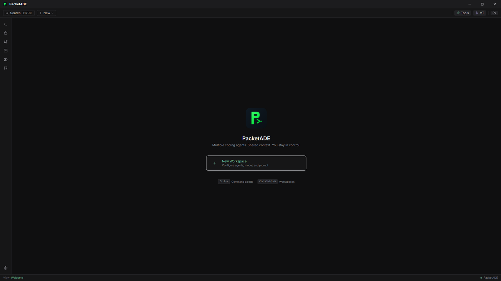
*01-welcome-1920.png — Welcome view*

- [Low] A single small centered cluster in a ~1880px-wide void; over 90% of the canvas is empty with only one action (New Workspace) — recents or a hint of the app's surfaces would earn the space.
- [Medium] Left-rail icons are extremely low contrast, label-less, with no active state on Welcome — first-run users get no hint the rail is the primary nav (UX-32).
- [Polish] Keyboard-hint chips ("Ctrl+K Command palette · Ctrl+Shift+W Workspaces") are a nice touch and well-rendered.

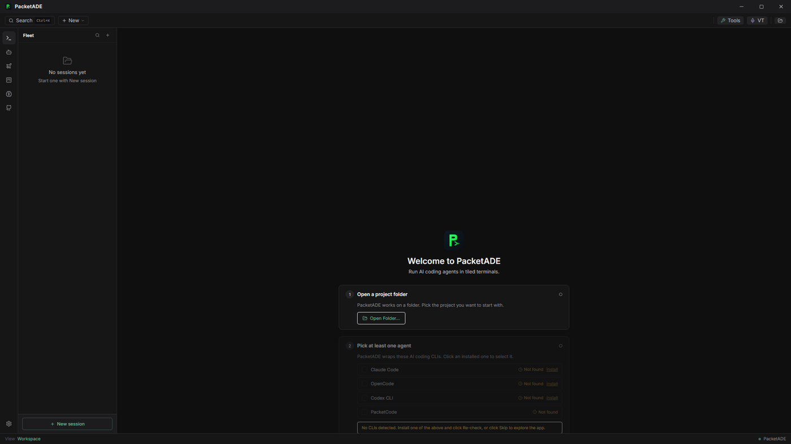
*02-workspace-onboarding-1920.png — Workspace, no sessions*

- [Medium] The onboarding column is vertically pushed down — the logo block starts at ~55% of viewport height, so step 2 and the CLI list run toward the fold while the top half of the canvas is empty (UX-36).
- [Low] The Fleet sidebar duplicates the guidance ("No sessions yet") — two competing empty states on one screen.
- [Low] The red-tinted "No CLIs detected…" strip reads as an error although it is a normal first-run state; amber/informational tone would fit better.

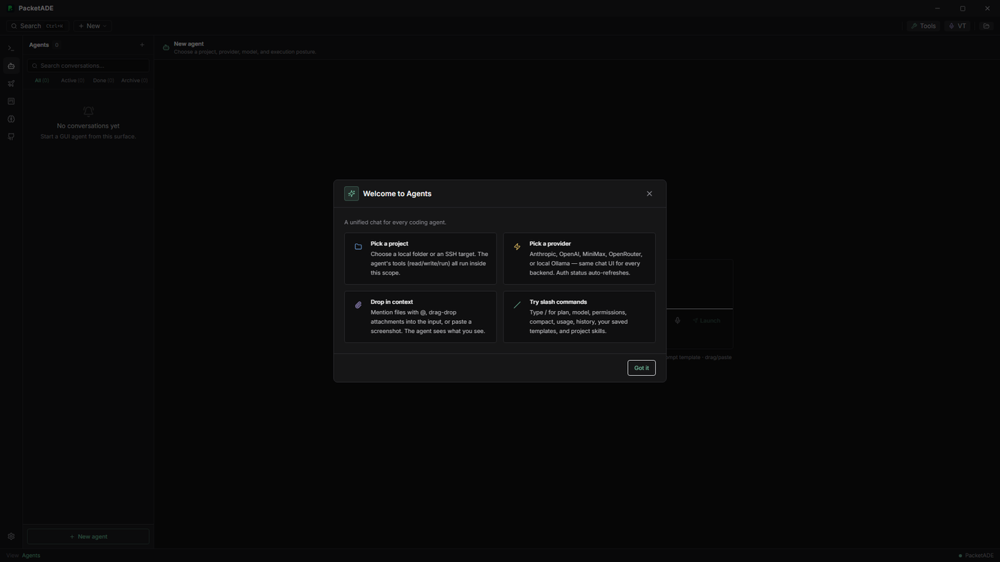
*03-agents-onboarding-modal-1920.png — Agents first-visit modal*

- [Medium] The modal auto-opens and its backdrop silently swallows every click including left-rail navigation — a user who clicks away gets no response and no visual explanation (UX-33).
- [Polish] The 2×2 feature cards are clean and well-balanced; "Got it" placement is fine.

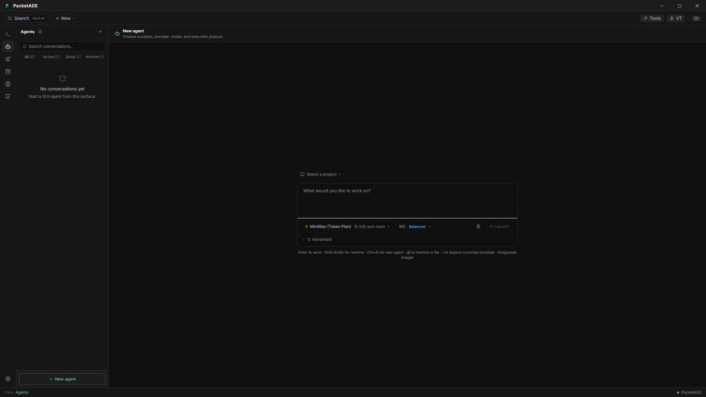
*04-agents-empty-1920.png — Agents view, modal dismissed*

- [Medium] Canvas ownership is ambiguous: a full-width header band, then ~350px of dead space, then the composer floating mid-canvas — the header describes the composer but is visually detached from it (UX-36).
- [Low] Three "new agent" affordances visible at once with no signalled hierarchy; a filter row and search box for zero conversations is noise in the empty state.

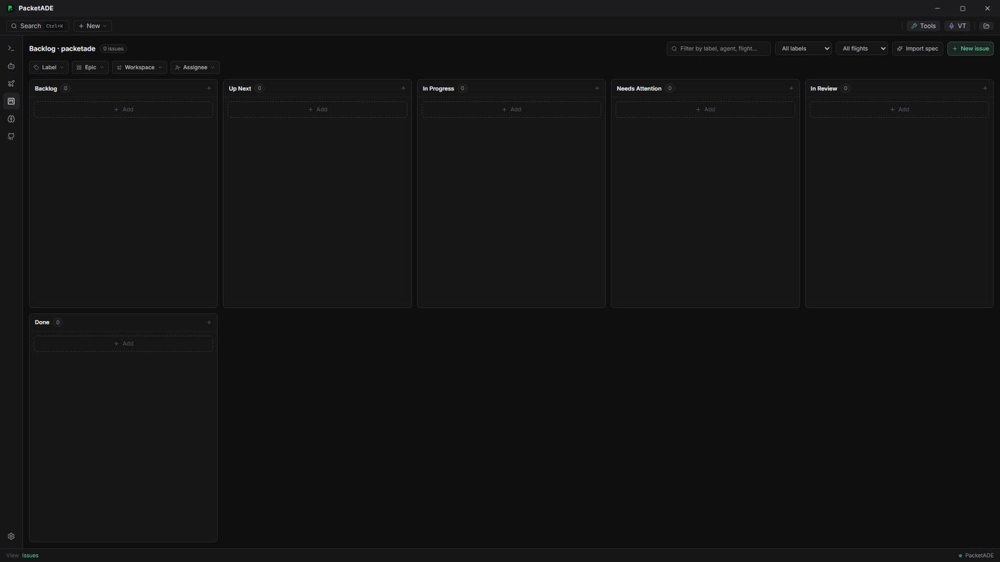
*05-issues-board-1920.png — Issues kanban — the most broken-looking screen in the app*

- [High] Column layout breaks the board metaphor: five columns fill row one and **Done wraps alone onto a second row** with a huge dead area to its right — at 1920 *and* 1280, so it is structural (fixed column min-width + wrap), not a narrow-screen artifact (UX-27).
- [Low] Row-one columns and the wrapped Done column have different heights, adding to the broken impression.
- [Polish] The header row (title chip, filter, dropdowns, Import spec, New issue) is dense but well-aligned.

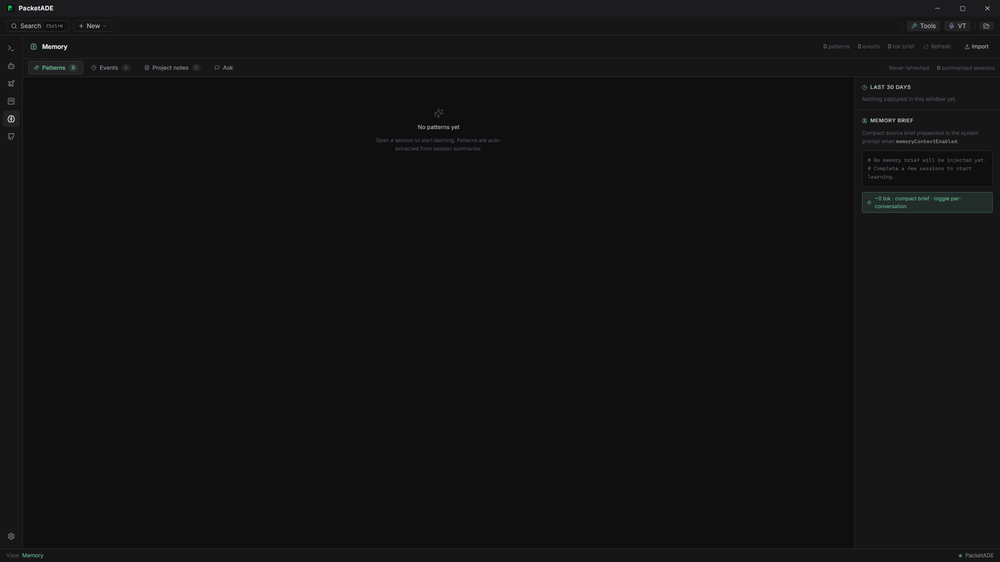
*06-memory-1920.png — Memory view*

- [Medium] The right panel fills content only in its top ~35%; below is a hard-edged full-height column of empty dark space (UX-37).
- [Low] Two stacked 10–11px muted meta rows right-aligned to the far corner read as clutter.
- [Polish] The centered "No patterns yet" empty state with guidance copy is good; the memory-brief code preview is a nice concrete touch.

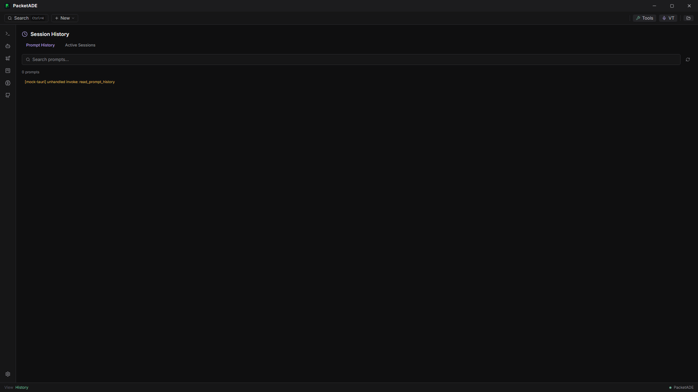
*07-history-1920.png — Session History — raw error rendered in-page*

- [High] (as rendered) A raw internal error string is printed inline in the content area: `[mock-tauri] unhandled invoke: read_prompt_history`. The trigger is the E2E mock, but the UI evidently pipes backend error strings verbatim into the page body — real failures would surface the same way (UX-22).
- [Medium] Prompt History / Active Sessions tabs are plain text links — a third tab idiom in the same app (UX-35).
- [Low] No designed empty state at all ("0 prompts" in tiny muted text is not one) (UX-36).

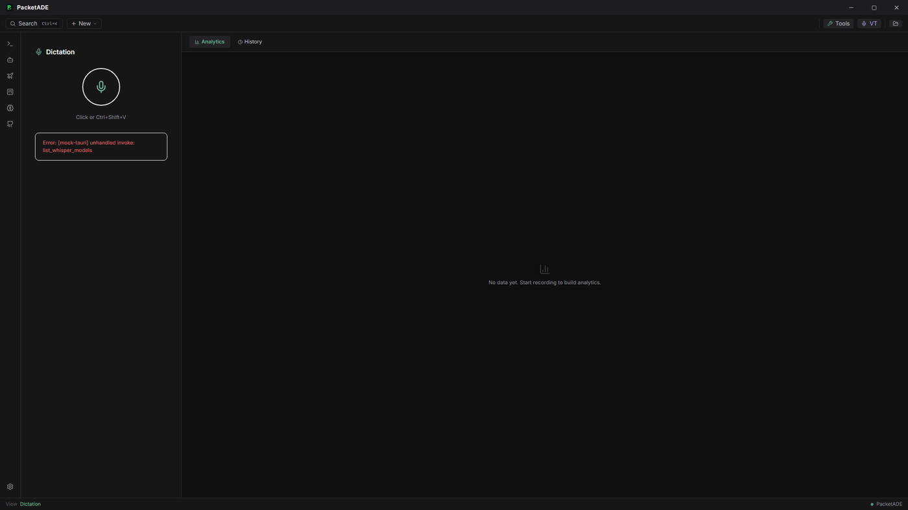
*08-dictation-1920.png — Dictation view*

- [High] (as rendered) Same raw-error pattern: a red-bordered box prints `Error: [mock-tauri] unhandled invoke: list_whisper_models` verbatim (UX-22).
- [Medium] The left panel uses its top fifth; the remaining ~80% is empty while the right Analytics pane is also an empty state — two mostly-empty panes side by side (UX-36).
- [Polish] The mic button with "Click or Ctrl+Shift+V" caption is a clear primary action.

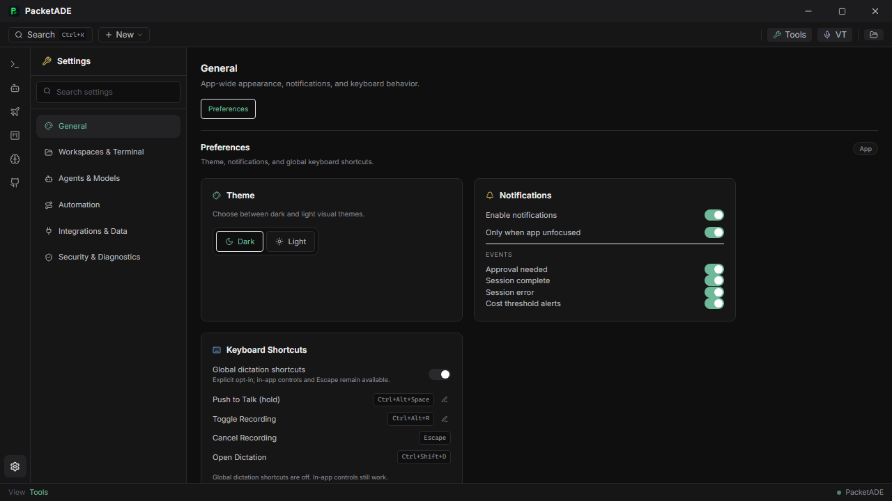
*09-settings-general-1280.png — Settings › General (1280×720) — fused notification toggles*

- [High] In the Notifications card the four EVENTS rows are ~16px tall but their toggles are taller: the four switches overlap into a fused vertical strip that no longer aligns with its rows — label-to-control mapping is ambiguous, at both viewports (UX-28).
- [Medium] Card-grid balance: the Theme card is mostly empty and the right column ends early — a masonry hole at the bottom right (UX-43).

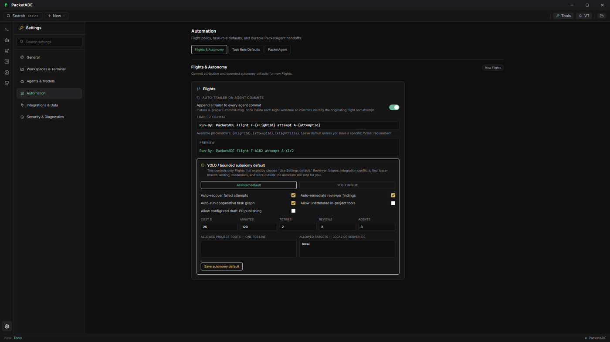
*10-settings-automation-1920.png — Settings › Automation*

- [Medium] Mixed control languages in one card: the YOLO section uses square checkboxes while everything above uses toggle switches (UX-34).
- [Low] Five numeric caps packed into one row with 9px uppercase labels read as a table without gridlines (UX-43).
- [Polish] The commit-trailer format + live PREVIEW block is genuinely good; but explicit-save vs auto-save is not signalled anywhere.

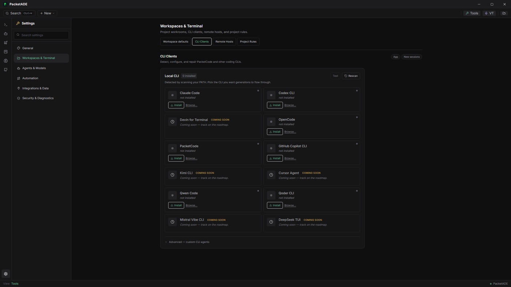
*11-settings-cli-clients-1920.png — Settings › CLI Clients*

- [Medium] Ten near-identical rows each restate "not installed" next to nearly invisible status dots — one of the two encodings is redundant (UX-39).
- [Low] COMING SOON rows are interleaved with installable ones; grouping would shorten the scan.

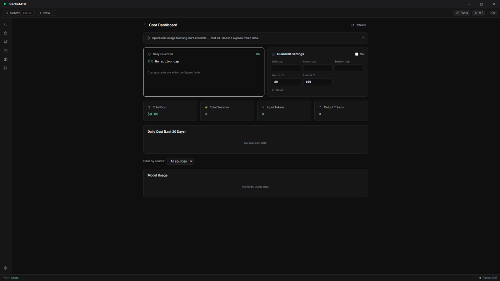
*12-cost-dashboard-1920.png — Cost Dashboard*

- [Medium] Guardrail Settings "On" is a bare native checkbox while the rest of the app uses styled toggles — a visually foreign element (UX-34).
- [Low] The Daily Guardrail card is half-empty next to a densely packed sibling; "$0.00" in accent green implies "good" rather than "no data" (UX-43).
- [Polish] The dismissible OpenCode notice banner (icon + copy + close) is well-formed — the model the raw-error surfaces above should copy.

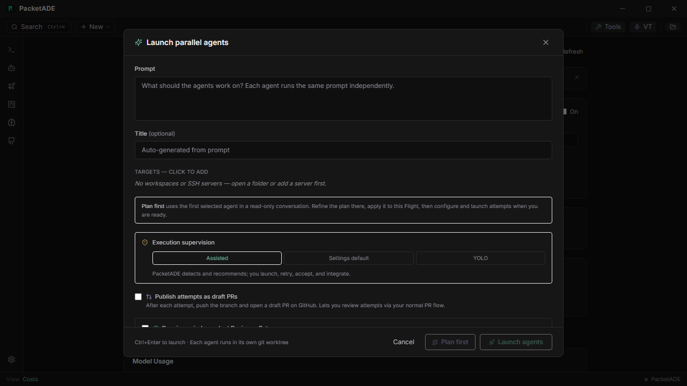
*13-modal-new-flight-1280.png — Launch parallel agents modal (1280×720)*

- [Medium] At 720px the "Require an independent Reviewer Gate" row is clipped mid-checkbox behind the sticky footer with no scroll affordance — it looks accidentally cut off, not scrollable (UX-38).
- [Low] Naming mismatch: toolbar says "New Flight", the modal is titled "Launch parallel agents", the buttons say "Launch agents" — Flight terminology appears nowhere in the modal (UX-15).
- [Low] The modal does not close on Escape — found because the audit script's Escape press was ignored (UX-24).
- [Polish] The three-way Assisted / Settings default / YOLO segmented control is clear; the empty-targets guidance is honest.

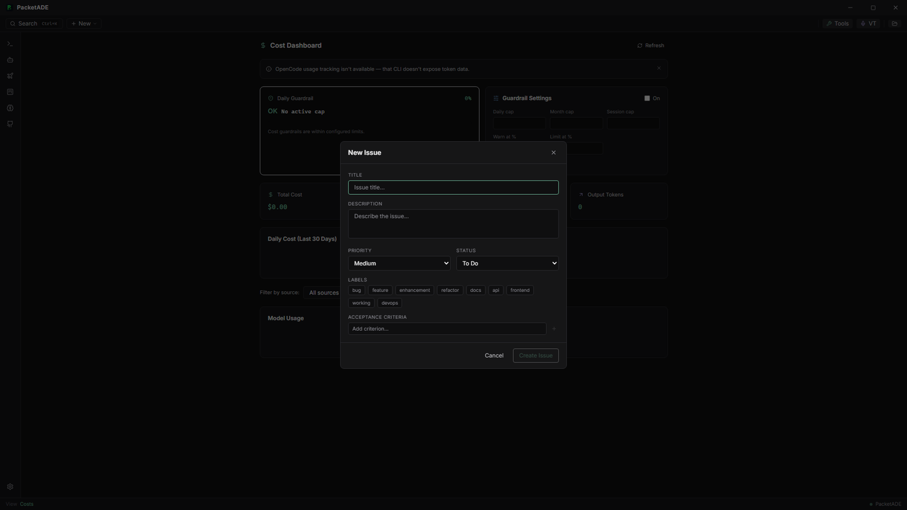
*14-modal-new-issue-1920.png — New Issue modal*

- [Low] Header style differs from the Launch modal (no icon, lighter weight) — two adjacent "create" modals, two treatments (UX-42).
- [Low] Label chips wrap into a ragged mixed-color cloud with unclear selected state.
- [Polish] TITLE/DESCRIPTION/PRIORITY/STATUS micro-caps labels are consistent and field alignment is good.

### 4.3 What genuinely looks good

- **Dark theme discipline** — the token palette holds up everywhere; accent green/amber/purple used consistently for semantics; text contrast in content areas reads crisp rather than cramped.
- **Settings information architecture** — six groups, pill sub-tabs, per-section scope badges, working search; the pattern is coherent across all six groups (independently confirming the 07-29 restructuring).
- **Concrete previews** — commit-trailer live preview, memory-brief code block, keyboard shortcut chips: show-not-tell.
- **The command palette surface** itself is clean (its *contents* are the UX-14 problem), and the toolbar economy (Search / + New / status chips) is small, aligned, unambiguous.
- **Empty states where they exist** — Flight Deck's "No flights yet" is the model the weaker views should copy.

Reproduction: `pnpm exec playwright test e2e/visual-audit.spec.ts --project=chromium` → output in `e2e/visual-audit-output/{1920x1080,1280x720}/` (gitignored). The spec is tolerant (skip-and-log per view), so a broken surface simply produces a screenshot of whatever rendered.

## 5. Creation, Opening & Deletion Flows

Commissioned directly by the owner — *"buttons are redundant, some up top some at the bottom, delete buttons for conversations"* — and answered by a five-reviewer fleet that walked every creation, opening, and deletion path in the app and inventoried every button on every list surface. **65 findings** across five flows: workspace creation (12), sessions/panes inside a workspace (11), agent conversations (16), deletion everywhere (13, including the review's only [Critical]), and a global button-redundancy audit of the main chrome (13).

Method: code-reading against the current tree, per-flow, with a button inventory recorded per surface. This chapter complements §3 (which reconciled three earlier audits) — several findings here confirm ledger entries in code (UX-15's label drift especially), and several are new. Nothing here was fixed by this session's bug loop or by the five decision implementations (§10.5), which touched the right-dock, routing, and SSH-gating surfaces rather than creation/deletion affordances. **That was true at publication only** — see the resolution note immediately below.

> **KEY**
> **Resolved since publication [3 commits, same day]**
>
> Three loops landed against this chapter after it was written, all on 2026-07-30.
>
> **`c3906c7` — confirmation.** The chapter's only [Critical] is closed: the unrouted dead-code `ServersView.tsx` was deleted and its confirm rebuilt as a shared `ConfirmDeleteModal` plus `lib/serverUsage.ts`, which names the real consequences (connection state, conversations on that `sshTarget` including mid-turn ones, running attempts, bound workspaces). All 7 native `window.confirm` sites were eliminated and 15 destructive paths that had none gained one; `scripts/confirm-idiom.test.mjs` now fences the idiom. `Modal` also flipped to `closeOnEscape=true` by default.
>
> **`8cc2217` — cleanup.** The three questions this chapter raised but could not answer without an owner decision were all decided and implemented. **Flight delete** now cancels every non-terminal attempt through the existing cancel path before deleting — deliberately including `reviewing`, because Rust only tears a worktree down on a terminal transition, so a reviewing attempt's worktree is still on disk (a subtlety this audit missed); cleanup is per-attempt try/caught with the delete after the `finally`, so a wedged attempt cannot abort it, and survivors are named in a toast. The 3-second armed inline confirm — the last of the five idioms — is gone. **Conversation delete** now discards the worktree and `pkt/<id>` branch, force-discarding dirty trees rather than refusing (once the record is deleted no UI names the tree, so a refusal would strand a directory nobody can find) behind a confirm that leads with the uncommitted-changes warning in caps and escalates its button to "Delete and discard changes". **SSH-server delete** clears the keyring secret on both the current and the legacy service, because reads auto-migrate from legacy and a survivor could resurrect the secret on id reuse.
>
> **`7cad08b` — cleanup holes, startup, issues, chrome.** The residue the previous two loops named as still open was closed except where it needs an owner decision. **Worktree cleanup stopped lying:** `cancel_flight_attempt` and `mark_attempt_status` now return a `WorktreeCleanupOutcome` instead of a `warn!`, and failures are data, not `Err` — the attempt is still cancelled while the existing `FlightCleanupFailure[]` toast finally covers them. `mark_attempt_status`'s SSH arm, found to be doing nothing but logging, now resolves the saved `ServerConfig` with fingerprint pinning like cancel does. **Cooperative integration worktrees are no longer abandoned:** new `cleanup_flight_integration_worktree` removes the `.pkt-flight-integrations/<flightId>` tree local or remote from the flight-delete fan-out, with its dirty state probed and named in the confirm *separately* from the attempt counts; the integration branch is removed with safe `git branch -d`, never `-D`, because it can be the only ref to merged-but-unlanded attempt work — a refusal is reported in `branchRetained` and the branch survives. **Startup restores the last view** (see UX-09, F-2.1-06). **Issues and comments are deletable** behind `ConfirmDeleteIssueModal`, which names the flight it unlinks, the workspace session that keeps running, and the counts of comments, acceptance criteria, and dependency links that go with it; a real linkage bug was fixed on the way — the flight unlink previously fired only when the deleted issue itself carried a `flightId`, so a flight holding a drifted id kept it forever. **Chrome de-duplicated:** `AgentSidebar` dropped its header "+", and `ConversationTile`'s **three** kebabs (tile chrome, a "More controls" toggle, and the overflow menu's own trigger) merged into one menu with every action preserved and the lazy-mount economy intact; the close (X) tooltip was lying because the same component mounts in two places where closing means different things, so labels are now per-mount-site and state the real consequence. No confirm was added to the tile close — closing destroys nothing and is one click to reverse.
>
> **Current residue from this chapter:** **no undo anywhere** — blocked on an owner design decision (soft-delete + restore vs a time-boxed undo toast; see §0.3 item 4). `IssueDetailView.tsx` remains a keep/delete candidate (B-11); `Ctrl+N` and `/new` retain different creation semantics; naming polish and the `useServerConnection` / `ConnectionProgress` keep-or-delete decision remain. The 2026-08-01 working tree closes the live-PTY confirmation and duplicate `CancelPendingButton` findings; the dated tables below retain the original audit evidence.
>

### 5.1 Headline findings

> **CRITICAL**
> **The five that matter most**
>
> 1. **Two parallel workspace-creation flows with conflicting contracts.** Flow A — the full `WorkspaceCreationModal` ("New Workspace" → "Create Workspace") — requires a name, at least one CLI session, and a non-empty project path. Flow B — Ctrl+N and the Fleet sidebar's two "New session" buttons — silently creates a zero-pane workspace hard-named "New Session" using whatever `projectPath` happens to sit in `layoutStore`, **including the empty string the modal explicitly blocks** because it "would break the Toolbar folder picker, git pollers, MCP, deploy". The two flows never mention each other and disagree on vocabulary: the same object is a "Workspace" in A and a "session" in B. (confirms UX-15)
> 2. [Resolved `c3906c7` + `7cad08b`] **The owner's complaint is literal, and it is in three places.** `FleetSidebar` ships a header "+" icon (top) and a footer "New session" CTA (bottom) **bound to the identical handler in one 240px sidebar**; `AgentSidebar` does exactly the same thing with "New agent"; and two pixels away in the same shell the WorkspaceView tab-strip "+" does something different (opens the full modal) under the near-identical tooltip "New workspace". Both sidebars now keep only the labelled footer CTA — `FleetSidebar` in `c3906c7`, `AgentSidebar` in `7cad08b`. The tab-strip "+" retains its distinct meaning and label.
> 3. **11 explicit triggers, 6 implicit programmatic creators, 6 label spellings** for one action — "New Workspace", "Create Workspace", "New workspace", "Create workspace", "Create Remote Workspace", "New session". And "session" names two different objects in adjacent UI: the sidebar's "New session" creates a *workspace*, while the workspace header's "Add Session" creates a *PTY pane*.
> 4. **The two most discoverable entry points cannot create a workspace.** The global "+ New" toolbar menu offers only Flight and Issue — while its own tooltip promises "a new session, flight, or issue" — and the Ctrl+K command palette offers no creation at all (and no Agents navigation entry either). The app's primary discovery surfaces are the only places the primary object cannot be made.
> 5. [Critical] [Resolved `c3906c7` + `8cc2217`] **Live SSH-server delete has no confirmation — and the component that *has* the confirm is dead code.** `ServersView.tsx` (with its `window.confirm` "Delete this server? This cannot be undone.") is never routed anywhere; every "open servers" handler navigates to the Settings card instead, whose delete fires immediately. Deleting a server also silently breaks every workspace and flight attempt bound to it. Dead component deleted and the Settings card moved onto the shared `ConfirmDeleteModal` with real consequence text (`c3906c7`); the orphaned keyring secret closed by `delete_ssh_password` across both keyring services (`8cc2217`).
>

Two structural patterns run underneath those five. First, **duplicate chrome on conversation tiles**: every `ConversationTile` renders two stacked header bars — tile chrome (grip, color dot, title, status pill, zoom, kebab containing "Archive conversation") and, directly beneath it, `AgentChatPane`'s own header (title again, status again, a second kebab that reveals a third, and an X whose tooltip says "Back to list" but actually removes the pane). Two identical kebab icons ~30px apart open completely different menus. Second, **confirm weight is inverted relative to blast radius**: there are **five** coexisting confirm idioms (styled Modal, `window.confirm` in 7 files, a 3-second armed inline confirm, a swap-to-"Confirm" button with no timeout, and — most commonly — none at all in 11+ surfaces), and the heaviest-blast-radius object in the app (a Flight with running attempts) gets the *lightest* confirm: an 11px inline two-step that auto-reverts after 3 seconds. [Resolved] **Both patterns are now closed.** The second: `c3906c7` collapsed the sweep onto one shared modal and `8cc2217` replaced the armed inline Flight confirm, so the heaviest-blast-radius delete now carries the heaviest disclosure. The first: `7cad08b` found **three** kebabs on the tile, not two — tile chrome, a "More controls" toggle, and the overflow menu's own trigger — and merged them into one menu with every action preserved and the lazy-mount economy intact; the X's tooltip was lying because the same component mounts in two places where closing means different things, so the label is now per-mount-site and states the real consequence (a tile close removes the pane while the conversation keeps running). No confirmation was added there: closing destroys nothing and is one click to reverse.

Honest counterweight: the reviewers found the creation funnels structurally sound where they matter — `createWorkspace` auto-activates and every caller sets the view, so focus always lands correctly; cancel paths leave clean state; the two conversation-delete paths the owner flagged are in fact the app's *most* polished (both use the same red-tinted styled modal). The problems are naming, redundancy, validation asymmetry, and confirm inconsistency — not data loss.

### 5.2 Button inventory — top strip vs bottom strip

The direct answer to the owner's question: every creation, navigation, and destructive control on each audited surface, recorded with its position and what it *actually* does (as opposed to what its label says). Read the "Surface / position" column for the top-vs-bottom pattern — `FleetSidebar` header + footer, `AgentSidebar` header + footer, and the tile chrome + chat header stack are the three literal duplications.

#### Workspace creation — 15 controls inventoried

| Surface / position | Control → what it actually does |
|---|---|
| Toolbar (top-left)/'+ New' dropdown | New Flight, New Issue -> opens LaunchAsyncFlightModal / NewIssueForm; NO workspace item despite tooltip 'Create a new session, flight, or issue' (`Toolbar.tsx`:157-176) |
| Toolbar (top-right)/folder icon | no active workspace -> OS folder picker -> FolderPickerFollowUp modal -> 'Create new workspace' (instant create, name = folder basename, preferred CLI) or 'Set as default for next workspace' (`Toolbar.tsx`:86-131, 308-376) |
|  | FleetSidebar header (top)/'+' icon, tooltip 'New session' -> instant createWorkspace('New Session', [], projectPath) (`FleetSidebar.tsx`:395-402) |
| FleetSidebar footer (bottom)/'New session' CTA -> same handler as the header '+' (`FleetSidebar.tsx` | 601-609) |
|  | WorkspaceView tab strip (top)/'+' icon, tooltip 'New workspace' -> opens WorkspaceCreationModal (`WorkspaceView.tsx`:134-140) |
|  | WorkspaceView header (top-right)/AddSessionPicker popover -> 'Workspace templates…' footer item -> opens WorkspaceCreationModal, i.e. creates a NEW workspace (`AddSessionPicker.tsx`:244-258 via `WorkspaceView.tsx`:157-162) |
|  | Empty-workspace zero state (center)/inline AddSessionPicker -> same 'Workspace templates…' item -> new-workspace modal (`WorkspaceView.tsx`:222-231) |
| WelcomeScreen (center)/'New Workspace' card -> WorkspaceCreationModal (`WelcomeScreen.tsx` | 38-50) |
|  | OnboardingPane step 3/'Open a Workspace' -> WorkspaceCreationModal with pre-selected agents (`OnboardingPane.tsx`:155-162, 182-187) |
| Settings > Tools ProjectInfoCard/'Create workspace' -> WorkspaceCreationModal (`ProjectInfoCard.tsx` | 96-102) |
|  | ServersView connected state (center)/'Create Remote Workspace' -> WorkspaceCreationModal with serverId + remotePath (`ServersView.tsx`:233-239, 264-270) |
|  | Global keyboard/Ctrl+N (outside Agents view) -> instant createWorkspace('New Session', [], projectPath) + jump to workspace view (`useAgentTabHoists.ts`:38-56) |
| Command palette (Ctrl+K) | navigation-only; no create-workspace command (`common/CommandPalette.tsx`:41-45) |
| Modal footer/'Cancel' + header X | discard silently; Escape does NOT close (no closeOnEscape) though X tooltip says 'Close (Esc)' (`WorkspaceCreationModal.tsx`:449-472, `ui/Modal.tsx`:40,76) |
| Implicit creators (no modal) | `IssueDetailView.tsx`:170, `issueStore.ts`:671, `QualityView.tsx`:267, `QualityAIErrorActions.tsx`:194, `github/InvestigationPanel.tsx`:85, `lib/agentHandoffs.ts`:151 |

#### Sessions & panes inside a workspace — 21 controls inventoried

| Surface / position | Control → what it actually does |
|---|---|
| WorkspaceView top strip/left | workspace tab '+' (icon, title 'New workspace') -> opens WorkspaceCreationModal (`WorkspaceView.tsx` L134-140) |
| WorkspaceView top strip/right | '+ Add Session' (AddSessionPicker popover) -> per-agent list, addPane on click (`WorkspaceView.tsx` L157-163, `AddSessionPicker.tsx` L59-71) |
| WorkspaceView top strip/right | 'Delegate' -> hands the workspace to a GUI agent (`WorkspaceView.tsx` L164-174) |
| WorkspaceView top strip/right | git-branch icon toggle -> opens Git Dashboard panel (L175-187) |
| WorkspaceView top strip/right | 'Bypass perms: on/off' -> toggles bypassPermissions (L188-202) |
| WorkspaceView empty state/center | inline AddSessionPicker card -> same addPane flow as the header popover (L222-232) |
| AddSessionPicker menu/footer | 'Workspace templates…' -> opens WorkspaceCreationModal titled 'New Workspace' (`AddSessionPicker.tsx` L244-258 -> WorkspaceView setShowCreate) |
| AddSessionPicker row/right | 'Set up' (PacketCode) -> opens Settings cli-clients (L196-204); 'Install' external link for other agents (L207-218) |
| Terminal tile header (WorkspacePane)/right | status pill (non-interactive), zoom Maximize2/Minimize2 -> setZoomedPane (`WorkspacePane.tsx` L240-250) |
| Terminal tile header/right | MoreVertical overflow -> menu: 'Model: X', 'Send prompt…', 'Pinned commands (n/5)', 'Restart session'/'Start session', 'Close pane' (kills PTY + removePane, no confirm) (`WorkspacePane.tsx` L252-327) |
| Terminal tile quick bar (below header) | pinned command chips -> writePty (L507-522) |
| Conversation tile OUTER chrome/right | status pill, zoom button, MoreVertical dropdown -> single item 'Archive conversation' (archives + removes tile, no confirm) (`ConversationTile.tsx` L194-235) |
| Conversation tile INNER agent-chat-header/right (TileHeaderActions) | AgentModeChip, DiffPaneTrigger, approval badge, [lazy] ModelSelector + ContextUsageRing + HeaderOverflowMenu, second MoreVertical 'More controls' (inline-expands cluster), X tooltip 'Back to list' -> removePane (pane only, conversation survives) (`TileHeaderActions.tsx` L158-178, `ConversationTile.tsx` L127-129) |
| Conversation tile fallback/center | 'Remove tile' button when conversation id dangles (`ConversationTile.tsx` L162-169) |
| Conversation tile failed strip | 'Retry' -> retryLastTurn (L268-276) |
| FleetSidebar header/top-right | '+' icon (tooltip 'New session') -> createWorkspace('New Session', [], projectPath) (`FleetSidebar.tsx` L395-402, L103-106) |
| FleetSidebar footer/bottom | 'New session' CTA -> same handleNewSession as the top '+' (L601-609) |
| FleetSidebar row hover/right | Pin, Archive/Unarchive (kills PTYs on workspace archive, no confirm, toast only), Trash2 'Delete' -> confirm Modal 'Delete session?' then killPty + deleteWorkspace (L333-364, L611-647, L237-250) |
| Toolbar/top-left | '+ New' dropdown (tooltip 'Create a new session, flight, or issue') -> only 'New Flight' and 'New Issue' items; no session item (`Toolbar.tsx` L148-178) |
| Keyboard | Ctrl/Cmd+N -> createWorkspace('New Session') outside Agents view (`useAgentTabHoists.ts` L38-56); Esc exits zoom (`WorkspaceMosaicContainer.tsx` L48-60); double-click tile header toggles zoom (WorkspacePane L226, ConversationTile L183) |
| DEAD | `TerminalHeader.tsx` default header ('+ New session', RotateCcw 'Restart', X 'Close pane') -> unreachable; sole production consumer WorkspacePane always passes renderHeader and showCloseButton={false} (`TerminalPane.tsx` L112-132, `WorkspacePane.tsx` L588) |

#### Agent conversations — 20 controls inventoried

| Surface / position | Control → what it actually does |
|---|---|
| AgentSidebar header (top-right) | Plus icon, tooltip 'New agent' -> selectConversation(null), shows launch composer (`AgentSidebar.tsx`:262-269) |
| AgentSidebar footer (bottom) | full-width 'New agent' button -> identical action (`AgentSidebar.tsx`:364-372) |
| AgentChatPane header (top-right) | X icon, tooltip 'Back to list' -> onClose = handleNewAgent = selectConversation(null) — same action as both 'New agent' buttons (`TileHeaderActions.tsx`:170-178, `AgentsView.tsx`:106-108,151) |
| Global | Ctrl/Cmd+N -> same action when activeView==='agents'; elsewhere creates a Workspace named 'New Session' (`useAgentTabHoists.ts`:38-53) |
| Chat composer | /new slash command -> immediately creates AND starts a new backend conversation cloning provider/model/permissions — different behavior from every 'New agent' button (`slashCommandHandlers.ts`:81-118) |
| Chat composer | /review -> creates a new reviewer conversation (`slashCommandHandlers.ts`:156-194) |
| Launch composer (bottom-right) | 'Launch' button, auth-gated, tooltip 'Launch (Enter)' -> actually creates the conversation (`ActionButtons.tsx`:43-53) |
| Launch composer (bottom-left) | ProviderPicker dropdown + inline 'Log in' sub-button; ModelSelector; AdvancedAccordion with ModeSelector/ProfilePicker/ComposerModePicker (`Composer.tsx`:723-806) |
| Command palette (Ctrl+K) | 'Prompt: <name>' rows -> sendToAgentChat creates a conversation with hard-coded api-claude fallback, no auth gating (`CommandPalette.tsx`:90-99, `promptStore.ts`:126-156); palette has NO 'Agents' view entry and no conversation search |
| AgentSidebar row (hover, right edge) | Pin / Archive-Unarchive / Trash icons -> Trash opens 'Delete conversation?' Modal (Cancel + red Delete) (`AgentSidebar.tsx`:219-250, 375-412) |
| FleetSidebar row (hover, right edge) | Pin / Archive / Trash -> Trash opens 'Delete session?' Modal; fallback conversation rows call the same deleteConversation (`FleetSidebar.tsx`:333-364, 611-648) |
| Chat header always-visible cluster | AgentModeChip, DiffPaneTrigger 'Changes' chip, amber pending-approval count badge (`TileHeaderActions.tsx`:104-131) |
| Chat header lazy cluster | ModelSelector + ContextUsageRing + HeaderOverflowMenu (its trigger is a MoreVertical kebab) (`TileHeaderActions.tsx`:134-154, `HeaderOverflowMenu.tsx`:100-107) |
| Chat header | second MoreVertical kebab = 'More controls'/'Hide controls' toggle that mounts/hides the lazy cluster — visually identical to the overflow trigger next to it when open (`TileHeaderActions.tsx`:156-168) — **[Resolved] `7cad08b`: merged into the single tile menu; the toggle no longer exists** |
| HeaderOverflowMenu contents | View mode Summary/Normal/Verbose, Memory toggle+preview, Show/Hide preview pane, Send to Monitor, Export Markdown, Export JSON, Copy transcript, then ContinueInMenu ('Move work': Open in Workspace, Attach terminal, Continue in PacketCode…, Open Git ending, Add to Flight…, Open folder in OS, Continue in CLI, Open in VS Code, Open in Cursor) — no Archive, no Delete, no Rename (`HeaderOverflowMenu.tsx`:108-272, `ContinueInMenu.tsx`:173-269) |
| Chat composer row (bottom) | Mic, CancelPendingButton 'Cancel N', Stop (Square, 'Stop turn') OR Send (`Composer.tsx`:636-685) |
| PendingApprovalsSection strip (above composer) | expand/collapse + its own CancelPendingButton 'Cancel N' — duplicate of the composer's (`PendingApprovalsSection.tsx`:148-175) |
| Toolbar RunningAgentsChip (any view) | row click -> openConversationInAgents; per-row Square 'Stop this agent' -> cancelActiveConversation, same call as composer Stop (`RunningAgentsChip.tsx`:63-99) |
| Reopen paths | AgentSidebar row click (`AgentSidebar.tsx`:196-218); FleetSidebar fallback row -> openConversationInAgents (`FleetSidebar.tsx`:180-193); RunningAgentsChip; BackToParentLink 'back to plan' (`AgentChatPane.tsx`:64-80); notification/Flight/Memory links via sessionGlue.openConversationInAgents (`sessionGlue.ts`:105-122) |
| Onboarding modal | 'Got it' footer button + Modal header X + Escape; full-viewport fixed inset-0 z-50 backdrop blocks the left rail while open (`AgentsOnboarding.tsx`:51-73, `Modal.tsx`:63) |

#### Deletion everywhere — 33 controls inventoried

| Surface / position | Control → what it actually does |
|---|---|
| FleetSidebar (Workspace view) / row hover, right-most icon | Trash2 'Delete' -> opens styled Modal 'Delete session?'; on confirm kills member PTYs (killPty) then deleteWorkspace — conversations detached, not destroyed (`FleetSidebar.tsx`:343-352, 611-648) |
|  | FleetSidebar / same row hover also has Archive (right-6) and Pin (right-11) icons — three stacked hover icons per row |
| FleetSidebar / header top | '+' icon 'New session' AND footer bottom: green 'New session' CTA — same action, two placements (`FleetSidebar.tsx`:395-402, 601-609) |
| AgentSidebar (Agents view) / conversation row hover | Trash2 'Delete conversation' -> styled Modal 'Delete conversation?' -> deleteConversation (`AgentSidebar.tsx`:242-249, 375-412) |
| AgentSidebar / header top | '+' 'New agent' AND footer bottom: green 'New agent' CTA — duplicate placements (`AgentSidebar.tsx`:262-269, 364-373) |
| AgentChatPane header (Agents view) / right cluster X | 'Back to list' -> deselects conversation (non-destructive) (`TileHeaderActions.tsx`:170-178, `AgentsView.tsx`:151) |
| ConversationTile (Workspace) / inner chat-header X | same 'Back to list' tooltip but here removes the pane from the workspace (`ConversationTile.tsx`:282, 127-129) |
| ConversationTile / tile chrome overflow (MoreVertical #1) | 'Archive conversation' -> archives + removes tile, no confirm (`ConversationTile.tsx`:205-235) |
| ConversationTile / chat-header overflow (MoreVertical #2, TileHeaderActions) | view mode/memory/export — a second stacked kebab in the same tile (`TileHeaderActions.tsx`:158-168) — **[Resolved] `7cad08b`: one kebab, one menu, all actions preserved** |
| WorkspacePane (PTY tile) / chrome overflow menu | 'Close pane' -> kills live PTY + removePane, NO confirm (`WorkspacePane.tsx`:316-327) |
| FlightsView / flight list row hover | Trash2 (opacity-0 until hover) -> inline two-step armed confirm 'Delete?' / 'Active work — delete?' with Check/X, 3s auto-revert -> deleteFlight (`FlightsView.tsx`:559-607) |
| AttemptTile (Flight detail) / footer | 'Cancel' -> cancelAttempt + remove worktree, no confirm (`AttemptTile.tsx`:380-388) |
| IssueBoard / anywhere | NO delete button exists — issueStore.deleteIssue has zero UI callers (`issueStore.ts`:113,345) — **[Resolved] `7cad08b`: `IssueCard` hover affordance + `IssueDetail` footer action, both behind `ConfirmDeleteIssueModal`** |
| IssueDetail / Flight field | X 'Remove from flight' -> unlink only, no confirm (`IssueDetail.tsx`:425-436) |
| IssueCommentList / comment hover | delete comment, no confirm (`IssueCommentList.tsx`:51) — **[Resolved] `7cad08b`: comment deletion added behind the same shared confirm idiom** |
| MemoryView / top toolbar | Trash2 'Clear all memory' -> window.confirm (`MemoryView.tsx`:255,368-375) |
| MemoryView / PatternRow hover | Trash2 'Delete pattern' -> immediate, NO confirm (`MemoryView.tsx`:880-891) |
| MemoryEventCard / card footer | Trash2 size=9 'Delete event' -> immediate, NO confirm (`MemoryEventCard.tsx`:87-96) |
| ProjectNotesTab / note detail | Archive button -> window.confirm('Archive this project-memory note?') — a confirm on a REVERSIBLE action while real deletes above have none (`ProjectNotesTab.tsx`:443-455) |
| ServersSettingsCard (Settings, the LIVE surface) / table row | Trash2 'Delete' -> deleteServer immediately, NO confirm, keyring ssh-<id> password never cleaned (`ServersSettingsCard.tsx`:95-101, `serverStore.ts`:68-75) |
| ServersView (DEAD — never routed) / header | Trash2 'Delete server' -> window.confirm('Delete this server? This cannot be undone.') (`ServersView.tsx`:44-46,165-171) |
| AgentProfilesCard (Settings) / row hover | Trash2 'Delete' -> window.confirm (`AgentProfilesCard.tsx`:149-153, 266-273) |
| CliAgentsCard (Settings) | Trash2 -> window.confirm; 'Reset built-ins' -> window.confirm (`CliAgentsCard.tsx`:771-788, 941) |
| McpServersCard (Settings) / row | Trash2 swaps in-place to a 'Confirm' button (no timeout, no cancel), raw red-500/red-400 Tailwind classes (`McpServersCard.tsx`:263-279) |
| ApiKeysCard (Settings) / row | Trash2, no tooltip, no confirm -> deleteApiKey (`ApiKeysCard.tsx`:155-161) |
| GitHubSettingsCard (Settings) | Trash2 'Remove host' -> immediate, no confirm (`GitHubSettingsCard.tsx`:482-489) |
| PacketAgentSettingsCard (Settings) | Trash2 'Remove stored token' -> immediate, no confirm (`PacketAgentSettingsCard.tsx`:127-135) |
| CrashViewerCard (Settings) | Trash2 'Delete' crash report -> immediate, no confirm (`CrashViewerCard.tsx`:99-104) |
| TrustProvenanceCard (Settings) | Trash2 'Clear local trust audit' -> immediate, no confirm (`TrustProvenanceCard.tsx`:46-53) |
| PromptLibrary / template row | Trash2 -> deleteTemplate immediate, no confirm (`PromptLibrary.tsx`:288-294) |
| CodeQualityHistoryDropdown / dropdown header | 'Clear' run history -> immediate, no confirm (`CodeQualityHistoryDropdown.tsx`:60-70) |
| WorktreeLifecycleBar / bar | 'Discard' -> runs immediately if clean; dirty tree throws and re-renders an inline confirm state (`WorktreeLifecycleBar.tsx`:169-186, 312-314) |
| WorkspaceAgentsDogfoodCard (Settings) | reset counters -> window.confirm (`WorkspaceAgentsDogfoodCard.tsx`:57) |

#### Global button redundancy — 35 controls inventoried

| Surface / position | Control → what it actually does |
|---|---|
| Toolbar(top)/left | 'Search Ctrl+K' -> opens CommandPalette (`Toolbar.tsx`:138) |
| Toolbar(top)/left | '+ New ▾' -> dropdown with ONLY 'New Flight' (LaunchAsyncFlightModal) and 'New Issue' (NewIssueForm), tooltip falsely promises 'session' (`Toolbar.tsx`:150-177) |
| Toolbar(top)/right | SidecarStatusChip -> non-interactive status text (`SidecarStatusChip.tsx`:54) |
| Toolbar(top)/right | RunningAgentsChip -> popover per agent: 'Open in Agents' + 'Stop this agent' (`RunningAgentsChip.tsx`:76-97) |
| Toolbar(top)/right | LiveSpendChip -> jumps to Cost Dashboard |
| Toolbar(top)/right | 'Tools ▾' -> optional module views (`Toolbar.tsx`:207) |
| Toolbar(top)/right | 'VT' -> Dictation view (`Toolbar.tsx`:239) |
| Toolbar(top)/right | FolderOpen icon -> rebind active workspace folder OR create-workspace/set-default fork (`Toolbar.tsx`:263) |
| TitleBar(top)/right | Minimize / Maximize-Restore / Close window controls (`TitleBar.tsx`:76-100) |
| LeftRail | Workspace, Agents, Flight Deck, Issues, Memory, GitHub; bottom: Settings -> view 'tools' (`LeftRail.tsx`:12-64) |
| StatusStrip(bottom) | NO action buttons — sidecar dot, project, branch, view label, dictation REC indicators only (`StatusStrip.tsx`) |
| Workspace/FleetSidebar header(top) | Search '/' toggle + '+' 'New session' -> createWorkspace('New Session') (`FleetSidebar.tsx`:382-402) |
| Workspace/FleetSidebar footer(bottom) | 'New session' CTA -> SAME createWorkspace handler (`FleetSidebar.tsx`:601-609) |
| Workspace/FleetSidebar row-hover | Pin, Archive/Unarchive, Trash2 -> Modal 'Delete session?' (`FleetSidebar.tsx`:333-364,611) |
| Workspace header row(top) | workspace tabs + '+' 'New workspace' -> WorkspaceCreationModal (`WorkspaceView.tsx`:134-140) |
| Workspace header row(top)/right | 'Add Session' popover, 'Delegate', GitBranch toggle (Git Dashboard), 'Bypass perms: on/off' (`WorkspaceView.tsx`:157-202) |
| Workspace terminal tile chrome | zoom, kebab 'More' -> {Model, Send prompt…, Pinned commands, Restart/Start session, Close pane (kills PTY, NO confirm)} (`WorkspacePane.tsx`:240-327) — **[Open] re-confirmed 2026-07-30 after `7cad08b`: 'Close pane' still kills the PTY with no confirmation (P-04, D-09)** |
| Workspace conversation tile chrome(row 1) | grip, zoom, kebab 'More' -> {Archive conversation} (`ConversationTile.tsx`:194-235) |
| Workspace conversation tile chat header(row 2) | **[Resolved] `7cad08b`: one kebab; X label is per-mount-site and states the real consequence.** As audited: mode chip, diff chip, approvals badge, kebab 'More controls' -> reveals ModelSelector + ring + SECOND kebab (HeaderOverflowMenu), X 'Back to list' -> actually removePane (`TileHeaderActions.tsx`:158-178, `ConversationTile.tsx`:282) |
| Agents/AgentSidebar header(top) | '+' 'New agent' -> selectConversation(null) (`AgentSidebar.tsx`:262-269) |
| Agents/AgentSidebar footer(bottom) | 'New agent' CTA -> SAME handler (`AgentSidebar.tsx`:364-373) |
| Agents/AgentSidebar row-hover | Pin, Archive, Trash2 'Delete conversation' -> Modal 'Delete conversation?' (`AgentSidebar.tsx`:219-249,375-411) |
| Agents chat header(top) | TileHeaderActions with X 'Back to list' -> deselect (correct semantics here); overflow: Send to Monitor / Export MD / Export JSON / Copy transcript / Continue in… (`HeaderOverflowMenu.tsx`:234-269) |
| Agents | Ctrl+N -> new agent in Agents view, but NEW WORKSPACE named 'New Session' from any other view (`useAgentTabHoists.ts`:38-53) |
| Flight Deck/FlightSidebar header(top) | Search + '+' 'New flight' -> LaunchAsyncFlightModal (`FlightsView.tsx`:388-403) |
| Flight Deck empty state(center) | 'New flight' CTA -> same modal (`FlightsView.tsx`:279-285) |
| Flight Deck row-hover | Trash2 'Delete flight' -> INLINE 2-step confirm, 3s auto-revert, allowed with active work (`FlightsView.tsx`:559-608) |
| Flight Deck detail(top-right) | 'Send to Monitor' (`FlightsView.tsx`:692-697); AsyncFlightGrid empty: 'Launch attempt' -> same modal targeted (`AsyncFlightGrid.tsx`:19-27) |
| Flight modal | title 'Launch parallel agents' (or 'Launch attempt — X'), footer 'Plan first'/'Open plan' + 'Launch N agents' (`LaunchAsyncFlightModal.tsx`:506-527) |
| Issues toolbar(top) | 'Import spec', 'New issue' (default up_next) (`IssueBoard.tsx`:283-311) |
| Issues column header | unlabeled '+' -> NewIssueForm w/ column default (`IssueBoard.tsx`:353-361) |
| Issues column footer(bottom) | '+ Add' -> IDENTICAL handler to column header '+' (`IssueBoard.tsx`:377-386) |
| Issues | NO delete-issue control anywhere; issueStore.deleteIssue (`issueStore.ts`:345) has zero UI callers — **[Resolved] `7cad08b`** |
| GitHub header(top) | Refresh, 'New PR', 'Disconnect' (`GitHubView.tsx`:772-803) |
| GitHub issue detail action row | 'Import to board', 'Investigate with AI', 'Plan flight', 'Branch from issue', 'Open on GitHub' (`GitHubView.tsx`:1103-1160) |

> **KEY**
> **Recommended ownership model (the fleet's consolidated proposal)**
>
> - The Toolbar **"+ New" dropdown becomes the single global creation entry** — add Workspace and Agent rows, and fix its tooltip so it stops promising what it does not offer.
> - Each surface keeps **exactly one local create control** in its list header — kill the footer CTAs *or* the header "+", never both.
> - Per-row destructive actions **standardize on one confirm idiom** (the shared Modal with `closeOnEscape` and a red confirm), with the inline two-step reserved for low-stakes row items only.
> - **Pane/tile close lives only in the tile chrome** (one kebab), never in the inner chat header.
> - **"Session" is reserved for PTY/conversation sessions** — workspace creation must say "workspace" everywhere. (This is the same fix UX-15 and Decision 4's route registry are converging on.)
>

### 5.3 Per-flow findings (65)

#### Workspace creation — 12 findings (High 2 · Medium 5 · Low 3 · Polish 2)

NEW WORKSPACE creation (all entry points: WorkspaceCreationModal, global "New" menu, Ctrl+N, Fleet sidebar, empty states, command palette, folder picker, Servers/Tools/Onboarding/Welcome CTAs)

Workspace creation has TWO parallel flows that never mention each other: (A) the full WorkspaceCreationModal ("New Workspace" -> "Create Workspace"), which enforces a name, at least one CLI session, and a non-empty project path; and (B) an instant path (Ctrl+N, Fleet sidebar's two "New session" buttons) that silently creates a zero-pane workspace hard-named "New Session" with whatever projectPath happens to be in layoutStore — including the empty string the modal explicitly blocks because it "would break the Toolbar folder picker, git pollers, MCP, deploy" (`WorkspaceCreationModal.tsx`:329-334 vs `FleetSidebar.tsx`:103-106 / `useAgentTabHoists.ts`:48-52). The two flows also disagree on vocabulary — the same object is a "Workspace" in flow A and a "session" in flow B — confirming the UX-15 ledger entry. There are at least 11 explicit UI triggers plus 6 implicit programmatic creators, using six different labels ("New Workspace", "Create Workspace", "New workspace", "Create workspace", "Create Remote Workspace", "New session"), while the two most discoverable entry points — the global "+ New" toolbar menu and the Ctrl+K command palette — are the only places that CANNOT create a workspace (the New menu's own tooltip even promises "a new session, flight, or issue" it doesn't deliver).

The owner's "some up top, some at the bottom" complaint is literal in FleetSidebar: a header "+" icon (top) and a footer "New session" CTA (bottom) call the identical handler in one 240px sidebar, while two pixels away in the same shell the WorkspaceView tab-strip "+" does something different (opens the full modal) under the near-identical tooltip "New workspace". Within the modal itself: Escape does not close it (Modal's closeOnEscape defaults false and the modal doesn't opt in) even though the X button's tooltip advertises "Close (Esc)"; picking a second template keeps the first template's auto-seeded name; and the AddSessionPicker's "Workspace templates…" item — offered in the zero state of a workspace the instant flow just created — opens the NEW-workspace modal rather than templating the current one, stranding the empty "New Session" shell as junk. On success all paths do land focus correctly (createWorkspace auto-activates + callers setActiveView("workspace")), and cancel paths are clean state-wise; the problems are naming, redundancy, validation asymmetry, and the escape/confirm inconsistency, not data loss.

| ID | Sev | Finding / files | Detail | Recommendation |
|---|---|---|---|---|
| W-01 | [High] | **Two parallel creation flows with conflicting names and contracts** `src/components/workspace/FleetSidebar.tsx`, `src/hooks/useAgentTabHoists.ts`, `src/components/workspace/WorkspaceCreationModal.tsx` | Flow A: WorkspaceCreationModal (title 'New Workspace', footer 'Create Workspace') requires a name, >=1 CLI session, and a non-empty project path. Flow B: Fleet sidebar 'New session' (header '+' at `FleetSidebar.tsx`:395-402 and footer CTA at :601-609) and Ctrl+N (`useAgentTabHoists.ts`:38-56) instantly create a zero-pane workspace hard-named 'New Session' with no name prompt, no session, no path validation. Same object, two vocabularies ('Workspace' vs 'session'), two rule sets — this is the UX-15 ledger item confirmed in code. A user who learns creation via Ctrl+N never sees templates, models, bypass-perms, or remote options; a user who learns via the modal doesn't know the sidebar buttons make workspaces at all. | Pick one noun ('Workspace'). Make the instant path a thin front door to the same concept: label it 'New workspace', and either auto-name uniquely ('Workspace 2') or reuse the FolderPickerFollowUp pattern. Route both flows through shared creation defaults so their contracts can't drift. |
| W-02 | [High] | **Instant paths create workspaces with empty projectPath that the modal explicitly forbids** `src/components/workspace/FleetSidebar.tsx`, `src/hooks/useAgentTabHoists.ts`, `src/stores/workspaceStore.ts`, `src/components/workspace/WorkspaceCreationModal.tsx` | WorkspaceCreationModal.saveBlockedReason blocks empty selectedProjectPath with the comment that persisting projectPath === '' 'would break the Toolbar folder picker, git pollers, MCP, deploy, etc.' (`WorkspaceCreationModal.tsx`:329-334). Yet FleetSidebar.handleNewSession (`FleetSidebar.tsx`:104-105) and Ctrl+N (`useAgentTabHoists.ts`:48-51) pass `useLayoutStore.getState().projectPath ?? ""` straight into createWorkspace with no guard, and workspaceStore.createWorkspace (`workspaceStore.ts`:306-361) accepts it. On a fresh install (no restored path) one keypress creates exactly the broken-state workspace the modal spends validation code preventing. | When projectPath is empty, the instant path should fall into the existing FolderPickerFollowUp / OS-picker flow (`Toolbar.tsx` already has it) instead of creating; or move the empty-path guard into workspaceStore.createWorkspace so no caller can bypass it. |
| W-03 | [Medium] | **Duplicate 'New session' buttons top and bottom of the same 240px sidebar** `src/components/workspace/FleetSidebar.tsx`, `src/components/views/WorkspaceView.tsx` | FleetSidebar renders a header '+' icon (Tooltip 'New session', `FleetSidebar.tsx`:395-402) and a full-width footer CTA '+ New session' (`FleetSidebar.tsx`:601-609) that call the identical handleNewSession. This is the owner's verbatim complaint ('some up top, some at the bottom'). Worse, the visually adjacent '+' in the WorkspaceView tab strip (`WorkspaceView.tsx`:134-140, tooltip 'New workspace') looks like a third duplicate but opens the full modal instead — a near-duplicate doing something subtly different. | Keep one sidebar trigger (the footer CTA is the discoverable one; drop the header '+' or keep only the icon). Make the surviving sidebar trigger and the tab-strip '+' do the SAME thing, or clearly differentiate labels ('New workspace' vs 'New workspace (choose template)…'). |
| W-04 | [Medium] | **Global '+ New' menu tooltip promises a session it cannot create; no workspace entry in the app's primary create menu** `src/components/layout/Toolbar.tsx`, `src/components/common/CommandPalette.tsx` | The toolbar '+ New' button's tooltip reads 'Create a new session, flight, or issue' (`Toolbar.tsx`:157) but the dropdown contains only 'New Flight' and 'New Issue' (`Toolbar.tsx`:164-177). The app's top-level object — the Workspace — is absent from the app's top-level create menu, and the tooltip actively misleads. The command palette (Ctrl+K), promoted on the Welcome screen, likewise has zero create commands (`CommandPalette.tsx`:41-45 is navigation-only). | Add 'New Workspace' as the first item of the '+ New' menu (opening WorkspaceCreationModal) and a 'New Workspace' command in the palette; or fix the tooltip to match reality. |
| W-05 | [Medium] | **'Workspace templates…' inside a workspace creates a DIFFERENT workspace and strands the current one** `src/components/workspace/AddSessionPicker.tsx`, `src/components/views/WorkspaceView.tsx` | AddSessionPicker's footer item 'Workspace templates…' (`AddSessionPicker.tsx`:244-258) is wired to onOpenTemplates = setShowCreate(true) (`WorkspaceView.tsx`:161, :230), which opens the New-Workspace modal. In the empty-workspace zero state — the exact state the instant 'New session' path produces — the screen says 'Add your first CLI session to this workspace', yet clicking 'Workspace templates…' and completing the modal creates a second workspace and leaves the empty 'New Session' shell behind as junk in the Fleet list. The label implies templating the current workspace; it does not. | Either apply the chosen template's sessions to the current empty workspace (addPane loop), or relabel the item 'New workspace from template…' and delete/absorb the empty current workspace when invoked from a zero-pane workspace. |
| W-06 | [Medium] | **Escape doesn't close the creation modal, but the X button tooltip says 'Close (Esc)'** `src/components/workspace/WorkspaceCreationModal.tsx`, `src/components/ui/Modal.tsx`, `src/components/layout/Toolbar.tsx`, `src/components/workspace/FleetSidebar.tsx` | WorkspaceCreationModal passes no closeOnEscape (`WorkspaceCreationModal.tsx`:449-453) and Modal defaults it to false (`ui/Modal.tsx`:40), so Esc is dead — yet the shared Modal's X button always carries title 'Close (Esc)' (`ui/Modal.tsx`:76). Meanwhile sibling modals in the same flow DO opt in: FolderPickerFollowUp (`Toolbar.tsx`:325) and the Fleet delete-session confirm (`FleetSidebar.tsx`:615). Users get Esc in some creation-adjacent dialogs and not others, with a tooltip that lies in the latter case. There is also no backdrop-click close anywhere (Modal renders no backdrop onClick). | Flip Modal's closeOnEscape default to true (opt OUT for destructive/busy modals), or at minimum derive the X tooltip from the actual closeOnEscape value. |
| W-07 | [Medium] | **Template name-seeding is sticky: picking a second template keeps the first template's name** `src/components/workspace/WorkspaceCreationModal.tsx` | applyTemplate only seeds the name when it's empty (`if (!name.trim()) setName(template.label)`, `WorkspaceCreationModal.tsx`:304-306). Click 'PacketCode' then 'Review Pair': the workspace is created named 'PacketCode' with Review Pair sessions. Conversely the auto-preselected default template (packetcode/shell, :73-82) never seeds the name at all, so the happy path still hits the 'Workspace name is required' block (:327) — the modal demands a name while every instant path auto-names. | Track whether the name was user-typed vs template-seeded; template clicks overwrite seeded names. Seed the name from the default template (or the project folder basename, matching Toolbar.basenameOfPath) so name entry becomes optional. |
| W-08 | [Low] | **FolderPickerFollowUp copy promises 'a Claude Code pane' but creates the preferred CLI (usually PacketCode)** `src/components/layout/Toolbar.tsx`, `src/lib/workspaceCliDefaults.ts` | The 'Create new workspace' option's description reads 'Open a workspace here with a Claude Code pane' (`Toolbar.tsx`:346-348), but handleCreateWorkspaceFromPicker uses getPreferredWorkspaceCli() (`Toolbar.tsx`:115-119), whose priority order is packetcode > claude-code > codex > opencode > terminal (`workspaceCliDefaults.ts`:10-16). Whenever PacketCode is installed the copy is simply wrong. | Compute the label from getPreferredWorkspaceCli() ('with a PacketCode pane') or genericize to 'with your default CLI session'. |
| W-09 | [Low] | **Six label spellings for one action across surfaces** `src/components/workspace/WorkspaceCreationModal.tsx`, `src/components/views/WelcomeScreen.tsx`, `src/components/views/WorkspaceView.tsx`, `src/components/views/tools/ProjectInfoCard.tsx`, `src/components/views/ServersView.tsx`, `src/components/workspace/FleetSidebar.tsx`, `src/components/onboarding/OnboardingPane.tsx` | Same action, different words per surface: 'New Workspace' (modal title `WorkspaceCreationModal.tsx`:451, `WelcomeScreen.tsx`:46), 'Create Workspace' (modal footer :469), 'New workspace' (tab-strip tooltip `WorkspaceView.tsx`:137), 'Create workspace' (`ProjectInfoCard.tsx`:101), 'Create Remote Workspace' (`ServersView.tsx`:238), 'New session' (`FleetSidebar.tsx`:395/607) producing a workspace literally named 'New Session' (`FleetSidebar.tsx`:105, `useAgentTabHoists.ts`:51). Onboarding adds a seventh: 'Open a Workspace' (`OnboardingPane.tsx`:160) which actually opens the creation modal. | Standardize on 'New workspace' for triggers and 'Create workspace' for the single commit button; sweep all seven call sites. |
| W-10 | [Low] | **No unique naming on the instant path — repeated Ctrl+N fills the UI with identical 'New Session' rows** `src/components/workspace/FleetSidebar.tsx`, `src/hooks/useAgentTabHoists.ts` | Both instant creators hardcode the name 'New Session' (`FleetSidebar.tsx`:105, `useAgentTabHoists.ts`:51) with no dedupe counter. Three Ctrl+N presses yield three tab-strip tabs and three Fleet rows all reading 'New Session', distinguishable only by relative timestamp. The tab strip (`WorkspaceView.tsx`:112-133) shows no path, so they're visually identical. | Suffix a counter ('New Session 2') or name from the project folder basename like Toolbar.handleCreateWorkspaceFromPicker already does. |
| W-11 | [Polish] | **Backing out of the onboarding creation modal permanently completes onboarding** `src/components/onboarding/OnboardingPane.tsx`, `src/components/views/WorkspaceView.tsx` | OnboardingPane.handleWorkspaceClose (`OnboardingPane.tsx`:65-71) calls complete() unconditionally — the comment acknowledges 'if the user backed out of the modal without creating, we still consider onboarding done'. A user who opens 'Open a Workspace', gets confused, and hits Cancel loses the guided flow forever (isOnboardingComplete gate in `WorkspaceView.tsx`:85-86). | Only mark complete when the modal actually created a workspace (pass a created flag through onClose), or on the explicit Skip. |
| W-12 | [Polish] | **Six implicit workspace creators bypass the modal with divergent defaults** `src/components/issues/IssueDetailView.tsx`, `src/stores/issueStore.ts`, `src/components/views/QualityView.tsx`, `src/components/quality/QualityAIErrorActions.tsx`, `src/components/views/github/InvestigationPanel.tsx`, `src/lib/agentHandoffs.ts` | Issues ('Open in Workspace' at `IssueDetailView.tsx`:170 and worktree flow at `issueStore.ts`:671), Quality (`QualityView.tsx`:267, `QualityAIErrorActions.tsx`:194), GitHub investigation (`InvestigationPanel.tsx`:85), and agent handoffs (`agentHandoffs.ts`:151) each call createWorkspace directly with their own naming and default-CLI conventions. Not wrong individually, but any future change to creation defaults (e.g. the empty-path guard above, bypassPermissions seeding) must be replicated in 12+ call sites. | Extract a single createWorkspaceWithDefaults helper (name fallback, preferred CLI, path validation, view activation) and route all programmatic creators through it. |

#### Sessions & panes inside a workspace — 11 findings (High 3 · Medium 3 · Low 4 · Polish 1)

NEW SESSIONS/PANES INSIDE A WORKSPACE (creation, top-vs-bottom button strips, close/kill/archive paths)

The workspace surface has a structurally sound creation funnel (AddSessionPicker popover in the header + the same picker inline as the empty-state CTA, both calling workspaceStore.addPane), but it is wrapped in exactly the redundancy the owner describes. The worst offender is the conversation tile: every ConversationTile renders TWO stacked header bars — the tile chrome (grip, color dot, title, status pill, zoom, MoreVertical dropdown containing "Archive conversation") and, directly beneath it, AgentChatPane's own 33px agent-chat-header (title again, status again, a second MoreVertical that inline-expands "More controls", and an X whose tooltip says "Back to list" but actually removes the pane). Two identical kebab icons ~30px apart open completely different things, the title and status are displayed twice, and the close affordance lives in the INNER bar while archive lives in the OUTER bar's menu. Terminal tiles, by contrast, have one header where close is buried in the overflow menu as "Close pane" — so the same operation (remove tile from mosaic) is a visible X on conversation tiles and a hidden menu item on terminal tiles.

The second systemic problem is that the word "session" names two different objects in adjacent UI: the Fleet sidebar's top "+" icon (tooltip "New session") and its bottom footer CTA "New session" — a literal top+bottom duplicate pair — both create an empty WORKSPACE named "New Session" (same as Ctrl+N), while inside a workspace the header's "Add Session" creates a PTY PANE. Destructive symmetry is also broken: closing a terminal pane kills a live PTY instantly with no confirmation, while deleting the enclosing workspace from the Fleet sidebar (same PTY kill plus pane removal) gets a full confirm modal with "This can't be undone." There is no undo anywhere in the flow, consistent with the ledger.

| ID | Sev | Finding / files | Detail | Recommendation |
|---|---|---|---|---|
| P-01 | [High] · [Partly resolved] `7cad08b` | **Conversation tiles render two stacked header bars with duplicate title, duplicate status, and two different kebab menus** `src/components/workspace/ConversationTile.tsx`, `src/components/agents/AgentChatPane.tsx`, `src/components/agents/chat/TileHeaderActions.tsx` | ConversationTile mounts its own chrome row (GripHorizontal + color dot + conversation.title + STATUS_PILL + zoom + MoreVertical dropdown whose only item is 'Archive conversation', `ConversationTile.tsx` L180-237) and then AgentChatPane renders a second full 33px 'agent-chat-header' immediately below it (Sparkles avatar + conversation.title again + status dot + status label again + TileHeaderActions, `AgentChatPane.tsx` L254-299). The user sees the title twice, the status twice, and two visually identical MoreVertical buttons ~30px apart: the outer one opens a dropdown menu (Archive), the inner one ('More controls', `TileHeaderActions.tsx` L158-168) inline-expands ModelSelector/ContextUsageRing/HeaderOverflowMenu — same icon, two different interaction patterns, different contents. This is the exact 'buttons up top, some at the bottom' complaint compressed into one tile. ConversationTile's own comment (L44) admits the shared-header extraction was deferred. | Merge into one header row for the tile frame: pass a 'chromeless' prop (or slot API) so AgentChatPane suppresses its header when framed by ConversationTile, and fold TileHeaderActions' chips into the single tile chrome bar. One title, one status, one kebab. **Done — with a correction.** `7cad08b` found THREE kebabs, not two, and merged them into one menu with every action preserved and the lazy-mount economy intact. The two stacked header bars and their duplicated title/status remain — that is the still-open half of this finding. |
| P-02 | [High] | **'Session' means a workspace in the Fleet sidebar/Ctrl+N but a PTY pane inside the workspace — creation-label drift confirmed in code** `src/components/workspace/FleetSidebar.tsx`, `src/hooks/useAgentTabHoists.ts`, `src/components/workspace/AddSessionPicker.tsx`, `src/components/views/WorkspaceView.tsx` | FleetSidebar's handleNewSession (L103-106) and Ctrl+N (`useAgentTabHoists.ts` L51) both call createWorkspace('New Session', [], projectPath) — they create an empty WORKSPACE literally named 'New Session'. The Fleet empty state says 'Start one with New session' (L488), the delete confirm says 'Delete session?' even for workspaces (L613), and search is 'Search sessions (/)' (L382). Meanwhile the workspace header's '+ Add Session' (`AddSessionPicker.tsx` L70) and its inline empty-state copy 'Add your first CLI session' (`WorkspaceView.tsx` L224) use 'session' to mean a PTY pane. A user clicking Fleet's 'New session' gets an empty workspace whose zero state then asks them to add a session — the same word for the container and its contents, two clicks apart. This corroborates ledger item UX-15. | Pick one vocabulary: call the Fleet rows and Ctrl+N target 'workspaces' (rename the button 'New workspace' and default name accordingly), keep 'session' exclusively for PTY panes — or vice versa, but not both. |
| P-03 | [High] · [Resolved] `7cad08b` | **Close semantics are inconsistent and mislabeled across the two tile types: hidden menu item vs visible X, and the X lies about what it does** `src/components/agents/chat/TileHeaderActions.tsx`, `src/components/workspace/ConversationTile.tsx`, `src/components/workspace/WorkspacePane.tsx` | Terminal tiles: the ONLY close affordance is 'Close pane' inside the header overflow menu (`WorkspacePane.tsx` L316-327) — it kills a live PTY and removes the pane. Conversation tiles: close is a visible X in the INNER header whose tooltip/aria-label is 'Back to list' (`TileHeaderActions.tsx` L170-178) — in the tile frame there is no list; onClose is ConversationTile.removeTile (L127-129), which removes the pane. Meanwhile 'Archive conversation' lives in the OUTER chrome's kebab (L222-232) and does something subtly different (archives the conversation AND removes the tile). So the same tile has two near-duplicate exits in two different header rows with different consequences, and the terminal tile hides its single exit in a menu. 'Back to list' is a leftover from the retired standalone AgentsView header (comment at TileHeaderActions L47). | Give both tile types a visible X in the (single) chrome row with an honest tooltip ('Close tile — conversation stays in Fleet' / 'Close pane — stops the CLI session'), and keep Archive as the one lifecycle action in the kebab. **Done.** `7cad08b` made the close label per-mount-site, because the same component mounts in two places where closing means different things. In a Workspace tile the label states the real consequence — the pane is removed while the conversation keeps running; in the Agents view it deselects. No confirm was added: closing destroys nothing and is one click to reverse. |
| P-04 | [Medium] · [OPEN — re-confirmed after `7cad08b`] | **Killing a live PTY via pane 'Close pane' has no confirmation, while the equivalent kill via Fleet delete has a full typed confirm modal** `src/components/workspace/WorkspacePane.tsx`, `src/components/workspace/FleetSidebar.tsx` | WorkspacePane's overflow 'Close pane' (L316-327) runs state.onKill() on a live agent PTY and removePane immediately — no confirm, no undo, mid-run work is lost silently. FleetSidebar's row Trash2 for the same workspace opens a Modal ('Delete session?', 'This can't be undone.', red Delete button, L611-647) before killPty + deleteWorkspace (L237-250). Fleet's Archive button also kills member PTYs (archiveWorkspaceWithFanout, L206) with no confirm, only a post-hoc toast. Three destructive paths that all end running PTYs: one confirmed, two not. Also no visual distinction anywhere between closing an idle pane and killing a running one — the menu label is 'Close pane' in both states. | Gate 'Close pane' on state.alive: when the PTY is running, either confirm inline ('Agent is running — stop and close?') or relabel the item 'Stop agent and close pane'. Align the archive fan-out kill with the same rule. **Still open, re-confirmed 2026-07-30.** `7cad08b` rebuilt the tile menus around this control without adding a confirm. It is the one destructive-without-confirm path left after the confirm sweep. |
| P-05 | [Medium] · [Resolved] `c3906c7` | **Fleet sidebar has a literal top+bottom duplicate: header '+' icon and footer 'New session' CTA call the same handler** `src/components/workspace/FleetSidebar.tsx` | The sidebar header's '+' (Tooltip 'New session', `FleetSidebar.tsx` L395-402) and the persistent footer CTA button 'New session' (L601-609) both invoke handleNewSession. The footer CTA is not an empty-state affordance — it renders unconditionally at the bottom of the sidebar even when the header '+' is visible 30px of scroll away, and the empty state additionally references it by name ('Start one with New session', L488). This is the owner's 'some up top, some at the bottom' complaint verbatim. | Keep exactly one: drop the footer CTA (or render it only in the empty state) and keep the header '+', or vice versa. **Done.** `c3906c7` removed the `FleetSidebar` header '+' and kept the labelled footer CTA; `7cad08b` applied the identical resolution to `AgentSidebar`. |
| P-06 | [Medium] | **'Workspace templates…' menu item opens a modal titled 'New Workspace' that creates a different workspace** `src/components/workspace/AddSessionPicker.tsx`, `src/components/views/WorkspaceView.tsx`, `src/components/workspace/WorkspaceCreationModal.tsx` | AddSessionPicker's footer item 'Workspace templates…' (`AddSessionPicker.tsx` L244-258) triggers onOpenTemplates, which WorkspaceView wires to setShowCreate(true) (L161, L230) — opening WorkspaceCreationModal, whose Modal title is 'New Workspace' and whose submit is 'Create Workspace' (`WorkspaceCreationModal.tsx` L451, L469). A user inside the 'Add Session' picker for the CURRENT workspace who clicks 'Workspace templates…' expects to apply a template here, but instead lands in the new-workspace flow. Label promises one thing, action does another — the same drift class as UX-15. | Relabel to 'New workspace from template…' or move the item out of the add-session picker entirely (it already exists as the tab-strip '+'). |
| P-07 | [Low] | **Toolbar '+ New' dropdown tooltip promises 'a new session' but offers no session item** `src/components/layout/Toolbar.tsx` | The global '+ New' button's title is 'Create a new session, flight, or issue' (`Toolbar.tsx` L157) but the dropdown contains only 'New Flight' (L166-170) and 'New Issue' (L171-175). No session/workspace entry exists, so the app-level creation menu and the tooltip disagree — and there is no single global entry point that creates a session, reinforcing the scatter (Fleet '+', Fleet footer, Ctrl+N, tab '+', Add Session). | Either add a 'New Workspace' item to the menu (making it the canonical creation hub) or fix the tooltip to 'Create a new flight or issue'. |
| P-08 | [Low] | **`TerminalHeader.tsx` default header (Plus/Restart/X buttons) is dead code in production** `src/components/session/TerminalHeader.tsx`, `src/components/session/TerminalPane.tsx`, `src/components/workspace/WorkspacePane.tsx` | TerminalPane renders TerminalHeader only when renderHeader is absent (`TerminalPane.tsx` L112-132). The sole production consumer is WorkspacePane, which always supplies renderHeader and passes showCloseButton={false} (`WorkspacePane.tsx` L581, L588). TerminalHeader's '+ New {cli} session', 'Restart session', and X 'Close pane' buttons (`TerminalHeader.tsx` L50-79) are therefore unreachable outside tests — a third, orphaned close/restart idiom that will silently diverge from the live overflow-menu idiom. `CLAUDE.md` still lists NewSessionModal/SessionTabBar/PaneContainer, none of which exist in src/ anymore. | Delete TerminalHeader (fold the minimal fallback into TerminalPane) or make WorkspacePane's custom header delegate to it so there is one header implementation. |
| P-09 | [Low] | **Restart/Start of a dead terminal session is buried in the overflow menu and the status pill mislabels dead sessions as 'idle'** `src/components/workspace/WorkspacePane.tsx` | When a PTY exits, WorkspacePane's status pill shows 'idle' (statusLabel logic L204-212 — dead and never-started are indistinguishable) and the only recovery affordance is the overflow item 'Start session' (L305-315). The retired default header showed a visible '+' for exactly this state (`TerminalHeader.tsx` L50-58). A user staring at a dead terminal has no visible restart button. | Show a small inline 'Start' button in the header (or an overlay CTA on the dead terminal body) when !alive, and distinguish 'exited' from 'idle' in the pill. |
| P-10 | [Low] | **Escape-to-close is inconsistent between the creation modal and the delete confirm in the same flow** `src/components/ui/Modal.tsx`, `src/components/workspace/WorkspaceCreationModal.tsx`, `src/components/workspace/FleetSidebar.tsx` | Modal defaults closeOnEscape to false (`Modal.tsx` L40). FleetSidebar's 'Delete session?' confirm passes closeOnEscape (L615) so Escape cancels it, but WorkspaceCreationModal never passes the prop (L449-451) so Escape does nothing in the 'New Workspace' modal — the surface a user is most likely to want to dismiss quickly. Same flow, opposite Escape behavior, corroborating the ledger's closeOnEscape note. | Pass closeOnEscape on WorkspaceCreationModal (it has no destructive intermediate state worse than losing form input), or flip the Modal default and opt out where Escape must be guarded. |
| P-11 | [Polish] | **WorkspaceView header comment advertises 'pane-layout presets' control that does not exist** `src/components/views/WorkspaceView.tsx`, `src/components/workspace/WorkspaceMosaicContainer.tsx` | The merged-header comment (`WorkspaceView.tsx` L104-108) lists 'pane-layout presets' among the header controls, but the JSX contains no preset button — presets exist only as automatic tree-building in WorkspaceMosaicContainer (buildPresetTree/presetForCount). Stale comment that will mislead the next refactor. | Fix the comment (or actually add the preset picker if it was intended to ship). |

#### Agent conversations — 16 findings (High 3 · Medium 7 · Low 3 · Polish 3)

AGENT conversations — creating and opening (AgentsView, AgentSidebar, onboarding, composer/provider/profile pickers, chat-pane header vs bottom controls, ContinueInMenu, reopen paths)

The Agents surface has one real creation action (selectConversation(null) → launch composer) exposed through four differently-labelled controls — sidebar-top Plus "New agent", sidebar-bottom "New agent" CTA, the chat-header X tooltipped "Back to list", and Ctrl+N — which is precisely the owner's "some up top, some at the bottom" complaint, made worse because the X (a close/destroy affordance) is the most prominent header button and actually means "show the new-agent screen". Alongside it sit near-duplicates with subtly different semantics: the /new slash command immediately creates and starts a cloned backend session (not the composer), the command palette's prompt actions create conversations with a hard-coded auth-ungated api-claude fallback, and the same palette has no Agents navigation entry at all. Deleting a conversation is possible from two different sidebars with two vocabularies ("Delete conversation?" vs "Delete session?", "cannot"/"can't be undone"), while the conversation's own overflow menu — which holds ten other actions — has neither Archive nor Delete.

In-pane redundancy is real too: when approvals are pending the user sees the count three times (header amber badge, "Cancel N" in the PendingApprovalsSection strip, and an identical "Cancel N" in the composer row directly beneath it), and opening the header overflow renders two identical MoreVertical kebabs side by side that do different things (open dropdown vs collapse inline cluster — the code comment itself calls it "Redundant"). Secondary issues: ProfilePicker silently rewrites the global default profile on every pick, the advertised Ctrl+N shortcut is dead whenever focus is in the (auto-focused) composer textarea, and the onboarding modal's full-viewport backdrop blocks rail navigation until dismissed. Confirm styling within this flow is at least internally consistent (Modal + red Delete + Cancel, closeOnEscape), but there is no undo anywhere, consistent with the ledger.

| ID | Sev | Finding / files | Detail | Recommendation |
|---|---|---|---|---|
| A-01 | [High] | **Four controls, three labels, one action: 'new agent'** `/mnt/d/projects/PacketADE/src/components/agents/AgentSidebar.tsx`, `/mnt/d/projects/PacketADE/src/components/agents/chat/TileHeaderActions.tsx`, `/mnt/d/projects/PacketADE/src/components/views/AgentsView.tsx`, `/mnt/d/projects/PacketADE/src/hooks/useAgentTabHoists.ts` | selectConversation(null) — i.e. 'show the launch composer' — is wired to (1) the AgentSidebar top-right Plus icon tooltipped 'New agent' (`AgentSidebar.tsx`:262-269), (2) the AgentSidebar bottom footer 'New agent' CTA (`AgentSidebar.tsx`:364-372), (3) the chat-pane header X button tooltipped 'Back to list' (`TileHeaderActions.tsx`:170-178, onClose=handleNewAgent in `AgentsView.tsx`:106-108), and (4) Ctrl+N (`useAgentTabHoists.ts`:44-46). Top + bottom duplication inside one 252px sidebar is exactly the owner's complaint. The X is the worst offender: an X connotes close/destroy, its tooltip promises 'Back to list' (the list never left the screen), and its actual result is the 'New agent' launch screen — three different mental models for one button. | Keep ONE 'New agent' button (sidebar header Plus, labeled), drop the footer CTA (or keep footer-only), and relabel/re-icon the header X to what it does (e.g. a chevron-left 'Deselect' or make it actually just collapse to the composer with a 'New agent' label). Ctrl+N can stay as the shortcut for that one control. |
| A-02 | [High] | **Duplicate 'Cancel N' button rendered twice at once, plus a third count badge** `/mnt/d/projects/PacketADE/src/components/agents/chat/PendingApprovalsSection.tsx`, `/mnt/d/projects/PacketADE/src/components/agents/composer/Composer.tsx`, `/mnt/d/projects/PacketADE/src/components/agents/chat/CancelPendingButton.tsx`, `/mnt/d/projects/PacketADE/src/components/agents/AgentChatPane.tsx` | When approvals are pending, the identical CancelPendingButton ('Cancel N', Ban icon, same cancelPendingTools call) renders in the PendingApprovalsSection strip (`PendingApprovalsSection.tsx`:170-174) AND in the chat composer row directly below it (`Composer.tsx`:658-661 via `AgentChatPane.tsx`:407-408). The chat header additionally shows a passive amber count badge (`TileHeaderActions.tsx`:120-131). Two live buttons for the same destructive action, vertically adjacent, is textbook button redundancy. | Render CancelPendingButton in exactly one place — the PendingApprovalsSection strip (it is the approvals surface). Keep the header badge as a passive indicator. |
| A-03 | [High] | **Same conversation deletable from two sidebars with different vocabulary** `/mnt/d/projects/PacketADE/src/components/agents/AgentSidebar.tsx`, `/mnt/d/projects/PacketADE/src/components/workspace/FleetSidebar.tsx`, `/mnt/d/projects/PacketADE/src/stores/agentTaskStore.ts` | AgentSidebar's hover Trash opens 'Delete conversation?' with body 'Permanently delete …? This closes the session and removes its history.' and footnote 'This cannot be undone.' (`AgentSidebar.tsx`:375-412). FleetSidebar's hover Trash on a fallback conversation row calls the same deleteConversation but titles the modal 'Delete session?' with footnote 'This can’t be undone.' (`FleetSidebar.tsx`:611-648). Same entity, same store action, different noun ('conversation' vs 'session') and different contraction. Both bodies also use 'session' inside the 'conversation' modal, blurring the conversation/session vocabulary further. | Extract one shared ConfirmDeleteConversation modal (single title, single copy) used by both sidebars; pick one noun for the entity everywhere. |
| A-04 | [Medium] · [Resolved] `7cad08b` | **Two identical MoreVertical kebabs side by side in the chat header** `/mnt/d/projects/PacketADE/src/components/agents/chat/TileHeaderActions.tsx`, `/mnt/d/projects/PacketADE/src/components/agents/chat/HeaderOverflowMenu.tsx` | When the header's lazy cluster is mounted, HeaderOverflowMenu's dropdown trigger is a MoreVertical kebab (`HeaderOverflowMenu.tsx`:100-107) and immediately next to it sits the 'More controls'/'Hide controls' toggle — also a MoreVertical kebab (`TileHeaderActions.tsx`:156-168). Identical icon, adjacent position, different behaviors (open dropdown vs collapse inline cluster). The code comment itself concedes 'Redundant while the tile is zoomed … kept for consistent chrome.' | Give the cluster toggle a different icon (e.g. SlidersHorizontal or ChevronLeft/Right) or merge the two: let the single kebab open the overflow menu and have the menu contain the model/context controls. **Done.** `7cad08b` merged the tile chrome kebab, the 'More controls' toggle, and the overflow trigger into one menu. |
| A-05 | [Medium] | **/new is a near-duplicate of 'New agent' with silently different semantics** `/mnt/d/projects/PacketADE/src/components/agents/composer/slashCommandHandlers.ts`, `/mnt/d/projects/PacketADE/src/components/agents/AgentSidebar.tsx` | The 'New agent' buttons only deselect to the launch composer, but the /new slash command (`slashCommandHandlers.ts`:81-118) immediately creates AND starts a backend session, cloning the current conversation's provider, model, planMode, allowedTools, permissionMode, and MCP servers — no composer, no confirmation, a billable session begins on an empty initialMessage. Two things both called 'new' that do materially different things is the 'worse' class of near-duplicate. | Rename the slash command to /clone or /fork-settings, or make /new route to the launch composer pre-filled with the cloned settings instead of immediately starting a session. |
| A-06 | [Medium] | **ProfilePicker silently changes the global default profile on every pick** `/mnt/d/projects/PacketADE/src/components/agents/composer/ProfilePicker.tsx`, `/mnt/d/projects/PacketADE/src/components/agents/composer/Composer.tsx`, `/mnt/d/projects/PacketADE/src/stores/profileStore.ts` | Every DropdownItem click in ProfilePicker calls both onProfileChange (per-launch selection) and setDefaultProfile(p.id) (`ProfilePicker.tsx`:44-49). A comment in `Composer.tsx`:771-778 admits the workaround this forces ('picking any profile also pins it as defaultProfileId, so we can't use that flag'). Selecting a profile for one launch permanently rewrites the default used by every future launch and by the chat variant's activeProfile fallback — an invisible global side effect of a local-looking control. | Make picking a profile per-launch only; offer an explicit 'Set as default' row or star affordance in the dropdown. |
| A-07 | [Medium] | **Advertised Ctrl+N shortcut is dead exactly where it is advertised** `/mnt/d/projects/PacketADE/src/hooks/useAgentTabHoists.ts`, `/mnt/d/projects/PacketADE/src/components/agents/composer/utils.ts`, `/mnt/d/projects/PacketADE/src/components/agents/chat/EmptyConversationHint.tsx`, `/mnt/d/projects/PacketADE/src/components/views/AgentsView.tsx` | COMPOSER_HELP_TEXT under the launch composer says 'Ctrl+N for new agent' (`utils.ts`:112-113) and EmptyConversationHint shows a '⌃N new' kbd chip (`EmptyConversationHint.tsx`:35-38). But the global handler yields whenever the event target is editable (isEditableTarget, `useAgentTabHoists.ts`:14-18,42), and AgentsView auto-focuses the launch textarea on mount (`AgentsView.tsx`:64-68) and the chat user is typically typing. So pressing Ctrl+N while focused in the composer — the state in which both hints are visible — does nothing. | Either allow Ctrl+N from editable targets (it is a chord, not typing) at least while activeView==='agents', or remove the hint from the two surfaces where it can't fire. |
| A-08 | [Medium] | **Onboarding modal auto-opens and its backdrop blocks rail navigation** `/mnt/d/projects/PacketADE/src/components/agents/AgentsOnboarding.tsx`, `/mnt/d/projects/PacketADE/src/components/ui/Modal.tsx` | AgentsOnboarding renders whenever onboardingDismissed is false (`AgentsOnboarding.tsx`:43-49), on every AgentsView mount. The shared Modal wraps it in a fixed inset-0 bg-black/60 z-50 backdrop (`Modal.tsx`:63) that covers the entire viewport including the LeftRail, so a first-time visitor cannot navigate to any other view until they dismiss. Confirms the known ledger item. Mitigations do exist — 'Got it', the header X, and Escape (closeOnEscape is passed) — but the backdrop itself is not click-to-dismiss, so the most natural escape (click elsewhere) fails. | Make the onboarding a dismissible inline banner/card in the launch-composer zero state instead of a viewport-blocking modal, or at minimum add backdrop click-to-dismiss for this specific modal. |
| A-09 | [Medium] | **Command palette cannot reach Agents but can create agent conversations** `/mnt/d/projects/PacketADE/src/components/common/CommandPalette.tsx`, `/mnt/d/projects/PacketADE/src/components/layout/LeftRail.tsx` | The palette's static actions (`CommandPalette.tsx`:38-117) list Workspace, Issues, History, GitHub, Memory, Settings, prompts, and modules — there is no 'Agents' navigation entry, no 'New agent', and no conversation search, even though 'agents' is a first-class LeftRail view (`LeftRail.tsx`:14). Meanwhile the same palette's 'Prompt: …' rows DO create agent conversations via sendToAgentChat. So the palette can spawn a conversation in a view it cannot itself navigate to. | Add an 'Agents' action (and ideally 'New agent' plus fuzzy conversation-title search) to the palette. |
| A-10 | [Medium] | **Palette prompt launch hardcodes api-claude with zero auth gating** `/mnt/d/projects/PacketADE/src/stores/promptStore.ts`, `/mnt/d/projects/PacketADE/src/components/views/AgentsView.tsx` | promptStore.sendToAgentChat (`promptStore.ts`:126-156) falls back to agent 'api-claude' when no API conversation is selected and calls createApiConversation immediately — bypassing the launch composer's auth-gated Launch button entirely. A user with no Anthropic API key gets a dead/failing conversation. It also disagrees with the other default-provider logic: AgentsView defaults to api-minimax and runs an AUTO_PICK_ORDER readiness probe (`AgentsView.tsx`:21-33,76-104). Three creation entry points, three different provider-default policies. | Route palette prompt launches through the same auth-aware pick (reuse AUTO_PICK_ORDER / getProviderAuthStatus) or prefill the launch composer with the template instead of creating a session directly. |
| A-11 | [Low] | **No Archive/Delete on the open conversation itself; only hover icons on the sidebar row** `/mnt/d/projects/PacketADE/src/components/agents/chat/HeaderOverflowMenu.tsx`, `/mnt/d/projects/PacketADE/src/components/agents/AgentSidebar.tsx` | HeaderOverflowMenu holds ten-plus actions (view mode, memory, preview, monitor, two exports, copy, and the whole ContinueInMenu) but neither Archive nor Delete (`HeaderOverflowMenu.tsx`:108-272). The only way to delete or archive the conversation you are looking at is to find its row in the 252px sidebar and hover to reveal opacity-0 icons (`AgentSidebar.tsx`:219-250). Combined with the header X that looks like close/delete but means 'new agent', the destructive affordances are exactly where users won't look. | Add 'Archive conversation' and 'Delete conversation…' (reusing the shared confirm) to the bottom of HeaderOverflowMenu. |
| A-12 | [Low] | **Ctrl+N and 'New session' cross-surface label drift (UX-15 confirmed in code)** `/mnt/d/projects/PacketADE/src/hooks/useAgentTabHoists.ts`, `/mnt/d/projects/PacketADE/src/components/workspace/FleetSidebar.tsx` | In Agents, Ctrl+N means 'clear selection, show launch composer'; anywhere else it creates a Workspace literally named 'New Session' (`useAgentTabHoists.ts`:48-52). FleetSidebar's top Plus and bottom CTA are both tooltipped/labelled 'New session' yet create an empty Workspace whose zero-state hosts a CLI-only picker (`FleetSidebar.tsx`:101-106,395-402,600-609). One shortcut and one label produce three different objects depending on where you stand. | Align nouns: 'New workspace' for the Fleet CTA (it creates a workspace), 'New agent' in Agents; stop naming workspaces 'New Session'. |
| A-13 | [Low] | **AgentSidebar empty state uses internal jargon and has no CTA** `/mnt/d/projects/PacketADE/src/components/agents/AgentSidebar.tsx` | With zero conversations the sidebar shows 'No conversations yet — Start a GUI agent from this surface.' (`AgentSidebar.tsx`:308-318). 'GUI agent' and 'this surface' are internal spec vocabulary, and the EmptyState's action slot is unused even though the component supports it (FleetSidebar passes an action button in its equivalent state). | Copy like 'Start your first agent with New agent below' or pass an action button that focuses the launch composer. |
| A-14 | [Polish] | **Filter chip label drift: 'Archive' vs 'Archived'** `/mnt/d/projects/PacketADE/src/components/agents/AgentSidebar.tsx`, `/mnt/d/projects/PacketADE/src/components/workspace/FleetSidebar.tsx` | The fourth status filter chip is labelled 'Archive' in AgentSidebar (`AgentSidebar.tsx`:294-301) but 'Archived' in FleetSidebar (`FleetSidebar.tsx`:408-410) for the same concept. | Use 'Archived' in both. |
| A-15 | [Polish] | **Same mic control styled differently across the unified composer's two variants** `/mnt/d/projects/PacketADE/src/components/agents/composer/Composer.tsx`, `/mnt/d/projects/PacketADE/src/components/agents/composer/ActionButtons.tsx` | The chat variant's mic is size 12, p-1, square-rounded (`Composer.tsx`:636-655); the launch variant's mic (`ActionButtons.tsx`:26-37) is size 14, p-1.5, rounded-full with a different active treatment. The component doc-comment sells 'ONE composer' but the visuals diverge for the identical function. | Share one MicButton between variants. |
| A-16 | [Polish] | **Two Stop buttons with different names for the same call** `/mnt/d/projects/PacketADE/src/components/agents/composer/Composer.tsx`, `/mnt/d/projects/PacketADE/src/components/layout/RunningAgentsChip.tsx` | The composer's streaming Stop button (Square icon, tooltip 'Stop turn', `Composer.tsx`:663-672) and the toolbar RunningAgentsChip per-row Square tooltipped 'Stop this agent' (`RunningAgentsChip.tsx`:90-97) both invoke cancelActiveConversation. 'Turn' vs 'agent' implies different scopes for the identical action. | Pick one phrasing ('Stop turn') for both tooltips. |

#### Deletion everywhere — 13 findings (Critical 1 · High 4 · Medium 5 · Low 2 · Polish 1)

DELETION everywhere (conversations, workspaces, sessions/panes, flights, issues, memory, servers, profiles, keys, prompts)

Deletion in PacketADE is spread across at least 30 affordances using FIVE distinct confirm idioms — a styled Modal (FleetSidebar/AgentSidebar), window.confirm (7 files), a 3-second armed inline confirm (FlightsView), a swap-to-'Confirm' button with no timeout (McpServersCard), and — most commonly — no confirmation at all (11+ surfaces, including the only live way to delete an SSH server). The two conversation-delete paths the owner flags are actually the most polished (both use the same red-tinted styled modal), but they sit inside sidebars that themselves duplicate their creation CTA top-and-bottom, and the conversation tile in Workspace stacks two kebab menus plus an X whose tooltip says 'Back to list' while it actually removes the pane — the exact 'some up top, some at the bottom' redundancy complained about. There is no undo anywhere, no keyboard delete, and no context-menu delete (right-click exists only for project rename).

| ID | Sev | Finding / files | Detail | Recommendation |
|---|---|---|---|---|
| D-01 | [Critical] · [Resolved] `c3906c7` + `8cc2217` | **Live SSH-server delete has no confirmation; the component WITH the confirm is dead code** `src/components/views/ServersView.tsx`, `src/components/views/tools/ServersSettingsCard.tsx`, `src/stores/serverStore.ts` | `ServersView.tsx` (window.confirm 'Delete this server? This cannot be undone.', line 45) is never routed anywhere — every 'open servers' handler (`ProjectPicker.tsx`:107-111, `LaunchAsyncFlightModal.tsx`:277, `WorkspaceCreationModal.tsx`:431) navigates to setActiveView('tools') instead. The surface users actually reach, `ServersSettingsCard.tsx`:95-101, calls deleteServer(id) directly from a 10px hover trash icon with zero confirmation. serverStore.deleteServer (`serverStore.ts`:68-75) also never deletes the OS-keyring password stored under ssh-<id>, orphaning the secret. | Delete `ServersView.tsx` (dead), move its confirm into ServersSettingsCard using the shared styled-Modal idiom, and have deleteServer clear the keyring entry (add a delete_ssh_password command; `ssh_keys.rs` currently has load/exists only). · **Done as recommended.** `c3906c7` deleted `ServersView.tsx` and gave the Settings card the shared `ConfirmDeleteModal` backed by `lib/serverUsage.ts`, so the dialog names bound workspaces, running attempts, and conversations on that host. `8cc2217` added Rust `delete_ssh_password`, which clears the entry under **both** the current and the legacy keyring service — reads auto-migrate from legacy, so a survivor could resurrect the secret on id reuse — treats a missing entry as success so key-auth servers do not error, and cannot block the delete on failure. |
| D-02 | [High] · [Resolved] `8cc2217` | **Flight delete warns about active work but then abandons running attempts, worktrees, and processes** `src/components/views/FlightsView.tsx`, `src/stores/flightStore.ts`, `src/stores/asyncFlightStore.ts` | `FlightsView.tsx`:485-607 detects hasActiveWork and changes the armed-confirm label to 'Active work — delete?', but confirming just calls flightStore.deleteFlight (`flightStore.ts`:269-285), which only unlinks issues and filters the array. It never calls asyncFlightStore.cancelAttempt, never kills attempt sessions, and never removes attempt worktrees — running agents keep executing with their entire management UI (AttemptTile Cancel button) gone, and worktree directories are stranded on disk. | On delete of a flight with live attempts, either block until attempts are cancelled or have deleteFlight fan out to cancelAttempt for each in-progress attempt (mirroring FleetSidebar's kill-PTYs-then-delete pattern). · **Done — the fan-out option, with one correction to this finding.** `asyncFlightStore.deleteFlightWithAttemptCleanup` cancels every non-terminal attempt through the existing cancel path and then deletes the Flight. "Non-terminal" deliberately **includes `reviewing`**, which this audit did not flag: Rust only tears a worktree down on a terminal transition, so a reviewing attempt's worktree is still on disk. Cleanup is per-attempt try/caught with the delete running after the `finally`, so a wedged attempt cannot abort it; failures raise a toast naming the branch and what may survive — including SSH attempts whose `ServerConfig` is gone, which neither Rust nor the frontend fallback can reach. The armed inline button was replaced by `ConfirmDeleteModal`, now stating the attempts to be cancelled by status, the worktrees to be removed, which are dirty or uncheckable, and that live tasks are **not** cancelled. Completion capture is suppressed during the delete so cancelling the last attempt cannot mint a `flight_completed` memory event and retrospective for a record being discarded. **Both remaining gaps closed by `7cad08b`.** Cooperative `integrationBranch` worktrees: new `cleanup_flight_integration_worktree` (registered, with a TS binding) removes the `.pkt-flight-integrations/<flightId>` tree local or remote, called from the flight-delete fan-out; its dirty state is probed and named in the confirm **separately** from the attempt counts. The integration branch is removed with safe `git branch -d`, never `-D`, because it can be the only ref to merged-but-unlanded attempt work — a refusal is reported in `branchRetained` and the branch survives. Rust's swallowed worktree-removal errors: `cancel_flight_attempt` and `mark_attempt_status` now return a `WorktreeCleanupOutcome` instead of a `warn!`, and failures are data rather than `Err` so the attempt is still cancelled while the existing `FlightCleanupFailure[]` toast covers them. `mark_attempt_status`'s SSH arm was found to be doing nothing but logging and now resolves the saved `ServerConfig` with fingerprint pinning, as cancel already did. |
| D-03 | [High] · [Resolved] `8cc2217` | **Deleting a conversation orphans its unlanded worktree and pkt/<id> branch** `src/stores/agentTaskStore.ts`, `src/components/agents/AgentSidebar.tsx`, `src/components/workspace/FleetSidebar.tsx` | agentTaskStore.deleteConversation (`agentTaskStore.ts`:893-940) cancels the session, GCs substores, and deletes the conversation file, but never touches conv.worktree — no discardConversationWorktree call and no dirty check. The archive path is meticulous about this (archiveWorkspaceWithFanout applies the worktree cleanup policy and toasts 'Archived with an unlanded worktree kept', `sessionGlue.ts`), yet permanent delete — via `AgentSidebar.tsx`:393 or `FleetSidebar.tsx`:248 — silently strands the worktree dir and branch with no remaining UI reference (WorktreeLifecycleBar is per-conversation). Neither delete modal's copy ('closes the session and removes its history') mentions the worktree. | In deleteConversation, if a worktree exists in state 'active', either run the discard flow (with the dirty-tree confirm) or surface it in the delete modal ('also discard worktree pkt/<id>?'). · **Owner decided: discard, and surface the confirm — both halves of the recommendation.** Dirty worktrees are **force-discarded rather than refused**, with the reasoning recorded: once the record is deleted no UI names the tree, so refusing would strand a directory nobody can find. The new `ConfirmDeleteConversationModal` (+ `lib/conversationWorktreeDisclosure.ts`) leads with "This worktree has UNCOMMITTED CHANGES. They will be permanently lost." in caps, names the exact worktree path and `pkt/<id>` branch, escalates the button to "Delete and discard changes", and reports an unreadable git status as possibly-dirty rather than clean. Root-run, SSH, and already-discarded worktrees are skipped; landed worktrees are still discarded. Both sidebars moved onto the shared idiom. |
| D-04 | [High] · [Resolved] `c3906c7` + `8cc2217` | **Five coexisting confirm idioms for destructive actions (ledger says three; it is worse)** `src/components/workspace/FleetSidebar.tsx`, `src/components/agents/AgentSidebar.tsx`, `src/components/views/FlightsView.tsx`, `src/components/views/tools/McpServersCard.tsx`, `src/components/views/MemoryView.tsx` | (1) Styled red-tinted Modal: `FleetSidebar.tsx`:611-648, `AgentSidebar.tsx`:375-412. (2) window.confirm: `MemoryView.tsx`:255, `AgentProfilesCard.tsx`:152, `CliAgentsCard.tsx`:773+780, `ProjectNotesTab.tsx`:446, `WorkspaceAgentsDogfoodCard.tsx`:57 (plus dead `ServersView.tsx`:45). (3) Inline armed confirm with 3s auto-revert: `FlightsView.tsx`:475-480,559-595. (4) In-place swap to a 'Confirm' button, no timeout, no cancel affordance: `McpServersCard.tsx`:263-279. (5) No confirm at all: ServersSettingsCard, ApiKeysCard:155, GitHubSettingsCard:482, PacketAgentSettingsCard:127, CrashViewerCard:99, TrustProvenanceCard:46, PromptLibrary:290, IssueCommentList:51, MemoryView pattern delete:886, MemoryEventCard:87, CodeQualityHistoryDropdown:69. The FlightsView comment at line 472-474 even claims its pattern 'matches ... e.g. GitDashboard', but `GitDashboard.tsx` contains no such confirm — stale justification. | Pick two sanctioned idioms (styled Modal for record-destroying deletes; inline armed confirm for small list rows) and codify a shared ConfirmDeleteModal / useArmedConfirm; ban window.confirm via lint. · **Done, and reduced further than recommended — one idiom, not two.** `c3906c7` eliminated all 7 `window.confirm` sites, added confirmation to 15 destructive paths that had none, and shipped `scripts/confirm-idiom.test.mjs` as the fence (a repo test rather than a lint rule). `8cc2217` retired the last holdout — the 3-second armed inline Flight confirm — onto `ConfirmDeleteModal`. Sharp edge: the fence greps broadly enough that a test *name* containing `confirm (` trips it. |
| D-05 | [High] · [Resolved] `7cad08b` | **ConversationTile stacks two kebab menus and an X whose tooltip lies about what it does** `src/components/workspace/ConversationTile.tsx`, `src/components/agents/chat/TileHeaderActions.tsx`, `src/components/views/AgentsView.tsx` | One workspace conversation tile renders: tile-chrome MoreVertical menu containing only 'Archive conversation' (`ConversationTile.tsx`:205-235), then directly below it the chat header's second MoreVertical (`TileHeaderActions.tsx`:158-168) with view-mode/export/etc., plus an X whose tooltip and aria-label say 'Back to list' (`TileHeaderActions.tsx`:170-177) but whose handler here is removeTile — it removes the pane from the workspace (`ConversationTile.tsx`:127-129, 282). In AgentsView the identical X genuinely means back-to-list (`AgentsView.tsx`:151, onClose=deselect). Same button, same label, two different meanings; and archive lives in menu #1 while everything else lives in menu #2. | Parameterize the X's label by frame ('Remove from workspace' vs 'Back to list') and merge 'Archive conversation' into the single TileHeaderActions overflow so a tile has one kebab. **Done.** `7cad08b`: three kebabs merged into one menu, and the X's tooltip replaced with a per-mount-site label that states the real consequence. |
| D-06 | [Medium] · [Partly resolved] `7cad08b` | **Issues cannot be deleted at all — deleteIssue is a dead store action and IssueDetailView is a dead component** `src/stores/issueStore.ts`, `src/components/issues/IssueBoard.tsx`, `src/components/issues/IssueDetailView.tsx` | issueStore.deleteIssue (`issueStore.ts`:113,345) has zero UI callers; `IssueBoard.tsx`, `IssueCard.tsx`, and `IssueDetail.tsx` expose no delete or archive affordance, so local issues accumulate forever while every other entity is deletable. `IssueDetailView.tsx` is an unmounted superseded duplicate of IssueDetail (`IssueDetail.tsx`:96-98 admits it is 'still exported for any' legacy callers — there are none). | Wire deleteIssue into IssueDetail with the styled-Modal confirm (and clear flight back-references), and delete `IssueDetailView.tsx`. **Delete shipped; the dead component was not touched.** `7cad08b` gave `deleteIssue` an `IssueCard` hover affordance and an `IssueDetail` footer action, both behind the new `ConfirmDeleteIssueModal`, which names the flight it unlinks, the workspace session that KEEPS RUNNING, and the counts of comments, acceptance criteria, and dependency links deleted with the issue. Comment deletion landed with the same idiom. A real linkage bug was fixed on the way: the flight unlink fired only when the deleted issue itself carried a `flightId`, so a flight holding a drifted id kept it forever — now every flight naming the issue is cleaned, with `reconcileIssueLinks` as backstop. **`IssueDetailView.tsx` is still dead code — see B-11.** |
| D-07 | [Medium] · [Resolved] `c3906c7` + `7cad08b` | **Duplicate creation CTAs top-and-bottom in both sidebars (owner's verbatim complaint)** `src/components/workspace/FleetSidebar.tsx`, `src/components/agents/AgentSidebar.tsx` | FleetSidebar has a '+' icon in the header (line 395-402) AND a full-width green 'New session' footer CTA (line 601-609) doing the identical handleNewSession — which creates a workspace named 'New Session' (UX-15 label drift). AgentSidebar mirrors it exactly: header '+' 'New agent' (line 262-269) plus footer 'New agent' CTA (line 364-373), both calling onNewAgent. Two surfaces × two placements = four buttons for two actions. | Keep one placement per sidebar (footer CTA reads better for empty states; header '+' for dense lists) — not both. · `c3906c7` de-duplicated `FleetSidebar` (the labelled footer CTA stays) and renamed it off "New session". **Still open:** `AgentSidebar` still ships both a header "+" and a footer "New agent" CTA. **Done.** `c3906c7` closed the `FleetSidebar` half; `7cad08b` closed the `AgentSidebar` half by dropping its header '+' and keeping the labelled footer CTA. This row previously read *Partly resolved*. |
| D-08 | [Medium] · [Resolved] `c3906c7` | **Memory deletes are confirm-inverted: irreversible deletes have no confirm, reversible archive does** `src/components/views/MemoryView.tsx`, `src/components/views/memory/MemoryEventCard.tsx`, `src/components/views/memory/ProjectNotesTab.tsx` | Clear-all memory uses window.confirm (`MemoryView.tsx`:255); but per-pattern delete (`MemoryView.tsx`:880-891) and per-event delete (`MemoryEventCard.tsx`:87-96, a 9px trash icon) fire immediately with no confirm and no undo. Meanwhile `ProjectNotesTab.tsx`:446 demands window.confirm for archiving a note — an action that is explicitly reversible. | Drop the archive confirm, add armed-confirm (or undo toast) to pattern/event delete. · The inversion is gone: clear-all, per-pattern and per-event delete all route through one `pendingDelete` state into the shared `ConfirmDeleteModal` with kind-specific copy. Note archive was kept but demoted to the same shared dialog ("Archive note?", confirm label "Archive") rather than a native prompt. Undo is still unbuilt. |
| D-09 | [Medium] · [Partly resolved] `7cad08b` | **Three different close/kill semantics for panes, none labeled consistently** `src/components/workspace/WorkspacePane.tsx`, `src/components/workspace/ConversationTile.tsx`, `src/components/workspace/FleetSidebar.tsx` | PTY tile: 'Close pane' hidden in the chrome overflow menu kills a live PTY process with no confirm (`WorkspacePane.tsx`:316-327). Conversation tile: header X detaches the pane, process keeps running (`ConversationTile.tsx`:127-129). Workspace row delete: styled modal, kills member PTYs first (`FleetSidebar.tsx`:237-250). So closing 'the same-looking tile' either kills a process silently, or doesn't kill anything, depending on tile kind — and only the third path confirms. | Give the PTY tile's Close a running-process guard ('Session is running — close and kill it?') and expose it as a header X like the conversation tile, so placement matches. **Partly done.** `7cad08b` collapsed the conversation-tile side to one menu with an honest, per-mount-site close label. The PTY tile's 'Close pane' still kills a live process with no confirmation — see P-04. |
| D-10 | [Medium] · [Resolved] `c3906c7` | **Eleven no-confirm destructive buttons across Settings cards, several also missing tooltips or theme tokens** `src/components/views/tools/ApiKeysCard.tsx`, `src/components/views/tools/McpServersCard.tsx`, `src/components/views/tools/GitHubSettingsCard.tsx`, `src/components/workspace/PromptLibrary.tsx`, `src/components/views/tools/TrustProvenanceCard.tsx` | `ApiKeysCard.tsx`:155-161 (delete API key — no tooltip at all), `GitHubSettingsCard.tsx`:482-489 (remove host connection), `PacketAgentSettingsCard.tsx`:127-135 (remove token), `CrashViewerCard.tsx`:99-104, `TrustProvenanceCard.tsx`:46-53 (clears the whole trust audit), `PromptLibrary.tsx`:288-294 (deletes a saved template), `IssueCommentList.tsx`:51, `CodeQualityHistoryDropdown.tsx`:60-70. `McpServersCard.tsx`:266-276 additionally violates the theme-token rule with raw bg-red-500/20 text-red-400 classes (`CLAUDE.md`: never raw Tailwind colors) and its 'Confirm' swap-state has no cancel and never times out. | Sweep Settings cards onto the shared armed-confirm helper; fix McpServersCard to accent-red tokens. · All of them now confirm through the shared modal, and the anonymous trash icons gained `aria-label`s. Residue: raw Tailwind red survives in `McpServersCard`'s error banner (not its delete control). |
| D-11 | [Low] · [Resolved] `8cc2217` | **FleetSidebar delete modal titled 'Delete session?' even for workspaces, and its conversation branch is unreachable dead code** `src/components/workspace/FleetSidebar.tsx`, `src/components/agents/AgentSidebar.tsx` | The modal title is always 'Delete session?' (`FleetSidebar.tsx`:613) while the body switches between 'Delete workspace ...' and 'Permanently delete ...'. Since includeVirtualConversations:false (line 140), conversation rows never render, so the row.kind==='conversation' delete branch (lines 247-249, 639-643) is defensive dead code. Copy drift too: FleetSidebar says 'This can't be undone', AgentSidebar says 'This cannot be undone'. | Title the modal by kind ('Delete workspace?'), unify the undo sentence, and drop or comment-fence the unreachable branch. · Titled "Delete workspace?" and the copy unified, because both sidebars now render the same shared components — `ConfirmDeleteModal` for workspaces and `ConfirmDeleteConversationModal` for conversations, so the two paths cannot drift apart again. The conversation branch survives as shared, comment-fenced code rather than a private duplicate. |
| D-12 | [Low] | **No undo, no keyboard delete, no context-menu delete anywhere** `src/components/workspace/FleetSidebar.tsx`, `src/components/ui/Toast.tsx`, `src/App.tsx` | Every delete path is hover-icon + (sometimes) confirm; there is no undo toast pattern despite an existing Toast system with action buttons (used by archiveWorkspaceWithFanout's 'Review worktree' toast, `FleetSidebar.tsx`:211-224 — proving the machinery exists). Right-click is implemented for project-group rename (`FleetSidebar.tsx`:553-558) but no surface offers right-click delete, and `App.tsx` registers no Delete/Backspace or Ctrl+W handlers. | For archive-able entities, prefer archive-with-undo-toast over confirm modals; reserve modals for true destruction. · **Still open, and now the headline gap.** Every destructive path is confirmed and cleans up after itself, but none of them can be taken back — confirmation remains the only safety net. Deliberately deferred again in `7cad08b`: undo would touch every store and needs an owner design decision first — **(a)** soft-delete plus restore, which gives durable recovery at the cost of tombstones and a restore path in every store and in persistence, or **(b)** a time-boxed undo toast that defers the commit for N seconds, which is cheap and changes no persistence but offers nothing once the window closes. |
| D-13 | [Polish] | **Destructive-icon sizing and reveal behavior drift** `src/components/views/memory/MemoryEventCard.tsx`, `src/components/views/tools/McpServersCard.tsx` | Trash icons range from size 9 (`MemoryEventCard.tsx`:95) through 10, 11, 12 (`GitHubSettingsCard.tsx`:488); some are opacity-0 until group-hover (`FleetSidebar.tsx`:348, `FlightsView.tsx`:603, `MemoryEventCard.tsx`:92), others always visible (Settings cards). Hover color is consistently accent-red except McpServersCard's red-400. | Standardize on one icon size per density tier and one reveal rule (hover-reveal in lists, always-on in tables). |

#### Global button redundancy — 13 findings (High 3 · Medium 5 · Low 3 · Polish 2)

GLOBAL BUTTON REDUNDANCY audit — main chrome (TitleBar, Toolbar, LeftRail, StatusStrip) plus the top/bottom strips of Workspace, Agents, Flight Deck, Issues, and GitHub

The chrome itself is fairly disciplined (Toolbar is the only global action strip; StatusStrip is purely informational; LeftRail is pure navigation), but every list surface re-invents its own creation and deletion affordances, and the owner's "some up top, some at the bottom" complaint is literally true in three places: FleetSidebar and AgentSidebar each ship BOTH a header "+" icon and a footer full-width CTA bound to the identical handler, and conversation tiles stack two header rows (tile chrome with its own kebab, then the chat header with a second kebab that in turn reveals a third kebab). Deletion is worse than creation: the same conversation can be deleted from two different sidebars under two different modal titles ("Delete session?" vs "Delete conversation?"), flights — the highest-blast-radius object, deletable even with running attempts — get the lightest confirm (an 11px inline two-step that auto-reverts after 3s), servers/profiles/memory use native window.confirm, and issues cannot be deleted at all (issueStore.deleteIssue has zero UI callers). Creation-label drift from UX-15 is all still live in the code: Toolbar "New Flight" opens a modal titled "Launch parallel agents" whose CTA reads "Launch N agents"; FleetSidebar "New session" and Ctrl+N create a Workspace named "New Session" while the header-right "Add Session" adds a pane — same word, different objects.

Recommended ownership model: the Toolbar "+ New" dropdown becomes the single global creation entry (add Workspace and Agent rows, fix its tooltip); each surface keeps exactly ONE local create control in its list header (kill the footer CTAs or the header "+", not both); per-row destructive actions standardize on one confirm idiom (the shared Modal with closeOnEscape, red confirm) with the inline two-step reserved for low-stakes row items only; pane/tile close lives only in the tile chrome (one kebab), never in the inner chat header; and "session" is reserved for PTY/conversation sessions — workspace creation must say "workspace" everywhere.

| ID | Sev | Finding / files | Detail | Recommendation |
|---|---|---|---|---|
| B-01 | [High] | **'Session' means two different objects: sidebar 'New session' creates a Workspace, header 'Add Session' adds a pane** `src/components/workspace/FleetSidebar.tsx`, `src/hooks/useAgentTabHoists.ts`, `src/components/workspace/AddSessionPicker.tsx`, `src/components/views/WorkspaceView.tsx`, `src/components/workspace/WorkspaceCreationModal.tsx` | FleetSidebar's header '+' (`FleetSidebar.tsx`:395-402) and footer CTA (601-609) are both titled 'New session' but call createWorkspace('New Session', [], projectPath) — they create a WORKSPACE literally named 'New Session'. Ctrl+N does the same from non-Agents views (`useAgentTabHoists.ts`:51). Meanwhile the Workspace header-right 'Add Session' button (`AddSessionPicker.tsx`:70, mounted in `WorkspaceView.tsx`:157-163) adds a CLI session pane to the existing workspace, and the tab-strip '+' (`WorkspaceView.tsx`:134-140, tooltip 'New workspace') opens WorkspaceCreationModal titled 'New Workspace' with CTA 'Create Workspace'. Four visible controls, two distinct operations, three different names, and the resulting workspace is misleadingly named 'New Session'. This is the confirmed live form of UX-15's Fleet drift. | Reserve 'session' for PTY/conversation sessions. Rename FleetSidebar's control to 'New workspace', route it through WorkspaceCreationModal (or at least name the workspace after the project folder, as Toolbar's FolderPickerFollowUp already does), and make Ctrl+N match. |
| B-02 | [High] · [Resolved] `c3906c7` + `8cc2217` | **Three confirm idioms coexist, and confirm weight is inverted relative to blast radius** `src/components/views/FlightsView.tsx`, `src/components/workspace/FleetSidebar.tsx`, `src/components/agents/AgentSidebar.tsx`, `src/components/views/ServersView.tsx`, `src/components/views/MemoryView.tsx`, `src/components/views/tools/CliAgentsCard.tsx`, `src/components/views/tools/AgentProfilesCard.tsx` | (a) Shared Modal confirm with red Delete: `FleetSidebar.tsx`:611-647 ('Delete session?') and `AgentSidebar.tsx`:375-411 ('Delete conversation?'). (b) Inline two-step check/x with 3s auto-revert: `FlightsView.tsx` FlightRow:559-608 — used for FLIGHT deletion, which is permitted even when the flight has running attempts/worktrees (hasActiveWork merely changes the 11px caption to 'Active work — delete?'). (c) Native window.confirm: `ServersView.tsx`:45, `MemoryView.tsx`:255 ('Clear all memory'), `tools/CliAgentsCard.tsx`:773, `tools/AgentProfilesCard.tsx`:152, `memory/ProjectNotesTab.tsx`:446, `tools/WorkspaceAgentsDogfoodCard.tsx`:57. The most destructive delete in the app (a flight with live attempts) gets the lightest, most missable confirm; a single conversation gets a full modal. No undo exists anywhere for any of them. | One idiom: the shared Modal (closeOnEscape, red confirm, states consequences). Flight delete with active work should REQUIRE the modal and offer 'Cancel attempts first'. Keep inline two-step only for trivial row items (pinned commands, criteria). Replace all window.confirm calls. · **Done, including the specific ask.** Flight delete with active work now requires the shared modal and does better than "Cancel attempts first": it cancels them itself, including attempts in `reviewing` whose worktrees are still on disk (`8cc2217`). Every `window.confirm` is gone and fenced by a repo test (`c3906c7`). |
| B-03 | [High] · [Resolved] `7cad08b` | **Conversation tiles have two stacked header rows with three kebab menus and a mislabeled X** `src/components/workspace/ConversationTile.tsx`, `src/components/agents/chat/TileHeaderActions.tsx`, `src/components/agents/chat/HeaderOverflowMenu.tsx`, `src/components/workspace/WorkspacePane.tsx` | In Workspace, a conversation tile renders ConversationTile chrome (grip + zoom + kebab 'More' containing only 'Archive conversation', `ConversationTile.tsx`:194-235) directly above AgentChatPane's own 33px header whose TileHeaderActions ends in a kebab 'More controls' (`TileHeaderActions.tsx`:158-168) that, when opened, mounts HeaderOverflowMenu — whose trigger is a SECOND identical MoreVertical kebab (`HeaderOverflowMenu.tsx`:102-106) the user must click again. The X at the far right is tooltipped/aria-labeled 'Back to list' (`TileHeaderActions.tsx`:170-177) but in the tile context onClose = removeTile (`ConversationTile.tsx`:282) — it removes the pane, not 'back to list'. Terminal tiles (`WorkspacePane.tsx`:316-327) have the opposite convention: no X at all, 'Close pane' buried in the kebab with no confirm despite killing the PTY. | One kebab per tile: merge tile-chrome actions (Archive, zoom) and chat overflow into a single menu on the tile chrome. Make the X context-aware ('Remove tile' in Workspace, 'Back to list' in Agents) or move close into the single kebab for both tile types. Collapse the kebab-reveals-kebab by making 'More controls' open the menu directly. **Done.** `7cad08b` merged all three kebabs into one menu and replaced the mislabeled X. The stacked header rows themselves are tracked in P-01. |
| B-04 | [Medium] · [Resolved] `c3906c7` + `7cad08b` | **Header '+' AND footer CTA duplicated in both FleetSidebar and AgentSidebar — the literal top/bottom redundancy complaint** `src/components/workspace/FleetSidebar.tsx`, `src/components/agents/AgentSidebar.tsx`, `src/components/views/FlightsView.tsx`, `src/components/issues/IssueBoard.tsx` | FleetSidebar has header '+' (`FleetSidebar.tsx`:395-402) and footer 'New session' (601-609) bound to the same handleNewSession. AgentSidebar has header '+' 'New agent' (`AgentSidebar.tsx`:262-269) and footer 'New agent' (364-373) bound to the same onNewAgent. FlightSidebar, by contrast, has header '+' only (`FlightsView.tsx`:397-403), and Issues puts its create in the toolbar — four list surfaces, three placement conventions. | Pick one slot for list-create across all sidebars — the header '+' (icon, tooltip) — and delete the footer CTAs, keeping a large CTA only inside empty states. **Done.** Both sidebars now expose exactly one labelled creation CTA in the footer (`c3906c7` for `FleetSidebar`, `7cad08b` for `AgentSidebar`). |
| B-05 | [Medium] | **Issue creation has four entry points; per-column header '+' and footer '+ Add' are exact duplicates; global vs board defaults differ silently** `src/components/issues/IssueBoard.tsx`, `src/components/layout/Toolbar.tsx` | Each Kanban column has an unlabeled header '+' (`IssueBoard.tsx`:353-361) and a footer '+ Add' (377-386) that run the identical two-line handler. The board toolbar 'New issue' defaults status to 'up_next' (`IssueBoard.tsx`:302-311) while the global Toolbar 'New' > 'New Issue' defaults to 'todo' (`Toolbar.tsx`:288: defaultStatus="todo") — a near-duplicate that lands the ticket in a different column depending on which button you used. | Keep the column-footer 'Add' (it is the drop-in-place affordance), drop the column-header '+', and align the two 'New issue' defaults (or have the global one open with the column picker focused). |
| B-06 | [Medium] · [Resolved] `7cad08b` | **No UI can delete an issue — issueStore.deleteIssue is dead code** `src/stores/issueStore.ts`, `src/components/issues/IssueDetail.tsx`, `src/components/issues/IssueBoard.tsx` | `issueStore.ts`:345 defines deleteIssue, but no component calls it: `IssueDetail.tsx`'s only Trash2 removes acceptance criteria (line 520-525), IssueCard has none, and the board has none. The only Trash2 in the Issues surface family deletes criteria/comments. Users accumulate issues forever; the only exits are Done or the GitHub-imported issue's own lifecycle. | Add Delete (with the standard confirm modal) to IssueDetail's footer and/or an overflow on IssueCard, wired to the existing store action; also detach from flight on delete (both stores per `CLAUDE.md` linkage rule). **Done.** `7cad08b` — see D-06. |
| B-07 | [Medium] | **UX-15 flight-creation label drift confirmed live: New Flight -> Launch parallel agents -> Launch N agents -> Launch attempt** `src/components/layout/Toolbar.tsx`, `src/components/views/FlightsView.tsx`, `src/components/flights/LaunchAsyncFlightModal.tsx`, `src/components/flights/AsyncFlightGrid.tsx` | Toolbar dropdown says 'New Flight' (`Toolbar.tsx`:168), Flight Deck sidebar '+' and empty state say 'New flight' (`FlightsView.tsx`:284,400), the modal is titled 'Launch parallel agents' (`LaunchAsyncFlightModal.tsx`:526) with footer CTA 'Launch {N} agents' (line 514) plus 'Plan first', and re-entry from an existing flight titles it 'Launch attempt — X' (line 525) matching AsyncFlightGrid's 'Launch attempt' (`AsyncFlightGrid.tsx`:26). Five labels for two operations (create flight / add attempt). | Title the create-path modal 'New Flight' (subtitle can explain parallel attempts) and keep 'Launch attempt' strictly for the existing-flight path; CTA should echo the title ('Create & launch N agents'). |
| B-08 | [Medium] · [Resolved] `c3906c7` | **Escape-close convention is inverted: delete confirms close on Escape, creation modals do not** `src/components/ui/Modal.tsx`, `src/components/flights/LaunchAsyncFlightModal.tsx`, `src/components/issues/NewIssueForm.tsx`, `src/components/workspace/WorkspaceCreationModal.tsx` | Modal defaults closeOnEscape to false (`ui/Modal.tsx`:40). The destructive confirm modals opt IN (`FleetSidebar.tsx`:615, `AgentSidebar.tsx`:379), but the three big creation forms — LaunchAsyncFlightModal, NewIssueForm, WorkspaceCreationModal — never pass closeOnEscape (grep confirms absent), so Escape abandons nothing there. The rationale (protect long form input) is defensible, but as shipped Escape gets you to a red Delete button faster than out of a form you opened by accident. | Flip the default to closeOnEscape=true and opt OUT only when a form is dirty (dirty-check → 'Discard changes?' mini-confirm). · Default flipped to `closeOnEscape=true`, so the app-wide "Close (Esc)" tooltip is finally true; `TransientPtyModal` is the one explicit opt-out because xterm owns Escape there. |
| B-09 | [Low] | **Toolbar '+ New' tooltip promises 'session' that the menu does not offer; palette offers no creation at all** `src/components/layout/Toolbar.tsx`, `src/components/common/CommandPalette.tsx` | The New button's tooltip reads 'Create a new session, flight, or issue' (`Toolbar.tsx`:157) but the dropdown contains only 'New Flight' and 'New Issue' (166-175) — no session, no workspace, no agent. CommandPalette (`common/CommandPalette.tsx`) contains only view navigation, settings, and prompt templates — none of the app's five creatable objects are reachable from Ctrl+K. | Make '+ New' the canonical global creator: add 'New Workspace' and 'New Agent' rows (fixing the tooltip), and mirror all four as palette commands. |
| B-10 | [Low] · [Resolved] `8cc2217` | **Same conversation deletable from two sidebars under two different modal titles** `src/components/agents/AgentSidebar.tsx`, `src/components/workspace/FleetSidebar.tsx` | AgentSidebar's row Trash2 opens 'Delete conversation?' (`AgentSidebar.tsx`:377) while FleetSidebar's compat conversation rows open 'Delete session?' (`FleetSidebar.tsx`:614) — both ultimately call agentTaskStore.deleteConversation (`FleetSidebar.tsx`:248). Body copy also differs slightly ('This cannot be undone.' vs 'This can't be undone.'). | Extract one shared ConfirmDeleteConversation modal (or a generic ConfirmModal) so title/copy stay identical wherever the row appears. · Done under that exact name: `ConfirmDeleteConversationModal`, shared by both sidebars, and it also owns the new worktree/branch disclosure. |
| B-11 | [Low] · [OPEN — re-confirmed after `7cad08b`] | **`IssueDetailView.tsx` is an unused near-duplicate of `IssueDetail.tsx`** `src/components/issues/IssueDetailView.tsx`, `src/components/issues/IssueDetail.tsx`, `src/components/issues/IssueBoard.tsx` | Only IssueDetail is imported (`IssueBoard.tsx`:14); `IssueDetailView.tsx` (492 lines) duplicates the same modal — same empty title Modal, same acceptance-criteria Trash2 block (`IssueDetailView.tsx`:388-395 vs `IssueDetail.tsx`:520-525) — and is referenced by no component. It will silently drift from the live one (it already lacks the newer Save/Cancel edit affordance). | Delete `IssueDetailView.tsx` (fold any wanted behavior into IssueDetail first). **Still open, re-confirmed 2026-07-30.** The issue-deletion work in `7cad08b` went into `IssueDetail`; this file was left untouched and remains unmounted with only self-references. Needs a delete-or-keep decision. |
| B-12 | [Polish] | **Sidecar status displayed twice (top chip + bottom dot); 'Tools' means two different things** `src/components/layout/Toolbar.tsx`, `src/components/layout/StatusStrip.tsx`, `src/components/layout/LeftRail.tsx`, `src/components/layout/SidecarStatusChip.tsx` | SidecarStatusChip in the Toolbar (`Toolbar.tsx`:186) and SidecarStatusDot in the StatusStrip (`StatusStrip.tsx`:108) show the same health with mirrored tooltips; neither offers an action, so one is pure duplication. Separately, the LeftRail gear labeled 'Settings' routes to view id 'tools' (`LeftRail.tsx`:55-56) while the Toolbar has an unrelated 'Tools' dropdown for optional modules (`Toolbar.tsx`:213) — two adjacent 'Tools' concepts in the same chrome. | Keep the StatusStrip dot as the ambient indicator and drop the Toolbar chip (or make the chip the actionable one with a restart affordance and drop the dot). Rename the appStore view id 'tools' to 'settings' in the route-registry work (D3) so labels and ids agree. |
| B-13 | [Polish] | **Capitalization drift across creation labels** `src/components/layout/Toolbar.tsx`, `src/components/views/FlightsView.tsx`, `src/components/issues/IssueBoard.tsx`, `src/components/issues/NewIssueForm.tsx`, `src/components/workspace/AddSessionPicker.tsx`, `src/components/workspace/WorkspaceCreationModal.tsx` | 'New Flight' (Toolbar dropdown) vs 'New flight' (Flight Deck ×2); 'New Issue' (Toolbar dropdown, `NewIssueForm.tsx`:107 heading) vs 'New issue' (board toolbar); 'Add Session' (`AddSessionPicker.tsx`:70) vs 'New session' (FleetSidebar); 'New Workspace'/'Create Workspace' (`WorkspaceCreationModal.tsx`:451,469) vs 'New workspace' (tab-strip tooltip). | Adopt sentence case ('New flight', 'New issue', 'Add session') everywhere and sweep once. |

## 6. Bug Hunt & Fixes

The 22-agent bug-hunt fleet ran six dimension-scoped finders, deduplication, then adversarial verification with fix designs. **All 16 findings survived the adversarial verify stage (0 refuted)** — every entry below was confirmed against the code with a reasoned verdict, and **all were fixed this session** by four fixer agents with disjoint file territories and regression tests. Findings #13 and #15 describe the same underlying TOCTOU defect from two dimensions and were reconciled during fixing — 15 distinct defects were repaired.

| # | Sev | Title | Failure scenario | Status |
|---|---|---|---|---|
| 1 | [Critical] | Anthropic `cancel()` aborts the session-lifetime AbortController agent-sidecar/src/providers/anthropic.ts:1073 | Stop mid-turn, then any follow-up message spins forever; every subsequent turn silently swallowed until app restart. | [Applied] |
| 2 | [Critical] | Codex flight cost over-count: cumulative `turn_summary` snapshots re-accumulated src-tauri/src/commands/agent_sidecar/handler.rs:546 | Sum of prefix sums — roughly an order of magnitude cost/token inflation persisted onto Flights for Codex attempts. | [Applied] |
| 3 | [High] | packetcode→packetade localStorage migration runs after store hydration (ESM import hoisting) src/main.tsx:6 | Upgraders see a fully-reset app; first-session writes permanently overwrite the migrated data behind a one-shot guard key. | [Applied] |
| 4 | [High] | `flight-planner:cost-updated` emitted with no frontend listener src-tauri/src/commands/agent_sidecar/handler.rs:567 | Autonomy budget hard-stop and cost UI run on stale totals; the dollar cap can be exceeded by at least one full attempt's spend. | [Applied] |
| 5 | [High] | UTF-8 char-boundary panic in `error_classifier::extract_message` src-tauri/src/core/error_classifier.rs:186 | A >200-byte non-ASCII error message panics mid-critical-section; the attempt is never marked Failed and sticks in Running forever. | [Applied] |
| 6 | [High] | Reader loop exits on an oversized (>8 MB) stdout line, leaving a zombie sidecar src-tauri/src/commands/agent_sidecar/supervisor.rs:929 | A large pending-edit payload kills the reader; every sidecar conversation freezes mid-turn with no error, no restart, status chip still Ready. | [Applied] |
| 7 | [High] | Every sidecar `error` event treated as session-terminal src-tauri/src/commands/agent_sidecar/handler.rs:600 | One transient Codex exit or advisory error permanently bricks the conversation and leaks the sidecar-side session. | [Applied] |
| 8 | [High] | Sidecar crash-recovery contract broken: "please resend" can never re-create the session src/stores/agentTaskStore.ts:701 | After a sidecar crash, every resend fails identically with "No active session" until the whole app restarts. | [Applied] |
| 9 | [High] | Non-conflict merge failure during cooperative integration reported as success src-tauri/src/core/worktree.rs:874 | Task marked done and "integrated" while nothing merged; Land Flight then lands without the accepted work — silent loss (local + SSH). | [Applied] |
| 10 | [High] | `land_local_integration_branch` leaves the user's checkout mid-merge (no `merge --abort`) src-tauri/src/core/worktree.rs:970 | A conflicting landing strands MERGE_HEAD and conflict markers in the user's real repo; all in-app git operations wedge until a manual abort. | [Applied] |
| 11 | [High] | Backend pricing table missing current default models (claude-opus-4-8, gpt-5, MiniMax-M3) src-tauri/src/commands/pricing.rs:106 | Flight rollups and usage.jsonl silently record $0 for the default (and most expensive) models while the UI pill shows dollars — guardrails never trip. | [Applied] |
| 12 | [Medium] | `done` handler auto-sends queued messages even when the turn was cancelled src/stores/apiAgentListeners.ts:360 | Cancelling an attempt re-sends the queued follow-up 0 ms later — restarting a turn the user just killed, or erroring against a closed session. | [Applied] |
| 13 | [Medium] | Concurrent `resumeApiConversation` installs duplicate api-agent listener sets src/stores/agentTaskStore.ts:431 | Chunks applied twice (visibly doubled transcript text), a spurious failed state, and one listener set leaked for the window's lifetime. | [Applied] |
| 14 | [Medium] | `issue-watcher:fixed` listener registers in Monitor windows and clobbers the issues slice src/stores/issueStore.ts:774 | A monitor window's stale copy overwrites shared localStorage — comments, handoff links, and labels added since monitor boot are destroyed. | [Applied] |
| 15 | [Medium] | `ensureApiAgentListeners` TOCTOU (second-dimension finding; reconciled with #13 as one defect) src/stores/agentTaskStore.ts:431 | Same root cause as #13 surfaced via the events-listeners dimension: single-flight install + resume-in-flight guard fixes both. | [Applied] |
| 16 | [Medium] | `write_file_contents` cannot create new files (canonicalizes the not-yet-existing target) src-tauri/src/commands/mod.rs:68 | Project Rules save always fails on repos missing AGENTS.md or CLAUDE.md — and can create the exact file divergence the card exists to eliminate. | [Applied] |

### Spotlight: the two criticals

> **CRITICAL**
> **[Critical #1] Cancel kills the conversation — the flagship provider's Stop button was a session grenade**
>
> **What happened.** On the "Anthropic (Subscription)" provider — the flagship row — `cancel()` ran the SDK's turn-scoped `interrupt()` and then *unconditionally* aborted the single session-lifetime AbortController that owns the long-lived `query()` serving every turn. The message pump exited via AbortError and never restarted, but every other layer believed the conversation was alive: protocol v10 explicitly makes cancel non-terminal, the registry emitted `done {cancelled:true}` and kept the session, and the Rust side kept routing ownership. The next send succeeded at every layer and then pushed into a dead iterable — no chunk, no done, no error, ever.
>
> **User impact.** Click Stop, type a follow-up, and the assistant bubble spins forever; every subsequent turn in that conversation is silently swallowed until app restart. Cancel-then-continue is a core daily workflow.
>
> **Fix applied.** Cancel is now turn-scoped: parked permission/edit hook resolvers are drained first (so interrupt cannot stall on a blocked turn), `interrupt()` success is tracked, and the session-lifetime abort runs only as a fallback — in which case the prompt iterable is explicitly ended so follow-up sends fail loudly instead of hanging. The registry's terminal-dedupe already suppresses stray late events. Regression risk assessed low; the openai-agents provider (fresh controller per turn) was already correct and untouched.
>

> **CRITICAL**
> **[Critical #2] Codex flight costs inflated by an order of magnitude — the money path misread cumulative counters as deltas**
>
> **What happened.** The Codex provider emits a `turn_summary` on *every* token-count event carrying session-cumulative running totals — its own source comment says "replace, not accumulate," and the frontend HUD correctly replaces. But the Rust handler's flight rollup treated each event as a per-turn delta: it priced the whole snapshot and added it to `flight.total_cost`/`total_tokens`. For N mid-stream snapshots T₁<T₂<…<T_N the flight accumulated T₁+…+T_N instead of T_N — sum of prefix sums, roughly quadratic inflation with stream length, compounded further for MultiAgentV2 sub-agent addresses, and persisted into state. The Anthropic provider emits genuine deltas, so the additive logic was right for exactly one of the two providers.
>
> **User impact.** Cost analytics — the feature that justifies API spend and feeds the flight-scope guardrails — was untrustworthy for exactly the provider class it was built to track.
>
> **Fix applied.** Provider-aware accounting in Rust: for snapshot-semantics providers (openai-codex) the handler tracks the last cumulative snapshot per (session, sub-agent address) and accumulates only the positive component-wise delta, with monotonic-reset re-baselining for fresh Codex processes; delta-semantics providers keep the existing path. The wire event and frontend consumers are unchanged. Snapshot state is cleaned up on session release.
>

Pattern worth naming: 10 of 16 confirmed bugs live in cancel/error/crash/restart seams of the session lifecycle — precisely the paths the deterministic echo-provider smoke gates structurally cannot reach. The single highest-leverage test investment identified by this review is a small set of real-provider lifecycle gates (edit-approval round-trip, cancel-then-continue, error-then-send) behind env-gated credentials.

## 7. Competitive Landscape & Tech Trends

### 7.1 The mid-2026 agent-orchestration market

The entire market moved to parallel, background, and cloud agent execution in H1 2026 — and simultaneously demonstrated that the venture-funded cloud-orchestrator tier burns out.

- **Cursor 3** (Apr 2026): a dedicated Agents Window — up to 8 parallel agents per prompt in isolated worktrees or cloud/remote machines, outputting PRs; cloud agents with computer-use verification (Feb) and self-hosted cloud agents for enterprises (Mar); Automations; its own fast model (Composer 2).
- **Windsurf → Devin Desktop** (Jun 2026 rebrand by Cognition): Agent Command Center (Kanban of every local + cloud agent), Spaces, multi-agent support for Codex/Claude Agent/OpenCode/Junie/Gemini CLI via the open Agent Client Protocol (ACP); Devin Cloud from $20/mo.
- **Conductor** (Melty Labs): the category-defining Mac-only app — parallel Claude Code/Codex/Cursor agents in worktrees, strong diff/PR flow, free with BYO subscription; used at Linear, Vercel, Notion, Stripe. Limits: macOS-only, Claude/Codex-centric, no remote execution.
- **Shakeout:** Terragon Labs (cloud fleet orchestrator) shut down Jan 2026 and open-sourced; Bloop shut down Apr 2026, leaving Vibe Kanban as community-maintained OSS. Cloud-orchestrator burn rates are fatal; orphaned users are up for grabs.
- **Claude Code ecosystem:** Agent Teams (Feb, with fleet guardrails added in July: 20-subagent cap, depth 3); Claude Code Desktop redesigned around parallel agents with per-session worktrees and an in-app diff viewer; sandboxed in-app browser; Remote Control (outbound-HTTPS-only sync to claude.ai/code and mobile).
- **VS Code** is now a multi-agent hub (Agent Sessions view, native Claude/Codex agents, /delegate, plan-then-delegate); **Zed + JetBrains** standardized on ACP and co-launched an agent registry — ACP is becoming "LSP for agents," replacing bespoke PTY scraping.
- **OpenCode** (most-starred OSS coding agent) and **Crush** are BYOK terminal-first engines PacketADE can wrap, not direct competitors.
- **Category table-stakes** (per the 2026 survey of 10 tools): session visibility, isolation, diff review, workspace organization, resumption. Differentiators: mobile oversight, container sandboxing, SSH/remote execution (only Mux), IDE-level controls.

> **KEY**
> **What PacketADE has that rivals lack**
>
> - The 8-provider chat matrix mixing subscription-OAuth reuse with API keys *and* local Ollama/OpenRouter/MiniMax — broader than Conductor or Devin Desktop's ACP list.
> - SSH-remote execution for both PTY sessions and API-agent tools + remote worktrees with host-key pinning — only Mux offers anything comparable.
> - Flights as a work organizer above issues/sessions with built-in Kanban, GitHub integration, and per-flight cost rollup — cross-provider cost analytics is essentially absent in every competitor.
> - Memory layer, MCP client + provider hub, prompt library, dictation, deploy pipeline, scaffolding in one app; Windows/Linux-native via Tauri (Conductor is Mac-only, Claude Code Desktop is Anthropic-only).
>

#### Strategic implications

- **Ship the Remote Agents plan with urgency** — the market moved to background execution with remote oversight. PacketADE's differentiated angle: "your own SSH boxes as the fleet" — self-hosted-first, no cloud bill, directly reusable for enterprise deployment.
- **Adopt ACP as a second agent transport** alongside PTY and the sidecar: one integration buys Devin Local, Junie, Goose, Cline, Auggie and future agents; map ACP sessions onto the existing `api-agent:*` contract so tiles stay transport-agnostic.
- **Make PRs the first-class output of attempts** with inline line-comment review in the diff viewer — Conductor and Vibe Kanban set this expectation; Cursor agents emit PRs by default.
- **Add an agent-verified-outcome step** (browser/UI verification pass, "verified" badge on AttemptTile) — computer-use self-checking became a 2026 differentiator.
- **Attention routing before full mobile:** a blocked/needs-review rollup across all Flights plus OS notifications; longer-term the thin PWA status surface the remote plan already specifies.
- **Scheduled/webhook-triggered Flight launches** as triggers into the existing user-launched pipeline — not a revival of the removed autonomous planner FSM. Optional container isolation for attempts strengthens the shared-server SSH story.
- **Positioning:** lead with what nobody else bundles — cost dashboard, subscription reuse, Windows-native, SSH remotes, MCP hub. Comparison targets: "Conductor for Windows/Linux + remotes" and "Devin Desktop without the vendor lock or cloud spend." Target migration paths for Terragon and Vibe Kanban refugees.

### 7.2 Technology trends and their implications

- **Claude Agent SDK:** rapid cadence — nested sub-agents (depth 3), fallback model chains, per-agent cost attribution, scoped permissions, subagent text streaming; Sonnet 5 shipped with 1M context / 128k output.
- **MCP spec 2026-07-28** (largest revision since launch): stateless core on plain HTTP, formal Extensions framework, Tasks extension (durable long-running work), MCP Apps (sandboxed-iframe server UIs), auth hardening (RFC 9207 iss validation; DCR → client-metadata documents), simplified elicitation, deprecation policy. Official MCP Registry targeted Q4 2026.
- **OpenAI:** Agents SDK gained a native sandbox and harness-compute separation (Python-first; TypeScript lags); Responses API is replacing Chat Completions; Codex CLI deprecated `--full-auto` for explicit permission profiles, and the app-server JSON-RPC protocol is now the documented long-term integration path.
- **Local models:** Ollama 0.24 with MLX runner and `ollama launch` desktop integration; Qwen3-Coder family, Devstral Small 2, Kimi K2.6 are genuinely agent-capable — validating the per-task-class local routing decision (LM1–LM7).
- **Sandboxing is now a defined market** with ~5 production isolation tiers; Anthropic ships an official OS-level sandbox runtime (srt: Seatbelt/bubblewrap + network proxy); Docker Sandboxes GA'd microVM-wrapped coding agents; lightweight Landlock/Seatbelt wrappers (nono) appeared. Unsandboxed agent tool execution is rapidly becoming unacceptable for enterprise.
- **Terminal & platform:** xterm.js remains the only mature embeddable web terminal (keep; enable WebGL; Canvas renderer deprecated). Tauri v3 is a draft milestone — v2 is the safe base; the updater plugin is mature across all bundle types and tauri-action produces signed multi-platform installers.

> **WARNING**
> **Adopt / watch / obsolescence**
>
> - **Adopt:** MCP 2026-07-28 (revision + Tasks extension mapped onto Flights + auth updates; MCP Apps spike for in-pane tool UIs); MCP Registry awareness ahead of Q4; Claude SDK upgrades (sub-agent trees + per-agent cost in the chat pane; Sonnet 5 in the catalog); OS-level sandboxing for agent tools (srt/Landlock; AppContainer or Docker-sandbox mode on Windows); Responses API in `llm_openai.rs`; Tauri v2 updater now (v2 artifact format from day one); richer Ollama routing defaults (Qwen3-Coder/Devstral-class).
> - **Watch/migrate:** Codex `exec` → app-server JSON-RPC; OpenAI Agents SDK TypeScript sandbox parity before promising it.
> - **Obsolescence list:** MCP session-stateful assumptions and 2025-era elicitation fields; Chat Completions as primary OpenAI surface; `--full-auto`; xterm Canvas renderer; unsandboxed agent tool execution; DCR for MCP OAuth; manual MCP server entry as the sole onboarding path.
>

## 8. Feature Program

Consolidated from all seven domain reviews: what to fix now (open defects and trust gaps), what to change (structural), what to add next (features the reviews rated "needed"), what is merely nice — and an honest account of what would make a daily driver hate it.

### 8.1 Fix now — open items after this session's repairs

| Item | Sev | Domain | Why now |
|---|---|---|---|
| ~~Codex "auto" → `--dangerously-bypass-approvals-and-sandbox` mapping~~ agent-sidecar/src/providers/openai-codex.ts | [Critical] | Security | **[Resolved] `422ab94`** — closed by deleting the `api-openai-codex` provider. Residual opt-in PTY toggle tracked as F-2.5-12; the mode-vocabulary work stays in §8.2. |
| Anthropic `pending_edit` missing `toolUseId` agent-sidecar/src/providers/anthropic.ts | [Critical] | Sidecar | Gated write approvals hang the turn forever on the flagship provider; one-line fix. |
| Attempt-aware startup recovery src-tauri/src/core/orchestrator.rs | [Critical] | Flights | Crash/restart mid-flight leaves permanent zombie attempts; resume plumbing already exists unused. |
| Ctrl+K / global-shortcut guards + xterm key handler src/App.tsx | [Critical] | UX | The palette pops over your shell on readline kill-line — the #1 rage-inducer for the target audience. |
| ~~Close-confirmation + selected-view restore~~ src/components/layout/TitleBar.tsx, src/lib/bootstrap.ts | [Critical] | UX | **[Resolved]** close-confirmation `c3906c7`, selected-view restore `7cad08b`. |
| Preserve failed-attempt worktrees (stash/commit before removal) src-tauri/src/core/worktree.rs | [High] | Flights | Failures are currently undiagnosable — the evidence is force-deleted. |
| ~~Backend-owned SSH worktree cleanup on failure paths~~ src/stores/asyncAttemptTerminalListeners.ts | [High] | Flights | **[Resolved] `7cad08b`** — `mark_attempt_status`'s SSH arm was doing nothing but logging; it now resolves the saved `ServerConfig` with fingerprint pinning as cancel does, and both commands return a typed `WorktreeCleanupOutcome`. |
| `restart_sidecar` command + status-chip action src-tauri/src/commands/agent_sidecar/mod.rs | [High] | Sidecar | Three crashes in 60 s currently cost every subscription conversation until full app restart. |
| Backend-constructed ssh argv (retire raw `ssh_exec`) src-tauri/src/commands/pty.rs | [High] | Security | ProxyCommand local-execution hole; passwords in IPC payloads. |
| Fix or remove Prompt Library "send to terminal"; ~~wire or hide routingStore card~~; SSH TOFU badge src/stores/promptStore.ts, src/stores/routingStore.ts | [High] | Frontend | Settings surfaces that silently do nothing erode trust in every other setting. **The routing card was wired in `d8fb78e`** (F-2.1-05) — it now selects the provider for auxiliary tasks. Prompt Library and the TOFU badge are still open. |
| Add `edit_file` to profile allow-lists; render failed edits as failures src/stores/profileStore.ts, src/components/agents/chat/ToolCallRenderer.tsx | [Medium] | Frontend | Two small follow-ups the `422ab94` edit tool exposed: pinned `allowedTools` profiles silently never get the cheap edit path, and an errored edit still draws a diff row the backend refused to write. |
| Gate the Ollama model picker on `/api/show` tool capability src-tauri/src/commands/ollama.rs | [Medium] | Providers | The backend now fails legibly, but the picker still offers models that cannot run an agent tile. Last LM1 item. |

### 8.2 Change — structural

- **Persistence:** split `state.v1.json` into per-slice files (reusing the existing write machinery) as an interim step toward SQLite; cap/compact memory events; replace the spin-lock with fair queuing; surface persistence failures as toasts, not console.warn.
- **Permission model:** one documented mode vocabulary mapped consistently across in-process, Anthropic, and Codex runtimes; default `ask_for_risky`; MCP/web tools classified by the risky gate; an "effective sandbox" field on session start so the UI can render reality.
- **Streaming performance:** memoize message rows and the markdown renderer; derived selectors for chrome; split conversation metadata from bodies; true transcript virtualization for the product's core use case (long agent sessions).
- **Contracts over convention:** tauri-specta (or equivalent) for command registration/bindings; generate Rust protocol structs from protocol.ts; typed error enums replacing string matching; terminal/advisory error distinction on the sidecar wire.
- **Process:** incremental CI (lint + vitest + cargo test now; compile matrix later), clippy + rustfmt in the ladder, coverage measurement, node:test for sidecar smokes, one golden-path native smoke test, single-source version bumping.

### 8.3 Add next — features the reviews rated "needed"

> **NOTE**
> **Workflow & daily loop**
>
> - Restore last view/workspace/conversation on boot; one-click relaunch of previous panes.
> - Global search across conversations, transcripts, and flights — "that session where the agent fixed X."
> - Command palette v2: fuzzy, all views, actions, recents; workspace/pane keyboard cycling.
> - Sticky flight-launch defaults per project; Escape-to-close modals; undo via soft-delete + grace toast.
> - In-app notification center with click-to-jump; unified pref gating; OS toast onclick handlers.
> - First-class diff review on AttemptTile (attempt-vs-base before Accept/Reject); per-attempt cost.
>

> **NOTE**
> **Platform & trust**
>
> - Auto-updater per the existing runbook, then Windows code signing; cross-platform compile matrix.
> - Worktree/branch GC; known-hosts management UI; PTY transcript lifecycle (0600, retention, delete-on-close).
> - Context compaction for in-process providers; provider-aware token semantics (done for cost; extend to retry paths).
> - Real-provider integration smoke gates (edit approval, cancel-continue, error-then-send) behind env credentials.
> - Remote Agents Sprint 0: shared protocol package, relay + PWA skeletons, feature flag; resolve auth + encryption decisions.
> - Written threat model; secret redaction before IPC; opt-in crash report submission.
>

### 8.4 Nice-to-have (selected)

Crash-safe streaming persistence (max-interval flush); command-palette flight relaunch; draggable tile splits with persisted layout; consolidated status-line poller; light-theme completion; sticky allow_always for Anthropic; sidecar heartbeat ping; remote sidecar auto-deploy; per-flight GitHub repo binding; desktop notifications for stalled attempts; shortcut cheat-sheet overlay with rebinding; frecency recents in the palette; cost sparkline on the spend chip; window-state restore; sidecar devDep auto-restore post-build; release automation script; fine-grained GitHub PAT guidance.

### 8.5 Daily-driver blockers — what would make you hate it

> **WARNING**
> The reviews were asked what would grind down an 8-hour/day user. The honest consolidated answer, grouped by theme (items fixed this session are marked):
>
> - **It fights your hands.** Ctrl+K in a terminal pops the palette over your shell; no keyboard way to switch workspaces or panes; view chords break on non-US layouts; Escape doesn't close the most-used modals.
> - **It forgets.** Every launch lands on Welcome with dead panes; every flight launch re-picks the same targets; GitHub re-auth every morning (deliberate, but it compounds).
> - **It loses work without telling you.** One misclick on X kills every session with no confirmation; a crash mid-turn loses the in-flight transcript; restart mid-flight leaves zombie attempts; failed attempts delete their uncommitted work; ~96 silent failure sites mean you discover data loss later, not when it happens; "Clear all memory" is one native dialog from wiping months of patterns.
> - **Its trust surfaces lied.** [Fixed] cancel-then-continue zombied conversations; advisory errors bricked sessions; "please resend" never worked; Codex flight costs were inflated ~10×; default models priced at $0 so guardrails never tripped. [Fixed 2026-07-31] the default Codex mode ran sandbox-less — the provider is gone (`422ab94`); the auxiliary features that quietly spent your Claude subscription now route to a configured API key (`d8fb78e`); the stored ledger that was overstating spend by 3× — and tripping budget caps at a third of authorized spend — was repriced from its own token counts (`d8fb78e`). [Open] gated-write approval hangs on the flagship provider; approving PTY prompts writes `y\n` on regex guesses; legacy SSH hosts silently stay unpinned; the budget can still be overrun by design gaps in per-attempt cost; Flight rollups were deliberately **not** repriced (they store a collapsed token sum with no input/output split, so recomputing would mean inventing a ratio) and still carry the old rates.
> - **It litters and decays.** pkt/* branches and worktree dirs accumulate forever in your repo; pty-transcripts grow unbounded and capture every secret ever echoed; monolithic state.v1.json rewrites become visible latency within months; long in-process conversations eventually die on raw context-length errors.
> - **It's hard to keep and share.** Every update is a manual 78 MB SmartScreen-flagged install; macOS/Linux have never been compiled; when it crashes on someone else's machine, nobody finds out; auto-installing npm packages onto every SSH host will get it banned from controlled environments.
>

## 9. The Frontier — Vision Panel & the Top 12

Four lenses generated 38 raw ideas; a synthesis judge merged near-duplicates and ranked the twelve never-built features most worth doing. The lenses first, briefly — then the Top 12 as the centerpiece.

### 9.1 Lens: Fleet Operations & Orchestration

Air-traffic-control for coding agents: Flights/Attempts as aircraft in shared airspace with routing, weather, black-box recorders, and an economy of escalation.

**Agent Reputation Ledger with Skill-Weighted Auto-Routing**

Every attempt already ends with a rich outcome tuple that gets discarded. An append-only ledger keyed by (agent × task type × repo area × model) computes Elo-style win rates and upgrades static routing into evidence-backed dispatch — the launch modal shows the receipt.

**Flight Recorder: Time-Travel Replay & Counterfactual Forks**

Journal every event plus lightweight git snapshots at tool boundaries; scrub any attempt step-by-step, then fork from step 14 into a fresh worktree with an injected correction. Failed attempts become branch points, not sunk cost.

**Airspace Control: Fleet-Wide Path Claims & Conflict Sequencing**

Active attempts continuously file claims (paths/symbols actually being edited); a controller detects converging traffic across flights before merge conflicts materialize — hold, reroute, or sequence like ATC.

**Escalation Auction: Bid-Based Failure Recovery**

On failure, spawn capped-budget triage bids from different agents — diagnosis plus fix plan plus confidence — and award the recovery to the best bid instead of blind relaunch.

**Fleet Weather: Provider Health Forecasting & Ground Stops**

Aggregate rate-limit events, failure categories, and OAuth expiry into a live weather map; ground-stop queued tasks on degraded providers and hold work until quota resets.

**Shakedown Flights: Shadow Replay for Model & Policy Certification**

Replay past completed flights against a candidate model/policy in throwaway worktrees; your own finished flights become a private, perfectly-relevant eval suite.

**Filed Flight Plans: Playbook Mining from Retrospectives**

Mine completed flights into reusable templates with track records attached — "this plan flew 4 times, 100% gate pass, median $1.20."

**Tournament Mode: Bracketed Attempt Judging & Best-of Assembly**

A reviewer agent runs pairwise diff comparisons in a bracket, ranks a leaderboard, and can assemble a best-of composite by cherry-picking file-level wins into the integration branch.

**Convoy Corridors: Cross-Flight Dependency Contracts**

Flight B declares a typed dependency on what Flight A will land; dependent tasks hold, auto-rebase on landing, and receive handoff artifacts — breaking changes trigger typed blockers, not silent conflicts.

### 9.2 Lens: Memory, Knowledge & Context

**Flight-to-Runbook Distiller**

Compile successful flights into executable, parameterized runbooks (ordered tool calls, decision points, verification steps, dead ends stripped) surfaced at launch.

**Pitfall Tripwires (Active Memory Enforcement)**

Learned pitfalls gain triggers (file glob, command regex); when an agent approaches one, the environment interjects a warning turn. Memory stops being something agents must remember to read.

**Agent Exit Debriefs**

At session end, ask the agent one structured question — "what does the next agent here need to know?" — deduped against existing patterns. First-person capture at maximum context, for one cheap turn.

**Closed-Loop Context Compiler**

Token-budgeted per-turn briefs, with tracking of whether injected items were actually load-bearing feeding automatic confidence rerating: patterns that earn their tokens rise, unused ones decay.

**Memory A/B on Parallel Attempts**

Give one attempt the memory brief and its sibling none; join cost rollups with outcomes to compute memory ROI — the counterfactual nobody else can run is free here.

**Nightly Consolidation Daemon (Sleep Cycle)**

Cluster events into candidate patterns, merge near-duplicates, decay stale entries, and promote stable high-confidence patterns into AGENTS.md as reviewable diffs — exporting knowledge to plain CLI sessions.

**Decision Provenance (Blame for Why)**

Link every applied edit to the turn, memory items, and flight that produced it: "why does this line exist" becomes one click, six months later.

**Memory Packs & Context Marketplace**

Signed, versioned bundles of patterns/pitfalls/runbooks installable like MCP servers, with per-pack trust. New projects start with expert memory instead of empty memory.

**Cross-Host Memory Mesh for SSH Fleets**

Sync learned patterns bidirectionally across hosts working the same repo — a pitfall discovered on the prod-adjacent box teaches your laptop before it repeats the mistake.

### 9.3 Lens: Remote, Mobile & Collaboration

**Unified Approval Inbox with Risk-Tiered Swipe Triage**

Every pending permission/edit/plan approval across all hosts and Flights in one risk-ranked queue: batch-approve low-risk reads in one swipe; expand high-risk items into diff cards.

**Time-Boxed Autonomy Grants ("Leash Slider")**

Scoped, expiring grants from the phone: "writes under src/components for 30 minutes," "shell for pnpm/cargo until 6pm" — signed policies with visible countdown, auto-revoked on expiry.

**Agent Presence & Live Handoff Between Devices**

Supervision as a transferable seat: drafts, scroll position, and queued follow-ups move atomically between desktop and phone, with presence preventing double-answered approvals.

**SSH Fleet Mesh: Attempt Migration Across Hosts**

When the laptop lid closes mid-flight, snapshot and re-hydrate the attempt on another capable host; the Flight Deck shows where each attempt physically runs.

**Morning Brief: Overnight Digest with In-Bed Merge Triage**

A signed per-flight digest — what shipped, cost burned, decisions made under standing grants, questions queued — delivered as a swipeable stack at a chosen hour.

**Pair Tower: Multi-Human Shared Flight with Role-Scoped Approvals**

Invite a second human as Observer / Reviewer / Co-Pilot; permission requests route to whoever is online and authorized, with per-human audit.

**Dead-Man Escalation Chains for Blocked Agents**

Approvals past an SLA escalate: urgency re-push, pre-authored fallback policy, optionally page a second human — with blocked-time metered on the Flight next to cost.

**Walkie-Talkie Mode: Voice-Native Supervision**

Push-to-talk steering with TTS narration of turn summaries and voice-answerable approvals — supervision that survives driving or walking.

**Flight Radar: Glanceable Fleet Wallboard**

An ambient always-on surface (lock screen, spare monitor, TV) showing every attempt as a tile: phase, burn rate, blocked badge, staleness.

**Guest Approval Links: Lend One Decision, Not Your Desktop**

A scoped, expiring capability URL for a single pending decision — a teammate reviews one migration diff on their phone with no org model, identity stamped into the audit log.

### 9.4 Lens: Trust, Autonomy & Verification

Turning provenance envelopes (TP1–TP8), the bounded-YOLO policy evaluator (AP1–AP9), and the reviewer gate (RG1–RG7) from static guardrails into a dynamic trust economy.

**Autonomy Licenses (graduated trust tiers per agent profile)**

Agents earn expanded YOLO bounds through verifiable track record; any hard-stop breach demotes the license automatically, with reasons persisted.

**Signed Commit Provenance (cryptographic agent authorship chain)**

Signed attestation trailers linking commit → attempt → Flight → conversation → evidence envelopes, verifiable offline — the compliance story (EU AI Act, SOC2) no ADE ships.

**Adversarial Verification Lane (red-team gate)**

A second isolated worktree spawns an attacker whose only contract is "break this diff or concede"; verdicts flip to "survived adversary" only on demonstrated failure.

**Blast-Radius Budgets (metered write scope per attempt)**

Files/directories/LOC-delta/manifest-touch quotas debited live by the attempt runtime — bounding damage surface, not just spend and turns.

**Rollback Contracts (pre-proven undo insurance)**

Autonomous integration is authorized only after the revert is generated, dry-run-applied, and proven clean — "YOLO, but fully collateralized."

**Taint Counterfactual Replay**

Re-run a tainted turn in a shadow session with the untrusted evidence redacted; divergence is hard proof the injection steered the agent. (Moonshot.)

**Escrowed Claims for Agent Handoffs**

"Tests pass" becomes a machine-checkable claim held in escrow until a deterministic verifier confirms it; refuted claims ding the builder's license.

**Policy Flight Recorder & Counterfactual Replay Lab**

Record full evaluator inputs so any past autonomous decision replays exactly — policy changes ship with regression evidence, not vibes.

**Risk-Priced Verification Router**

Score each change (radius, taint, path criticality, license tier) and route to a proportional lane: trivial diffs auto-land; high risk gets the adversary plus human ack.

**Honeytoken Tripwires (live canary credentials)**

Plant decoy credentials in agent-visible locations; any read/transmit trips an instant hard stop and a full incident record — catching exfiltration in the act.

### 9.5 The Top 12 — synthesized, ranked, sequenced

**01. Earned Trust Ledger: Reputation-Weighted Routing & Autonomy Licenses**

Merge of the Reputation Ledger and Autonomy Licenses (with Escrowed Claims as a signal source) — two views of one asset. An append-only local ledger of per-attempt outcomes keyed by (agent × task type × repo area × model), computed from review-gate verdicts, failure categories, cost-per-accepted-diff, and refuted handoff claims that PacketADE already persists but discards. It drives two consumers: a live router that upgrades static RouteMapping into evidence-backed dispatch, and graduated autonomy tiers the policy evaluator consults to widen or revoke YOLO bounds automatically. Trust becomes a computed, auditable quantity — and the launch modal shows the receipt.

**Difficulty: medium.** Build the data-capture layer FIRST, before anything else on this list — the ledger only becomes valuable once months of outcomes accumulate, so every week of delay is lost training data. Capture + read-only stats panel first; routing and license tiers follow once the record has statistical weight. Nearly every other item feeds it — it is the flywheel hub.

**02. Tournament Mode: Bracketed Judging, Best-of Assembly & Bid-Based Recovery**

Merge of Tournament Mode and the Escalation Auction — the auction is the tournament run at failure time with capped-budget triage bids. A reviewer-agent bracket runs pairwise diff comparisons over the parallel worktree attempts, produces a ranked leaderboard with per-file verdicts, and can assemble a best-of composite in the existing integration branch when no single attempt sweeps. On failure, the same machinery spawns cheap diagnosis bids and awards the relaunch to the winning plan. All judgments flow into the trust ledger. No other tool has the worktrees, reviewer runtime, and integration branch in one place.

**Difficulty: medium.** Build after ledger capture exists and the reviewer-gate runtime is stable — it reuses that machinery wholesale. It attacks today's sharpest UX pain (eyeballing N diffs), so it is the highest-visible-payoff item in the first wave.

**03. Unified Approval Inbox with Leash Slider & Dead-Man Escalation**

One coherent mobile supervision surface: every permission request, pending edit, and plan approval across all hosts and Flights aggregates into a risk-ranked triage queue — low-risk reads batch into one swipe, high-risk items expand into diff cards. From any card, grant scoped expiring autonomy ("writes under src/components for 30 min") as signed desktop-side policies with visible countdown. Approvals past an SLA escalate, and blocked-time is metered on the Flight next to cost. No competitor's one-session-at-a-time remote control can match a cross-agent queue.

**Difficulty: medium.** Sequence with the Remote Agents flagship plan — this IS the mobile MVP done right; fold it into that workstream. The inbox and risk scoring can ship desktop-first (useful immediately with concurrent attempts) before the relay/PWA transport lands.

**04. Rollback Contracts: Pre-Proven Undo Insurance for Autonomy**

Before autonomous integration of any reviewer-passed branch, construct and PROVE the unwind: revert commits generated and dry-run-applied in a scratch worktree, snapshots captured, contract persisted. Integration proceeds only if the undo is demonstrated clean; the Flight carries a permanent one-click "unwind everything this policy did." It inverts the industry's framing — everyone offers undo-ish checkpoints; nobody makes verified reversibility a precondition of autonomous action. "YOLO, but fully collateralized" is the strongest trust pitch PacketADE can make, including to enterprise.

**Difficulty: large.** Build immediately after the auto-integration adapter ships, as its gating precondition — retrofitting insurance after users get burned is the wrong order. Scope v1 to fast-forward-only integration; contract invalidation on base movement is the hard part.

**05. Flight Recorder: Time-Travel Replay & Counterfactual Forks**

One black-box subsystem, two consumers. Journal every `api-agent:*` event plus a lightweight git snapshot at each tool-result boundary; a scrubber UI replays any attempt with diff and reasoning evolving in sync. The killer move is fork-from-step: branch any past attempt into a fresh worktree with an injected correction. Because the policy evaluator is a pure function, the same journal enables policy backtesting — replay recorded decisions against a candidate policy before adopting it. Failed attempts stop being sunk cost; policy changes ship with regression evidence.

**Difficulty: large.** Start the journaling substrate early (cheap, additive — same "record now, exploit later" logic as the ledger); defer the scrubber and fork UX to a second wave.

**06. Runbook Distiller: Filed Flight Plans from Successful Flights**

Two lenses independently proposed this — evidence of its gravity. Retrospectives currently sit inert; instead compile a completed flight into an executable, parameterized template: task-graph shape, routing choices, prompts, review criteria, budget, and verification steps that actually worked, dead ends stripped. When a new Flight's objective semantically matches, the launch modal offers "file the same plan" with its track record attached. Runbooks version as later flights amend them — the memory investment becomes compounding fleet capability no prompt library approaches.

**Difficulty: large.** Mid-sequence: needs the ledger for track-record stats and a few dozen completed flights as raw material. Ship distillation-on-completion first; the semantic-match launcher follows. Shakedown Flights returns later as runbook regression-testing against new models.

**07. Risk-Priced Verification: Blast-Radius Budgets + Proportional Review Routing**

The budget is the metering primitive, the router its consumer. Per-attempt quotas on files, directories, LOC delta, manifest touches, and network mutations are debited live by the Rust attempt runtime (the cost rollup already proves the metering pattern); overage pauses into Needs Attention with the exact breach shown. A risk score from radius consumed, taint exposure, path criticality, and license tier routes each change to a proportional lane: trivial diffs auto-land, medium risk requires the reviewer, high risk requires the adversarial lane plus human ack — score and inputs shown on the AttemptTile so routing is contestable.

**Difficulty: medium.** Budgets first (standalone value the moment YOLO ships), router second once the reviewer gate and license tiers exist. The connective tissue between the trust items — sequence between Rollback Contracts and the Adversarial Lane.

**08. Closed-Loop Context Compiler with Exit Debriefs & Sleep-Cycle Consolidation**

One self-tuning memory lifecycle. Per turn, a compiler assembles a token-budgeted brief from patterns, notes, and retrospectives — then tracks whether injected items were actually load-bearing (referenced in tool calls or the final diff) and feeds that into automatic confidence rerating. Intake improves via a one-question end-of-session debrief deduped against existing patterns; a background daemon merges near-duplicates, decays stale entries, and promotes stable high-confidence patterns into AGENTS.md as reviewable diffs — exporting learned knowledge to plain CLI sessions outside the app. Memory becomes measured, garbage-collected, and compounding.

**Difficulty: large.** Ship the two small pieces first (exit debriefs is days of work; the consolidation daemon is a contained Rust task), then usage-tracking, then close the rerating loop. Memory A/B on parallel attempts survives here as the validation method.

**09. Adversarial Verification Lane (Red-Team Gate)**

Beyond the cooperative reviewer: an institutionalized attacker in a second isolated worktree whose only contract is "produce a failing test, crashing input, or injection escalation against this diff — or concede," reusing the evidence bundle and existing session machinery. The verdict flips to "survived adversary" only when the attacker demonstrably fails; successful breaks auto-package as reviewer findings and ding the builder's license. Every AI review product does cooperative critique; a budgeted adversary with a worktree is a genuinely different verification primitive — and the attempt runtime makes the isolation essentially free.

**Difficulty: large.** Build after Risk-Priced Verification — an adversary is too expensive for every diff; it only makes economic sense as the high-risk lane the router escalates into.

**10. Fleet Weather: Provider Health Forecasting & Ground Stops**

The fleet already emits the meteorology — typed rate-limit events, failure categories, OAuth expiry — but each surface consumes it in isolation. Aggregate into a live per-provider weather map: health, rate-limit pressure trends, time-to-quota-reset forecasts. The autonomy runtime then flies around weather: ground-stop queued tasks on a degraded provider, divert launches to the healthiest capable agent per the trust ledger, and hold tasks when "your Claude subscription resets in 40 minutes" beats burning retries. Local telemetry plus subscription-quota awareness as a scheduling input is genuinely new.

**Difficulty: medium.** After the ledger's routing consumer exists — weather is the real-time modifier on the ledger's historical prior. The aggregation panel alone is a cheap early ship.

**11. Provenance Blame: Signed Agent Authorship + "Why Does This Line Exist"**

One lineage chain consumed at two depths. Every attempt commit carries a signed attestation trailer (keyring-held per-install key, sigstore-style, git notes — no blockchain) linking commit → attempt → Flight → conversation → the evidence envelopes consumed during authoring, verifiable offline. On top, a "why does this line exist" action walks git blame → applied-edit record → conversation excerpt → the memory pattern that motivated it — and the answer can be captured back as a pattern. git blame answers who and when; only a tool owning both the VCS surface and the conversations can answer why. The signed layer is the compliance story (EU AI Act, SOC2) anchoring the enterprise pitch.

**Difficulty: large.** Start recording the linkage metadata early so history is retroactively blameable; defer signing and the blame UI until the trust-provenance loop lands. Pull forward if the enterprise pitch goes live.

**12. Runtime Tripwires: Honeytokens + Active Pitfall Guards**

One interception layer on the tool-call stream, two trigger sources. Security: realistic decoy credentials planted in agent-visible locations, tracked by envelope ID — any read/transmit/embed trips an instant hard stop, pauses the Flight, demotes the license, and writes a source-chain incident record, catching prompt-injected exfiltration in the act. Knowledge: learned pitfall patterns gain file-glob/command-regex triggers, and the environment interjects a warning when an agent approaches one. Memory and security both stop being things agents must remember and become things the environment enforces.

**Difficulty: small.** Ship the honeytoken half FIRST in absolute sequence — the smallest item on the list, needing only event-stream matching plus canary planting, and it delivers an active intrusion alarm before any autonomy expansion raises the stakes. Cut from the Top 12: Flight Radar, Walkie-Talkie, Pair Tower, Guest Links, SSH attempt migration, cross-host memory mesh, memory marketplace, convoy corridors, taint counterfactual replay (moonshot — revisit once the Flight Recorder journal exists), and presence/handoff (folds into the Remote plan's relay work).

## 10. Actions Taken This Session & Verification

### 10.1 Fleets run

- **Research fleet — 14 agents:** 7 domain deep dives (frontend, Rust backend, sidecar/providers, flights/remote, security, daily-driver UX, quality/infra), 2 web-research briefs (mid-2026 competitor landscape, technology trends), and a 4-lens vision panel with a synthesis judge.
- **Bug-hunt fleet — 22 agents:** 6 dimension finders → dedup → adversarial verify + fix design. 16 bugs confirmed (2 critical, 9 high, 5 medium), 0 refuted at the verify stage. Findings #13/#15 were reconciled as one defect during fixing — 15 distinct defects repaired.

### 10.2 Code and content shipped (uncommitted at report time)

1. **Gemini CLI support removed entirely:** 5 files deleted (provider, status bar, API-key card + test, statusline module), 40 files edited across TS + Rust. Graceful load-compat: persisted "gemini" panes remap to plain terminal (mirroring the mission→flight alias pattern); retired agent ids dropped on hydration. The OpenRouter chat model `google/gemini-2.5-pro` is intentionally kept (it is not the CLI). Both compile gates passed immediately after removal.
2. **All 16 confirmed bugs fixed** by 4 fixer agents with disjoint file territories, with regression tests added across the board. Highlights beyond the two criticals: the worktree merge machine no longer reports non-conflict failures as success (local + SSH) and failed landings now `git merge --abort` instead of stranding the user's checkout; oversized sidecar output no longer leaves a zombie process (tree-kill → crash fan-out → restart); per-turn errors no longer brick sessions (local + SSH); the orphaned cost event was renamed and actually wired to a frontend listener; the localStorage migration now runs before store hydration via an ESM side-effect module; crash-recovery resend actually resumes; cancelled turns no longer auto-send queued messages; the duplicate-listener TOCTOU got single-flight installs; Monitor windows no longer clobber the issues slice; the UTF-8 truncation panic is fixed; the pricing table gained claude-opus-4-8, the gpt-5 family, and MiniMax-M3; `write_file_contents` can create new files while preserving workspace confinement.
3. **Statusline** (separate repo `claude-code-tools`, committed 84f794f and pushed): Claude Code wiring verified byte-identical; research established that Codex CLI supports only built-in status-line item ids (no external command; upstream issue open) and OpenCode has none — so no fake adapters were written; a real tmux fallback segment shipped, and peer review corrected the Codex item-id vocabulary in the docs from third-party blog guesses to verified ids.
4. **Docs overhaul:** `docs/index.html` rewritten (fabricated stats counter, "Missions," Gemini, and deleted-planner claims removed; honest status strip); `docs/roadmap.html` rebuilt mirroring the real R0–R11 tracks with truthful status labels; `docs/packetade-manual.html` rewritten task-oriented; `docs/deferred-work.md` re-verified per item; 14 completed/stale dev/ docs archived via `git mv`; root README / ROADMAP / backlog / HANDOFF / CHANGELOG refreshed with the user's uncommitted edits preserved.
5. **Marketing:** hero poster, one-pager PDF, social banner, and a design-philosophy document ("Phosphor Deck" identity) built from the real logo.

### 10.3 Verification gates

Status recorded at report finalization by the orchestrator. **Current gate figures at `422ab94` are in §0.1 and §10.5** — `pnpm build` green, ESLint 0 errors, Vitest 1,820/1,820 across 218 files, `cargo test` 595/595, sidecar build and all smoke gates green. The list below is the original snapshot, kept for comparison.

- `pnpm build` (tsc + vite, Windows toolchain) — [Pass] vite built in 33.6 s, zero TS errors.
- `cargo check` (Windows toolchain) — [Pass] only pre-existing ts-rs serde-attribute warnings.
- `pnpm sidecar:build` (sidecar tsc) — [Pass] plus `tsc --noEmit` clean for app and sidecar.
- `vitest run` (src/stores/__tests__ + src/lib/__tests__) — [Pass] 1,260 tests across 166 files (440 Rust tests also pass via `cargo test`). Two pre-existing load-induced flaky tests were stabilized test-side during the session (timeout budget for cold module imports); every substantive failure found during gating was fixed.
- Peer-review fleet over the full diff — [Complete] 4 reviewers (Gemini removal, Rust fixes, frontend fixes, docs truth): 3× approve-with-nits, 1× needs-changes; all 12 findings remediated — including one major (order-safe Codex cost delta accounting via per-session sequence stamping) — and re-verified green.
- Windows exe compile — [Queued] runs immediately after this report is committed; artifacts and hashes will be recorded in HANDOFF.md.

### 10.4 Notable truths surfaced

- Zero CI, zero coverage measurement, unsigned installers, no updater, no crash telemetry — the quality ladder is discipline-only.
- PROTOCOL_VERSION is 11; CLAUDE.md said 10 (stale; the file is gitignored/generated — verify against code). **Re-verified 2026-07-31:** CLAUDE.md now says 11 and correctly documents the `api-openai-codex` removal, the `api-claude-oauth`-is-not-OAuth rename, and the deleted Cost Dashboard — it is current, not stale. What remains stale is the *inline changelogs* in `protocol.ts` and `agent_sidecar/mod.rs`, which stop describing changes at v10 (F-2.3-13).
- The "1,261 passing Vitest tests" figure originated from a docs-agent count and should be verified against the vitest gate output above before quoting externally.
- Known-broken surfaces deliberately left for the next loop rather than rushed: Prompt Library "send to terminal" (dead pane registry), the routing settings card that configures nothing, and the never-restored persisted view. **The persisted view was restored in `7cad08b`** (F-2.1-06) and **the routing card was wired in `d8fb78e`** (F-2.1-05) — it now selects the provider for auxiliary tasks. Prompt Library is the last of the three still open.

### 10.5 Implementation record — the five decided main-shell items and their follow-up loops

All five decisions were **implemented, gated, committed, and pushed the same day they were made** (2026-07-30). The sequence executed was exactly the one this report recommended in §3.4: D1 → D3 → D4 → D2+D5.

| Decision | Commit | Resolves | Outcome |
|---|---|---|---|
| **D1** — remove Workspace-level Agent inspector | `a8abf54` | P0-1 · UX-01 | `App.tsx` no longer mounts `AgentInspectorPane` in workspace context; the dead `defaultOpen` prop removed; the Agents-view inspector untouched. A regression test asserts App does not mount it in workspace view while a conversation is globally selected. |
| **D3** — gate local-only actions on SSH conversations | `531fbec` | P0-4 · UX-04 | New `lib/remoteConversation.ts`: `isRemoteConversation()`, one shared tooltip, and `inheritSshTarget()` that rebuilds the full `SshConfig` from the live `ServerConfig`. Gated (disabled + tooltip, never hidden): Inspector Preview tab, markdown preview, clickable-path Open-in-editor / Show-in-Explorer, header preview toggle, review-surface Undo and applied-file disk reads, MultiFileEditCard local diffs. |
| **D4** — single route registry | `2898946` | P1-9 · UX-14 | `lib/routeRegistry.ts` is one exhaustive `Record<CoreView, RouteMeta>`; LeftRail, CommandPalette, viewHotkeys, StatusStrip, App, Toolbar, ModulesCard, and WelcomeScreen all read from it. |
| **D2** — RightDock controller | `86cfac3` | P0-2 · P0-3 · UX-02 · UX-03 | One surface-scoped dock owns visible panel, width, and stacking. A pure `dockWidthContract()` clamps to [260, 720] against viewport minus rail/sidebar/min-canvas, and collapses to a 30px icon rail at the 800px minimum window. |
| **D5** — Editor reconnect + Markdown viewer | `86cfac3` | P1-5 · P1-7 · UX-10 · UX-12 | The Editor is a first-class dock panel with real callers via `lib/openInEditor.ts`; `.md`/`.mdx` render through the existing MarkdownRenderer with a Preview/Raw toggle; dirty buffers protected. |
| **Follow-up loop** — UX quick wins + creation flows | `c3906c7` | §5 Critical · §5 confirm-idiom, Settings no-confirm, Escape-close, memory inversion rows · UX-08 · UX-09 | What D1–D5 deliberately left out, in four groups. **Deletion safety:** the unrouted dead-code `ServersView.tsx` deleted; shared `ConfirmDeleteModal` + `lib/serverUsage.ts` naming real consequences; all 7 `window.confirm` sites removed and 15 unconfirmed destructive paths given a dialog; `scripts/confirm-idiom.test.mjs` as the fence. **Keyboard/exit safety:** `lib/keyboardTarget.ts` + `useGlobalShortcuts` keep Ctrl+K and Escape out of focused terminals and inputs (UX-08); `useCloseConfirm` + `lib/liveWork.ts` confirm app close only when live work exists (UX-09). **Modals/board:** `Modal` defaults to `closeOnEscape`; `NewIssueForm` migrated onto it; the Issues board's six-column wrap fixed. **Creation:** `createWorkspace` throws on a blank local path, instant paths open the OS folder picker, workspaces auto-name, duplicate Fleet CTAs de-duplicated, creation reachable from "+ New" and Ctrl+K. |
| **Delete-cleanup loop** — three owner decisions | `8cc2217` | §5 flight-delete High · §5 conversation-worktree High · §5 Critical (keyring half) · §5 modal-title Low | Confirmation now cleans up. **Flight delete** cancels every non-terminal attempt via the existing cancel path before deleting, deliberately including `reviewing` (Rust only tears a worktree down on a terminal transition, so that worktree is still on disk — a subtlety the audit missed); per-attempt try/caught with the delete after the `finally`, survivors named in a toast, and completion capture suppressed so a discarded Flight cannot mint a `flight_completed` event plus retrospective. **Conversation delete** discards the worktree and `pkt/<id>` branch, force-discarding dirty trees (deleting the record removes the last reference to the directory) behind a caps-led confirm naming path and branch, with an unreadable git status treated as possibly-dirty. **SSH delete** clears the keyring secret on both the current and legacy service via new Rust `delete_ssh_password`, missing-entry-as-success, non-blocking on failure. |
| **Cleanup-holes loop** — worktrees, startup, issues, chrome | `7cad08b` | F-2.4-03 · F-2.4-13 · F-2.1-06 · UX-09 (startup half) · UX-25 (confirm half) · §5 D-05/D-06/D-07/D-09 · §5 P-01/P-03/P-05 · §5 A-04 · §5 B-03/B-04/B-06 | Everything the previous two loops recorded as still open, except what needs an owner decision. **(1) Rust worktree failures surface.** New `WorktreeCleanupOutcome` (`worktreePath`, `removed`, `branch`, `branchDeleted`, `branchRetained`, `dirtyPaths`, `error`, `deferred`) returned by `cancel_flight_attempt` and `mark_attempt_status`; failures are data, not `Err`, so the attempt is still cancelled and the existing `FlightCleanupFailure[]` toast covers them. `mark_attempt_status`'s SSH arm was doing nothing but logging and now resolves the saved `ServerConfig` with fingerprint pinning like cancel does. **(2) Cooperative integration worktrees are no longer abandoned.** New `cleanup_flight_integration_worktree` (registered + TS binding) removes `.pkt-flight-integrations/<flightId>` local or remote from the flight-delete fan-out; its dirty state is named in the confirm separately from attempt counts, and the branch is removed with safe `git branch -d`, never `-D`, because it can be the only ref to merged-but-unlanded work — a refusal is reported, not overridden. **(3) Startup restores the last view.** Pure `resolveStartupView(persisted, isModuleEnabled)` validates against `ROUTE_REGISTRY` + module-enabled state; retired, unknown, and disabled-module ids fall back to Welcome; the restore runs after conversation hydration but before `setInitialized(true)`, so there is no Welcome flash and no view mounts against a half-built graph. **(4) Issues are deletable.** `deleteIssue` had zero UI callers; it now has an `IssueCard` hover affordance and an `IssueDetail` footer action behind `ConfirmDeleteIssueModal`, which names the flight it unlinks, the workspace session that keeps running, and the comment/criteria/dependency counts. Comment deletion added with the same idiom. Real bug fixed: the flight unlink previously fired only when the deleted issue itself carried a `flightId`, so a flight holding a drifted id kept it forever — now every flight naming the issue is cleaned, with `reconcileIssueLinks` as backstop. **(5) Chrome de-duplicated.** `AgentSidebar` drops its header '+' and keeps the labelled footer CTA (matching the `c3906c7` `FleetSidebar` resolution); `ConversationTile` had THREE kebabs — tile chrome, a 'More controls' toggle, and the overflow menu's own trigger — merged into ONE menu with every action preserved and the lazy-mount economy intact; the close (X) label is now per-mount-site and states the real consequence. **(6) Confirm-idiom fence tightened.** `scripts/confirm-idiom.test.mjs` no longer trips on a test *name* containing `confirm (`; fixing it exposed a CRLF bug — the repo checks out CRLF and `.` does not match a trailing `\r`, so `$` never anchored and comments were never stripped, which had produced a false positive on a real file. Both directions are pinned with fixtures and proven end-to-end with a planted `window.confirm` probe. |
| **Cost-surface decision** — remove the reporting, keep the control | `35dcb54` | — (owner decision; see `dev/cost-efficiency-loop.md` §0) | The owner deleted the user-facing cost *reporting* surface — the `cost_dashboard` route and `CostDashboardView`, the always-mounted `LiveSpendChip`, the Settings "Usage Analytics" `CostCard`, the per-conversation cost line in `SessionMetaLine`, the inspector Cost row, the per-turn USD tooltip, and the `/usage` slash command — on the reasoning that a reporting surface is not worth its maintenance cost. **Cost did not stop being a control input.** Budget guardrails still hard-stop a launch over a cap and still fire threshold notifications; their caps moved to `BudgetGuardrailsCard` under Settings → Flights & Autonomy, and the poll that refreshes their data source moved out of the deleted `LiveSpendChip` into `startCostGuardrailMonitor()`, started once from `bootstrap`. The bounded-autonomy hard-stop, the shared pricing table (`shared/model-pricing.json` + its golden fixture), and all token accounting including `~/.packetade/usage.jsonl` are untouched — token counts are still shown per turn and per session, only the dollars are gone. Plan consequences: **CE5 CUT** (it existed to make a permanent reporting surface trustworthy), **CE3/CE4 RE-SCOPED** from dashboard features to temporary instrumentation, and the CE5-before-OAuth-removal constraint **dissolved**. |
| **Cost-efficiency loop** — caching, aux routing, repricing | `d8fb78e` | F-2.1-05 · CE6 · CE9 · CE2-B · WI-1 | Three things, one commit. **(1) CE6 prompt caching.** Anthropic requests carry a top-level `cache_control` ephemeral marker — *automatic* caching, which Anthropic's docs call the recommended starting point and which needs no beta header. The agent loop re-sent system + tools + full history every iteration up to `MAX_TOOL_ITERATIONS=150` at full input price; cache reads bill at 0.1x. Because caching **fails silently on short prefixes**, the proof ships with the feature: a `CE6-CACHE` log line per round trip carrying the per-iteration hit rate, plus `scripts/cache-hit-rate.mjs` over `usage.jsonl`. Acceptance is `cache_read` zero on iteration 0 and non-zero after. **CE9** stopped the OpenAI-compat path hardcoding cache tokens to zero — it reports real `cached_tokens` and sends `prompt_cache_key` on OpenAI. Deliberate deviation from the plan: normalising cached-vs-input **on the wire** would double-subtract, because `conversationCost` already branches on `inputIncludesCacheRead`; the normalisation lives in `pricing::billable_input_tokens` instead. **(2) WI-1 auxiliary routing — the actual compliance fix.** Spec import, Code Quality explain/summarize, PR description, PR review, and Draft patch called `SidecarManager::forward_start("claude-oauth")` directly, bypassing the provider picker and routing subscription credentials for work the user never chose a provider for. They now resolve through a new `core/aux_llm.rs` seam to the **cheapest configured API-key provider**, ranked by pricing the candidates against a representative aux workload rather than a hardcoded order. Ollama is excluded from *automatic* selection: it has no credential, so a stopped daemon would silently win every ranking at $0. Those five were `forward_start`'s only callers, so the bare wrapper is **deleted** — every remaining sidecar path goes through `api_agent.rs` behind `is_sidecar_provider`, and `commands/aux_routing.rs` holds a standing `include_str!` fence asserting none of the three modules contains `.forward_start`. With nothing configured the features fail with a pointer to Settings; there is never a fallback to a subscription login. `resolveForTask` and the Provider Routing card stop being placebos (F-2.1-05). **(3) Historical repricing.** Everything recorded before the CE2 rate fix was computed with deprecated Opus 4.1 and retired Haiku 3.5 rates. `core/reprice.rs` runs automatically once, recomputes from stored **token counts** — never by scaling dollars — prices each record at its **own** date, backs the ledger up first, marks repriced rows with `repricedAt` / `costUsdBefore`, and is guarded so it cannot double-apply. On the real ledger: **$158.88 → $52.96**. Not cosmetic: `usage.jsonl` feeds `assertCostGuardrailsAllowLaunch`, so an overstated history was tripping budget caps at about a third of the spend actually authorized. Flight rollups are deliberately **not** repriced (collapsed token sum, no I/O split, and `save_flights` merges with `max()` anyway) — filed P3 with the workaround. **MiniMax:** base URL off the legacy `api.minimaxi.chat` host to the documented `api.minimax.io`, overridable like Ollama's; `reasoning_details` now round-trips via an opaque `ProviderReasoning` block (M3's interleaved thinking *requires* it across turns — dropping it read as model weakness but was our plumbing). Failover was **not** made cross-vendor, because `retryLastTurn` only swaps the model on a live session and a Claude id would POST to MiniMax's endpoint; instead account-level exhaustion is now distinguished from per-model throttling and not retried — a bug that applied to Anthropic and OpenAI too. |
| **Provider loop** — sidecar re-auth, edit tool, Ollama, flight P1 | `422ab94` | F-2.5-01 · CE14 · LM1 · flight-launch P1 | Four things. **(1) Sidecar re-authenticated on API keys.** The prohibition is on the credential, not the SDK: Anthropic's own docs direct Agent SDK developers to API-key auth, so the Claude Agent SDK row keeps every capability and loses only the wrong credential. The key travels via `Options.env` — the SDK has no `apiKey` option, and its bundle composes the child env as a **replace, not a merge**, so `process.env` is spread explicitly; setting the key is also the SDK's own signal to skip importing `.credentials.json`. The id **`api-claude-oauth` was kept**: `AgentConversation.provider` is read verbatim on resume with no canonicalisation, and the id is load-bearing in cost attribution, so renaming would need a second migration and would split historical spend. The label changed; the id did not. A new `authProbeProvider()` seam in `agentTaskStore.ts` points the badge at the `anthropic` keyring **without touching `provider_auth.rs` or `auth_watcher.rs`** — `claude-oauth` and `openai-codex` must remain valid probe inputs permanently, because PTY CLI launches still use subscription logins and that is ordinary end-user use. **`api-openai-codex` was dropped** with graceful degradation (F-2.5-01, F-2.3-16). **(2) CE14 targeted edit tool.** The in-process path had only `write_file`, which takes full file content — changing three lines regenerated the whole file, expensive in output tokens where caching cannot help and actively failure-inducing for smaller models. `edit_file` does exact-string replacement for `api-claude`, `api-openai`, MiniMax, OpenRouter, and Ollama at once. **Ambiguous matches error rather than editing the first occurrence**, since silent first-match edits are how files get corrupted. It goes through the same approval gate as `write_file`, and the gate materialises its preview through the same `apply_exact_edit` the executor uses, so the diff you approve is exactly what lands. **Local only** — the SSH write path appends a trailing newline via heredoc, so a remote read-modify-write would grow one newline per edit. Follow-ups it exposed: F-2.1-14, F-2.1-15. **(3) LM1 Ollama context.** The root cause was structural, not a missing parameter: Ollama's OpenAI-compatible endpoint **cannot set context size at all** — their docs say so — so every local model had been silently truncating to the daemon default no matter what we sent. Switched to the native `/api/chat` route, which accepts `options.num_ctx` and `keep_alive`. `num_ctx` is derived per model from `/api/show` and capped (default 16384) rather than tracking prompt size, because Ollama reloads the model whenever `num_ctx` changes, which would defeat `keep_alive` (now 30m — Ollama's own 5m expires inside a normal agent loop). Ollama reports no truncation field, so truncation is inferred and surfaced on the turn instead of being invisible. Picker gating remains (F-2.3-15). **(4) Flight-launch P1.** `pickedToSpec` derived the backend provider by stripping the `api-` prefix, yielding `"claude"` where the backend expects `"anthropic"`. Seven of eight ids round-trip by coincidence, which is why it survived review — the one that breaks is the **default** executor, and it failed with "No API key configured for claude", sending the user to configure a provider that does not exist. Fixed at three call sites through one shared helper, plus a test mock that had been teaching the bug. Rust now rejects an unroutable provider id up front, naming the offending value; a source-level fence blocks reintroducing the strip and **was verified to fail when the bug is put back**. `flight_cost.rs` keeps its strip on purpose (F-2.4-15). Also repoints the flight reviewer default off the dropped Codex row to `api-openai-agents`. |

#### Discoveries made during implementation

None of these were in the original audit — they surfaced only once the work was done, and each is worth recording.

1. **The Plan handoff was not the only silent SSH→local conversion.** D3 found the identical bug class in the `/new` and `/review` slash commands (`composer/slashCommandHandlers.ts`); all three now inherit the SSH target. The handoff was *preserved rather than disabled* because the Codex sidecar genuinely runs over SSH (`supervisor.rs::spawn_remote_sidecar_for_session` covers `openai-codex`) — the honest exception is a deleted server record, where the target cannot be rebuilt without downgrading host-key checking to TOFU, so the control disables instead.
2. **Diff failures were rendering as `+0/−0`.** `PerFileDiffStat` gained `unavailable: "read-failed" | "remote"` and the aggregate an `unavailableCount`; the UI now shows "diff unavailable" / "N not diffed" chips instead of a false zero. A whole-aggregate throw previously became a silent zero too.
3. **Why `editorStore.openFile` had no production caller.** The clickable-path "Open in editor" action was shelling out to the OS default application, so the in-app editor was never reachable — not merely unwired, but actively bypassed. D5 routed it through the dock.
4. **Free layout-independence win.** Because D4 centralized hotkeys, matching switched to `KeyboardEvent.code` (physical key) with the historical shifted-glyph fallback, retiring the self-documented "Ctrl+Shift+number chords break on non-US layouts" caveat (UX-26, partial). AZERTY/QWERTZ/Dvorak now work.
5. **Dirty-buffer loss was structural, not just a missing confirm.** Hoisting the editor buffer into the store made tab, dock-panel, and workspace switches lossless; only an explicit buffer close can discard, and that now uses an inline styled confirm (never `window.confirm`).
6. **Deliberate UX call:** the Workspace dock ships collapsed (icon rail only) so the CLI workroom keeps its full width; Agents keeps the Inspector open by default.

#### Gate progression across the loop

| Step | Vitest | Files | Build | Lint |
|---|---|---|---|---|
| Before loop | 1,260 | 166 | green | 0 errors |
| After D1 | targeted 10 | — | green | — |
| After D3 | 1,276 | 170 | green | 0 errors |
| After D4 | 1,320 | 172 | green | 0 errors |
| After D2+D5 | **1,363** | **179** | green | 0 errors |
| After `c3906c7` | **1,466** | **194** | green | 0 errors |
| After `8cc2217` | **1,523** | **199** | green | 0 errors |
| After `7cad08b` | **1,581** | **200** | green | 0 errors |
| After `d8fb78e` | **1,781** | **215** | green | 0 errors |
| After `422ab94` | **1,820** | **218** | green | 0 errors |

Rust moved too: `cargo test` went 440 → **444** at `8cc2217` (covering the new `delete_ssh_password` paths: current service, legacy service, missing entry) → **452 passing with 2 ignored** at `7cad08b`, covering `WorktreeCleanupOutcome` and the local integration-worktree removal → **555** at `d8fb78e` (cache accounting, `billable_input_tokens`, the `aux_llm` route resolver and its pricing rank, the `forward_start` source fence, and `reprice.rs`'s idempotence on a copy of the real ledger) → **595** at `422ab94` (`apply_exact_edit` and its ambiguity refusal, the Ollama `num_ctx`/`keep_alive` derivation and truncation inference, and unroutable-provider rejection). The remote worktree arm still has no test because it needs a live SSH host (F-2.4-14). `422ab94` also keeps the sidecar build and all smoke gates green after three Codex gates were deleted with the provider. Known pre-existing: one unhandled rejection in `src/lib/__tests__/bootstrap.test.ts` (Tauri `listen` shim `transformCallback`), reproduced on a clean tree — not caused by this work.

**Ledger effect.** All five decision rows move from "decided — implementation open" to **IMPLEMENTED 2026-07-30**, and the UX ledger findings they resolve (UX-01/02/03/04/10/12/14, i.e. P0-1 through P0-4 plus P1-5, P1-7 and P1-9) close with them. The two items explicitly scoped *out* of D1–D5 as standalone quick wins — the Ctrl+K-in-terminal guard (UX-08) and the close-confirmation (UX-09) — then closed in `c3906c7`, and `8cc2217` closed the chapter-5 deletion findings that needed an owner decision rather than a dialog.

**What the four loops did not close.** `7cad08b` closed everything the previous paragraph listed except undo: the swallowed worktree-removal errors are now a typed `WorktreeCleanupOutcome`, cooperative `integrationBranch` worktrees have an exposed cleanup command wired into the delete fan-out, `bootstrap.ts` restores the persisted view, and Issues (and their comments) are deletable.

What is left, in the order it blocks work:

1. **Undo — the one thing four loops have not touched.** Confirmation is still the only safety net anywhere in the app. It was deliberately deferred again because it would touch every store and needs an owner design decision first: **(a) soft-delete + restore** — every store gains a tombstone and a restore path, persistence changes, recovery survives a restart; or **(b) a time-boxed undo toast** — the commit is deferred for N seconds, nothing in persistence changes, and there is no recovery once the window closes. Option (a) is the durable answer and the larger build; option (b) is an afternoon and covers the common misclick.
2. **`WorkspacePane`'s "Close pane" kills a live PTY with no confirmation** (P-04, D-09), re-confirmed open after the chrome loop rebuilt the menu around it. It is the last destructive-without-confirm path after the sweep.
3. **`src/components/views/IssueDetailView.tsx` is still dead code** (B-11) — an unmounted near-duplicate of `IssueDetail`, only self-referencing. Delete-or-keep decision.
4. **The duplicate `CancelPendingButton`** in `PendingApprovalsSection` and the composer row (A-02), and the remaining legs of four-controls-one-action — `Ctrl+N` and the `/new` slash command (A-01, A-05, A-07, A-12).
5. **`remove_remote_integration_worktree` has no Rust test** (F-2.4-14); it needs a live SSH host, the same gap that already applies to every remote worktree function.
6. **Two pre-existing `cargo fmt` drifts** in `src-tauri/src/commands/agent_sidecar/supervisor.rs` and `src-tauri/src/commands/mod.rs`, left untouched so the loop's diff stayed reviewable (F-2.7-07).

## 11. Outstanding Audits Ledger

A full validity sweep of every past audit, review, scan, and plan in the repository: **64 documents** inventoried across three territories, **218 open items** extracted, **182 still valid** against the code as of 2026-07-30 — **15 of them critical**. Every item below carries its validity evidence; nothing is quoted from a document's own (frequently stale) status headline. Some table rows bundle several closely-related raw items, so row counts are lower than the raw item counts.

> **CRITICAL**
> **The 15 critical still-valid items**
>
> Thirteen of the fifteen collapse into two owner-decision clusters — the five main-shell decisions (§3.1) with their P0 quartet, and the three Remote Agents Sprint-0 decisions — plus the three approved-but-unexecuted placebo-settings removals. Answering the decision clusters dissolves most of this list. **Update (2026-07-31):** one of the three placebo items (UX-07, AI Provider Routing) closed in `d8fb78e` by being wired rather than removed; UX-05 (MCP scope/tool checkboxes) and UX-19 (rail collapse) are unchanged. **Update (2026-07-30):** the five main-shell decisions were **decided and implemented the same day** (marked below; commits `a8abf54`, `531fbec`, `2898946`, `86cfac3` — §10.5), closing those entries and the P0 quartet with them. The Remote Agents Sprint-0 cluster and the placebo-settings execution remain genuinely open.
>
> - P0-1: Workspace mounts a stale global Agent inspector — App mounts AgentInspectorPane beside Workspace for any global selectedConversationId (main-shell-navigation-and-right-panel-audit-2026-07-29.md)
> - P0-2: Right-side panels (480px Editor + 280px Git + 280-720px Inspector) have no shared width/ownership arbitration; exceed 800px minimum window (main-shell-navigation-and-right-panel-audit-2026-07-29.md)
> - P0-3: Preview ownership is global and internally inconsistent — previewPaneStore has no conversationId; Hide/Close disagree (main-shell-navigation-and-right-panel-audit-2026-07-29.md)
> - P0-4: SSH conversations expose local-only Preview/applied-Review/Undo operations; Plan's Hand off to Codex sets sshTarget: null; aggregate diff failures become zero-line counts (main-shell-navigation-and-right-panel-audit-2026-07-29.md)
> - Owner decision 1 (verbatim-ish): 'Remove the Workspace-level Agent inspector now, keeping Inspector owned by Agents. Recommended: yes.' — **DECIDED & IMPLEMENTED 2026-07-30** (main-shell-navigation-and-right-panel-audit-2026-07-29.md)
> - Owner decision 2: 'Replace independent right panels with one RightDock. Recommended: yes.' — **DECIDED & IMPLEMENTED 2026-07-30** (main-shell-navigation-and-right-panel-audit-2026-07-29.md)
> - Owner decision 3: 'Disable unsupported SSH Preview/Diff/Editor actions before adding full remote parity. Recommended: yes.' — **DECIDED & IMPLEMENTED 2026-07-30** (main-shell-navigation-and-right-panel-audit-2026-07-29.md)
> - P0: MCP provider scope + allowed-tool checkboxes are placebo — mcp_server_start receives only port and allow_writes; Rust builds the full static tool router (workspace-agent-settings-decision-2026-07-29.md)
> - P0: password SSH configuration cannot save a password — no set/delete keyring commands, no password field, no host-key/auth/base-path Test (workspace-agent-settings-decision-2026-07-29.md)
> - ~~P0: AI Provider Routing is unconsumed — resolver has no production call site; selects CLI agent configs not the 8 API rows~~ — **CLOSED `d8fb78e`** (workspace-agent-settings-decision-2026-07-29.md)
> - Thread 2: step through the five main-shell/right-dock owner decisions before any implementation; then run only approved MS1-MS4 slices — **decided and implemented (all five, 2026-07-30)** (HANDOFF.md)
> - Sprint-0 (a): Auth provider build-vs-buy for v1 (passkey/magic-link on Workers vs Clerk/Auth0/Stytch/Supabase vs Cloudflare Access for internal beta) — owner: Security/Auth agent (09-open-decisions.md)
> - Sprint-0 (b): Payload-encryption launch gate (plaintext internal-only vs required-before-external-private-beta) — owner: project owner + Security/Auth agent (09-open-decisions.md)
> - Sprint-0 (c): Code location (in-repo remoteagents/ vs apps/ vs separate repo) — owner: implementation lead (09-open-decisions.md)
> - Unchecked tail item: hold the Remote Agents Sprint-0 kickoff (lock three decisions, scaffold behind compile-off flag) (sprints-2026-06-15.md)
>

#### Added after the sweep — items surfaced by the follow-up loops (2026-07-30)

The sweep below was taken before `c3906c7`, `8cc2217`, and `7cad08b`. These rows were surfaced by doing the work rather than by reading the docs, so they exist in no planning document and would otherwise never enter the ledger. All are OPEN.

| Item | Priority | Source | Evidence |
|---|---|---|---|
| `WorkspacePane`'s terminal-tile "Close pane" kills a live PTY with no confirmation | [High] | `7cad08b` chrome loop | Re-confirmed against `WorkspacePane.tsx` after the tile menus were rebuilt around the control. Catalogued as P-04 / D-09; the only destructive-without-confirm path left after the confirm sweep. |
| `src/components/views/IssueDetailView.tsx` is dead code | [Low] | `7cad08b` issue-delete work | Unmounted near-duplicate of `IssueDetail`, only self-references. The delete affordances went into `IssueDetail`; this file was untouched. Catalogued as B-11. Needs a delete-or-keep decision. |
| No Rust test covers `remove_remote_integration_worktree` | [Low] | `7cad08b` integration-worktree work | Exercising it needs a live SSH host — the same gap that already applies to every remote worktree function. Recorded so it is not mistaken for an oversight in the new code (F-2.4-14). |
| Two pre-existing `cargo fmt` drifts | [Low] | `7cad08b` gate run | `src-tauri/src/commands/agent_sidecar/supervisor.rs` and `src-tauri/src/commands/mod.rs`. Predate the loop and were left untouched so the diff stayed reviewable. `cargo fmt` is not gated (F-2.7-07). |
| `scripts/confirm-idiom.test.mjs` mis-stripped comments on CRLF checkouts | [Medium] | `7cad08b` fence work | RESOLVED in the same commit, recorded because the class of bug outlives it: the repo checks out CRLF and `.` does not match a trailing `\r`, so `$` never anchored and comment stripping silently failed, producing a false positive on a real file. Any future line-anchored source-scanning gate in this repo has the same trap. Both directions are now pinned with fixtures. |
| `useServerConnection` and `ConnectionProgress` are unreferenced | [Low] | `c3906c7` deletion sweep | Kept deliberately when `ServersView.tsx` was deleted; needs a keep-or-delete decision. |

### Dev root — active planning docs (dev/*.md, backlog, ROADMAP, HANDOFF, docs/deferred-work)

125 still-valid item rows · 4 superseded / resolved-in-code / unverifiable (collapsed below).

| Doc | Item | Priority | Validity evidence (07-30) |
|---|---|---|---|
| main-shell-navigation-and-right-panel-audit-2026-07-29.md audit — **IMPLEMENTED 2026-07-30** (D1 `a8abf54`) — **IMPLEMENTED 2026-07-30** (D2 `86cfac3`) — **IMPLEMENTED 2026-07-30** (D2 `86cfac3`) — **IMPLEMENTED 2026-07-30** (D3 `531fbec`) | P0-1: Workspace mounts a stale global Agent inspector — App mounts AgentInspectorPane beside Workspace for any global selectedConversationId | [Critical] | src/App.tsx:335-337 still mounts AgentInspectorPane when showWorkspaceSidebar && selectedConversationId |
| main-shell-navigation-and-right-panel-audit-2026-07-29.md audit | P0-2: Right-side panels (480px Editor + 280px Git + 280-720px Inspector) have no shared width/ownership arbitration; exceed 800px minimum window | [Critical] | no RightDock controller exists in src/; WorkspaceView still renders Editor+Git panels independently |
| main-shell-navigation-and-right-panel-audit-2026-07-29.md audit | P0-3: Preview ownership is global and internally inconsistent — previewPaneStore has no conversationId; Hide/Close disagree | [Critical] | grep: src/stores/previewPaneStore.ts contains no conversationId field |
| main-shell-navigation-and-right-panel-audit-2026-07-29.md audit | P0-4: SSH conversations expose local-only Preview/applied-Review/Undo operations; Plan's Hand off to Codex sets sshTarget: null; aggregate diff failures become zero-line counts | [Critical] | HANDOFF decision 3 still pending; no SSH gating commit since audit |
| main-shell-navigation-and-right-panel-audit-2026-07-29.md audit | Owner decision 1 (verbatim-ish): 'Remove the Workspace-level Agent inspector now, keeping Inspector owned by Agents. Recommended: yes.' — **DECIDED & IMPLEMENTED 2026-07-30** | [Critical] | HANDOFF.md thread 2 lists all five as pending |
| main-shell-navigation-and-right-panel-audit-2026-07-29.md audit | Owner decision 2: 'Replace independent right panels with one RightDock. Recommended: yes.' — **DECIDED & IMPLEMENTED 2026-07-30** | [Critical] | HANDOFF.md thread 2 |
| main-shell-navigation-and-right-panel-audit-2026-07-29.md audit | Owner decision 3: 'Disable unsupported SSH Preview/Diff/Editor actions before adding full remote parity. Recommended: yes.' — **DECIDED & IMPLEMENTED 2026-07-30** | [Critical] | HANDOFF.md thread 2 |
| workspace-agent-settings-decision-2026-07-29.md decision-record | P0: MCP provider scope + allowed-tool checkboxes are placebo — mcp_server_start receives only port and allow_writes; Rust builds the full static tool router | [Critical] | src-tauri/src/mcp_server/mod.rs:209-214 signature is (app, state, port, allow_writes) only |
| workspace-agent-settings-decision-2026-07-29.md decision-record | P0: password SSH configuration cannot save a password — no set/delete keyring commands, no password field, no host-key/auth/base-path Test | [Critical] | src-tauri/src/commands/ssh_keys.rs exposes only load_ssh_password and get_ssh_password_exists |
| workspace-agent-settings-decision-2026-07-29.md decision-record | ~~P0: AI Provider Routing is unconsumed — resolver has no production call site; selects CLI agent configs not the 8 API rows~~ | [Critical] | **CLOSED `d8fb78e`** — wired, not hidden: production caller in lib/attemptRouting.ts plus an Auxiliary AI tasks section backed by core/aux_llm.rs (F-2.1-05, UX-07) |
| HANDOFF.md decision-record | Thread 2: step through the five main-shell/right-dock owner decisions before any implementation; then run only approved MS1-MS4 slices — **decided and implemented (all five, 2026-07-30)** | [Critical] | no decision record exists after the audit |
| main-shell-navigation-and-right-panel-audit-2026-07-29.md audit | P1-5: Files advertises a Markdown-Preview path that is not wired (onSelectFile not provided by AgentInspectorPane) — **IMPLEMENTED 2026-07-30** (D5 `86cfac3`) | [High] | audit + no contrary commit; decisions pending |
| main-shell-navigation-and-right-panel-audit-2026-07-29.md audit | P1-6: Plan and Changes each have competing duplicate presentations (chat, Inspector tab, Preview; overlay vs Inspector Diff) | [High] | audit + HANDOFF pending status |
| main-shell-navigation-and-right-panel-audit-2026-07-29.md audit | P1-7: Workspace Editor panel is production-unreachable — editorStore.openFile has no production caller; dirty-buffer discard unprotected — **IMPLEMENTED 2026-07-30** (D5 `86cfac3`) | [High] | grep: no .openFile( caller outside editorStore.ts and tests; WorkspaceView still renders the pane |
| main-shell-navigation-and-right-panel-audit-2026-07-29.md audit | P1-8: Shell project context lies for SSH Workspaces — Status Strip/useGitInfo keep polling stale local projectPath; folder picker can overwrite it | [High] | audit + matching Settings-decision P1 finding still open |
| main-shell-navigation-and-right-panel-audit-2026-07-29.md audit | P1-9: Navigation metadata duplicated across Left Rail, Status Strip, command palette, hotkeys, modules; palette omits Agents/Flight Deck/Costs/canonical Dictation; Dictation has two route identities — **IMPLEMENTED 2026-07-30** (D4 `2898946`) | [High] | grep: no routeRegistry/viewRegistry in src/; CommandPalette.tsx has no agents/flights entries |
| main-shell-navigation-and-right-panel-audit-2026-07-29.md audit | P1-10: Creation labels lie — global New menu lacks session; Fleet 'New session' creates an empty Workspace; Ctrl+N creates Workspace named 'New Session' | [High] | audit + pending decisions; no toolbar/FleetSidebar rename commit |
| main-shell-navigation-and-right-panel-audit-2026-07-29.md audit | P1-11: Git-host capability gating incomplete — Gitea-unsupported checks/AI/draft controls remain visible; repo/host switches don't clear PR detail/diff state | [High] | GitHubView.tsx uses capabilitiesFor only once (line 169, activity) |
| main-shell-navigation-and-right-panel-audit-2026-07-29.md audit | P1-12: Operational indicators report false success — Agent Stop marks idle before backend cancel; Today's-spend live half sums all hydrated conversations; commit-after-review unenforced; Flight Send-to-Monitor drops failures silently | [High] | agentTaskStore.ts:1055 sets idle before :1064 await, failure only console.warn; FlightsView.tsx:693 void openMonitorWindow with no catch in lib/monitorWindows.ts; LiveSpendChip live half (lines 61-76) still unfiltered by day/archive (persisted half is now day-bucketed) |
| main-shell-navigation-and-right-panel-audit-2026-07-29.md audit | P1-13: Side chat requests not isolated — closing doesn't cancel backend stream; unscoped event names let a prior request pollute a new answer | [High] | grep: src-tauri/src/commands/side_chat.rs has no request_id or cancel |
| main-shell-navigation-and-right-panel-audit-2026-07-29.md audit | Owner decision 4: 'Make one route registry own rail, palette, labels, and hotkeys. Recommended: yes.' — **DECIDED & IMPLEMENTED 2026-07-30** | [High] | HANDOFF.md thread 2 |
| main-shell-navigation-and-right-panel-audit-2026-07-29.md audit | Owner decision 5: 'Reconnect the lightweight Editor through the dock or remove its unreachable shell. Decision required after reviewing PacketCode/editor positioning.' — **DECIDED & IMPLEMENTED 2026-07-30** | [High] | HANDOFF.md thread 2 |
| workspace-agent-settings-decision-2026-07-29.md decision-record | P1: 'Start right rail collapsed' Agent setting persists but has no production consumer (Inspector owns its own collapsed state) | [High] | railCollapsed referenced only in AgentSettingsCard.tsx and agentSettingsStore.ts |
| workspace-agent-settings-decision-2026-07-29.md decision-record | P1: MCP defaults unsafe on name collisions across scopes — agent defaults and trust filtering persist/filter by name, not stable scoped IDs | [High] | backlog P2 'Settings identity' item still lists scoped MCP IDs as open |
| workspace-agent-settings-decision-2026-07-29.md decision-record | P1: remote Workspace Project card shows global local layoutStore.projectPath, wrong for SSH Workspaces | [High] | matches still-open main-shell P1-8; HANDOFF Settings-remains list includes it |
| workspace-agent-settings-decision-2026-07-29.md decision-record | P1: Flight/orchestration settings say Saved before persistence — unawaited fire-and-forget backend writes, swallowed errors, overlapping read/merge/write | [High] | src/stores/orchestrationSettingsStore.ts:60-77 still uses void patchPersistedSettings(...) |
| local-model-routing.md plan | LM1 (P1, blocks the rest): Ollama fundamentals — native /api/chat with num_ctx + keep_alive in core/llm_ollama.rs, /api/show tool-capability probe with picker gating, visible over-context warning instead of silent truncation | [High] | grep: no num_ctx/keep_alive in llm_openai_compat.rs or llm_ollama.rs; no api/chat or api/show in llm_ollama.rs / commands/ollama.rs |
| backlog.md plan | Dictation P1: live microphone acceptance matrix (default/USB/BT, 44.1/48kHz, fast-PTT, cancel, disconnect, history, clipboard, external-app) — host has no active capture endpoint | [High] | hardware-gated; ROADMAP D9 unchanged |
| backlog.md plan | Remote Agents: BLOCKED on three Sprint-0 decisions (auth provider, payload-encryption timing, code location) — open since 2026-06-15; no remoteagents/ code until resolved. Then P1s: Packet Cloud relay MVP, account sign-in + device trust, PWA conversation shell, secure remote command envelope, E2EE gate; P2s: Web Push attention loop, native iOS spike | [High] | HANDOFF 'Remote Agents is still paused'; ROADMAP D1 paused at decision gate |
| backlog.md plan | Settings P1s: enforce-or-remove placebo controls (AI Provider Routing, rail collapse, MCP scope/tool checkboxes); complete-or-hide SSH password config; authoritative safety-setting saves. P2s: scoped MCP server IDs + real active-Workspace project identity + provider-aware profile validation; CLI-first preferences and consolidated doctor diagnostics | [High] | all verified in code today (routingStore unconsumed; ssh_keys.rs read-only; orchestrationSettingsStore void writes; mcp_server_start port+allow_writes only) |
| backlog.md plan | Main-shell audit section: P0 inspector scope / one right-dock / Preview+SSH boundaries; P1 nav registry, shell context + Gitea gating, honest operational controls; P2 labels/accessibility — all pending the five owner decisions | [High] | see main-shell audit entry; HANDOFF thread 2 |
| backlog.md plan | Local model routing LM1-LM7 (P1 LM1 blocks section) | [High] | see local-model-routing entry; defects verified in code |
| backlog.md plan | State of the ADE review P2: triage docs/reports/state-of-the-ade-2026-07-30.md recommendations into concrete backlog items — its 'Fix now' list (now §8.1) (Codex auto→dangerously-bypass mapping, Anthropic pending_edit toolUseId, attempt-aware startup recovery, Ctrl+K/global-shortcut guards, close-confirmation + view restore, failed-worktree preservation, SSH worktree cleanup, restart_sidecar, backend-constructed ssh argv, prompt-library/routing/TOFU placebo surfaces) is not yet itemized | [High] | backlog contains only the umbrella P2; the individual 5.1 criticals have no backlog rows |
| ROADMAP.md plan | R11/D14: main shell + right dock — review complete, five owner decisions pending, then MS1-MS4 | [High] | duplicate of main-shell audit entry |
| ROADMAP.md plan | R0/D1: Remote Agents paused at three Sprint-0 decisions (auth provider, E2EE timing, code location) | [High] | HANDOFF; remoteagents/09-open-decisions.md still Open |
| ROADMAP.md plan | D13: Settings authority cleanup — remove/enforce placebo controls, authoritative safety saves, SSH/MCP/provider correctness before new preferences | [High] | verified placebo controls still live in code |
| HANDOFF.md decision-record | Settings authority cleanup list (MCP scope/tools, SSH password, AI Routing, rail collapse, scoped MCP IDs, project identity, awaited safety saves) | [High] | all verified open in code (see Settings-decision entry) |
| HANDOFF.md decision-record | Remote Agents: three Sprint-0 decisions must be resolved by the owner before any remoteagents/ code | [High] | decisions doc still Open; backlog blocker unchanged |
| main-shell-navigation-and-right-panel-audit-2026-07-29.md audit | P2 bundle: rename GitHub→Git Hosts, Tools/Settings/VT/Attach-terminal/Continue-in-CLI/Open-Git-ending label fixes; two-ellipsis Agent header; duplicated Workspace selection; Side Chat covers approval banner; ARIA (aria-label/aria-current/menu roles/tablist); responsive overflow at 800px | [Medium] | LeftRail.tsx:18 still labels the route 'GitHub' |
| workspace-agent-settings-decision-2026-07-29.md decision-record | Corrections list: PacketAgent 'Test connection'→'Test endpoint health' wording; SSH server delete confirmation/dependency impact; profile model/tool validation vs provider capability; provider key validity tests; notification-permission-denial visibility; issue ticket-prefix validation + taxonomy rename/merge/delete; transport-agnostic MCP copy; live Release Trust status; crash-report health claim; Project Rules placement; Dictation+shortcuts merge; API Keys deep links; model/disk reset controls | [Medium] | listed as open corrections; no commits touching these since 2026-07-29 |
| workspace-agent-settings-decision-2026-07-29.md decision-record | Settings product-quality additions: terminal/CLI preferences, provider/CLI/SSH diagnostics doctor, non-secret export/import, documented inheritance model | [Medium] | backlog P2 'add CLI-first preferences and diagnostics' unresolved |
| workspace-agent-settings-decision-2026-07-29.md decision-record | Reliability tests: runtime-consumption assertions, SSH secret lifecycle, effective MCP policy, orchestration save failure, Settings deep-link integration tests | [Medium] | settings implementation-order 'Reliability' section unexecuted (its prerequisites above are still open) |
| workspace-agents-wa3-handoff-evidence.md audit | Gate 1: manually exercise local and SSH handoffs in the packaged app | [Medium] | completion-audit matrix marks SSH runtime 'Unavailable — no configured ServerConfig' |
| workspace-agents-wa3-handoff-evidence.md audit | Gate 2: exercise PacketCode paste/launch with a published PacketCode build | [Medium] | completion-audit: no PacketCode executable installed; PC5 signed artifacts still unpublished |
| workspace-agents-wa3-handoff-evidence.md audit | Gate 3: run the configured live PacketAgent close/restart/evidence proof | [Medium] | completion-audit: no PacketAgent base URL/token/Workspace ID configured |
| workspace-agents-completion-audit-2026-07-29.md audit | SSH Workspace/handoff runtime proof — Unavailable (no configured ServerConfig) | [Medium] | no SSH server exists in this dev env (S11 blocker unchanged) |
| workspace-agents-completion-audit-2026-07-29.md audit | Published PacketCode paste/launch proof — Unavailable (no installed executable) | [Medium] | PC5 release gate still open in backlog |
| workspace-agents-completion-audit-2026-07-29.md audit | Credentialed PacketAgent close/restart interop — Unavailable (no configured endpoint/token/listener) | [Medium] | backlog PacketAgent section lists live W9 gate open |
| workspace-agents-wa0-route-contract.md plan | WA1B agent-first surface: 'Implemented; manual UX sign-off open' — manual product/dogfood review never recorded | [Medium] | backlog WA1 row: 'manual product sign-off remains'; no sign-off record exists |
| github-pane-v9-loop.md loop | GP7 remaining gate: packaged GitHub + Gitea live-host proof (create/adopt/update/pull/conflict, hidden-window pause, restart, revoked-auth recovery) | [Medium] | issue-flight-mirror-design.md 2026-07-29: 'Remaining gate: packaged GitHub + Gitea ... proof'; backlog P2 Issue⇄Flight live host proof |
| issue-flight-mirror-design.md plan | Packaged GitHub + Gitea matrix: create/adopt/update/pull/conflict, hidden-window pause, restart, revoked-auth recovery | [Medium] | doc's own remaining-gate line, mirrored in backlog P2; no proof record exists |
| ssh-remote-loop.md loop | S11 (P2): live Codex-over-SSH smoke — one real remote host with remote Codex auth + installed sidecar, per sidecar-over-ssh-verification.md step 12 | [Medium] | env-gated; no SSH server configured; backlog SSH section unchanged |
| sidecar-over-ssh-verification.md runbook | Manual step 12: live Codex-over-SSH smoke (remote ~/.codex/auth.json + remote sidecar; multi-turn resume on one host) — the only remaining Codex-over-SSH verification | [Medium] | same env gate as S11; routing regression-locked in agentCatalog.test.ts and agent_sidecar/mod.rs but live proof never run |
| sidecar-over-ssh-verification.md runbook | Full manual SSH parity checklist steps 1-11 (Anthropic subscription over SSH) have no recorded live pass either — same missing-host gate | [Medium] | doc's 'Current verification state (2026-07-19)' only claims automated checks |
| send-to-monitor-plan.md plan | Packaged manual matrix: multi-display move, close-with-main-process per platform, packaged WebView-to-Rust denial integration proof, stale-state on deleted entity | [Medium] | backlog 'Monitor windows' P2 packaged/manual proof still open; no proof record |
| local-model-routing.md plan | LM2 (P2): custom OpenAI-compatible endpoint provider row (user base_url, optional key, manual model list) covering vLLM/LM Studio/LiteLLM/self-hosted gateways | [Medium] | no CustomCompat provider in core/llm_provider.rs dispatch |
| local-model-routing.md plan | LM3 (P2, load-bearing): unified auxiliary LLM entry point core/aux_llm.rs with TaskClass — ~15 call sites across 3 incompatible mechanisms (4 get_provider, 3 sidecar claude-oauth one-shots, 4 claude CLI shell-outs) | [Medium] | ls src-tauri/src/core/ shows no aux_llm.rs |
| local-model-routing.md plan | LM4 (P2): migrate mechanism-3 shell-out sites (memory.rs, insights.rs, spec.rs, github.rs:1577) off run_claude — removes hard claude-on-PATH dependency, adds token accounting | [Medium] | blocked on LM3 which does not exist |
| local-model-routing.md plan | LM5 (P2): migrate mechanism-2 sidecar sites (code_quality.rs, github.rs PR commands, issues.rs spec import) with claude-oauth kept selectable so subscription-funded default survives | [Medium] | blocked on LM3 |
| competitors.md feature-scan | Gap: mobile/remote/voice steering (Omnara/AgentsRoom/Cursor own it; PacketADE desktop-only) | [Medium] | tracked by Remote Agents plan, which is paused at three Sprint-0 decisions — no code exists |
| updater-setup.md runbook | Auto-updater deferred pending: signing keypair (offline), hosted signed latest.json + release pipeline, and an update-prompt UI surface | [Medium] | updater-setup.md:246-248; ROADMAP R2 'still blocked on signing certificates'; also backlog P2 |
| beta-distribution-trust-runbook.md runbook | Trust gates pending external credentials: Windows signing cert (SmartScreen reputation), macOS codesign/notarization, updater signing key — strict release gate cannot pass until acquired | [Medium] | HANDOFF environment-gates list and ROADMAP R2/D5 both still blocked on the same certificates; all 0.10.2 artifacts unsigned |
| deferred-work.md plan | 1. Codex interactive per-command approvals — modeToCodexFlags pins approval_policy=never (stdin closed for codex exec); revisit if codex 0.142+ exposes an approval channel / app-server mode (ROADMAP Later A6) | [Medium] | doc self-reverified 2026-07-30 ('modeToCodexFlags still pins approval_policy=never'); note this review §8.1 separately flags the related critical: 'auto' maps to --dangerously-bypass-approvals-and-sandbox |
| deferred-work.md plan | 3. Per-conversation costCapUsd mid-run cancel — Flight-level maxTotalCost gates autonomy but nothing halts a runaway single run (more relevant with MAX_TOOL_ITERATIONS=150) | [Medium] | re-verified 2026-07-30: no costCapUsd |
| deferred-work.md plan | Validation TODO: autonomy harness (agent-harness.ts) never verified on a real multi-step task — highest-value babysit | [Medium] | no run record; listed unchanged in the 07-30 re-verified doc |
| backlog.md plan | Dictation P2: packaged macOS/Linux matrix (mic/accessibility prompts, ALSA/PipeWire, X11/Wayland) | [Medium] | env-gated; no other-platform build run |
| backlog.md plan | SSH: S11 live Codex-over-SSH smoke (P2), S9 Windows-OpenSSH hosts (P3), S10 SFTP/streamed cap + port-forward (P3) — all environment-gated | [Medium] | verified against ssh-remote-loop ledger; POSIX-only confinement still in tool_runtime_ssh.rs |
| backlog.md plan | Platform P2: auto-updater (keypair, hosted signed latest.json, prompt UI); macOS signing+notarization; Windows Authenticode. P3: Snap/Flatpak; cross-compile (won't-fix until matrix demands) | [Medium] | all 2026-07-30 artifacts unsigned; ROADMAP R2 externally blocked |
| backlog.md plan | Flight Deck residual gates on shipped loops: RG8 reviewer-gate, CG9 cooperative-graph, AP9 adversarial YOLO, CI9 inbox delivery — each a release-like local/SSH/manual smoke | [Medium] | ROADMAP D6 'run packaged local/SSH/manual matrices'; no smoke records |
| backlog.md plan | PacketAgent handoff still open: live W9 close/restart/reconnect gate with credentials; direct approval-response route (PacketAgent publishes attention events but no approval-response endpoint); task/conversation source builders; richer attention/cost projection; packaged evidence/artifact return-and-land matrix | [Medium] | cross-repo; ROADMAP R5/D-row unchanged; completion-audit marks credentialed interop Unavailable |
| backlog.md plan | PacketCode: PC5 published signed artifacts + clean-machine install/upgrade/rollback; PC9 hardening queue — PCH3 versioned workflow verifier/retry (P2), PCH4 abandoned-job reconcile/resubmit (P2), PCH5 Streamable-HTTP MCP trust contract (P3), PCH6-PCH8 external release gates; PC10 PacketAgent compatibility contract + packaged cross-repo smoke | [Medium] | sibling-repo owned; duplicated here deliberately; ROADMAP D7 unchanged |
| backlog.md plan | GitHub pane P2: Issue⇄Flight live host proof (packaged GitHub+Gitea matrix) | [Medium] | mirror design doc's remaining gate |
| backlog.md plan | Memory Hub P2: MH8/MH9 packaged interoperability proof (real editor/watch-storm/partial-write/rename/restart + empty/large/dirty/gitignored project smoke) | [Medium] | ROADMAP R6/D8 environment-gated |
| backlog.md plan | MCP Hub P2: MCPH3/MCPH8 — real Codex CLI + local/SSH crash/reload/version-skew, offline install/removal, trust downgrade/reconnect, remote-profile parity, packaged provider smoke | [Medium] | ROADMAP R9/D11 environment-gated |
| backlog.md plan | Trust/provenance P2: TP8 live local/SSH all-provider transport parity, MCP remote, restart, YOLO, packaged visual/manual smoke (denial floors must not weaken) | [Medium] | ROADMAP R8/D10 environment-gated |
| backlog.md plan | Monitor P2: packaged/manual multi-display matrix + close-with-main + packaged denial proof | [Medium] | send-to-monitor plan's remaining proof |
| backlog.md plan | Workspace/Agents: WA1 manual product sign-off; WA2 SSH + published-PacketCode proof; WA3 manual local/SSH + external-runtime proof; P2 detachable-window single-writer prerequisite | [Medium] | WA docs above; env-gated |
| ROADMAP.md plan | R2/D5: distribution blocked on Windows+macOS signing certificates; then signing config + Tauri updater wiring | [Medium] | external dependency; artifacts unsigned |
| ROADMAP.md plan | R3/D6: Flight Deck supervision — packaged local/SSH/manual smoke matrices (RG8/CG9/CI9/AP9) | [Medium] | no smoke records |
| ROADMAP.md plan | R4/D7: PacketCode release proof — signed artifacts, clean-machine install/upgrade/rollback, cross-product smoke | [Medium] | PC5 gate open |
| ROADMAP.md plan | R5: PacketAgent live cross-repo close/restart proof | [Medium] | no configured runtime |
| ROADMAP.md plan | R6/R7/R8/R9 + D8-D11: Memory Hub, Dictation (DV17 + mic matrix), Trust/provenance TP8, MCP Hub MCPH3/MCPH8 — all environment-gated packaged proofs | [Medium] | mirrors backlog rows verified above |
| ROADMAP.md plan | D4: SSH parity — live Codex-over-SSH smoke when a configured remote host exists | [Medium] | same as S11 |
| HANDOFF.md decision-record | Environment/release gates list: signing credentials, updater signing + hosted latest.json, dictation mic matrices, local/SSH provider/MCP/GitHub/Gitea packaged proof, PacketCode clean-machine proof, PacketAgent live proof, packaged Flight matrices, external-editor/Memory watch interop | [Medium] | mirrors verified backlog/ROADMAP gates; none have evidence records |
| main-shell-navigation-and-right-panel-audit-2026-07-29.md audit | Evidence-limits gate: packaged proof still required for cross-platform WebView visuals, live SSH error presentation, real GitHub/Gitea accounts, native keyboard/screen-reader behavior | [Low] | no packaged MS4 matrix exists; MS1-MS4 not started |
| workspace-agent-settings-decision-2026-07-29.md decision-record | Evidence not established: telemetry for session placement; live validation of Settings against configured external accounts/servers | [Low] | doc's own evidence-limits section; no telemetry added since |
| workspace-agents-wa3-handoff-evidence.md audit | Detachable interactive Agent windows out of scope until WA5 single-writer contract | [Low] | backlog P2 'detachable interactive Agents window prerequisite' open; only read-only Monitor exists |
| workspace-agents-wa4-dogfood-gate.md decision-record | WA5 detachable interactive Agents window remains a later item requiring a single-writer state contract | [Low] | same gate repeated in restructuring goal, backlog, ROADMAP D12 |
| workspace-agents-restructuring-goal.md plan | WA5 — detachable-window prerequisite: single-writer state contract, revisioned multi-window persistence/approval tests, read-only projection first | [Low] | explicitly a follow-on goal; no single-writer broker exists |
| github-pane-v9-loop.md loop | Deferred (not in loop): full Actions/CI dashboard beyond GP6's read view (re-run, log streaming) | [Low] | no Actions dashboard code; also in Gitea deferred follow-ups |
| github-pane-v9-loop.md loop | Deferred: Gists view (split out of GP6 scope) | [Low] | GP6 shipped releases-only |
| issue-flight-mirror-design.md plan | Deferred to later phase: assignees and comment-thread mirroring (cross-host identity matching) | [Low] | resolved-decision 3 scoped v1 to title/state/labels/milestone |
| issue-flight-mirror-design.md plan | Flight tasks do not own labels — v1 preserves host labels; a local task-label model is a future decision | [Low] | noted in both design doc and backlog |
| issue-flight-mirror-design.md plan | Webhooks (vs 60s polling) deferred — needs a public callback endpoint | [Low] | v1 shipped with the GP2-style poller only |
| ssh-remote-loop.md loop | S9 (P3): Windows-OpenSSH remote hosts — POSIX shell scaffolding ([ -e ], dirname, heredocs, readlink) breaks on cmd/PowerShell remotes; needs OS-detection probe + unit-tested Windows command builders | [Low] | core/tool_runtime_ssh.rs confinement is still POSIX-only; deferred pending a Windows-OpenSSH host |
| ssh-remote-loop.md loop | S10 (P3): SFTP/streamed transfer to lift the 2 MB remote file cap (MAX_FILE_SIZE in tool_runtime_ssh.rs), then port-forward — needs a live remote to verify chunk/reassembly correctness | [Low] | cap still present at src-tauri/src/core/tool_runtime_ssh.rs:10 per ledger; env-gated |
| ssh-remote-loop.md loop | Deferred beyond loop: full Windows-remote parity (PTY quirks, path translation) and interactive port-forward UX | [Low] | declared out-of-loop; no work since |
| send-to-monitor-plan.md plan | Sprint 4 (later): read-only Approval Monitor and Cost Monitor routes | [Low] | MonitorRoute kinds approvals/cost_dashboard designed but ROADMAP 'Later' lists them unimplemented |
| send-to-monitor-plan.md plan | Sprint 5 (later): multi-window expansion — dynamic monitor-agent-<id> labels, saved bounds, duplicate-route focus, restore preferences | [Low] | v1 uses single monitor-main label only |
| send-to-monitor-plan.md plan | Sprint 6 (later, blocked): Workspace/Terminal Monitor — requires PTY session-attachment model (useTerminalSession kills PTY on unmount) | [Low] | doc + HANDOFF both keep PTY attachment gated on a separate design |
| send-to-monitor-plan.md plan | Future elevated approval-capable Monitor lease (short-lived, toolId-bound) if approval-from-monitor is ever wanted | [Low] | design sketch only; v1 approvals stay visibility-only |
| local-model-routing.md plan | LM6 (P3): new modelRoutingStore + settings slice mapping task class → provider/model (NOT orchestrationSettingsStore) | [Low] | no modelRoutingStore in src/stores/ |
| local-model-routing.md plan | LM7 (P3): local-vs-metered spend split in CostDashboardView + local/SSH/packaged gates — the feature's proof | [Low] | not started |
| local-model-routing.md plan | Open question: which task classes default local vs frontier (leaning frontier-default) | [Low] | doc open-questions section, no decision recorded |
| local-model-routing.md plan | Open question: are subagent/custom-agent tools auxiliary or agentic (currently Haiku but run tool loops) | [Low] | undecided |
| local-model-routing.md plan | Open question: fallback policy when local endpoint is down mid-task — fail vs silent frontier escalation (cost-surprise risk) | [Low] | undecided |
| competitors.md feature-scan | Gap: native-Mac polish and provider row count (Superset 12+, AgentsRoom 8 CLIs) vs PacketADE's 8 rows | [Low] | no new provider rows since; LM2 custom-endpoint row would partially address count |
| competitors.md feature-scan | Implication: durable moats to keep investing in — provider/auth abstraction, dual transport, memory, MCP breadth (lanes the field under-invests in) | [Low] | strategic synthesis; consistent with ROADMAP north star |
| deferred-work.md plan | 2. Per-launch MCP multi-select in the Composer (Settings-level default exists; mid-session hot-swap unsupported since v11 frozen trust) | [Low] | re-verified 2026-07-30: no Composer MCP multi-select |
| deferred-work.md plan | 4. Cross-provider reasoningEffort/thinking-budget launch control (Anthropic budget hardcoded 8000 in api_agent.rs) | [Low] | re-verified 2026-07-30: no reasoningEffort launch field |
| deferred-work.md plan | 5. Full agentTaskStore module split (now ~1,520 lines; 50+ importers, incremental slice extraction) | [Low] | doc re-verified; store not split further |
| deferred-work.md plan | 6. Diff viewer extra controls: word-wrap, unified/split toggle, copy diff/file, expand-context | [Low] | re-verified 2026-07-30: no diff toolbar controls |
| deferred-work.md plan | Validation TODO: PTY orphan reaper live verification (close pane, crash/force-quit sweep on next launch) | [Low] | no live-run record |
| deferred-work.md plan | Validation TODO: Codex streaming feel — codex exec emits complete blocks; investigate delta mode only if it matters | [Low] | unchanged; inherent to codex exec |
| backlog.md plan | Dictation P3: Parakeet/Whisper-acceleration benchmark only after packaged CPU-path measurements | [Low] | gated on P1/P2 above |
| backlog.md plan | Flight Deck P3: structured per-target partial multi-target launch wire result (today recovered by rehydrate+diff) | [Low] | backlog runtime-audit section; no wire-result change since |
| backlog.md plan | Flight Deck P3: migrate/prune orphaned Planner data — legacy planner_* fields/journals kept read-compatible; define eager migration + release-age gate before deletion | [Low] | CLAUDE.md still documents planner_* read-compat fields |
| backlog.md plan | Mission→Flight compat removal: 2 Rust serde aliases + 1 issueStore read shim removable only after one release cycle ships the (already-landed) eager migration; earliest 1.0.0 | [Low] | removal criterion (b) unmet — no release since 0.10.2 carries a major bump |
| backlog.md plan | Gitea deferred follow-ups: gh_* agent-tool parity + tea/API create-PR path (tool_github.rs/tool_pull_request.rs GitHub-scoped); richer Gitea Actions/check-runs (degraded to empty); Gitea inline PR-review-comment authoring (viewing works); AI compare-diff for Gitea multi-commit PRs | [Low] | declared deferred at G1-G14 close; no Gitea commits since |
| backlog.md plan | Memory P3 (deferred): semantic retrieval only if measured keyword misses justify it (bundled local embeddings + brute-force cosine, no vector DB) | [Low] | explicitly measurement-gated on M1/M8 usage |
| backlog.md plan | Rust audit P3: core/mcp_bridge.rs resolve_mcp_name re-spawns every enabled MCP server per mcp__* call — cache advertised-name map at session start | [Low] | backlog's only surviving Rust-audit follow-up; no mcp_bridge caching commit |
| backlog.md plan | State of the ADE review P3: sweep remaining historical Gemini references (stray descriptive mentions, e.g. src/agents/packetcode.ts description) | [Low] | intentional load-compat aliases kept; descriptive sweep not done |
| ROADMAP.md plan | Later: Codex app-server transport (A6); Send-to-Monitor expansion (Approval/Cost, multi-window, PTY attachment); native iOS after PWA; plugin system after distribution unblocks | [Low] | declared Later; none started |
| ROADMAP.md plan | Architectural debt: store consolidation review (historyStore/projectHistoryStore/promptStore overlap); mid-session MCP hot-swap unsupported (by design); Remote Agents scope guardrails | [Low] | stores all still exist separately |
| ROADMAP.md plan | Release-path step 9: expand E2E coverage across workspace session creation, API-agent launch, Remote Agents approval flow, Flight attempt lifecycle | [Low] | Playwright coverage remains 8 web-mode smokes per HANDOFF gates |

##### Superseded / resolved / unverifiable items in this territory (4)

- **Superseded:** Workspace contract text says 'continue to support Claude Code, Codex CLI, Gemini, OpenCode' — Gemini row is stale (workspace-agents-restructuring-goal.md — commit d5cfe8b removed Gemini CLI; backlog 2026-07-30 review section records the removal)
- **Superseded:** GP7 ledger row itself is stale ('code design-gated') vs the landed P0-P3 implementation (github-pane-v9-loop.md — dev/issue-flight-mirror-design.md P1-P3 LANDED 2026-07-29; issueFlightMirrorStore.ts exists)
- **Resolved in code:** Gap: orchestration depth — 'auto-reassignment escalation is the remaining gap' vs AgentsRoom/BridgeSwarm (competitors.md — backlog Flight Deck: assisted Flight escalation E1-E9 shipped (Option B confirmed 2026-07-27) with stuck detection, reassignment suggestions, one-click relaunch/reassign; deliberate remaining delta is 'no silent relaunching' by policy)
- **Resolved in code:** Thread 1: commit and verify the uncommitted review working tree (Gemini removal + docs overhaul) (HANDOFF.md — git log: d5cfe8b 'Midway review: fix 16 verified bugs, remove Gemini CLI, overhaul docs' and 580ee80 are committed on main (HANDOFF text simply predates the commit) — though backlog.md/dev/README.md edits and dev/local-model-routing.md remain uncommitted in the working tree)

### dev/bridgemind — feature-loop ledgers and convergence records

39 still-valid item rows · 11 superseded / resolved-in-code / unverifiable (collapsed below).

| Doc | Item | Priority | Validity evidence (07-30) |
|---|---|---|---|
| packetagent-handoff-loop.md loop | PH7 gap: PacketAgent W9 publishes no approval-response route, so PacketADE cannot respond to Worker approvals (inspect/pause/resume/revoke landed) | [High] | grep of src/stores/packetAgentStore.ts finds no approval/respond handling; backlog.md ~line 198 repeats 'W9 publishes attention events but no approval-response route' — cross-repo contract gap |
| packetagent-handoff-loop.md loop | PH5/PH10: live close-PacketADE/PacketAgent-continues/reconnect continuation gate against a configured live PacketAgent (deploy replay, policy rejection, revoke, network loss, schema skew) | [High] | pre-remote-convergence-2026-07-28.md post-convergence section and backlog.md both keep 'PacketAgent's live close/restart/reconnect gate' open |
| dictation-repair-hardening-loop.md loop | Live microphone acceptance matrix: connect/enable one default + one USB/Bluetooth microphone, run the Settings doctor for each, then exercise the full record/PTT/history/delivery matrix | [High] | backlog.md lines ~15-24 keep this as 'P1 — live microphone acceptance matrix'; host still has no capture endpoint per the doc's pickup note |
| pre-remote-agents-loop-queue.md plan | Remote Agents remains an unstarted product-decision boundary — the queue explicitly stops there | [High] | dev/remoteagents/README.md is still 'Status: planning package for implementation' (last updated 2026-06-15); no implementation commits; CLAUDE.md calls it the current flagship plan |
| reviewer-gate-loop.md loop | RG8: packaged local interactive Flight matrix + disposable SSH smoke (disabled/pass/fail/reviewer-error/override/reload paths) to close the loop | [Medium] | backlog.md ~line 150 still states 'RG8 remains a release-like local/SSH/manual smoke gate'; flight-supervision-proof-2026-07-28.md records the pickup contract; the 2026-07-30 review did not touch this |
| cooperative-flight-graph-loop.md loop | CG9: release-like packaged local + SSH matrix (landing, reload, cancellation, backward-compat) to close the cooperative-graph loop | [Medium] | backlog.md ~line 159 confirms 'CG9 retains' the release-like gate; same pickup contract as RG8 in flight-supervision-proof-2026-07-28.md |
| autonomy-policy-loop.md loop | AP9: adversarial/regression matrix on packaged build + live SSH (cost/time/retry races, policy downgrade, stop behavior) to close the YOLO loop | [Medium] | backlog.md ~line 172 confirms 'AP9 remains the adversarial' gate; part of the shared RG8/CG9/CI9/AP9 pickup contract |
| coordination-inbox-loop.md loop | CI9: end-to-end packaged/SSH smoke (user→agent, role broadcast, PTY/MCP, reload, partial failure, YOLO-stop paths) | [Medium] | backlog.md ~line 183 confirms 'CI9 retains the release-like' gate; same pickup contract |
| flight-supervision-proof-2026-07-28.md decision-record | Pickup contract: one isolated packaged local fixture + one disposable SSH fixture must exercise the named RG8/CG9/CI9/AP9 paths before those four items move gated→closed | [Medium] | backlog.md still carries all four gates; no packaged-fixture run recorded since; this review addressed bugs, not these matrices |
| flight-supervision-proof-2026-07-28.md decision-record | Enabler gap: PacketADE has no production data-directory override, which is the stated blocker for an isolated packaged acceptance run against non-real user Flights | [Medium] | Verified in code: src-tauri/src/core/brand.rs defines DATA_DIR_NAME with no env override, and grep for PACKETADE_DATA* across src-tauri finds no data-dir override variable |
| packetagent-handoff-loop.md loop | PH3: package builder covers Flight source only — task/attempt and conversation sources plus richer artifact/target inputs pending | [Medium] | Doc last updated 2026-07-29; backlog.md PacketAgent section (~lines 186-200) still lists richer source slices as open; no later commit claims them |
| packetagent-handoff-loop.md loop | PH6: only persisted-cursor polling/ack landed — SSE subscription and richer progress/checkpoint projections pending | [Medium] | backlog.md confirms projection slices open; this review fixed unrelated bugs |
| packetagent-handoff-loop.md loop | PH8: typed artifact return and explicit landing of returned code pending (latest-evidence inspection landed) | [Medium] | backlog.md ~line 200 'packaged evidence/artifact return-and-land matrix' still open |
| packetagent-handoff-loop.md loop | PH9: PacketAgent attention events → PacketADE attention queue + coordination inbox integration — still queued, not started | [Medium] | Status 'queued' as of 2026-07-29 doc update; no code or backlog claim of completion |
| packetcode-bridgecode-loop.md loop | PC5: published checksum-verifiable Windows/macOS/Linux PacketCode release channel with clean-machine install/upgrade/rollback proof | [Medium] | backlog.md ~lines 259-296: 'PC5 still owes the published multi-platform channel and clean-machine install/update/rollback'; work lives in D:\projects\packetcode, outside this repo |
| packetcode-bridgecode-loop.md loop | PC10: cross-repo end-to-end smoke (PacketADE install/detect/configure/launch of a published PacketCode build) + PacketAgent durable-continuation compatibility fixture | [Medium] | backlog.md ~line 273 'PC10 awaits the separate PacketAgent compatibility contract and a packaged cross-repo smoke'; also mirrored in Workspace-restructure items (~line 445 'published PacketCode proof open') |
| project-local-memory-hub-loop.md loop | MH8: real external-editor watch storms, partial writes, rename/reload, packaged restart recovery proof | [Medium] | backlog.md ~lines 357-362: 'Complete MH8/MH9 by running real external-editor watch-storm/partial-write/rename/restart recovery' |
| project-local-memory-hub-loop.md loop | MH9: opt-in copy/export migration proof plus empty/large/dirty/gitignored packaged-project smoke on available platforms (incl. macOS/Linux hosts, which do not exist yet) | [Medium] | Same backlog entry; macOS/Linux host gate also repeated in pre-remote-convergence-2026-07-28.md 'Remaining gates' |
| local-first-mcp-hub-loop.md loop | MCPH3: unified lifecycle/diagnostics proof against real local/SSH server crash, reload, and version-skew (currently only deterministic tests) | [Medium] | backlog.md ~lines 367-376: 'Complete MCPH3/MCPH8 with a real Codex CLI plus local/SSH crash/reload/version-skew, offline install/removal ... and packaged provider smoke' |
| local-first-mcp-hub-loop.md loop | MCPH8: regression/packaging gate — real Codex CLI + remote-profile trust-proxy parity, offline install/removal, packaged interaction smoke, backward compatibility | [Medium] | Same backlog entry; convergence record repeats 'a real Codex CLI and packaged remote-profile matrix remains environment-gated' |
| dictation-repair-hardening-loop.md loop | Packaged cross-platform matrix (DV15 gates): Windows paste/microphone, packaged macOS microphone/accessibility permission, packaged Linux ALSA/PipeWire + X11/Wayland | [Medium] | backlog.md lines ~25-29 'P2 — packaged cross-platform dictation matrix'; source prerequisites (Info.plist key, libasound2 dep) verified present per DV15 |
| trust-provenance-loop.md loop | TP8: packaged Windows visual/manual inspection, live local/SSH all-provider transport parity (needs live provider credentials + configured SSH host), MCP remote, restart, YOLO, old-state migration matrix; macOS/Linux proof needs those hosts | [Medium] | backlog.md ~lines 382-387 'P2 — packaged provenance parity proof ... Complete TP8 with live local/SSH and all-provider transport parity, MCP remote, restart, YOLO, and packaged visual/manual' |
| pre-remote-agents-loop-queue.md plan | Signing/updater lane: Windows/macOS signing credentials, notarization, updater configuration for public trusted distribution | [Medium] | backlog.md ~lines 111-119 keeps signing keypair, macOS Developer ID, and Windows Authenticode as open P2 items; only unsigned local installers exist |
| pre-remote-convergence-2026-07-28.md audit | Live Anthropic multi-turn smoke never went green — two 60s attempts produced no terminal event; the deterministic suite now requires opt-in PACKETADE_LIVE_ANTHROPIC_SMOKE=1 and the live round-trip remains unproven | [Medium] | Recorded in this doc's gate table and repeated in the 2026-07-29 final pass ('live Anthropic round trip remained explicitly opt-in'); no later green run recorded anywhere |
| pre-remote-convergence-2026-07-28.md audit | Packaged GitHub + Gitea issue-mirror matrix proof (create/adopt/update/pull/conflict) | [Medium] | backlog.md ~line 315 still lists 'Run the packaged GitHub + Gitea matrix' |
| pre-remote-convergence-2026-07-28.md audit | Packaged multi-display read-only Monitor proof incl. WebView-to-Rust denial integration proof on each platform | [Medium] | backlog.md ~lines 403-410 'P2 — packaged/manual Monitor proof' still open |
| pre-remote-convergence-2026-07-28.md audit | Distribution gates: signing credentials, notarization, updater config, signed updater manifest (unsigned local artifacts only, with recorded SHA-256s) | [Medium] | backlog.md ~lines 111-119; release-readiness reporter still emits 6 expected signing/updater warnings |
| flight-supervision-proof-2026-07-28.md decision-record | No disposable SSH acceptance target has been designated (saved credentials/hosts are explicitly not treated as test authorization) | [Low] | Same gate restated in pre-remote-convergence-2026-07-28.md 'Remaining gates' and backlog.md; also blocks S11 live Codex-over-SSH smoke (backlog ~line 89) |
| flight-escalation-loop.md loop | Open decision 'stuck threshold configurability': fixed 15-min default was chosen; a user-configurable setting (e.g. in OrchestratorSettings) was deferred and never revisited | [Low] | Code check: src/lib/flightCoordination.ts:190 hardcodes DEFAULT_STALL_THRESHOLD_MS = 15*60_000 with no settings surface wired to the thresholdMs parameter |
| packetagent-handoff-loop.md loop | PH2: richer PacketAgent server/schema capability display in Settings pending (keyring/TLS/health landed) | [Low] | Doc's own 2026-07-29 status; no newer doc supersedes |
| packetcode-bridgecode-loop.md loop | PC9: remaining lower-priority PacketCode hardening loops from the PC8 feature-truth audit | [Low] | backlog.md 'PacketCode remaining hardening' section intentionally mirrors D:\projects\packetcode\docs\bridgecode-plus-hardening-loop-2026-07-27.md; owned by the sibling repo |
| local-first-mcp-hub-loop.md loop | Known limitation to eventually close: doctor probe is stdio-only — HTTP/SSE server config is preserved losslessly but gets no live diagnostics | [Low] | backlog.md ~line 376 'Streamable HTTP/SSE config is preserved but the [doctor is stdio-only]'; doc's own implementation record states the same |
| local-first-mcp-hub-loop.md loop | Disclosure caveat: a trusted stdio MCP child may still use network per its own runtime — not an OS sandbox (documented posture, no further work scoped) | [Low] | Stated in the 2026-07-28 implementation record; no sandboxing work has been scoped anywhere since |
| dictation-repair-hardening-loop.md loop | DV17: Parakeet/acceleration/engine benchmarking — intentionally deferred until a packaged CPU Whisper latency/quality baseline is measured with an active microphone; cloud transcription stays off | [Low] | backlog.md line ~31 keeps DV17 evidence-gated behind the packaged CPU measurement; deliberately sequenced, not forgotten |
| pre-remote-convergence-2026-07-28.md audit | Cosmetic: cargo check carries an existing ts-rs missionId alias warning (intentional Mission→Flight compat alias) | [Low] | Recorded in the gate table; the alias is an intentional persisted-data compatibility per CLAUDE.md, so this is accepted debt |
| bridgespace-competitive-brief.md feature-scan | Strategic takeaway never converted to a task: lead marketing/positioning with the provider/auth-type abstraction + dual transport (the field-unique differentiator) toward the professional-engineer audience | [Low] | Pure positioning recommendation; no marketing/docs artifact in the repo acts on it and no doc supersedes it |
| bridgespace-competitive-brief.md feature-scan | Paused decision: production-signal monitoring (Sentry/PostHog/CI-to-Flight) is 'not now'; PacketAgent is the eventual owner if reconsidered | [Low] | Restated in pre-remote-agents-loop-queue.md 'Decisions that intentionally create no loop'; deliberate deferral, revisit-worthy at the Remote Agents boundary |
| bridgeswarm-teardown.md feature-scan | Marketing suggestion: keep and market per-attempt worktree isolation as a harder guarantee than BridgeSwarm's advisory file ownership | [Low] | Positioning-only recommendation; nothing in the repo acts on it |
| packetade-mcp-server-plan.md plan | Phase 3 ownership-aware MCP tools (claim task ownership, reserve/release file paths) — deferred and never explicitly decided for or against | [Low] | No successor doc scopes or rejects MCP-side task-claiming; cooperative-graph handles ownership at launch validation inside PacketADE, not via external MCP clients. Genuinely dangling low-priority decision |

##### Superseded / resolved / unverifiable items in this territory (11)

- **Resolved in code:** Reassignment target policy and issue-status-on-escalation decisions (flight-escalation-loop.md — suggestReassignmentAgent (flightCoordination.ts:38, first-untried API_PROVIDERS agent) and issuesToFlagNeedsHuman/needs_human wiring shipped per closed E3/E4/E7; catalog is the 8 API chat rows so the Gemini CLI removal (this review) does not affect it)
- **Superseded:** Lane-1 residue: RG8/CG9/CI9/AP9 packaged/SSH smoke (pre-remote-agents-loop-queue.md — Canonically tracked in flight-supervision-proof-2026-07-28.md and the four loop ledgers (all still open); this queue only ordered them)
- **Superseded:** PacketCode compatibility smoke deferred until a published PacketCode build exists; PacketAgent live continuation + approval-response slices remain in the handoff ledger (pre-remote-agents-loop-queue.md — Canonically owned by packetcode-bridgecode-loop.md (PC5/PC10) and packetagent-handoff-loop.md (PH5/PH7/PH10))
- **Superseded:** Aggregated 'Remaining gates' list (supervision packaged/SSH, dictation mic/DV17, TP8 parity, Memory watch storms, MCP Hub Codex/skew/offline, HTTP/SSE diagnostics) (pre-remote-convergence-2026-07-28.md — Doc itself says 'The authoritative open items remain in backlog.md'; each item is canonically owned by its loop ledger (all confirmed still open there))
- **Superseded:** Decision-queue items 2-4 (reviewer gate, task graphs, coordination inbox) 'release-like smoke remains' (bridgespace-competitive-brief.md — Canonically tracked as RG8/CG9/CI9 in their loop ledgers plus flight-supervision-proof-2026-07-28.md)
- **Superseded:** Item 5 (Keep running in PacketAgent) and item 6 (PacketCode release proof) residuals (bridgespace-competitive-brief.md — Owned by packetagent-handoff-loop.md and packetcode-bridgecode-loop.md respectively; both still open there)
- **Unverifiable:** Competitive data freshness: BridgeSpace/BridgeAgent facts are as of 2026-07-27 (BridgeAgent was already beta v0.1.9, ~PacketAgent-equivalent); needs a re-pass before the Remote Agents decision (bridgespace-competitive-brief.md — Cannot verify external vendor state from the repo; brief itself flags absence-findings as non-proof)
- **Resolved in code:** Parity gaps 'in-loop Reviewer merge gate', 'inter-agent mailbox', 'single steering command bar', 'escalation/auto-reassignment' (bridgeswarm-teardown.md — Shipped after this doc by the reviewer-gate (RG1-RG7 closed), coordination-inbox (CI1-CI8 closed, CI7 = command bar steering), cooperative-graph (CG1-CG8 closed), and flight-escalation (E1-E9 closed) loops — only the packaged/SSH smokes remain, tracked elsewhere)
- **Superseded:** Parity gap 'auto-decomposing Coordinator' (bridgeswarm-teardown.md — Deliberately not built: CLAUDE.md and every loop doc forbid reviving the autonomous planner; bounded auto-run of ready tasks exists only via YOLO AP7 (autonomy-policy-loop.md). This is a recorded non-goal, not a missed item)
- **Resolved in code:** Phase 1 (local read-only server) and Phase 2 (safe workflow tools: append handoff, request review, mark blocked) (packetade-mcp-server-plan.md — Localhost Streamable HTTP provider with bearer/origin controls plus opt-in append_handoff/escalate writes are the stated shipped substrate of local-first-mcp-hub-loop.md and coordination-inbox CI5 (both closed))
- **Superseded:** Open questions (one server per project vs project-scoped process; review packets as tools vs resources) (packetade-mcp-server-plan.md — Answered in practice by the shipped shape: one loopback provider with project-scoped suite resources (MCPH6 closed, review resources grouped in the provider per local-first-mcp-hub-loop.md implementation record))

### Subdirectories & archive — remoteagents, moat, mobile, tile-program, zen-workspace, dev/archive

18 still-valid item rows · 21 superseded / resolved-in-code / unverifiable (collapsed below).

| Doc | Item | Priority | Validity evidence (07-30) |
|---|---|---|---|
| 09-open-decisions.md decision-record | Sprint-0 (a): Auth provider build-vs-buy for v1 (passkey/magic-link on Workers vs Clerk/Auth0/Stytch/Supabase vs Cloudflare Access for internal beta) — owner: Security/Auth agent | [Critical] | Resolution still '_pending_' in the Decision Log; no remoteagents/ or apps/ directory exists in the repo; ROADMAP.md D1 'Paused at decision gate' and backlog.md:50 'Blocked on Sprint-0 decisions' both current as of 2026-07-30 |
| 09-open-decisions.md decision-record | Sprint-0 (b): Payload-encryption launch gate (plaintext internal-only vs required-before-external-private-beta) — owner: project owner + Security/Auth agent | [Critical] | Same Decision Log, resolution '_pending_'; confirmed live gate in ROADMAP.md:91 and dev/README.md:129-130 ('paused on its three Sprint-0 choices: auth provider, E2EE timing, and code location') |
| 09-open-decisions.md decision-record | Sprint-0 (c): Code location (in-repo remoteagents/ vs apps/ vs separate repo) — owner: implementation lead | [Critical] | Resolution '_pending_'; verified neither /remoteagents nor /apps exists in the working tree — no scaffolding was ever created, consistent with the blocking rule |
| sprints-2026-06-15.md plan | Unchecked tail item: hold the Remote Agents Sprint-0 kickoff (lock three decisions, scaffold behind compile-off flag) | [Critical] | Duplicate of the live gate in dev/remoteagents/09-open-decisions.md — tracked there and in ROADMAP.md D1; no unique content here |
| README.md plan | Entire Remote Agents R0 implementation (relay worker, PWA, desktop remote_agents module, six-agent runbook) — zero code exists; the whole package is unexecuted | [High] | No remoteagents/ code directory in repo; ROADMAP.md R0 is P1 'Preserved; paused at three Sprint-0 product decisions'; resumption is explicitly after the current main-shell owner decision pass |
| 06-implementation-plan.md plan | All sprints 0-6 unstarted (foundations, relay/presence, snapshots, backend conversation service, mobile UX, push/audit/hardening, beta release) | [High] | No relay worker, PWA, remote_agents Rust module, or remoteAgents.enabled feature flag anywhere in the tree |
| 09-open-decisions.md decision-record | Backend conversation persistence shape for remote creation (minimal Rust DTO/snapshot for MVP vs fully backend-native post-MVP) | [Medium] | Listed under Open Decisions with only a recommendation; conversation persistence remains frontend-owned opaque JSON (agentConversationPersistence.ts) — becomes actionable at Remote Agents Sprint 3 |
| README.md plan | Open question 7: does the desktop's pending approval oneshot survive a delayed (minutes-later) phone approval delivered after push? Doc asks for a code check in commands/api_agent.rs before committing | [Medium] | The remoteagents package (03-protocol sequencing/idempotency, Sprint 3 'route mobile approval responses') does not explicitly answer approval-timeout/oneshot-survival semantics; this technical check carries forward to Remote Agents Sprint 3/5 and is not recorded anywhere in the live plan |
| plan.md plan | Program status ambiguity + doc hygiene: the tile-program directory carries no COMPLETE/SUPERSEDED banner, is absent from dev/README.md's ownership table, and was not archived in the 2026-07-30 consolidation, while its authoritative spec (conversation-tile-design.md) is archived with a SUPERSEDED banner | [Medium] | The program executed (sessionIndex.ts, sessionGlue.ts, gitPublish.ts, worktreeLifecycle.ts, ConversationTile.tsx, FleetSidebar.tsx, merge_conversation_branch in commands/git.rs all exist), but the 2026-07-29 Workspace/Agents restructuring then reversed its core direction — AgentsView restored as a first-class view (appStore.ts:20), WA4 removed new conversation attachments/materializers/draft tile, tile renderer kept only for old saved layouts. A reader of dev/tile-program/ today gets no signal any of this happened; the directory should be archived with a superseded note |
| p1-p2-fix-loop-spec.md loop | Hard kills / force-quit skip RunEvent::Exit leaving orphaned sidecar children; named fast-follow: persistent ~/.packetade/sidecar-active-pids startup-reap registry mirroring reap_orphaned_pty_children — plus detached:true bash shells (openai-agents.ts:932) surviving group-kill and the unix shell-sidecar fallback killing a single pid only | [Medium] | src-tauri/src/lib.rs:164-167 reaps only orphaned PTY children (core::pty::reap_orphaned_pty_children); no sidecar-active-pids registry or sidecar-orphan reap exists anywhere in src-tauri, and grep of backlog.md finds no entry carrying this fast-follow — it fell through the archival crack. This is the one genuinely live unaddressed item found in the archive |
| 09-open-decisions.md decision-record | Native iOS strategy (Swift vs React Native vs Capacitor vs Tauri mobile) — explicitly deferred until after PWA beta | [Low] | PWA beta has not started; ROADMAP.md:114 keeps 'Native iOS / TestFlight: evaluate after the PWA relay' as a Later item |
| 09-open-decisions.md decision-record | Deferred-decisions bundle: team/org access model, cloud runner mode, billing model, WebRTC/LAN direct mode, remote PTY policy, mobile file-browser depth, long-term transcript retention | [Low] | No newer doc resolves any of these; entire feature remains pre-Sprint-0 |
| cost-dashboard-plan.md audit | Pricing-table maintenance: unknown model IDs price to $0 (undercounting risk as new models ship) | [Low] | pricing.rs behavior is by-design; requires ongoing table updates — a standing chore, not a one-time fix |
| cost-dashboard-plan.md audit | Dashboard UX: date-range filtering and actual-vs-estimated flight cost (plan items 5-6) | [Low] | CostDashboardView.tsx has DailyCostChart, per-model table, and a source filter, but no date-range filter and no estimate-vs-actual comparison |
| cost-dashboard-plan.md audit | Per-user cost attribution on shared machines (gap #5) | [Low] | No user-attribution field anywhere in the analytics path; arguably out of scope for a single-user desktop app — candidate for explicit wontfix |
| plan.md plan | Post-program: PaneHeaderShell shared-header-grammar extraction | [Low] | grep for PaneHeaderShell across src/ returns zero hits — never built; pane headers still exist on both surfaces, but value is diminished post-restructuring; tracked nowhere live |
| gitea-support-loop.md loop | Deferred: Gitea agent-tool (gh_*) parity + tea/API create-PR path; Gitea Actions/check-runs parity (degraded to combined status); AI compare-diff for Gitea multi-commit PRs; GraphQL-only GitHub features stay capability-gated | [Low] | All four are carried live in backlog.md:331-335 ('Deferred follow-ups') — tracked, not lost; also backlog.md:315 keeps the packaged GitHub+Gitea proof matrix open |
| memory-v9-loop.md loop | Deferred: local-embedding semantic retrieval, only if keyword misses are measured | [Low] | Tracked live at backlog.md:348 as 'P3 (deferred) — Evaluate semantic retrieval only if keyword misses are measured' |

##### Superseded / resolved / unverifiable items in this territory (21)

- **Resolved in code:** Implementation risk 'Sidecar Provider SSH Gap' (sidecar providers cannot run SSH execution) (06-implementation-plan.md — agent-sidecar/src/protocol.ts:88 now defines an execution-context kind:"ssh"; protocol v8 added remote-owned MCP config over SSH; CLAUDE.md documents API-agent file/bash tools + remote worktrees over ServerConfig SSH — the plan's mitigation text is stale and should be refreshed at kickoff)
- **Resolved in code:** Proactive cost-threshold alerts/notifications (notifyCostThreshold fired on ok→warning and warning→limit transitions, with settings toggle) (cost-dashboard-plan.md — Implemented exactly as the doc recommended: src/lib/notifications.ts:142 notifyCostThreshold, fired from analyticsStore.ts:77/193 on the poll, with NotificationSettingsCard.tsx onCostThreshold toggle — the doc's own recommendation text predates this and is now stale)
- **Resolved in code:** Per-flight cost rollup (gap #3: flights not costed as a unit) (cost-dashboard-plan.md — src-tauri/src/commands/flight_cost.rs (executor token/cost rollup onto Flights) exists; the 2026-07-30 review further fixed Codex flight-cost delta accounting)
- **Resolved in code:** Budget-threshold design decision (global vs per-provider vs per-flight) (cost-dashboard-plan.md — src/lib/costGuardrails.ts + costGuardrailStore implement per-scope daily/monthly/session/provider/flight limits with warning/hard-stop thresholds, as recorded in the doc's own Recommendation section)
- **Superseded:** Open questions 1-6 (tenant model, relay connection model, device capability scope, multi-desktop, VAPID/APNs ownership, pairing-code TTL) (README.md — dev/remoteagents/README.md locked direction resolves or re-frames each: account-scoped multi-tenant sign-in, WebSocket relay, API-agents-only scope, host-list model, Web Push in 05-pwa.md, QR demoted to optional later shortcut)
- **Superseded:** Post-program: deletion of the Agents redirect shim after one release (plan.md — The Workspace/Agents restructuring restored "agents" as a permanent first-class same-window view (src/stores/appStore.ts:7,20); there is no shim to delete)
- **Superseded:** Post-program: Summary-density fallback if 4Hz coalescing fails its perf re-run (plan.md — Conditional-only item for the tile-first surface; new conversation tiles are no longer created after WA4, so the N-tile streaming scenario it hedged against is retired)
- **Resolved in code:** Post-program: remote git write enabling Land on SSH sessions (plan.md — commands/git.rs now has SSH-routed worktree/branch/status/merge operations (into_ssh_config at :517, ssh_get_branch/ssh_get_status et al.), and the 2026-07-30 review fixed non-conflict merge failures to fail closed on local+SSH)
- **Resolved in code:** openai-codex.ts stale '-a on-request' header-comment drift (flagged for cleanup in P1) (advisories.md — agent-sidecar/src/providers/openai-codex.ts:85-101 comments now document approval_policy=never throughout with the codex-exec-can't-answer-prompts NOTE; no 'on-request' mapping claims remain)
- **Resolved in code:** Ctrl+Shift+V double-binding (push-to-talk vs transcript view-mode cycling) to reconcile at P5 hoist (advisories.md — grep finds no Ctrl+Shift+V / KeyV binding in current App.tsx or AgentsView.tsx — the collision no longer exists after the restructuring; P5 hoist itself never needed (AgentsView retained))
- **Superseded:** P3 perf gate (4 streams p95<16ms) and P4 mounted-cost gate 'not executable as written' — concrete harness/machine never defined (advisories.md — New conversation-tile creation retired by WA4; the multi-tile streaming and 20-materialized-workspace scenarios these gates measured no longer arise for new work)
- **Superseded:** Draft-tile lifecycle underspecified (unsent draft conversation visibility, workspace-close-before-first-send) — 'a small open decision, not a settled ruling' (advisories.md — backlog.md WA4 entry: the dormant draft tile and its materializers were removed with the conversation-attachment retirement)
- **Superseded:** 'Worktree pending' chip authoritative-surface ambiguity (tile header vs sidebar row) (advisories.md — Tile-surface question mooted by WA4; worktree endings now flow through the Git-ending handoffs of the restructured contract)
- **Resolved in code:** Open authoritative git diff directly from the review packet (features-git-workspace.md — src/components/workspace/ReviewPacketPanel.tsx imports FileDiff and its header documents GitDashboard openDiff as the authoritative diff path with the panel deep-linking; dev/README.md:166-169 confirms 'direct review-packet diff opening ... now implemented')
- **Resolved in code:** Command-palette prompt launch (features-prompt-library.md — src/components/common/CommandPalette.tsx:90-96 registers every promptStore template as 'Prompt: <name>' entries launching via sendToAgentChat; dev/README.md:166-169 confirms)
- **Superseded:** Deferred Rust MCP server expansion beyond read-only v1 (mcp-provider-transport.md — dev/README.md:109 assigns future Hub expansion to the live bridgemind/local-first-mcp-hub-loop.md (SOURCE COMPLETE with its own gates); cuts (request_review, mark_blocked, claim_task, reserve/release_paths) were deliberate no-substrate decisions, not open work)
- **Unverifiable:** Per-finding closure of the 314 findings was never individually tracked; the target surface has since been rebuilt twice (Waves 1-4, then the 2026-07-29 restructuring) (agents-tab-modernization-plan.md — Spot-checks of named findings resolve in current code: aria-live streaming announcements now exist in AgentChatPane.tsx/PendingApprovalsSection.tsx/PinnedApprovalBanner.tsx (the review's elevated a11y gap); the data-loss close-X, status-strip triplication, and card-system findings targeted components that were rewritten. No specific live finding was identified, but a residual-low-finding sweep against the current Agents surface would be the only way to certify all 314)
- **Superseded:** Unchecked tail items: flight-planner journal/backoff work and v1 acceptance runbook (sprints-2026-06-15.md — Flight-planner backend amputated 2026-07-11 (dev/README.md:141-158); acceptance runbook targets the deleted v1 surface)
- **Resolved in code:** All ❌/⚠ rows (CostDashboardView missing, InsightsView frontend missing, ScaffoldView missing, Analytics migration incomplete) (cross-competitor-map.md — CostDashboardView.tsx exists and is routed; insights commands + views shipped; scaffolding shipped per CLAUDE.md project description; dev/README 'Tracks (All Implemented)' — the snapshot predates ~15 months of shipping. Broadcast mode ❌ was a deliberate v0.4.0 removal, not open work)
- **Resolved in code:** All ❌ rows (PacketCode MCP, swarm orchestration, workspace-per-project) (positioning-notes.md — All three shipped as Tracks M/S/W per dev/README.md 'Tracks (All Implemented)' and the live MCP server (N3); voice returned as the Dictation module. Strategy theses themselves (local-first, Windows-first) remain the live positioning and are restated in current docs)
- **Superseded:** Caveat: 6 single-verifier refutations from the throttled run flagged 'spot-check before discarding' (code-review-2026-06-07.md — The 37 G-findings subsequently went through a full 3-vote panel (31 confirmed / 6 refuted, recorded in the doc itself); confirmed findings were closed by the completed P1/P2 loop and the 30-finding Reliability-low loop; the 2026-07-30 State of the ADE review then re-hunted bugs independently (16 fixed). Except for the sidecar-orphan residual recorded under p1-p2-fix-loop-spec.md above, nothing from these reviews remains unaddressed)

**Reading the ledger:** the dominant pattern is not forgotten work but *environment-gated proof* — packaged/SSH/live-credential matrices (RG8, CG9, AP9, CI9, TP8, MH8/9, MCPH3/8, S11, dictation microphone, PacketCode/PacketAgent cross-repo gates) that cannot run on this dev host. The genuinely dropped items are rare and now recorded: the sidecar-orphan startup-reap fast-follow from the archived P1/P2 loop, the approval-oneshot-survival check carried over from the mobile research, and the tile-program directory's missing supersession banner.

## 12. Recommended Next 90 Days

### 12.0 Current order — status pass 2026-08-02

1. **Done 2026-08-01:** commit and push the reviewed source as `fd8c226`, build
   fresh Windows app/MSI/NSIS artifacts from that revision, and bind the hashes
   in `HANDOFF.md` and the proof audit.
2. Run the packaged/local matrices that need no product decision: terminal-
   pane close, the local shell profiles, Agent Stop, Side Chat, Monitor launch
   failure, Settings save failure, OS-keyring lifecycle, local Git-host
   switching, and responsive/accessibility review.
3. Designate disposable GitHub, Gitea, and pinned SSH fixtures, then close the
   external authority, Issue-to-Flight, Flight supervision, MCP/provider,
   provenance, and real-host password gates without touching real user data.
4. Acquire signing/notarization credentials, wire the updater and `latest.json`,
   and add hosted CI for the already-green local quality ladder.
5. Decide Undo, then complete the bounded Settings/MS4/local-model cleanup in
   §0.3 instead of reopening already-closed source work.
6. Resolve the two remaining Remote Agents Sprint-0 decisions (auth provider
   and E2EE timing). Relay/code location is already selected; only then start
   the relay, PWA, and desktop feature-flag implementation.

The remainder of §12 is the original 2026-07-30 recommendation narrative. It
is preserved for rationale and sequence history; §12.0 is authoritative now.

The data supports a clear order: **implement the five decided decisions (D1→D3→D4→D2+D5)**, lock in what was fixed, close the trust seams, unblock distribution, then start the frontier bets whose value compounds with time. Do not invert this — every frontier item assumes a foundation that does not silently lose work, and every week without CI risks re-breaking the 15 defects just repaired. The decisions are made and the MS waves are unblocked; every week implementation slips, 43 verified UX findings slip with it.

- [Done 2026-07-30] **The five decided decisions are implemented** (D1 `a8abf54` → D3 `531fbec` → D4 `2898946` → D2+D5 `86cfac3`), taking the UX P0 quartet with them — P0-1 by D1, P0-2 and P0-3 by D2, P0-4 by D3, plus P1-5/P1-7 by D5 and P1-9 by D4. Gates green throughout; suite 1,260 → 1,363 tests (§10.5). **Decision 6 is also source-complete as of 2026-08-01:** UX-05/06/19 were hidden or completed, and UX-07 was wired rather than removed.
- **The remaining standalone quick wins** (explicitly scoped out of D1–D5, each an afternoon or less): the Ctrl+K terminal/editable-target guard plus an xterm key handler (UX-08); close-confirmation with live-session counts and honoring the persisted `selectedView` (UX-09); Escape-close opt-ins on `LaunchAsyncFlightModal` and `NewIssueForm` (UX-24) with sticky picked targets (UX-23); and the Issues-board grid fix so six columns fit or scroll rather than wrap (UX-27).

  **Status 2026-07-30:** all of these shipped — UX-08 and UX-09's close-confirmation half in `c3906c7`, UX-24/UX-23 and the Issues-board grid in `c3906c7`, and UX-09's persisted-view half in `7cad08b`. What remains from the quick-win bucket is the xterm custom key handler and undo (see §0.3 item 1).
- **New — the top creation-flow fixes (§5).** Highest signal first: (a) make the instant path (Ctrl+N / Fleet "New session") honor the same contract as the modal, or route it *to* the modal — today it creates the empty-`projectPath` workspace the modal explicitly forbids; (b) de-duplicate the header-"+"-plus-footer-CTA pairs in `FleetSidebar` and `AgentSidebar` (one create control per surface); (c) add Workspace and Agent rows to the "+ New" toolbar menu and fix its tooltip, so the app's two most discoverable entry points can create the app's primary objects; (d) reserve "session" for PTY/conversation sessions and say "workspace" everywhere else (converges with D4's registry); (e) put a confirmation on live SSH-server delete and retire the dead `ServersView.tsx` that holds the only existing confirm — the review's one critical.
- **Green the gates and commit.** Run the six verification gates (§10.3), land the session's diff, and tag it. Nothing else proceeds on an unverified base.
- **CI first — it is the cheapest insurance in this report.** One push-triggered workflow: `pnpm lint`, `vitest run`, `cargo test`. The local-gates philosophy stays true; CI becomes the net for skipped runs. Add clippy + rustfmt in the same PR while the ladder is open.
- **Trust-item status:** (1) Codex chat-provider auto-bypass closed in `422ab94` by removing that provider; (2) Anthropic `pending_edit` `toolUseId` correlation is source-closed in the 2026-08-01 working tree; (3) `restart_sidecar` command + chip action and (4) stash-before-remove on failed attempt worktrees remain follow-up.
- ~~**Kill the top three daily rage-inducers:**~~ terminal-safe shortcut guards and close-confirmation with live-session counts shipped in `c3906c7`; selected-view restore shipped in `7cad08b`. **Remaining from this line:** an xterm custom key handler for the terminal-safe guard.
- **Truth pass:** fix or hide the Prompt Library send-to-terminal. **Done since:** the routing card was wired in `d8fb78e`, and CLAUDE.md is current as of 2026-07-31 (protocol v11, the seven-row provider table, the `api-claude-oauth`-is-not-OAuth note, the removed Cost Dashboard). Still owed there: GitHub auth, worktree paths, and the dead `layoutStore` pane convention. The `protocol.ts` / `agent_sidecar/mod.rs` inline changelogs still stop at v10 (F-2.3-13).

- **Flight recovery:** attempt-aware startup recovery (mark interrupted, offer resume via the existing plumbing, orphan-worktree sweep), backend-owned SSH cleanup on all terminal transitions, and worktree/branch GC with auto-exclude. This is the single biggest reliability gap for daily use.
- **Updater, then signing.** The runbook has already made every decision — keypair, GitHub Releases, full-installer strategy; ~30 lines of code. Follow with an OV cert or Azure Trusted Signing so SmartScreen stops killing beta conversion. Add the compile-only ubuntu/macos CI matrix in the same window so non-Windows breakage surfaces at commit time.
- **Streaming performance pass:** memoize rows + renderer, derived chrome selectors, max-interval save flush — three contained changes that fix the "sluggish long session" class.
- **Failure visibility:** route `logSwallowed` and persistence failures through the ToastProvider; one confirm primitive; opt-in crash-report submission (prefilled GitHub issue).
- **Flights polish that pays daily:** sticky launch defaults per project, per-attempt cost (backend-side rollup), attempt diff review before Accept/Reject, notification unification with click-to-jump.
- **Security hardening batch:** backend-constructed ssh argv, prune the npx/node capability grants and stale CSP entry, SSH trust-state badges with hard-require pinning for password hosts, PTY transcript retention + 0600.

- **Start the two "record now, exploit later" substrates immediately** — their value compounds with every week of accumulated data: the **Earned Trust Ledger** capture layer + read-only stats panel (Top 12 #1), and the **Flight Recorder** event/snapshot journal (#5). Neither needs UI polish to start earning.
- **Ship Runtime Tripwires' honeytoken half** (#12) — the smallest Top 12 item, an active intrusion alarm before any autonomy expansion raises the stakes.
- **Remote Agents Sprint 0, folded together with the Approval Inbox (#3):** resolve the two blocking decisions (auth provider, payload-encryption timing), create the shared protocol package + relay and PWA skeletons + desktop feature flag — and build the approvals inbox desktop-first so it delivers value before the relay exists. The market brief is unambiguous: background execution with remote oversight is where every competitor went in H1 2026, and "your own SSH boxes as the fleet" is the differentiated, enterprise-compatible angle.
- **Tournament Mode (#2)** once ledger capture exists — the highest-visible-payoff frontier item, directly attacking the compare-N-diffs pain.
- **Standards spikes, timeboxed:** MCP 2026-07-28 revision support (Tasks extension mapped onto Flights; auth updates), an ACP transport spike mapped onto the `api-agent:*` contract, and an OS-sandbox spike (srt/Landlock; Windows options) for agent tools. Adopt the Responses API in `llm_openai.rs`. (Watching the Codex app-server migration is moot for the API surface after `422ab94`; it still matters for the `codex` PTY row.)
- **Defer deliberately:** Rollback Contracts until auto-integration actually ships; the Adversarial Lane until risk routing exists; SQLite migration until per-slice files prove insufficient; full mobile until the inbox proves the supervision loop.

**The through-line:** PacketADE's differentiators — provider breadth, SSH fleets, cost truth, and soon the trust economy no competitor is building — all depend on the same foundation: sessions that survive their own lifecycle, releases that update themselves, and gates that run without willpower. Ninety days of the sequence above turns a formidable solo tool into something that can be handed to a second person without apology — which is precisely the bar any enterprise deployment or public beta will demand.
