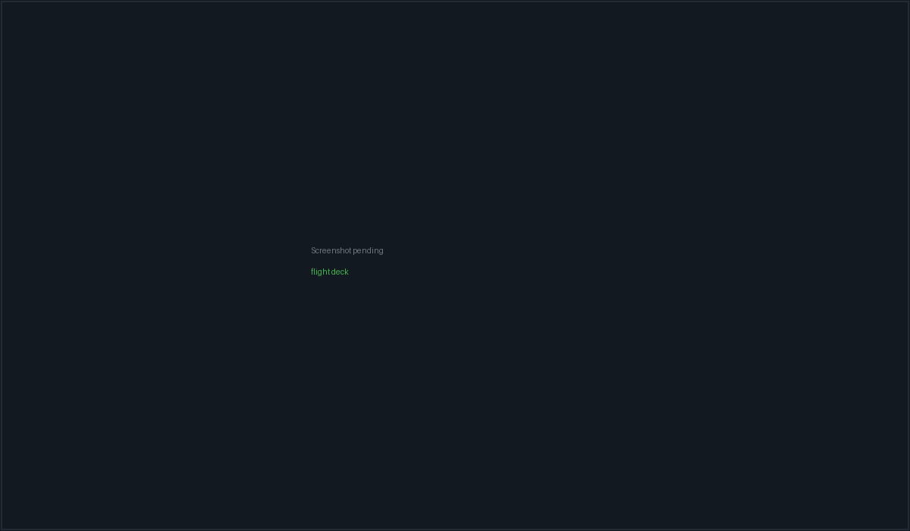

# Flight Deck

A **Flight** is the top-level work organiser, above issues and above individual
sessions. It carries an objective, an optional upfront plan, links to issues and
conversations, and — the reason most people open it — a set of **attempts**: one
agent per git worktree, all running the same prompt in parallel, each with its
own branch, cost and review state.

Reach it from the left rail (plane icon) or with
<kbd>Ctrl</kbd>+<kbd>Shift</kbd>+<kbd>2</kbd>.

*A Flight with three parallel attempts, the stat grid above them and the
attention strip flagging one that needs review.*

> **Note:** "Flight" replaced "Mission" as the user-facing name. The word
> "mission" survives only in persisted-data compatibility aliases; nothing in
> the UI should say it. Likewise, the autonomous **planner** runtime was removed
> in July 2026 and is not coming back — planning is now a normal read-only agent
> conversation you explicitly apply.

## The surface

Two panes. A 320px sidebar on the left, the selected Flight's detail on the
right. With no Flights at all you get an empty state:

> **No flights yet** — *"Launch a worktree attempt against a target agent and
> branch — track progress, review the diff, and accept or reject the result."*
> — **New flight**

### The sidebar

Header: **Flights** with a count, a search toggle (*"Search flights"*) and a
**+** (*"New flight"*). Search filters on title, objective and id.

Flights are bucketed into four groups, each with its own count:

| Group | Contains |
| --- | --- |
| **Drafting** | Status `spec` |
| **Attention** | Status `failed` or `paused`, or any task in `approval_needed` |
| **Active** | Status `active` or `review` |
| **Recent** | Everything else |

Each row shows a short id (`F-XXXX`, the last four id characters uppercased), the
title, a status dot, agent count, cost, a memory-hits chip (click it to open
[Memory](memory.html) scoped to this Flight), and a delete button.

### Status is computed, not stored

The status you see is derived on every read, in this precedence:

1. **From attempts** — all cancelled → `paused`; all failed → `failed`; all
   completed → `done`; any running/provisioning/queued → `active`; any reviewing
   → `review`; then mixed terminal states resolve failed → `failed`, completed →
   `done`.
2. **From tasks** (if the Flight has milestones) — any `approval_needed` →
   `active`; any failed → `failed`; all done → `review`; any running/queued →
   `active`; any blocked → `active`.
3. **From linked issues** — any `needs_human` or `blocked` → `paused`; all done
   → `done`; any in-progress or QA → `active`.
4. Otherwise the Flight's stored `status`.

| Status | Label shown | Dot |
| --- | --- | --- |
| `spec` | spec | purple |
| `draft` | draft | muted |
| `planning` | planning | purple |
| `ready` | ready | blue |
| `active` | **running** | blue |
| `paused` | paused | amber |
| `review` | review | purple |
| `done` | done | green |
| `failed` | failed | red |
| `cancelled` | cancelled | muted |

Priorities render as `P0` (critical, red), `P1` (high, amber), `P2` (medium,
blue), `P3` (low, muted). New Flights are created at **medium**.

## Launching

Both **New flight** and a Flight's own **Launch attempt** open the same dialog.
Its title is *"Launch parallel agents"* for a new Flight, or *"Launch attempt —
`<title>`"* when it targets an existing one.

### Fields

| Field | Notes |
| --- | --- |
| **Prompt** (required) | *"What should the agents work on? Each agent runs the same prompt independently."* Becomes the Flight's objective and prompt |
| **Title** (optional) | Falls back to the first 60 characters of the prompt, then `Untitled flight` |
| **Targets** | The multi-target picker, below |
| **Execution supervision** | Assisted / Settings default / YOLO |
| **Publish attempts as draft PRs** | Checkbox |
| **Require an independent Reviewer Gate** | Checkbox with its own sub-form |

The footer reads *"Ctrl+Enter to launch · Each agent runs in its own git
worktree"*, and offers **Cancel**, **Plan first** (or **Open plan**) and
**Launch `<n>` agents**.

While a launch or planning turn is in flight the dialog cannot be closed — the
X is dimmed and <kbd>Esc</kbd> is suppressed.

### The target picker

Targets come from two sources: your existing **local workspaces** (any workspace
with a project path that is not SSH-backed) and your configured **SSH servers**.

> **Important:** You cannot pick an arbitrary folder here. Local targets are
> drawn from workspaces, so if the picker says *"No workspaces or SSH servers —
> open a folder or add a server first."*, create a workspace first.

Clicking a chip adds it. Each picked row then exposes four inline controls:

| Control | Default | Notes |
| --- | --- | --- |
| Base branch | **`main`** | Free text. Lowercased and trimmed downstream; empty falls back to `main` |
| Provider | `api-claude` | Any of the nine API rows |
| Model | That provider's first catalogue model | Changing provider resets the model |
| Remove | — | Drops the target |

> **Warning:** The base branch defaults to the literal string `main` for every
> target, regardless of what the repository's actual default branch is. On a repo
> whose trunk is `master`, `develop` or anything else, change this before
> launching or provisioning will fail.

For an SSH target the base path pre-fills from the server's default remote path
and is editable per attempt (blank when the server has no default).

#### Unpinned SSH hosts are blocked

An SSH server with no pinned host fingerprint renders as a disabled amber chip
(*"Host key not verified — pin it on the Servers page"*) and cannot be added at
all. If one somehow ends up selected, the launch is blocked with:

> *Host key not verified for: `<names>`. Verify on the Servers page before
> launching.* — plus an **Open Servers settings →** link.

Without a fingerprint the backend falls back to `StrictHostKeyChecking=accept-new`
(trust-on-first-use), which is MITM-able on the first connect. See
[SSH remote workspaces](remote.html).

### Path collisions

Two selected targets that claim the same repository root on the same branch are
refused before anything is provisioned:

> *Selected targets 1 and 2 both claim `<path>` on `<branch>`.*

An already-live attempt on the same root and branch is refused the same way:

> *Attempt `<id>` is already `<status>` on `<path>` (`<branch>`).*

### "This looks familiar"

If your prompt overlaps a known pitfall pattern or a lesson that has recurred
across prior Flights, an amber hint appears under the prompt box:

> ⚠ **This looks familiar** (hit in *n* prior flights): *`<lesson text>`*

This is drawn from [Memory](memory.html) and is advisory only — it never blocks a
launch.

### Execution supervision

Three buttons: **Assisted**, **Settings default**, **YOLO**.

- **Assisted** (the default, and what an absent value means) —
  *"PacketBench detects and recommends; you launch, retry, accept, and integrate."*
- **Settings default** — copies the effective policy from Settings at opt-in
  time. If Settings currently resolves to Assisted, the card says so.
- **YOLO** — an explicit bounded policy built from the Settings defaults plus
  this launch's roots and targets.

When a policy is in effect the card prints its **effective bounds** verbatim:
max total cost, max duration in minutes, retries per task, review rounds,
concurrent agents, and which behaviours are enabled (recovery, review
remediation, task graph, unattended in-project tools) — or `limits only`.

> **Important:** The policy is a **versioned snapshot**, not a live subscription.
> A Flight never silently follows later Settings edits: `settings_default` copies
> the effective policy at opt-in time and keeps it.

Configuration errors are surfaced before launch, e.g.:

- *`<target>` is outside the autonomy root allowlist.*
- *`<target>` is outside the autonomy target allowlist.*
- *Auto-run task graph requires a Cooperative Flight.*
- *Auto-run task graph requires the independent Reviewer Gate.*

### Publish attempts as draft PRs

> *"After each attempt, push the branch and open a draft PR on GitHub. Lets you
> review attempts via your normal PR flow."*

Pre-checked when you opted into that default in Settings → GitHub — but on an
existing Flight the Flight's own stored setting wins, so re-opening the dialog to
add an attempt does not silently rewrite it.

### The independent Reviewer Gate

> *"When an attempt finishes, automatically run one read-only reviewer. This
> incurs model usage. Acceptance stays blocked until it passes or you record an
> override."*

Enabling it reveals three controls: a **Reviewer agent** select (any of the nine
providers, default OpenAI Agents SDK), a **Reviewer model** select, and an
**acceptance criteria** textarea (*"Acceptance criteria — one per line / Example:
pnpm test passes"*).

Validation, all of which blocks the launch:

| Condition | Message |
| --- | --- |
| No provider resolved | *Choose a supported API reviewer.* |
| Model not in the list | *Choose a model supported by the selected reviewer.* |
| Ollama model with no tools template | *That Ollama model has no tools template — the reviewer needs tool calling.* |
| No criteria | *Add at least one acceptance criterion for the independent reviewer.* |
| More than 40 criteria | *Reviewer Gate supports at most 40 acceptance criteria.* |

The reviewer runs read-only, restricted to `read_file`, `list_directory` and
`grep`.

### Plan first

**Plan first** (*"Explore the repository and refine a structured plan in a normal
agent conversation"*) uses the **first selected target** to start an ordinary
agent conversation, titled `Flight plan — <title>`, with:

- a Flight-planning system prompt,
- a restricted planning tool set,
- **no** MCP servers,
- memory context **on**,
- `permissionMode: deny_all` and `approveWrites: false` — i.e. genuinely
  read-only.

The Flight moves to status `planning` and the conversation is linked. Once one
exists, the button becomes **Open plan** and re-opens it instead of starting a
second.

### Launching, and partial failures

Provisioning is **sequential**, one target at a time. The dialog says so while it
runs:

> *Provisioning a git worktree and starting a session for each target, one at a
> time: `<labels>`. Targets that come up stay live even if a later one fails.*

Before any target is provisioned, PacketBench checks your cost guardrails.
If a daily, monthly, session, per-provider or per-Flight cap is already exceeded
the launch is refused with that guardrail's message. Caps that are not set are
skipped entirely.

> **Important:** If a later target fails, earlier attempts may already be live
> and spending. PacketBench rehydrates and re-attaches those partial successes so
> they stay visible and controllable, and the error message names how many
> actually launched — rather than telling you the launch failed while agents are
> running.

## What an attempt is

| Property | Value |
| --- | --- |
| Branch | `pkt/<attemptId>` |
| Worktree | `<basePath>/.pkt-worktrees/<attemptId>` |
| Session | A normal API-agent conversation whose id equals the attempt's session id |
| Statuses | `queued` → `provisioning` → `running` → `reviewing` → `completed` / `failed` / `cancelled` |

The status labels shown on the tile are **Queued**, **Provisioning**,
**Running**, **Reviewing**, **Completed**, **Failed**, **Cancelled**.

A failed attempt also carries a structured failure category, one of: `auth`,
`billing`, `rate_limit`, `context_overflow`, `timeout`, `server_error`,
`not_installed`, `unknown`.

### The attempt tile

Each tile shows the status, the target (local folder or SSH server), a live
transcript of the last five messages (expandable), the tool calls, and a
follow-up composer so you can steer the agent mid-run.

Action row:

| Button | When | Effect |
| --- | --- | --- |
| **Open in Workspace** | Session exists | *"Open this attempt's project in a CLI-first Workspace"* |
| **Monitor** | Session exists | *"Open a read-only monitor for this attempt"* |
| **Accept** | Status `reviewing` | Accepts this attempt as the Flight's result |
| **Reject** | Status `reviewing` | Marks it failed |
| **Cancel** | In progress | *"Cancel attempt + remove worktree"* |

Accept and Reject both open a confirmation that names the consequences exactly:

> *`pkt/<id>` is accepted as this Flight's result. The agent session closes and
> the attempt's git worktree is force-removed.* — with the footnote *"Removing
> the worktree cannot be undone. The branch is kept."*

If the worktree has uncommitted changes at that moment, the confirmation says so
explicitly: *"That worktree has uncommitted changes right now — they are
destroyed, and a later Land only takes what is committed on `<branch>`."*

**Accept is blocked** while a Reviewer Gate is configured and has not passed:

| Gate status | Reason shown |
| --- | --- |
| `running` or `pending` | *The independent reviewer has not finished.* |
| anything else non-passing | *The Reviewer Gate must pass or be explicitly overridden before acceptance.* |

`passed` and `overridden` both unblock it.

### Landing an attempt

A completed attempt grows a second row with its branch name and two buttons.

**Land** squash-merges `pkt/<attemptId>` into the current branch of the base
checkout, using the same command the Agents worktree bar uses. It refuses when
the base checkout is dirty or the merge conflicts, leaving both trees untouched.
"Nothing to land" is reported as a failure, not a green confirmation.

| Situation | Land tooltip / result |
| --- | --- |
| SSH attempt | *"Landing merges into the local checkout; this attempt ran on an SSH host. Open a PR for its branch instead."* — disabled |
| Not yet terminal | *"Accept or reject this attempt before landing its branch."* — disabled |
| Ready | *"Squash-merge `<branch>` into the current branch of `<basePath>`."* |

> **Note:** Land works after acceptance even though acceptance removed the
> worktree — the `pkt/<attemptId>` branch survives in the base repo, and the Rust
> side treats an absent worktree as clean.

**Open PR** pushes the branch and opens a draft PR on the selected GitHub repo.
It is disabled once a PR exists (*"Draft PR #N is already open for this
branch"*). The resulting PR number is stamped on the attempt and shown as a
clickable **Draft PR #N** chip.

### Reassigning a failed attempt

A failed attempt can be relaunched on a different agent. The reassignment rebuilds
a target from the failed attempt (same repository base and branch, the new
agent's default model), records a `handoff` coordination event, and appends a
fresh attempt. The failed record is kept for history.

An SSH attempt can only be reassigned while its `ServerConfig` still exists —
connection details are deliberately not persisted on the attempt record.

## The Flight detail pane

Header: short id, status pill, priority pill, title, objective, and a **Send to
Monitor** button.

### Stat grid

Six cells: **Cost**, **Tokens**, **Tasks** (`done/total`), **Approvals**,
**Sessions**, **Updated**. Tasks turns green while work is in progress;
Approvals turns amber when any are outstanding.

Cost formats as `$0.00`, or with no decimals above `$100`. Tokens abbreviate to
`k` and `M`.

### Cards, in order

| Card | Shown when |
| --- | --- |
| **Upfront plan** | The Flight has a linked planning conversation |
| **Supervision** | Always |
| **PacketAgent handoff** | Always |
| **Issue ↔ Flight mirror** | Always |
| **Cooperative task graph** | Always (offers to enable when not cooperative) |
| **Coordination inbox** | Always |
| **Attempts grid** | Always |
| **Needs attention** | Something needs a human |
| **Output review** | The Flight has tasks, is in review, or has pending approvals |
| **Milestones** + **Timeline** | Always, side by side |

#### Upfront plan

Shows `n milestones · m tasks` (or *"No plan applied yet"*) and the note
*"refined in a normal read-only agent conversation"*, plus two buttons:
**Open conversation** and **Apply latest plan** / **Replace with latest**.

Applying parses the most recent `packetbench-flight-plan` block out of the
conversation, materialises it into milestones and tasks, sets the Flight to
`ready`, and records a handoff coordination event.

> **Warning:** **Replace with latest** does exactly that — it replaces the
> Flight's whole milestone set with the newly parsed plan. It is not a merge.

If the linked conversation is missing on this machine, both buttons report
*"The linked planning conversation is not available on this device."*

#### Supervision

Reads `Supervision · Assisted` / `YOLO` / `YOLO · Settings snapshot` /
`Assisted · Settings snapshot`, with the runtime status badge (`idle`,
`running`, `paused`, `stopped`, `needs attention`, `completed`).

With a policy in force it shows four live counters — **Cost left**, **Time
left**, **Retry cap**, **Concurrency** — plus play/pause/stop controls and the
last eight autonomy actions. Without one:

> *"PacketBench recommends actions; launches, retries, review acceptance, and
> integration stay under your control."*

#### Needs attention

An amber strip summarising, with a count: attempts awaiting review (*"accept or
reject below"*), failed attempts with their failure category, and any PacketAgent
worker with open approvals or a terminal failure.

#### Milestones and Timeline

The Milestones card lists every task from every milestone with its title, agent,
role (Coordinator / Builder / Reviewer / Scout) and done/running state. The
Timeline card renders the coordination log: task started, completed, failed,
handoff, review requested, review resolved, collision warning, escalation.

## Cooperative Flights

By default attempts are **independent** — every one runs the same prompt and you
pick a winner. A Flight can instead be switched to a **cooperative task graph**:

> *"Validate assignments and dependencies, then launch each ready batch from an
> isolated Flight integration branch."* — **Enable assisted graph**

In cooperative mode:

- A dedicated **integration branch** (`packetbench/flight/<flightId>`) and
  worktree under `.pkt-flight-integrations/` are prepared. Its status is one of
  `uninitialized`, `ready`, `integrating`, `needs_attention`, `landed`.
- **Launch ready tasks** starts every task whose dependencies are satisfied.
  Disabled while the graph has validation issues or nothing is ready.
- Accepted tasks are merged into the integration branch rather than into your
  trunk.
- Once every task is integrated and the branch is `ready`, **Land Flight** asks
  *"Land into `<baseBranch>`?"* before merging.
- A conflicted integration shows the error and the conflicting file list, with a
  **Retry after resolution** button.

## Coordination inbox

An append-only, versioned mailbox on the Flight. You can steer a task, a role, an
agent, or the whole Flight (*"Steer the selected task, role, agent, or Flight…"*).

Message kinds: `instruction`, `question`, `answer`, `blocker`, `finding`,
`handoff`, `artifact`. Delivery states: `queued`, `delivered`, `acknowledged`,
`failed`, `archived`. Per-message controls: copy, *"Explicitly send to a PTY
terminal"*, *"Retry delivery"*, *"Acknowledge"*, *"Archive"*.

## Issue ↔ Flight mirror

> *"Each task becomes a host issue grouped under a milestone named for this
> Flight. Changes reconcile every 60 seconds with revision fences and visible
> conflicts."*

Requires a repository selected in the Git Hosts pane; until then the button
reads *"Select a repository in GitHub first"*.

Once enabled the card shows `owner/repo`, the number of linked records, the last
sync time, and a conflict count. Conflicts are shown, not silently resolved:

> *"The newer value already won. The losing value remains here until you
> acknowledge the reconciliation."*

Each conflict lists the issue number, the field, which side won, and both values.
**Sync now** and **Stop mirroring** are available at any time.

See [Issues & git hosts](issues.html).

## Deleting a Flight

Deletion is destructive and the confirmation says so up front. Before it opens,
PacketBench probes the live attempts and their worktrees; until that returns the
dialog reads "checking…" rather than "nothing will be lost".

> **Delete flight?** — *`<title>` is removed along with its attempt history, and
> any issues linked to it are unassigned. Running attempts are cancelled and
> their git worktrees removed first.*

The confirm button reads **Cancel attempts & delete** when live attempts exist,
otherwise **Delete**. Warnings enumerate the attempts, the cooperative
integration worktree (including when it holds uncommitted work), and any tasks
still running or awaiting approval.

Cleanup is best-effort by contract: the delete **always** happens, and per-attempt
cleanup failures are collected and reported rather than silently leaking a
session or a worktree.

## Flight ↔ Issue linking

An issue's Flight assignment is authoritative on the **issue**. Flight records
cache an `issueIds` list, and that cache is rebuilt from the issue store on every
hydrate.

> **Important:** A one-sided assignment made from the issue side self-heals. A
> one-sided addition made only on the Flight side silently vanishes on the next
> hydrate. UI that links the two writes both — the Flight-side add is only the
> optimistic paint.

## Related

- [Core concepts](concepts.html)
- [Agents & conversations](agents.html) — attempts are ordinary API conversations
- [Issues & git hosts](issues.html) — linking, mirroring, and draft PRs
- [Workspaces & terminals](workspaces.html) — opening an attempt's worktree in a workspace
- [SSH remote workspaces](remote.html) — remote attempts and host-key pinning
- [Memory](memory.html) — the recurring-error hint and flight capture
- [Settings reference](settings.html) — autonomy defaults, budget guardrails, GitHub defaults
