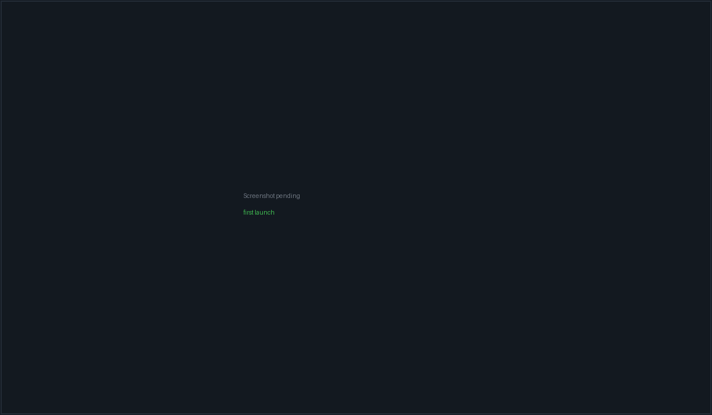
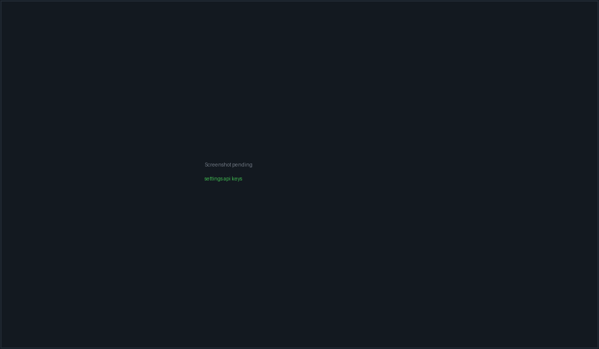

# Install & first run

PacketBench is not yet distributed the way a finished desktop app is. The
source tree is at **v0.13.2**, Windows installers exist but have never been
published, and the newest thing on GitHub Releases is nearly four months older
than the current code and still carries the product's previous name. Building
from source is the honest primary path, and this page treats it as such.

> **Important:** Nothing here is code signed and there is no auto-updater. If
> you want the current app, build it.
>
> Packaged upgrades do now work, on Windows, tested three times: 0.12.1 →
> 0.13.0, 0.13.0 → 0.13.1 and 0.13.1 → 0.13.2 — all silent per-user installs
> that exited 0, left exactly one entry in Add/Remove Programs, and preserved
> `~/.packetbench` byte for byte. That is the extent of what has been proven — see the caveat under
> [Upgrading a packaged install](#upgrading-a-packaged-install).

## The state of distribution

Three separate things are easy to confuse, so they are separated here.

| | What exists | Where |
| --- | --- | --- |
| **Source** | v0.13.2 — `package.json`, `src-tauri/Cargo.toml` and `src-tauri/tauri.conf.json` all agree | This repository |
| **Local Windows builds** | Unsigned NSIS + MSI for 0.11.0, 0.12.0 and 0.12.1 (built 2026-08-28), plus 0.13.0, 0.13.1 and 0.13.2 (built 2026-08-30) | The maintainer's build machine, under `packetbench-build/release/bundle/` — **not** in the repo, **not** uploaded anywhere |
| **Published download** | `v0.5.0`, published 2026-05-04 | [GitHub Releases](https://github.com/packetloss404/PacketBench/releases) |

### What the published download actually is

The newest release asset set on GitHub is `v0.5.0` from **4 May 2026**. Its
files are named `PacketADE_0.5.0_x64-setup.exe`,
`PacketADE_0.5.0_x64_en-US.msi` and `packetade-0.5.0-x64.exe`, because the
product was still called *PacketADE* at the time. It was renamed to
**PacketBench** on 2026-08-26, after that release.

So the published installer:

- predates the rename, and installs an app called PacketADE;
- predates the Flight Deck rework, the nine-row agent picker as it now stands,
  the sidecar protocol v6–v11 additions, project memory, dictation analytics,
  and everything else in `CHANGELOG.md` between 0.6.0 and 0.13.2;
- is not an upgrade path to the current code — there is no updater to carry
  you forward from it.

> **Note:** The repository was renamed on GitHub to
> `git@github.com:packetloss404/PacketBench.git`, matching the product name.
> The old `PacketADE` URL still works — GitHub redirects it — but it prints a
> "This repository moved" notice on every push, so update any existing clone:
>
> ```bash
> git remote set-url origin git@github.com:packetloss404/PacketBench.git
> ```

### Code signing and SmartScreen

No Windows Authenticode certificate and no Apple Developer ID are configured.
`src-tauri/tauri.conf.json` carries no signing block, and the release gate's
signing checks (`pnpm release:gate:strict`) are opt-in precisely because the
credentials do not exist yet.

Practically, on Windows: running an installer you built yourself, or the old
published one, raises a **SmartScreen** "Windows protected your PC" prompt.
You clear it with *More info → Run anyway*. That prompt is expected and is not
evidence of tampering — but it also means you have no signature to check, so
only run installers you built yourself or fetched from the project's own
release page.

On macOS an unsigned, un-notarized `.app` is refused by Gatekeeper on first
open in the usual way.

### No auto-updater

`dev/updater-setup.md` is a runbook, not a shipped feature. There is no
`tauri-plugin-updater` dependency, no updater plugin initialisation, and no
`plugins.updater` block in the Tauri config. New versions are installed
manually — or, on the path this page recommends, by pulling and rebuilding.

### Upgrading a packaged install

Installing a newer package over an older one works on Windows. It has been done
three times, all silent per-user installs:

```powershell
Start-Process .\PacketBench_0.13.2_x64-setup.exe -ArgumentList '/S','/CURRENTUSER' -Wait
```

| Upgrade | Date | Result |
| --- | --- | --- |
| 0.12.1 → 0.13.0 | 2026-08-30 | exit 0; one Add/Remove entry; data dir preserved |
| 0.13.0 → 0.13.1 | 2026-08-30 | exit 0; one Add/Remove entry; data dir byte-identical |
| 0.13.1 → 0.13.2 | 2026-08-30 | exit 0; one Add/Remove entry; data dir byte-identical |

Check the installer's SHA-256 against the table in `CHANGELOG.md` before
running it — every build there is made from a committed tree with a clean
working directory, so each artifact maps to exactly one commit.

Two limits on what those runs proved:

- **`localStorage` does not survive a *pre-rename* upgrade.** WebView2 keys its
  profile by bundle identifier, and the 2026-08-26 rename moved it from
  `com.packetade.desktop` to `com.packetbench.desktop`. A package upgraded from
  a `PacketADE` build therefore gets an empty profile: twelve keys, including
  unsent composer drafts, are stranded (not deleted — the old profile stays on
  disk). This is an accepted consequence of the rename, not a bug to be fixed.
  Upgrades between two PacketBench versions are unaffected.
- **The pre-rename data-dir migration is still unproven on a real installed
  upgrade.** `~/.packetbench` already exists on the machine that has been
  testing this, so the migrator correctly returns early. Proving it needs a
  host with `~/.packetade` and no `~/.packetbench`.

### macOS and Linux

Build-from-source only. No macOS or Linux artifact has ever been published.
The per-platform prerequisites, target triples and bundle formats are in
[`dev/multi-platform-build.md`](https://github.com/packetloss404/PacketBench/blob/main/dev/multi-platform-build.md);
[Build & release](dev-build.html) covers the same ground for contributors.

> **Note:** On macOS, `brew install cmake` is mandatory, not optional — the
> dictation module's `whisper-rs-sys` build-depends on CMake, which does not
> ship with the Xcode Command Line Tools. A clean Mac fails the build without
> it.

## Building from source

This is the supported way to run current PacketBench.

### Prerequisites

- **Node.js** — a recent LTS. (The runtime *bundled into installers* is pinned
  to 24.15.0; that is separate from the Node you develop with.)
- **pnpm** — the repo pins `pnpm@9.15.4` via `packageManager`, so `corepack
  enable` is enough.
- **Rust**, stable toolchain, plus your platform's Tauri v2 system
  dependencies (WebView2 on Windows, Xcode CLT on macOS, GTK/WebKitGTK on
  Linux).
- **Optionally, agent CLIs on `PATH`** — `claude`, `codex`, `opencode`,
  `packetcode`. These back the terminal panes; the API agent rows do not need
  them.

### Clone and install

```bash
git clone git@github.com:packetloss404/PacketBench.git packetbench
cd packetbench
pnpm install
```

`pnpm install` also installs the Node sidecar's dependencies through a
`postinstall` hook, so there is no second install step.

### Run in development

```bash
pnpm tauri dev
```

Before the first use of a sidecar-backed provider (Claude Agent SDK or OpenAI
Agents SDK), compile the sidecar once:

```bash
pnpm sidecar:build
```

> **Tip:** On Windows the rustup toolchain must be on `PATH` for Tauri builds.
> In a Git Bash shell:
> `export PATH="$HOME/.rustup/toolchains/stable-x86_64-pc-windows-msvc/bin:$PATH"`

### Build an installer

```bash
pnpm tauri build
```

This is not a plain compile. Tauri's `beforeBuildCommand` runs the `prebundle`
chain first: DMG scratch cleanup, `fetch-node` (the pinned Node runtime for
your host triple), `sidecar:install`, `sidecar:build`, `sidecar:prune`, and
`release:gate`. On Windows it produces both an NSIS `-setup.exe` and an MSI,
because `bundle.targets` is `"all"`.

> **Warning:** `sidecar:prune` is a destructive, hoisted, production-only
> reinstall of `agent-sidecar/node_modules`. After bundling, run
> `pnpm sidecar:install` again to restore the sidecar's devDependencies before
> doing further sidecar work.

On macOS use `pnpm build:macos` instead — it wraps the build with the DMG
scratch-image cleanup and retry that Tauri's `bundle_dmg.sh` needs.

### Verify your build

```bash
pnpm preflight   # format check, lint, vitest, frontend build
pnpm check       # the full local ladder, including Playwright and Rust
```

There is no CI in this repository by design; local gates are the source of
truth. See [Testing & gates](dev-testing.html).

## First run



*The Welcome screen is what a fresh install opens to. Nothing is running yet —
saved layouts hydrate dormant, so no CLI is launched until you open a
workspace.*

### Where your data lives

All persistent application data goes in a single hidden directory under your
home folder:

```text
~/.packetbench/
  state.v1.json        flights, issues, workspaces, servers, agent configs,
                       settings, and the memory event/pattern slice
  conversations/       one JSON file per API-agent conversation
  pty-transcripts/     terminal session transcripts
  pty-active-pids/     PTY child registry, used to reap orphans after a crash
  dictation.db         dictation history and analytics
  usage.jsonl          token/cost ledger the budget guardrails read
  known_hosts          app-managed SSH known-hosts file
  crashes/             panic reports
```

Two kinds of state live outside that directory on purpose:

- **Secrets** go in your OS credential store, never in a file. See below.
- **UI preferences** live in the webview's `localStorage`, under keys prefixed
  `packetbench:` — theme, dock widths, onboarding dismissal, agent profiles,
  MCP trust profiles, cost guardrails and similar.

Project memory notes are a third case: they are ordinary Markdown in
`.agents/memory` inside *your* project, not in the app's data directory, so
they can be committed alongside the code they describe. See
[Memory](memory.html).

### The OS keyring

API keys and git-host tokens are stored under the keyring service
**`packetbench`**:

| Entry | Holds |
| --- | --- |
| `api-key-anthropic` | Anthropic API key (Claude API and Claude Agent SDK rows) |
| `api-key-openai` | OpenAI API key (OpenAI API and OpenAI Agents SDK rows) |
| `api-key-minimax` | MiniMax key |
| `api-key-openrouter` | OpenRouter key |
| `github-token` | GitHub PAT; additional git hosts get per-host accounts |
| `ssh-<serverId>` | SSH password for a remote host, when that auth method is used |

That is Windows Credential Manager, macOS Keychain, or the Secret Service on
Linux. Nothing is written to disk in plaintext, and tokens never enter
frontend state or workspace records.

> **Note:** On Linux the keyring needs an unlocked Secret Service provider
> (GNOME Keyring, KWallet). In a bare session with none running, key storage
> fails and the provider badges stay on `missing_key`.

### Coming from a pre-rename install

If the machine carries `~/.packetade` state from the previous product name,
the first launch migrates it before anything else touches the data directory.
The migration is deliberately cautious, because a sibling TUI product now
claims the *older* `PacketCode` name:

1. It classifies the legacy directory by the files inside it — `Ours`,
   `Foreign` (the sibling TUI's home), `Mixed` (both), or `Unknown`.
2. `Ours` is renamed in place to `~/.packetbench` — atomic on the same volume.
   If the rename fails (a cross-volume home returns `ERROR_NOT_SAME_DEVICE` on
   Windows), it falls back to a recursive copy and only counts as migrated if
   the copy fully succeeds; the legacy directory stays as a backup.
3. `Mixed` is **copy-only**: recognised PacketBench entries are copied out and
   nothing belonging to the other product is moved, renamed or deleted.
4. `Foreign` and `Unknown` are left completely alone.

If migration cannot complete, the app keeps reading the legacy directory
rather than starting empty. Keyring entries migrate lazily: a read falls back
to the legacy `packetade` service, writes the value into `packetbench`, then
deletes the old entry.

> **Warning:** **UI preferences do not survive a packaged upgrade, by design.**
> The rename also moved the app's bundle identifier, and the webview keys its
> storage by that identifier — so an installed PacketBench starts against a
> fresh, empty webview profile and the `packetade:` keys are simply not visible
> to it. Pane layouts, dock state, your project-history list and any unsent
> composer drafts start over. Flights, issues, workspaces, agent profiles,
> memory and API keys are **not** affected: those live in the data directory and
> the OS keyring, both of which migrate correctly.
>
> Nothing is deleted. The old profile stays at
> `%LOCALAPPDATA%\com.packetade.desktop\EBWebView\`. This was accepted rather
> than fixed — reading another application's storage engine is a feature with
> its own failure modes, for data that is mostly preference.

A source build is unaffected: it keeps the same identifier throughout, so the
`packetade:` → `packetbench:` copy on first boot works there.

> **Warning:** This migration has only ever been executed from a **source
> build**, against a copy of a real legacy data directory. No packaged
> PacketBench installer has ever been installed over pre-rename state. If your
> machine carries `~/.packetade` data you care about, copy the directory
> somewhere safe before first launch.

### Add your first API key

Terminal panes need nothing configured — they run the CLIs you already have.
The API-agent rows each need a key.

1. Open **Settings** — press <kbd>Ctrl</kbd>+<kbd>K</kbd> for the command
   palette and type "Settings", or use the left rail.
2. Go to **Agents & Models → Providers & Models**.
3. Pick a provider, paste the key, save.

The card covers Anthropic, OpenAI, MiniMax, OpenRouter, Ollama (no key — it
probes `localhost:11434`) and a custom OpenAI-compatible endpoint (key
optional, sent as a bearer token when set). Saving writes straight to the OS
keyring; the provider's badge in the agent picker flips to `ready` once the
key is present.



*Every keyed row authenticates with an API key you supply. There is no
Claude.ai or ChatGPT subscription login for API agents — see
[Agents & conversations](agents.html) for why.*

## Known limits of the current builds

Being specific is more useful than a general disclaimer. As of 0.13.2:

- Sections 2–5 of the acceptance matrix — launch and lifecycle, dictation on
  real hardware, dictation analytics, and the two-display Monitor matrix —
  are **substantially unrun**. They need a person at the keyboard with a
  headset attached. What has been confirmed on an installed package is narrow:
  it launches and stays up with its sidecar, and the Agents and PacketCode
  routes mount and navigate. Everything else in those sections is open.
- Section 1 (the migration path) has been run only from source, against a copy
  of a real legacy data directory. The **pre-rename** leg — a packaged
  installer landing on a machine that has `~/.packetade` and no
  `~/.packetbench` — remains unproven.
- Packaged upgrades between two PacketBench versions have been performed twice
  and behaved (see [Upgrading a packaged install](#upgrading-a-packaged-install)).

That is why this page describes building from source rather than pointing you
at a download.

## Next

- [Core concepts](concepts.html) — the vocabulary, before you start clicking.
- [Workspaces & terminals](workspaces.html) — get a CLI running in a pane.
- [Settings reference](settings.html) — every group and what it affects.
