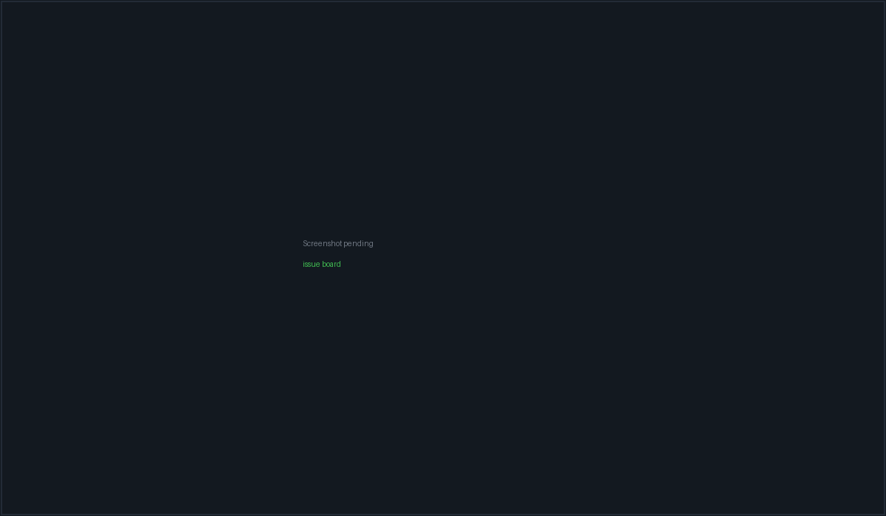

# Issues & git hosts

PacketBench has **two** issue systems, and it is worth being clear about that up
front. The **Issues** board is a local kanban that lives entirely on your
machine — no account, no sync, no network. The **Git Hosts** pane is a
read/write client for GitHub cloud and self-hosted Gitea/Forgejo, with its own
issues, pull requests, notifications and releases.

They are connected in exactly three places: an **Import to board** button, a
`Fixes #N` commit close-loop, and the optional per-Flight **Issue ↔ Flight
mirror**. Nothing else syncs automatically.

- **Issues** — left rail kanban icon, <kbd>Ctrl</kbd>+<kbd>Shift</kbd>+<kbd>3</kbd>
- **Git Hosts** — left rail GitHub icon (the rail label still reads "GitHub"; the
  pane's own heading says "Git Hosts")



*The local board: six columns, the filter toolbar, and a card showing its flight
link and workspace pill.*

## The local issue board

### Columns

Six user-facing columns, each backed by one or more stored statuses so nothing
ever falls off the board:

| Column | Stored statuses | Drop target |
| --- | --- | --- |
| **Backlog** | `backlog` | `backlog` |
| **Up Next** | `up_next`, legacy `todo` | `up_next` |
| **In Progress** | `in_progress` | `in_progress` |
| **Needs Attention** | `blocked`, `needs_human` | `needs_human` |
| **In Review** | `in_review`, `qa` | `in_review` |
| **Done** | `done` | `done` |

Any status not listed falls back to Backlog. **Needs Attention** exists so that
escalated work is visible rather than hidden inside In Progress — a Flight
attempt escalation flags its linked issues `needs_human`, which lands them here.

The six columns share width evenly down to 180px each, below which the row
scrolls horizontally rather than wrapping.

> **Note:** An issue whose linked Flight has any attempt with a draft PR open is
> **displayed** in *In Review* regardless of its stored status. This is a
> display-only override — dragging the card still writes the real status.

### The toolbar

| Control | Behaviour |
| --- | --- |
| `Backlog · <project>` + count | The active workspace's name, or `packetbench` when there is none |
| Search | *"Filter by label, agent, flight…"* — matches title, labels and the linked Flight's title |
| **All labels** select | Single-select label filter |
| **All flights** select | Includes an **Unassigned** option |
| **Import spec** | Opens the AI spec importer |
| **New issue** | Opens the new-issue dialog with Up Next preselected |

Below the toolbar, a strip of multi-select **filter chips** over labels, epics,
workspaces and assignees. Chips compose with the toolbar selects using logical
AND.

### Drag and drop

Cards are dragged between columns; the drop writes the target column's
`dropTarget` status. A drop indicator line shows the insertion point.

### Creating an issue

Each column header and the bottom of each column carry a **+** / **Add** that
opens the dialog with that column's drop target preselected.

| Field | Options / notes |
| --- | --- |
| Title | Required — *"Issue title…"* |
| Description | *"Describe the issue…"* |
| Priority | Low / Medium / **High** / Critical (default Medium) |
| Status | To Do, In Progress, QA, Done, Blocked, Needs Human |
| Labels | Multi-select over the label vocabulary |
| Epic | Only rendered once at least one epic exists |
| Flight | Only rendered once at least one Flight exists |
| Acceptance criteria | Free-text list, *"Add criterion…"* |
| Blocked by / Blocks | Selects over existing issues |

> **Warning:** The Status dropdown is missing three of the nine statuses —
> `backlog`, `up_next` and `in_review` are **not** in its option list, even
> though the board has columns for all three. Opening the dialog from the
> Backlog or Up Next column preselects a status that has no matching option, so
> the control renders blank. Leave it alone and the issue still lands in the
> right column; touch it and you can only pick from the six that are listed. The
> issue detail panel has all nine and can fix it after the fact.

### Ticket ids

Ids are `<prefix>-<n>` with the number zero-padded to three digits — `PKT-001`
by default. The prefix is configurable; the next number is derived by scanning
existing ticket ids for the current prefix, so changing the prefix does not
renumber anything already created.

### Default labels

A fresh install seeds: `bug`, `feature`, `enhancement`, `refactor`, `docs`,
`api`, `frontend`, `working`, `devops`.

### The issue detail panel

Clicking a card opens a detail panel with the full nine-status button row
(Backlog, Up Next, To Do, In Progress, In Review, QA, Done, Blocked, Needs
Human), an assignee field (*'username, email, or "me"'*), a Flight assignment
select (*"Assign to flight…"*, with a *"Remove from flight"* control), the
acceptance-criteria checklist, dependency lists, and a comment thread.

Comments carry an author of `user`, `system` or `agent`. System comments are how
the close-loop leaves its audit trail.

## Send to Workspace

The card's **Send to Workspace** button (*"Send this issue to a new workspace and
start Claude on it"*) does a lot in one click:

1. Resolves a project path from the active workspace, falling back to the global
   project path. **Bails with no feedback if there is none.**
2. Provisions a per-issue git worktree via `createIssueWorktree`.
3. Creates a workspace named `Issue #<n>: <title>` (truncated to 60 characters)
   at that worktree, with the preferred CLI slot.
4. Seeds the workspace prompt with an envelope:

```text
--- Issue PKT-007: Fix the login redirect ---

<description, or "(no description)">

**Acceptance criteria:**
- [ ] Redirect preserves the query string
- [x] Session cookie survives

--- Please proceed. ---
```

5. Stamps `workspaceId`, `sessionId` and `sentToWorkspaceAt` on the issue, and
   flips it to `in_progress` (unless it was already Done).
6. Activates the workspace and switches to the Workspace view.

From the detail panel you can also send to an **existing** workspace, which
writes the same envelope directly into the first pane that has a live PTY.

## The auto-Done close loop

The worktree created in step 2 installs a `prepare-commit-msg` hook that appends
`Fixes #<n>` plus a `Run-By: PacketBench issue I-<id>` trailer to every commit
made inside it. When a commit lands, the backend scans the message for
`Fixes #N` / `Closes #N` / `Resolves #N`, resolves it against the live issue set,
and emits an event. PacketBench then flips that issue to **Done** and adds a
system comment:

> *Auto-closed by commit `a1b2c3d`: `<commit subject>`*

> **Warning:** This loop only fires when the worktree was actually provisioned.
> If provisioning fails — uncommitted changes in the main checkout, a branch-name
> conflict, a non-git project — the pane still opens, but it runs in the bare
> project root with no hook installed and **auto-Done will never fire**. The same
> is true for an issue whose ticket id has no numeric suffix. Both cases are
> logged to the console; neither surfaces in the UI.

Closing an issue this way deliberately does **not** kill the linked pane — the
agent session stays alive for follow-up work.

## Import spec → issues

**Import spec** opens a two-stage modal.

**Stage 1 — Paste.** *"Paste your spec, PRD, design doc, or feature description.
AI will break it into discrete Issue tickets."* The project path is captured when
the modal opens, so switching workspaces mid-edit cannot retarget the extraction.

**Stage 2 — Review.** Each extracted draft renders as an editable row (title,
body, labels, acceptance criteria, suggested epic) with a checkbox, all checked by
default. **Create N tickets** stamps a shared `specImportBatchId` on every issue
created in that batch, so siblings can be recognised later.

| Limit | Value |
| --- | --- |
| Max spec size | 200 KB |
| Timeout | 120 seconds |

Failure modes are handled inline with the spec text preserved for a retry:

- No configured API provider → an error naming the feature and pointing at
  Settings → API Keys.
- Zero tickets returned → *"The model returned zero tickets. Try a more concrete
  spec."*
- Non-JSON response → *"Spec response was not valid JSON (…). Raw preview: …"*
  with the first 500 characters shown verbatim.
- Timeout → *"Spec import timed out after 120s."*

> **Note:** Closing the modal at any point discards staged drafts. There is no
> auto-save.

> **Note:** The extraction runs through PacketBench's **auxiliary-task routing**
> (Settings → AI Provider Routing), or the cheapest configured API key when no
> route is set. It used to fire a one-shot Claude subscription session; that was
> deliberately removed because it routed subscription credentials for work you
> never chose a provider for. A stale code comment still says "claude-oauth
> sidecar" — the implementation does not.

## Git hosts

### Supported hosts

| Host | API base | Auth header | Base URL needed |
| --- | --- | --- | --- |
| **GitHub** (cloud) | `https://api.github.com` | `Bearer <token>` | No |
| **Gitea / Forgejo** (self-hosted) | `<yourInstance>/api/v1` | `token <token>` | Yes |

Gitea and Forgejo share the same `/api/v1` surface and are one host kind.

### Connecting

**GitHub** — the connect screen asks for a personal access token
(*"Enter a personal access token with repo scope to browse repositories and
issues."*, placeholder `ghp_xxxxxxxxxxxx`). An OAuth device flow also exists,
requesting the scopes `repo read:org notifications`.

**Gitea / Forgejo** — added from Settings with a base URL, a label and a token.
The token hint reads *"Settings → Applications → Generate New Token (scope: repo,
issue)"*. The URL must start with `http://` or `https://`; a pasted `…/api/v1`
root is accepted and stripped back to the origin. The connection id is derived
from the host (`gitea-git-example-com`, de-duplicated with a numeric suffix).

> **Important:** Tokens are stored in the OS keyring, never in frontend state,
> workspace records or ordinary files. The GitHub connection cannot be removed;
> removing any other connection deletes its token and falls the active
> connection back to GitHub.

### Which host a repo belongs to

PacketBench resolves the host from the repo's `origin` remote. `github.com` and
its subdomains resolve to the GitHub connection; any other host is matched
against your configured Gitea base URLs. Both HTTPS and scp-style
(`git@host:owner/repo.git`) remotes are parsed, and ports are ignored so an SSH
remote still matches a connection whose base URL carries `:3000`.

Once a second connection exists, a **Host** strip appears above the tabs letting
you override the resolved connection manually.

### Per-host capabilities

Not everything works on both hosts, and PacketBench gates rather than failing
mid-request:

| Feature | GitHub | Gitea / Forgejo |
| --- | --- | --- |
| Issues, PRs, comments, labels, milestones, assignees | Yes | Yes |
| Repos, branches, releases, notifications | Yes | Yes |
| PR diff | Via `Accept: application/vnd.github.diff` | Via a `.diff` URL suffix |
| PR reviews (viewing) | Yes | Yes |
| Inline review comments (authoring) | Yes | **No** |
| Check runs | Yes | **No** |
| Activity feed | Yes | **No** |
| Draft ⇄ ready toggle | Yes | **No** |
| AI assist (investigate, PR description, PR review, catch-up, triage) | Yes | **No** |

What you actually see on a Gitea workspace:

- The **Activity** tab is hidden entirely.
- The **Checks** sub-tab on a PR is hidden, and the checks API degrades to an
  empty result rather than a 404.
- The draft toggle errors with *"Draft toggle isn't supported on Gitea — prefix
  the PR title with \"WIP:\" instead."*
- Authoring an inline review comment errors with *"Inline review comments aren't
  supported on Gitea yet — post a regular PR comment instead."*
- Every AI feature errors with *"This AI feature is available on GitHub
  workspaces only."*

Pagination also differs under the hood — GitHub uses `per_page`, Gitea uses
`limit` — but that is handled for you.

> **Warning:** One command is **not** gated. Replying to an existing PR review
> comment hard-codes `api.github.com` and carries no host check, so on a Gitea
> workspace it will fire your GitHub token at GitHub with a Gitea repo path. The
> realistic outcome is a 404. Use a regular PR comment on Gitea instead.

### Tabs

| Tab | Contents |
| --- | --- |
| **Issues** | Host issues for the selected repo, with a count badge |
| **Pull requests** | Host PRs, with a count badge |
| **Activity** | Typed events feed — GitHub only |
| **Inbox** | Notifications, global to the authenticated user, so it renders even with no repo selected. Badged with the unread count |
| **Releases** | Repo releases, loaded lazily on first open |

A `synced <relative time>` / `not synced yet` indicator sits at the right end of
the tab strip. Every tab except Inbox needs a repository: *"Select a repository
to begin."*

### Issue actions

Selecting a host issue gives you a close/reopen toggle, label, assignee and
milestone editors, a comment list and composer, plus four CTAs:

| Button | Effect |
| --- | --- |
| **Import to board** | Creates a local issue titled `[GH-<n>] <title>`, body copied, labels copied, status `todo` (which displays in Up Next) and priority medium. A one-way copy — nothing syncs afterwards |
| **Investigate with AI** | Runs the configured AI route against the issue. Disabled on Gitea and on SSH workspaces: *"AI investigation is available for local GitHub Workspaces only"* |
| **Plan flight** | Stages a Flight seeded from the issue body. Attempts are then launched from [Flight Deck](flights.html) |
| **Branch from issue** | Creates and checks out `issue-<n>-<slug>` in the active local workspace. Disabled on a remote workspace: *"Use the Workspace Git panel to create a branch on this SSH project"* |

### Pull request actions

For an open, non-draft PR:

| Button | Notes |
| --- | --- |
| **Merge (`<strategy>`)** | A split button. The dropdown offers *Create a merge commit*, *Squash and merge*, *Rebase and merge*. Seeded from your Settings default; the local choice can drift within a session without being written back |
| **Close** | Closes without merging |
| **Convert to draft** | GitHub only |

A draft PR gets **Ready for review** instead; a closed PR gets **Reopen**; a
merged PR shows only *"Merged — This pull request has been merged."*

Each action routes through an inline confirm step by default. Settings → GitHub
lets you opt out of it; the non-destructive actions go through the same guard for
consistency.

> **Note:** Every action re-checks that the active connection and selected repo
> have not changed before applying its result, so switching hosts or repos
> mid-request cannot write an outcome onto the wrong repository.

The PR detail panel has an **Overview** sub-tab and, on GitHub, a **Checks**
sub-tab. Below the diff sit an AI pre-flight review and then the human review
threads, in that order.

### Error messages

Host API errors are sanitised before they reach you — the raw response body is
logged, not displayed:

| Status | Message |
| --- | --- |
| 401 | `GitHub API error 401: unauthorized — check your GitHub token` |
| 403 | `… forbidden — you may lack permissions or be rate-limited` |
| 404 | `… not found — the resource may not exist or may be private` |
| 422 | `… validation failed — check your request parameters` |
| 429 | `… rate limited — try again later` |
| 5xx | `… GitHub server error — try again later` |

> **Note:** The prefix says "GitHub API error" for Gitea responses too. The
> status code and reason are still accurate.

## Issue ↔ Flight mirror

The one genuinely bidirectional bridge, configured per Flight from
[Flight Deck](flights.html), not from either issue surface:

> *"Each task becomes a host issue grouped under a milestone named for this
> Flight. Changes reconcile every 60 seconds with revision fences and visible
> conflicts."*

It requires a repository selected in the Git Hosts pane. Conflicts are surfaced
rather than resolved silently — *"The newer value already won. The losing value
remains here until you acknowledge the reconciliation."* — showing the issue
number, the field, which side won, and both values.

## Where data lives

| Data | Location |
| --- | --- |
| Local issues | `localStorage` under `packetbench:issues`, mirrored into the Rust persisted state so the `Fixes #N` close loop can resolve them |
| Git host tokens | The OS keyring |
| Gitea connections | Persisted app config (base URL and label only — the token is keyring-side) |
| Host issues, PRs, notifications | Not persisted; fetched on demand |

## Related

- [Flight Deck](flights.html) — Plan flight, draft PRs, and the Issue ↔ Flight mirror
- [Workspaces & terminals](workspaces.html) — where Send to Workspace lands
- [Agents & conversations](agents.html) — the agent that receives the issue envelope
- [Settings reference](settings.html) — ticket prefix, git host connections, merge defaults, AI routing
- [SSH remote workspaces](remote.html) — why several CTAs are disabled on remote workspaces
