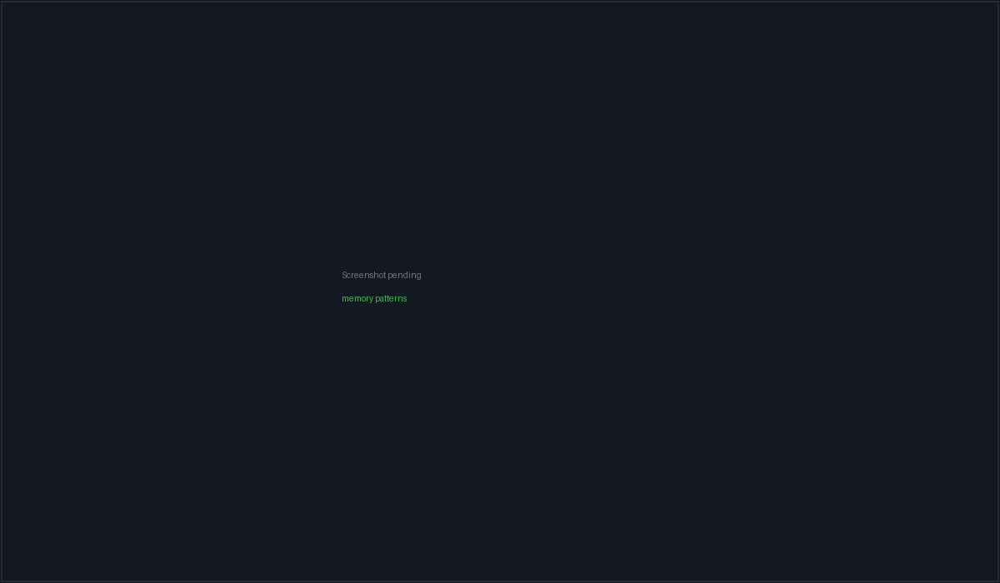

# Memory

PacketBench keeps two separate memories for your work. One is a **corpus** it
records for you — every terminal session that ran, every Flight that landed,
every note you saved — which it distils into short "learned patterns" and
injects, in a strict budget, into agent prompts. The other is a folder of plain
Markdown files in your repository (`.agents/memory`) that you and your agents
write by hand and commit like any other source file.

They are deliberately different things: the corpus is a record of what
happened, the notes are a record of what you decided. This page covers both,
the Memory pane that browses them, and exactly what does and does not reach an
agent's prompt.


*The Memory pane. The header chip names the scope everything on this screen belongs to.*

## What memory is made of

| Thing | Where it lives | Who writes it | Reaches a prompt? |
| --- | --- | --- | --- |
| Memory **events** | App state (`~/.packetbench/`), one flat corpus | PacketBench, automatically | Only session summaries (48 h) and Flight lessons (7 d) |
| Learned **patterns** | Same app state | An aux LLM, from the events | Yes — the top-ranked ones |
| Project **notes** | `.agents/memory/*.md` inside the repo | You, or an agent, by hand | Yes — up to 5 per brief |

Events come in four types. `session_completed` records a finished terminal
session; `flight_completed` records a settled Flight and its retrospective;
`manual_note` records anything you explicitly saved; `task_completed` is a
legacy type that nothing emits any more — the autonomous task scheduler that
produced it was removed in July 2026, and the Timeline no longer offers a filter
chip for it. Old `task_completed` events persisted before then still render.

> **Note:** The event corpus is **flat, not per-project**. Every record carries
> a scope key, and the Memory pane, retrieval, and the prompt brief all filter
> by it — but a single Clear-all wipes every project's memory at once, and an
> export contains all of it.

## Scope: which project memory belongs to

Scope is derived from the **active workspace**, not from whichever local folder
happens to be open. A local workspace scopes memory to its `projectPath`. A
remote SSH workspace scopes memory to a synthetic key of the form
`ssh:<serverId>:<remote path>`, so two projects at the same path on two
different servers never see each other's memory, and neither does a local
project that happens to sit at the same path.

This matters because PacketBench keeps a *local-only* mirror of the current
project path for things that touch this machine's filesystem (git pollers, the
file watcher, MCP). On a remote workspace that mirror still holds the last
**local** project you had open. Memory does not read it.

You never see the raw scope key. Timeline project chips, the pattern scope
badge, and the Markdown export all resolve it to something readable —
`build-box · app` — degrading to the bare server id if that connection has since
been deleted or the memory was imported from another machine.

### Matching mode

Settings → Integrations & Data → Memory has a **Match memory by project path**
choice that governs how loosely a *local* scope matches:

| Mode | Behaviour |
| --- | --- |
| **Exact** (default) | Normalised path equality only. |
| **Parent directory** | Either side may be a path prefix of the other, so a sub-workspace inherits its parent project's memory. |
| **Global** | Project path is ignored entirely; every project-scoped item matches everywhere. |

> **Important:** These modes govern **filesystem paths only**. A remote
> (`ssh:`) scope key matches by exact key identity or not at all — even under
> Global, and even under Ask's "All projects" toggle. Without that rule, turning
> on Global would pull every remote workspace's memory into a local project's
> prompt. Tests pin non-retrieval across servers, across paths on one server,
> and in both directions between local and remote.

### Memory for remote workspaces

Remote capture is supported. Sessions, Flights, and saved notes that ran on an
SSH workspace are recorded against that server and injected back into that
workspace's agents.

In earlier builds every writer stamped a plain path regardless of target, so a
correctly-scoped remote workspace could never show anything. Memory recorded
that way is still on disk but unreachable from the remote scope. When
PacketBench finds some, the Memory pane shows an amber banner offering
**"Adopt into &lt;server&gt;"**.

> **Warning:** Adoption is a judgement call, which is why it is opt-in and never
> automatic. A record stamped `/srv/app` is indistinguishable from a genuinely
> local project at `/srv/app`, and from the same path on a *different* server.
> Adopt only if you are sure the memory came from this workspace. Adoption
> stores the original path, and **Undo** restores it exactly; records already
> correctly scoped are never touched.

`.agents/memory` project notes stay local-only in every case — they are read off
this machine's filesystem. The Project notes tab says so on a remote workspace
rather than showing the previous local project's notes, and the injection path
refuses to load notes for an `ssh:` scope at all.

## Capture: what gets recorded, and when

### Terminal sessions

A PTY session is recorded when it ends **and lasted longer than 10 seconds**.
Every way a session can end counts:

- the process exits on its own → status `done`
- you press Kill, Restart, or close the pane → status `killed`
- the pane unmounts while the session is live → status `killed`

Recording happens **before** any LLM is involved. PacketBench writes the
`session_completed` event and persists it, and only then tries to enrich it with
a summary. So the Timeline fills up even with no aux provider configured, with a
model that returns junk, or with a provider call that hangs. Capture is
idempotent per session id, so the exit path and the unmount path racing each
other still produce exactly one entry.

The enrichment step reads the session transcript, trims it to the **last 4,000
characters**, and asks the configured auxiliary LLM for a summary, the key
decisions, and the files touched. It is bounded by a **60-second timeout**. If
it fails, the bare event stays and the Memory header says why — "Session
recorded, but summarizing failed: …" — instead of failing silently.

> **Note:** Terminal sessions are recorded *from*, but never briefed *to*. A PTY
> pane's opening prompt is the workspace prompt, if any. Memory injection
> applies to API conversations and Flight launches only.

### Flights

A Flight is captured once, on its transition from a non-terminal status into
`done` — that is, at least one completed attempt and no failures. Flights that
end `failed` or `paused` (every attempt cancelled) are **not** captured, and a
Flight whose attempts are being cancelled as part of a delete is not captured
either.

Separately, and regardless of capture, a settled Flight rerates the confidence
of every learned pattern that rode along in its launch brief: `done` adds 0.05,
`failed` subtracts 0.1, and `paused` is treated as a user abort that rerates
nothing. Confidence is clamped to the range 0.1–1.0.

If both **Capture completed flights** and **Summarize sessions on completion**
are on, PacketBench then fires a best-effort model-authored retrospective that
replaces the mechanically-derived lessons. That enrichment only runs for
all-local Flights — a Flight with any remote attempt keeps the mechanical
payload.

### Manual notes

Anything you save by hand is written regardless of the capture toggles, because
you asked for it. Four surfaces offer it:

- **New memory** in the Memory pane header (a summary prompt and an optional
  detail prompt).
- **Save as memory** on a GitHub investigation.
- A Flight's coordination-timeline event.
- An assistant message in an agent transcript, which files against that
  conversation's own scope — including its SSH target, if it has one.

## Learned patterns

Patterns are short statements distilled from what memory already recorded. They
have one of four categories — architecture, convention, preference, pitfall — a
confidence between 0 and 1, and a scope.

**Refresh** in the Memory header runs the extraction. It is enabled only when
the current scope actually has source material: session summaries, saved notes,
or Flight retrospectives — the last ten of them, joined together. The count next
to the button ("N memories in this project") is that source count.

Extraction requires a configured auxiliary LLM provider. Without one, Refresh
reports the failure in the header band rather than doing nothing quietly. New
patterns are filtered to confidence ≥ 0.5 and capped, and every extraction
preserves patterns you pinned.

In the pattern list you can:

- **Pin** a pattern (star). Pinned patterns sort first in every brief, skip the
  0.6 confidence gate that other patterns must clear, and by default survive cap
  eviction.
- **Edit** the text or category. A hand-edit is treated as authoritative and
  resets confidence to 100%.
- **Delete** it, behind a confirmation.

The right rail shows a rolling 30-day digest (events by type, new patterns, top
patterns, recent lessons) and a live preview of the brief.

## The memory brief: what actually reaches an agent

Retrieval and search are two different code paths over the same data, on
purpose. This section is retrieval — the strict, budgeted selection that gets
prepended to a prompt.

The brief is assembled from four capped sources, in this order:

| Source | Cap | Eligibility |
| --- | --- | --- |
| Learned patterns | **Patterns** setting (default 10) | Pinned, or confidence ≥ 0.6 |
| Flight lessons | **Flight lessons** setting (default 5) | From retrospectives in the last **7 days** |
| Recent session summaries | **Recent sessions** setting (default 5) | Sessions in the last **48 hours** that actually have a summary |
| Project notes | **5** (fixed) | Any non-archived `.agents/memory` note — no recency window, no confidence gate |

Every candidate is scope-filtered first. When the launch carries a task or
objective, patterns, lessons, and notes are re-ranked by IDF-weighted term
overlap with it, blended 60/40 with confidence for patterns. A query only
changes the *order*; the confidence gate still decides what is eligible.

The assembled text is then truncated to a **character budget** — 1,800 by
default, clamped to 400–4,000 — and each line is flattened to a single line of
at most 260 characters. It is prefixed with a short header telling the model to
prefer current repository files over stale notes.

Two switches control whether the brief is used at all:

- **Per conversation:** the `memoryContextEnabled` toggle in a conversation's
  header overflow menu. Off by default for a plain new conversation; agent
  profiles can set it; a Flight's attached conversation turns it on.
- **Per Flight launch:** Settings → Memory → **Inject brief into Flight
  prompts** (on by default). A Flight launch also refuses to brief a mixed
  fan-out — if the selected targets span local and SSH, or two different
  servers, or two different base paths, the launch carries the raw prompt
  instead of guessing which project's memory it is entitled to.

The Memory pane's right rail renders the *same* brief the launch pipeline would
inject, so the token estimate can never overstate what actually gets sent.

## Ask: searching the whole corpus

The **Ask** tab is a keyword-ranked search over everything in scope. It makes no
LLM call.

It is deliberately not the injection selector. Ask has **no confidence gate, no
per-source cap, and no 48-hour or 7-day recency window** — a note you wrote last
week is findable, and so is a low-confidence pattern that genuinely matches.
Scope matching is shared with the injection path, so an SSH scope still only
sees memory keyed to that server and remote path.

What Ask searches that the brief never does: Flight retrospective bodies
(summary, what worked, what failed, suggested improvements, tags), saved notes,
and legacy task events.

Controls:

- **Source** — All, *PacketBench* (the event/pattern corpus), or *Project
  Markdown* (`.agents/memory` notes only).
- **All projects** — widens scope matching to Global for this search. Remote
  scope keys still only match by exact identity.

Ranking is 70% relevance, plus small priors for kind, recency (60-day
half-life-ish decay), and trust. Results are deduplicated by display title and
capped at 50, with the header telling you how many matched in total. A query
term can match by exact token, stem, four-character prefix, or raw substring, so
"auth" finds "authentication". The tokenizer also splits camelCase and
PascalCase (`SshConfig` → `ssh`, `config`) and expands a short fixed list of
domain acronyms — pty, acp, mcp, idf, dto, sdk, cli, tofu, ssh, ade.

> **Note:** That widened matching is Ask-only by design. The injection scorer
> keeps its narrower exact-token behaviour, so making search more generous can
> never make prompts more generous. A curated synonym map was evaluated and
> rejected — against a held-out query set it recovered 0% of misses while
> inflating result sets 2.75×.

## Project notes (`.agents/memory`)

The **Project notes** tab edits plain Markdown files in `.agents/memory/` inside
your project. They are ordinary files: version them, review them in a PR, edit
them in your editor. PacketBench never writes a `.gitignore` for them.

A managed note is YAML frontmatter followed by Markdown:

```markdown
---
schemaVersion: 1
id: 9f8c2b7e-4f1a-4a44-9d0e-1b8b3f2c5a10
title: SSH host pinning
createdAt: 1756252800000
updatedAt: 1756339200000
archived: false
tags:
  - ssh
  - security
provenanceIds: []
---
Host keys are pinned on first save. See [[Remote workspaces]].
```

A plain `.md` file with **no** frontmatter is still a valid note. Its id is
derived from its path, its title from the first `# ` heading (or the filename),
its timestamps from the filesystem, and it is tagged `unmanaged`. Editing it
through the app rewrites it with proper frontmatter, which is the intended
upgrade path.

Notes link to each other with `[[Title]]` or `[label](other-note.md)`. The
sidebar has a **list** view and a **link graph** view showing outbound links and
backlinks; notes with no links either way are flagged `orphan`, and links that
resolve to nothing are flagged as broken.

Other behaviour worth knowing:

- **Archived** notes are hidden unless you tick the Archived box. Archiving sets
  a flag in frontmatter; it never deletes the file.
- **Optimistic concurrency:** every save carries the revision you loaded. If the
  file changed underneath you, the save is refused with a conflict message
  instead of clobbering it.
- A **live watcher** refreshes the list when files change on disk, with a
  trailing debounce so a mid-save file is never read. Editor lock files
  (`.#note.md`) are ignored. If the watcher cannot be armed (network drive,
  exhausted inotify handles), the notes still load and refresh becomes manual.
- **Promote global memory** at the bottom of the sidebar turns any corpus event
  into a durable note, carrying its provenance ids so the same event is not
  promoted twice.

Refusals and limits, enforced in the backend:

| Limit | Value |
| --- | --- |
| Notes per project | 2,000 |
| Bytes per note | 262,144 (256 KiB) |
| Symlinks / junctions | Rejected, never followed |
| Binary content | Rejected |
| Secret-shaped content | Rejected — `api_key=…`, `password: …`, PEM private-key headers |

Files that cannot be parsed do not vanish; they appear as warnings with a code
(`malformed_frontmatter`, `unsupported_schema`, `duplicate_id`,
`ambiguous_link`, `oversized`, `binary_rejected`, `symlink_rejected`,
`orphaned_backup`, `count_limit`, …) so you can see and fix them.

> **Tip:** Notes are the right home for anything you want to survive a memory
> Clear-all, share with a teammate, or review in a pull request. Learned
> patterns are a convenience; notes are the record.

## The Timeline

The **Events** tab is the raw corpus, newest first, with:

- **Type chips** — All, Sessions, Flights, Notes (with counts).
- **Search** — ranked by relevance, with any substring hit always kept, so
  nothing a plain substring search would have found is lost.
- **When** — All time / 24h / 7d / 30d.
- **Project** — one chip per distinct scope key present in the corpus, labelled
  readably.
- **Delete** on any event, behind a confirmation.

A Flight chip elsewhere in the app can deep-link here with a Flight filter
applied; a banner shows it and offers Clear.

## Import, export, and clearing

- **JSON** exports the full corpus (`packetbench-memory.json`, version 1) —
  every event and pattern, across every project.
- **MD** exports a readable Markdown digest: counts by type, a per-scope
  breakdown using resolved labels, and patterns grouped by category with
  confidence percentages.
- **Import** merges a JSON export by id; existing entries win, so re-importing
  the same file adds nothing. Structurally invalid events are dropped rather
  than crashing the consumers downstream. You are told how many new events and
  patterns landed.
- The **trash icon** clears everything, behind a confirmation that says so.

## Retention and caps

Retention is applied on load, on every write, and whenever you change one of
these settings.

| Setting | Default | Effect |
| --- | --- | --- |
| Expire events by age | Off | When on, drop events older than *Keep days*. |
| Keep days | 30 | Only meaningful when expiry is on. Range 1–3650. |
| Max stored events | 200 | Oldest events beyond the cap are dropped. Range 20–2000. |
| Max learned patterns | 20 | Range 1–100. |
| Pinned patterns survive cap eviction | On | When on, pinned patterns are kept even past the cap and the unpinned remainder is trimmed by confidence then recency. When off, pinned entries compete in the same LRU. |

## Where memory shows up elsewhere

- **Conversation header overflow menu** — the per-conversation memory toggle and
  a preview flyout of the exact brief that will be sent, with counts and a token
  estimate.
- **Agent profiles** (Settings → Agents & Models → Agent behavior) — a profile
  can set `memoryContextEnabled` for every conversation launched with it.
- **Flight launches** — see [Flight Deck](flights.html).
- **MCP** — the PacketBench MCP provider exposes `read_memory_context` plus the
  project-note read/search/create/update/archive tools. See [MCP hub](mcp.html).

For the write-key choke point, the scope-matcher rules, and the invariants that
keep search and injection separate, see [Memory internals](dev-memory.html).
