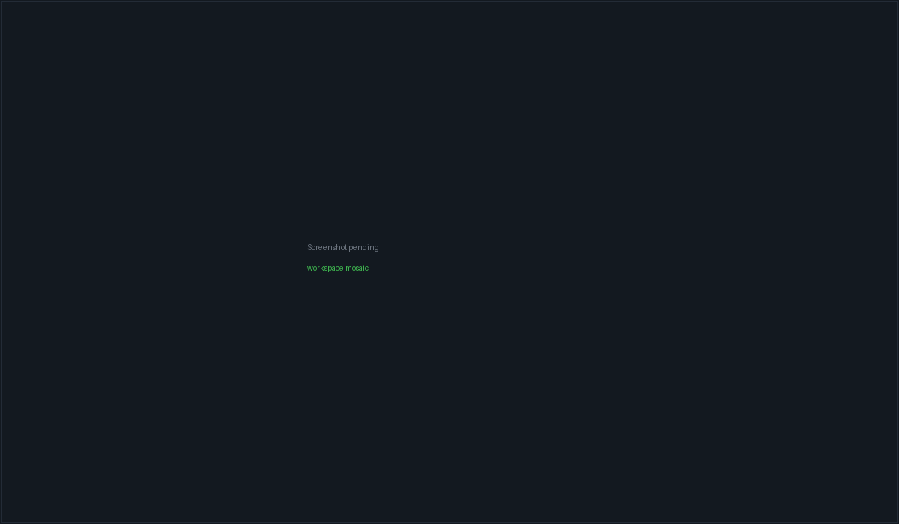

# Workspaces & terminals

A **workspace** is a named project context that owns a set of panes. Most of
those panes are real PTYs running a coding CLI — `claude`, `codex`, `opencode`,
`packetcode` — or a plain shell; the rest are chat conversation tiles and file
viewers. Workspaces persist across restarts, hydrate dormant, and only start
processes once you actually open them.

The surface is reached from the left rail (terminal icon), from the command
palette, or with <kbd>Ctrl</kbd>+<kbd>Shift</kbd>+<kbd>W</kbd>.



*A workspace with several PTY panes tiled by the mosaic, the workspace tab strip
above them and the Git panel docked at the right.*

## What a workspace holds

Every workspace record carries these fields (`src/types/workspace.ts`):

| Field | Meaning |
| --- | --- |
| `name` | Shown on the tab strip and in the Fleet sidebar |
| `projectPath` | The local checkout. Used as every local pane's cwd |
| `serverId` / `remoteProjectPath` | Set instead for an SSH workspace |
| `executionTarget` | `{kind:"local"}` or `{kind:"ssh", serverId}` — the canonical discriminant |
| `agents` | The CLI roster behind the header badges. Conversation and file panes are deliberately *not* in it |
| `panes` | The authoritative list of what exists in this workspace |
| `layout` | A **cache** of your hand-arranged mosaic tree, never the source of truth |
| `prompt` | Auto-sent as the first input to every non-`terminal` CLI pane |
| `bypassPermissions` | Adds a per-CLI bypass flag at launch (see below) |
| `modelOverrides` / `effortOverrides` | Per-agent-slot `--model` / `--effort` args |
| `terminalShell` | Workspace-level default shell for `terminal` panes |
| `githubRepo` | Derived from `git remote get-url origin` at creation time |
| `status` | `active` or `archived`. Archived workspaces are hidden from the tab strip |
| `origin` | `"conversation"` marks an auto-created wrapper for a standalone chat |

> **Note:** `panes` is the truth about what exists; `layout` is only an
> arrangement. On load the mosaic reconciles the saved tree against the real
> pane list — leaves whose pane is gone are pruned, panes the layout never saw
> are appended — so a stale layout can neither lose a pane nor render one twice.

## Creating a workspace

The **+** button on the tab strip (tooltip: *"New workspace (choose template)…"*)
opens the New Workspace dialog. The Fleet sidebar's own "New workspace" CTA is
the instant path; this one is the templated fork.

### Templates

Picking a template pre-selects a set of CLI sessions and seeds the name. Any
session the template names that is not installed is silently dropped from the
selection.

| Template | Sessions | Description shown |
| --- | --- | --- |
| PacketCode | `packetcode` | Recommended terminal coding loop |
| CLI Pair | `packetcode`, `codex` | PacketCode + Codex side-by-side |
| Review Pair | `claude-code`, `codex` | Claude Code + Codex CLI |
| Shell | `terminal` | One plain terminal |

### Form fields

- **Name** — auto-seeded from the template or the chosen folder; typing in it
  marks the name as hand-edited and later template clicks stop overwriting it.
- **Location** — Local or Remote. Remote asks for an SSH server and a remote
  project path, and probes that the path exists.
- **Project folder** — a recents dropdown plus a native folder picker. For a
  remote workspace you can instead clone a repo URL (with an optional branch;
  blank means the repo's default branch).
- **Agent sessions** — checkboxes over the five slots. Not-installed slots show
  an Install link (or, for PacketCode, a **Set up** button that jumps to
  Settings → CLI clients).
- **Model / effort overrides** — per slot. Claude Code seeds `effort: medium`.
- **Bypass permissions** — see the warning below.
- **Prompt** — *"Describe the task for all CLI sessions…"*. This becomes
  `workspace.prompt` and is written into every non-`terminal` pane's stdin once
  its session is ready.

## The workspace header

A single 33px row across the top of the surface:

| Control | Behaviour |
| --- | --- |
| Workspace tabs | One per non-archived workspace, with a status dot rolled up from the max severity across member tiles. Tooltip is the project path. Clicking switches the *visible* workspace; all of them stay mounted so live PTYs survive |
| **+** | Opens the New Workspace dialog |
| Agent badges | One per (agent slot × account) pair with a count suffix (`Claude x2`). Conversation and file panes never appear here |
| **+ Add Session** | The pane picker, described below |
| **Delegate** | *"Delegate work on this project to a GUI agent"* — hands the workspace off to the Agents surface |
| Git icon | Toggles the **Git** panel in the right dock |
| **Bypass perms: on/off** | Per-workspace toggle, described below |

### Bypass permissions

The toggle sets `workspace.bypassPermissions`, which appends one flag at the
*next* session launch:

| Slot | Flag appended |
| --- | --- |
| `claude-code` | `--dangerously-skip-permissions` |
| `codex` | `--dangerously-bypass-approvals-and-sandbox` |
| `opencode` | *(none)* |
| `packetcode` | *(none)* |
| `terminal` | *(none)* |

> **Warning:** OpenCode is deliberately omitted from that table — it has no
> equivalent launch flag, and passing one makes it print `--help` and exit.
> Configure OpenCode's permissions inside its own TUI/config instead. The
> toggle will still read "on" for an OpenCode pane; it simply does nothing
> there.

> **Important:** The toggle only affects panes started *after* you flip it.
> Restart a pane for the change to take effect.

## Adding panes

**+ Add Session** opens a 320px picker with a search box (*"Search CLI
sessions…"*). It has three sections.

### CLI sessions

One row per terminal slot. PacketCode floats to the top with a **Recommended**
pill when it is installed. A row that is not installed is disabled and grows an
**Install** link (PacketCode gets a **Set up** button instead).

| Slot | Row label | Launches |
| --- | --- | --- |
| `packetcode` | PacketCode | `packetcode` |
| `terminal` | Terminal | Your selected shell |
| `claude-code` | Claude Code | `claude` |
| `codex` | Codex CLI | `codex` |
| `opencode` | OpenCode | `opencode` |

Install-hint links point at the Claude Code docs, the `openai/codex` repo and
`opencode.ai` respectively. On an SSH workspace, "installed" means the *server*
record lists that agent in `installedAgents`, not your local machine.

Two extra controls appear on rows that need them:

- **Account chip** — only on `claude-code` and `codex`, and only once you have
  registered a CLI account. Leaving it untouched keeps the one-click fast path
  (the sticky per-project default is resolved for you). Changing it makes that
  account the project's new sticky default.
- **Shell select** — only on the Terminal row. Defaults to *"Default shell"*,
  meaning inherit. Unavailable profiles render as `… · unavailable` and are
  disabled.

### The WSL row

On Windows, when at least one distribution is detected, a separate **WSL ·
`<distro>`** row appears. It is exactly a Terminal pane carrying a `wsl` shell
selection — no new pane kind, no second launch path.

### Viewers

- **File Viewer** — *"Open any file as a tile"*. Opens a native file dialog
  rooted at the project path.
- **Markdown Viewer** — *"Open a .md rendered"*. Same tile, filtered to
  `.md`/`.mdx` and opened in preview mode.

Both are disabled (not hidden) on SSH workspaces, with the tooltip *"File
viewers read the local filesystem — not available on SSH workspaces"*.

Re-opening a file that already has a tile focuses the existing tile rather than
stacking a duplicate viewer.

## Shells

Terminal panes resolve their shell from three levels, most specific first:

1. `pane.terminalShell` — set when you picked a shell (or the WSL row) at add time
2. `workspace.terminalShell` — the workspace default
3. The app default, persisted in `localStorage` under
   `packetbench:terminal-default-shell`

### Available profiles

| Profile id | Label | Default command | Default args |
| --- | --- | --- | --- |
| `auto` | Auto-detect | The slot's own command | *(none)* |
| `powershell7` | PowerShell 7 | `pwsh` | *(none)* |
| `windows-powershell` | Windows PowerShell | `powershell` | *(none)* |
| `command-prompt` | Command Prompt | `cmd` | *(none)* |
| `git-bash` | Git Bash | `bash` | `--login -i` |
| `wsl` | WSL | `wsl` | `--distribution <distro>` when a distro is set |
| `bash` | Bash | `bash` | *(none)* |
| `zsh` | Zsh | `zsh` | *(none)* |
| `custom` | Custom executable | your path | *(none)* |

Windows offers `auto, powershell7, windows-powershell, command-prompt, git-bash,
wsl, custom`; everything else offers `auto, bash, zsh, custom`. The `custom` row
is hidden from the picker unless your app default is already a custom shell.

### Custom shells are allowlisted

A custom executable is only honoured when its program name (path and
`.exe`/`.cmd`/`.bat` stripped, lowercased) is one of:

```text
bash  cmd  fish  nu  powershell  pwsh  sh  wsl  xonsh  zsh
```

> **Warning:** An unsupported custom executable does **not** produce an error.
> `resolveTerminalShellLaunch` silently falls back to the auto command and
> labels the pane `<command> (Auto)`. If your custom shell appears to be
> ignored, this is why.

Arguments are parsed by PacketBench's own tokenizer, not by a shell: quotes
group, a backslash escapes only whitespace / quotes / another backslash (so
ordinary Windows path separators survive), and at most **32** arguments are kept.

## The mosaic

Panes are tiled with `react-mosaic`. The layout is built from a preset the first
time and then grown by appending, never re-nesting:

| Pane count | Preset | Columns |
| --- | --- | --- |
| 0–1 | `1x1` | 1 |
| 2 | `1x2` | 2 |
| 3–4 | `2x2` | 2 |
| 5+ | `3x2` | 2 |

New panes are appended to the root split so no surviving tile changes depth —
re-nesting a leaf would remount it and kill its PTY.

- **Drag** a tile by its header bar to reorder.
- **Drag a splitter** to resize. The new tree is only persisted on release, and
  a tree carrying a collapsed (0%) split is refused — that shape only appears
  mid-drag.
- **Zoom** with the tile's maximize button or by double-clicking its header.
  Zoom is CSS-only: every other tile stays mounted and hidden, so no PTY is
  interrupted. Press <kbd>Esc</kbd> to exit — unless focus is inside the
  terminal, which owns every keystroke; then use the tile's zoom button. The
  on-screen hint says exactly this.

> **Note:** Growing a workspace one pane at a time produces progressively
> narrower columns. That shape is deliberately *not* saved: only a real drag
> gesture writes a layout, so the next launch rebuilds from the preset. Once you
> arrange tiles by hand, that arrangement is what persists.

## The pane header and overflow menu

Each terminal tile's header is one row: drag grip, a pulsing status dot, the
pane identity, an account chip (ambient panes show nothing), a status pill, a
zoom button and a **⋮** overflow menu.

The status pill reads one of: `not installed`, `approval`, `running`, `error`,
`idle`. Terminal panes label themselves `Terminal · <shell label>` — or
`Terminal · Remote login shell` on an SSH workspace.

The overflow menu:

| Item | Effect |
| --- | --- |
| **Model: `<label>`** | Sub-panel listing the models for this slot plus **Default**. Footer says *"Takes effect on next session"* — it writes `workspace.modelOverrides`, it does not restart anything |
| **Send prompt…** | Only when a session is live. Lists your prompt templates and writes the chosen body plus a carriage return into this pane's PTY |
| **Pinned commands (n/5)** | Add, run and remove up to five saved commands. Pins also render as a quick-run strip under the header |
| **Restart session** / **Start session** | Kills the old PTY (if any) and starts a fresh one, clearing the terminal |
| **Close pane** | Opens a confirm dialog: *"Any live PTY and CLI process in this pane will be stopped."* A failed remote stop keeps the pane and shows the error rather than orphaning the process |

### Model catalogues per slot

| Slot | Models offered |
| --- | --- |
| `claude-code` | Opus 4.8, Opus 4.7, Opus 4.6, Sonnet 4.6, Haiku 4.5 |
| `codex` | GPT-5.5, GPT-5.4, GPT-5.3 Codex |
| `opencode` | MiniMax M3 (`minimax/MiniMax-M3`) |
| `packetcode` | MiniMax M3 (`MiniMax-M3`) |
| `terminal` | *(no model picker)* |

Effort levels are Low / Medium / High and become `--effort <level>`.

## How a terminal session actually starts

1. The pane mounts and, if it is in the visible and selected workspace, arms a
   single automatic launch after a 200 ms delay. That launch happens **once per
   pane** — toggling visibility or changing memoised options never silently
   restarts a running CLI.
2. Concurrent starts for the same pane are deduped in a module-level registry.
   Without this, React StrictMode's double-mount spawned two PTYs; harmless for
   `claude`/`codex`, fatal for `opencode` (the second instance exits 1 and
   leaves a permanently blank pane).
3. The frontend calls `create_pty_session` with the project path, current
   terminal dimensions, the command, args and env.
4. The backend validates the command against the allowlist, resolves it to a
   real executable, opens a PTY and spawns the child.
5. Output streams back on `pty:output:<sessionId>`; exit arrives on
   `pty:exit:<sessionId>`. On attach the frontend replays the server-side
   transcript first, then any events it buffered while replaying, so nothing is
   lost or doubled.
6. If `workspace.prompt` is set and the pane is not a plain terminal, the prompt
   is written to stdin — immediately for `claude`, after a 3-second delay for
   everything else so the TUI has time to initialise.

### The command allowlist

`create_pty_session` refuses anything whose program name is not in:

```text
claude  codex  opencode  packetcode
bash  sh  zsh  powershell  pwsh  cmd  wsl  fish  nu  xonsh
ssh
```

The check is on the *program name* — directory components and a trailing
executable extension are stripped and the result is lowercased — so a pinned
absolute path like `D:\tools\packetcode.exe` validates as `packetcode`.

The error is explicit: `Command '<x>' is not allowed. Allowed commands: [...]`.

### Working directory rules

| Situation | cwd used |
| --- | --- |
| `ssh` command | Your home directory (the remote path is not local) |
| Project path is a real directory | That directory |
| Project path is empty or `/` | `~/.packetbench/scratch`, created on demand |
| Project path is set but not a directory | **Error**: `Project path '<x>' is not a valid directory` |

> **Note:** The empty-path fallback is a dedicated scratch directory rather than
> `$HOME` on purpose. An agent like `claude` scans its cwd for context, and
> scanning `$HOME` walks into `~/Music`, `~/Pictures`, `~/Documents` — which
> triggers macOS TCC permission prompts attributed to PacketBench.

### Environment applied to every PTY

`TERM=xterm-256color` and `COLORTERM=truecolor` are always set, then your
pane-supplied env is merged on top.

For `claude` panes specifically:

| Variable / flag | Value | Why |
| --- | --- | --- |
| `--settings <json>` | Generated | Injects PacketBench's status-line collector through Claude's supported settings seam. Your own settings stay loaded; only `statusLine` is overridden |
| `CLAUDECODE` | *removed* | Stops Claude thinking it is nested inside another session |
| `CLAUDE_CODE_ENTRYPOINT` | *removed* | Same |
| `DISABLE_AUTOUPDATER` | `1` | An auto-update mid-session can swap in a build incompatible with the PTY |
| `PACKETBENCH` | `1` | Tells `statusline.ps1` to suppress its own output |
| `PACKETCODE` | `1` | Backwards compatibility with existing scripts |

The status-line helper path and state directory are applied **after** your
pane env, so persisted workspace state cannot redirect them.

### Binary resolution

On POSIX, resolution is: an app pin at `~/.packetbench/<command>-bin` containing
an absolute path, then an explicit path if the command contains `/`, then a PATH
scan producing an **absolute** path. The absolute-path requirement matters: the
PTY layer resolves a relative program against cwd first, so a stray `claude`
directory in your home folder would otherwise shadow the real CLI and the pane
would just say `[Session ended]`.

On Windows, resolution uses `where.exe`, with two special cases:

- A command that is already an existing explicit path is used verbatim.
- For `codex`, the npm `.cmd` wrapper is preferred, and a WindowsApps
  `openai.codex_…` executable is skipped entirely — that packaged GUI app is
  not a PTY CLI and cannot be spawned (`Access is denied`).
- `bash` falls back to known Git-Bash install locations before `where`.

A resolved `.cmd` is spawned as `cmd.exe /c <path>`, which is why the process
tree — not just the direct child — has to be killed on close.

> **Note:** The `~/.packetbench/<command>-bin` pin file is a POSIX-only escape
> hatch; the Windows resolver does not read it. On Windows, pin a binary by
> setting its explicit path in Settings → CLI clients instead.

## Approvals in a terminal pane

PacketBench watches PTY output for the CLI's own approval prompts. When one is
detected an amber overlay appears at the bottom of the pane:

> **Approval needed** — **Allow (y)** · **Deny (n)** · **Abort (Esc)**

The buttons write `y\n`, `n\n` and `\x03` (Ctrl-C) into the PTY respectively.

Bare <kbd>y</kbd> / <kbd>n</kbd> / <kbd>Esc</kbd> also work, under a strict
ownership rule:

- Exactly one pane waiting → it owns the keypress, focused or not.
- Several waiting → **only the active pane answers**. Click a pane to make it
  active, or use its on-screen buttons.
- Several waiting and none active → nobody answers.

> **Important:** This ownership rule exists because the earlier version had
> none: every waiting pane bound the same window keys, so a single `y` wrote
> `y\n` into *every* waiting agent's stdin — silently approving actions in panes
> you had not looked at.

The shortcut never fires while focus is in an `<input>` or `<textarea>` (which
includes xterm's own focus holder).

## Terminal rendering

The emulator is xterm.js with the fit, web-links, unicode11 and WebGL addons.

| Setting | Value |
| --- | --- |
| Font | `JetBrains Mono, Cascadia Code, Fira Code, Consolas, monospace` |
| Font size | 13px, line height 1.15 |
| Scrollback | 10,000 lines |
| Unicode | Version 11 |
| Renderer | WebGL, falling back to canvas |

Two rendering workarounds are worth knowing about, because they explain
symptoms you may have seen in other tools:

- **DECRQM is stubbed out.** xterm 6.0.0's bundled `requestMode` handler throws
  in minified builds, which aborts the whole parse. Any stream containing a
  DECRQM query then renders nothing — which is why `opencode` panes were blank
  while `claude`/`codex` were fine. PacketBench registers a no-op handler; the
  CLI simply gets no mode-support reply and handles that gracefully.
- **WebGL is attached lazily.** A WebGL canvas attached to a hidden or 0×0
  container comes back permanently blank. PacketBench only attaches once the
  container is visible, and recreates + force-repaints it on the hidden→visible
  transition.

Resizes are debounced through a `ResizeObserver` that refuses degenerate
dimensions: a hidden workspace reports 0×0, and fitting the PTY to that scrambles
full-TUI CLIs on return.

## Session lifecycle and failure modes

| What you see | What happened |
| --- | --- |
| `[Session ended]` in grey | The child exited, or you killed/restarted the pane |
| `Failed to start <CLI>: <message>` in red, followed by `Make sure '<cmd>' is installed and on your PATH.` | The spawn itself failed |
| `Command '<x>' is not allowed.` | The command is not on the PTY allowlist |
| `Project path '<x>' is not a valid directory` | The workspace's project path no longer exists |
| A pane that never paints | Usually the WebGL-while-hidden case above; switching away and back forces a repaint |

Closing a pane, restarting it, or unmounting it all kill the PTY. Process ids are
recorded at spawn so a crash or force-quit that never reaches the exit handler
gets swept on the next launch.

> **Note:** PacketBench writes at most 64 KB per `write_pty` call. There is no
> backend "orchestrator kill" path any more — every exit you see is either a
> natural process exit or a kill you asked for.

## Session tabs, status and memory capture

Each live PTY registers a session tab with a status that drives the dots you see
on the workspace tab strip:

| Status | Label |
| --- | --- |
| `idle` | Idle |
| `starting` | Starting… |
| `thinking` | Thinking… |
| `running` | Working… |
| `waiting_approval` | Needs approval |
| `waiting_input` | Needs input |
| `done` | Done (with elapsed time once finished) |
| `error` | Error |

An **activity strip** appears under the terminal while a tool is running,
showing the tool and the file it touched. Below that, `claude`, `codex` and
`opencode` panes get a native status bar; other CLIs get none.

Sessions longer than **10 seconds** are recorded into [Memory](memory.html) when
they end — stamped `done` for a natural exit and `killed` for a kill, restart or
pane close. Both are real sessions, so both are captured.

## The right dock

The Workspace surface registers two dock panels; only one is visible at a time
and they share a single width budget.

| Panel | Notes |
| --- | --- |
| **Editor** | Disabled on SSH workspaces — it reads the local filesystem |
| **Git** | The Git Dashboard, scoped to the workspace's project path (or its remote path for an SSH workspace) |

## Keyboard shortcuts

| Keys | Action |
| --- | --- |
| <kbd>Ctrl</kbd>+<kbd>Shift</kbd>+<kbd>W</kbd> | Go to Workspace |
| <kbd>Ctrl</kbd>/<kbd>Cmd</kbd>+<kbd>N</kbd> | New workspace — auto-named (`Workspace`, `Workspace 2`, …), falling into the OS folder picker when no project path is known. Yields to typing, so it does nothing while focus is in a text field |
| <kbd>Ctrl</kbd>+<kbd>K</kbd> | Command palette — **skipped while focus is in a terminal**, because Ctrl+K is readline's kill-line |
| <kbd>Esc</kbd> | Exit pane zoom (lowest-priority Escape consumer: dialogs, the palette and a focused terminal all outrank it) |
| <kbd>y</kbd> / <kbd>n</kbd> / <kbd>Esc</kbd> | Approve / deny / abort a terminal approval prompt, subject to the ownership rule above |

View-switch chords are matched on the **physical** key, so they work on AZERTY,
QWERTZ and Dvorak layouts.

## Related

- [Core concepts](concepts.html) — how workspaces, panes and conversations relate
- [Agents & conversations](agents.html) — the conversation tiles that can also live in a workspace
- [SSH remote workspaces](remote.html) — running panes on a remote host
- [Settings reference](settings.html) — CLI client detection, default shell, prompt templates
- [Memory](memory.html) — what session capture records
